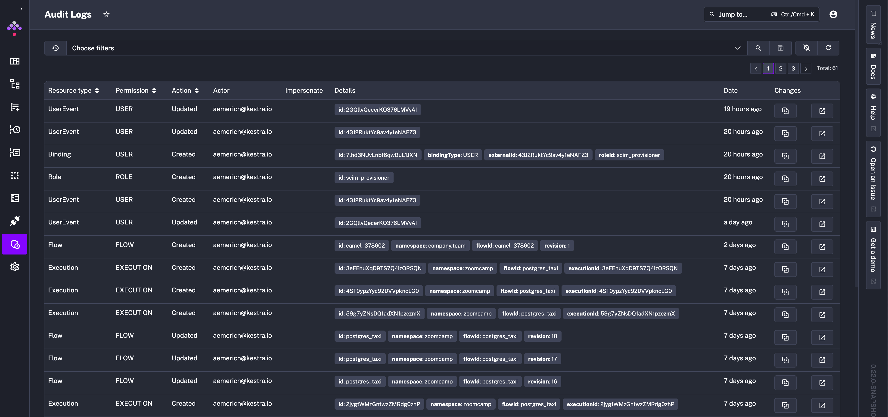
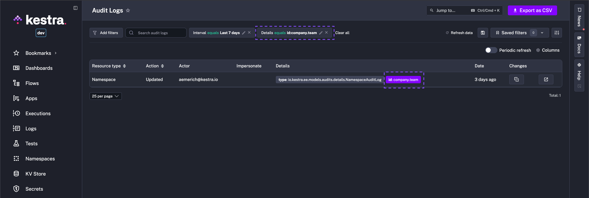

How to use Audit Logs to govern activities in your Kestra instance.

<div class="video-container">
  <iframe src="https://www.youtube.com/embed/Qz24gBPGZHs?si=RaI14lzO_zt3nL_T" title="YouTube video player" allow="accelerometer; autoplay; clipboard-write; encrypted-media; gyroscope; picture-in-picture; web-share" referrerpolicy="strict-origin-when-cross-origin" allowfullscreen></iframe>
</div>

## Audit logs – governance and compliance guide

Audit Logs record all activities performed in your Kestra instance by users and service accounts. By reviewing Audit Logs, system administrators can track user activity, and security teams can investigate incidents and ensure compliance with regulatory requirements.

## Why are Audit Logs important

The audit log table in Kestra serves as a historical record that developers and system administrators can use to track changes, monitor system usage, and verify system activity. It's a transparency tool that tracks the sequence of activities, ensuring accountability for actions taken and providing data for troubleshooting and analysis. Given that Audit Logs are immutable, they can also be used to detect and investigate security incidents. If you leverage Kestra edition with Elasticsearch backend, you can also use Kibana to search and visualize your logs.

## How to access Audit Logs

You can access Audit Logs from the **Tenant** section in the UI. That UI page provides a detailed table of recorded events, capturing the actions taken within the system:



Each row in the table represents a distinct event with several columns providing specific details:

- **Resource Type** column categorizes the resource that the event is associated with, such as editing a flow (FLOW) or executing it (EXECUTION).
- **Action** indicates whether a given resource has been created, updated, or deleted.
- **Actor** identifies who performed the action. The user can be a human, a system, or a service account.
- **Details** section offers an in-depth description of the event, including identifiers such as the `id`, `namespace`, `flowId`, `executionId`, revision, etc. — those fields depend on the type of resource the event is associated with.
- **Date** represents the timestamp of when the event occurred.
- **Changes** shows two buttons: one to view the revision and a second to link you directly to the resource that created the log.

## How to see a full diff of a specific event

To see a full diff of a specific event, click on the icon in the **Changes** column. The expanded view shows the full diff of the event side-by-side, including the `before` and `after` states of a given resource:


## How to use the Details filter to search for specific Audit Log events

The `Details` filter allows you to flexibly search for any Audit Log event using the `key:value` format. It's a tag-based system which works the same way as [Execution Labels](../../../05.workflow-components/08.labels/index.md).

For example, you can filter for all events related to a specific namespace by typing `namespace:your_namespace`:



To further filter for a specific event, you can click on the relevant tag in the `Details` column, and it automatically adds the filter to the view.

---

## How to Purge Audit Logs

The Enterprise Edition of Kestra generates an audit log for _every action_ taken on the platform. While these logs are essential for tracking changes and ensuring compliance, they can accumulate over time and take up a significant amount of space in the database.

The `PurgeAuditLogs` task removes old audit logs that are no longer needed. You can set a date range for the logs you want to delete, choose a specific `namespace`, and even filter by `resources` or `actions` (`CREATE`, `READ`, `UPDATE`, `DELETE`).

:::alert{type="info"}
Additional types of **Purge tasks** are described in the [dedicated section](../../../10.administrator-guide/purge/index.md).
:::

Here is the recommended way to implement the audit logs retention policy that purges audit logs older than one month:

```yaml
id: audit_log_cleanup
namespace: system
tasks:
  - id: purge_audit_logs
    type: io.kestra.plugin.ee.core.log.PurgeAuditLogs
    description: Purge audit logs older than 1 month
    endDate: "{{ now() | dateAdd(-1, 'MONTHS') }}"
```

Note how the above flow is added to the `system` namespace, which is the default namespace for System Flows. This ensures that this maintenance flow and its executions are hidden from the main UI, making them only visible within the `system` namespace that can be managed by platform administrators.

Combining the [System Flows](../../../06.concepts/system-flows/index.md) functionality with the `PurgeAuditLogs` task provides a simple way to manage your audit logs as code and from the UI, ensuring you keep them as long as you need to stay compliant while keeping your database clean and performant.

## Export audit logs

Audit logs can be forwarded to an external monitoring system such as Datadog, AWS CloudWatch, Google Operational Suite, and more with the [Audit Log Shipper task](../logshipper/index.md#audit-log-shipper).
