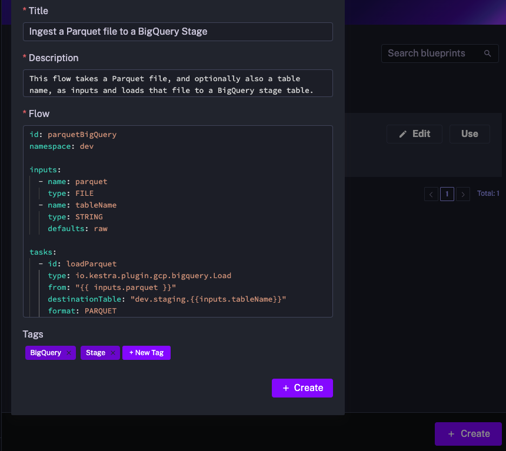

How to create and manage Custom Blueprints.

# Custom Blueprints in Kestra Enterprise – Private Templates

<div class="video-container">
  <iframe src="https://www.youtube.com/embed/qbGfK-FJi6s?si=UX6cOyT7nvlyd6zb" title="YouTube video player" allow="accelerometer; autoplay; clipboard-write; encrypted-media; gyroscope; picture-in-picture; web-share" referrerpolicy="strict-origin-when-cross-origin" allowfullscreen></iframe>
</div>

---

In addition to the publicly available [Community Blueprints](../../../06.concepts/07.blueprints/index.md), Kestra allows you to create **Custom Blueprints**—private, reusable workflow templates tailored to your team. These blueprints help centralize orchestration patterns, document best practices, and streamline collaboration across your organization.

You can think of Custom Blueprints as your team's internal App Store, offering a wide range of integrations and validated workflow patterns tailored to your needs.

### How to create a new custom blueprint

From the left navigation menu, go to **Blueprints**. Then, select the **Custom Blueprints** tab. Click on **Create**.

Add a title, description, and the contents of the flow. You can add as many tags as you want. Then click on the **Create** button.



You can edit Blueprints at any time, for example, to add new tasks or expand the documentation.

## Templated Blueprints

Templated Blueprints allow you to create reusable, configurable workflows that users can instantiate without editing YAML. Instead of copying and modifying Blueprints, users fill in guided inputs and Kestra generates the complete flow automatically. 

This approach democratizes workflow creation by letting platform teams build reusable templates once while enabling business users to generate production-ready workflows through a simple form interface. 

**How It Works:** Templated Blueprints use [Pebble templating](../../../06.concepts/06.pebble/index.md), with custom delimiters to avoid conflicts with Kestra expressions.

### Define Template Arguments

Template arguments define the inputs users must provide. To add them to your Blueprint, use the `extend` key with a `templateArguments` section:

```yaml
extend:
  templateArguments:
    - id: values
      displayName: An array of values
      type: MULTISELECT
      values:
        - value1
        - value2
        - value3
```

All Kestra [input types](../../../05.workflow-components/05.inputs/index.md) and their validation rules are supported. These arguments automatically generate a UI form when the blueprint is instantiated.


### Use Template Arguments

Templated blueprints use the Pebble templating engine. To avoid conflicts with Kestra expressions (`{{ }}`), template arguments use custom delimiters: `<<` and `>>`.

Template arguments are accessed using the `arg` prefix. For example, if you have a template argument with `id: my_custom_field`, you can use it in your flow as follows:

```yaml
tasks:
  - id: log
    type: io.kestra.plugin.core.log.Log
    message: Hello << arg.my_custom_field >>
```

### Loops and Conditions

You can dynamically generate multiple tasks, inputs, variables, or triggers through for-loops and if/else conditions using the `<% %>` syntax.

For example, the following loop creates one log task for each value in an array input.

```yaml
extend:
  templateArguments:
    - id: values
      displayName: An array of values
      type: MULTISELECT
      values:
        - value1
        - value2
        - value3
id: myflow
namespace: company.team
tasks:
  <% for value in arg.values %>
  - id: log_<< value >>
    type: io.kestra.plugin.core.log.Log
    message: Hello << value >>
  <% endfor %>
```

This allows you to dynamically generate tasks or include them conditionally.

Solutions such as templatized Terraform configurations or using the Python SDK to make DAG factories are still valid ways to address similar templating needs. Templated Custom Blueprints offer a more direct, simpler and integrated approach within the Kestra platform.

### Example: Data Ingestion Template

Here's an example showing a Templated Blueprint that generates data ingestion workflows based on user selections:

:::collapse{title="Template Definition"}

```yaml
id: data-ingest
namespace: kestra.data

extend:
  templateArguments:
    - id: domains
      displayName: Domains
      type: MULTISELECT
      values:
        - Online Shop
        - Manufacture
        - HR
        - Finance

    - id: target
      type: SELECT
      values:
        - Postgres
        - Oracle
    
    - id: env
      type: SELECT
      values:
        - dev
        - staging
        - prod

tasks:
  - id: parallel_<< arg.env >>
    type: io.kestra.plugin.core.flow.Parallel
    tasks:
<% for domain in arg.domains %>
      - id: sequential_<< domain | slugify >>
        type: io.kestra.plugin.core.flow.Sequential
        tasks:
        - id: << domain | slugify >>-download
          type: io.kestra.plugin.jdbc.postgresql.CopyOut
          sql: SELECT * FROM public.<< domain | slugify >>
        - id: << domain | slugify >>-ingest
          <% if arg.target == 'Oracle' %>
          type: io.kestra.plugin.jdbc.oracle.Batch
          from: "{{ << domain | slugify >>-download.uri }}"
          table: public.< domain | slugify >>
          <% elseif arg.target == 'Postgres' %>
          type: io.kestra.plugin.jdbc.postgresql.CopyIn
          from: "{{ outputs.<< domain | slugify >>-download.uri }}"
          url: jdbc:postgres://sample_<< arg.target | lower>>:5432/<<arg.env>>
          table: public.< domain | slugify >>
          <% endif %>
<% endfor %>

pluginDefaults:
  - type: io.kestra.plugin.jdbc.postgresql
    values:
      url: jdbc:postgresql://sample_postgres:5432/<<arg.env>>
      username: '{{ secret("POSTGRES_USERNAME") }}'
      password: '{{ secret("POSTGRES_PASSWORD") }}'
      format: CSV

  - type: io.kestra.plugin.jdbc.oracle.Batch
    values:
      url: jdbc:oracle:thin:@<< arg.env >>:49161:XE
      username: '{{ secret("ORACLE_USERNAME") }}'
      password: '{{ secret("ORACLE_USERNAME") }}'
```

:::

:::collapse{title="Generated Flow (after template rendering)"}

After selecting `env: dev`, `domains: [HR, Manufacture]`, and `target: Oracle`, the template generates this complete workflow:

```yaml
id: data-ingest
namespace: kestra.data

tasks:
  - id: parallel_dev
    type: io.kestra.plugin.core.flow.Parallel
    tasks:

      - id: sequential_hr
        type: io.kestra.plugin.core.flow.Sequential
        tasks:
        - id: hr-download
          type: io.kestra.plugin.jdbc.postgresql.CopyOut
          sql: SELECT * FROM public.hr
        - id: hr-ingest
          type: io.kestra.plugin.jdbc.oracle.Batch
          from: "{{ hr-download.uri }}"
          table: public.< domain | slugify >>

      - id: sequential_manufacture
        type: io.kestra.plugin.core.flow.Sequential
        tasks:
        - id: manufacture-download
          type: io.kestra.plugin.jdbc.postgresql.CopyOut
          sql: SELECT * FROM public.manufacture
        - id: manufacture-ingest
          type: io.kestra.plugin.jdbc.oracle.Batch
          from: "{{ manufacture-download.uri }}"
          table: public.< domain | slugify >>

pluginDefaults:
  - type: io.kestra.plugin.jdbc.postgresql
    values:
      url: jdbc:postgresql://sample_postgres:5432/dev
      username: '{{ secret("POSTGRES_USERNAME") }}'
      password: '{{ secret("POSTGRES_PASSWORD") }}'
      format: CSV

  - type: io.kestra.plugin.jdbc.oracle.Batch
    values:
      url: jdbc:oracle:thin:@dev:49161:XE
      username: '{{ secret("ORACLE_USERNAME") }}'
      password: '{{ secret("ORACLE_USERNAME") }}'
```
:::

## Version control for Custom Blueprints

Custom Blueprints can be version-controlled with Git using two dedicated tasks from the `plugin-ee-git` plugin:

- [PushBlueprints](/plugins/plugin-ee-git/io.kestra.plugin.ee.git.PushBlueprints) commits and pushes blueprints from Kestra to a Git repository.
- [SyncBlueprints](/plugins/plugin-ee-git/io.kestra.plugin.ee.git.SyncBlueprints) syncs blueprints from a Git repository into Kestra, treating Git as the single source of truth.

These tasks mirror the [PushFlows and SyncFlows patterns](../../../version-control-cicd/04.git/index.md) used for flows, applied to Custom Blueprints.

### Push blueprints to Git

Use `PushBlueprints` to export your blueprints from Kestra into a Git repository. This is useful for creating backups, reviewing changes via pull requests, or promoting blueprints across environments.

Each blueprint is written as a YAML file to the target `gitDirectory` (default: `_blueprints`). Use the `blueprints` property with glob patterns to push only a subset of blueprints.

```yaml
id: push_blueprints
namespace: system

tasks:
  - id: commit_and_push
    type: io.kestra.plugin.ee.git.PushBlueprints
    url: https://github.com/your-org/blueprints-repo
    username: git_username
    password: "{{ secret('GITHUB_ACCESS_TOKEN') }}"
    branch: main
    commitMessage: "push blueprints from {{ flow.namespace ~ '.' ~ flow.id }}"

triggers:
  - id: schedule
    type: io.kestra.plugin.core.trigger.Schedule
    cron: "0 * * * *"
```

The task outputs a `commitId`, a `commitURL`, and a `blueprints` URI pointing to a diff report that lists the number of lines added, deleted, and changed per file.

### Sync blueprints from Git

Use `SyncBlueprints` to pull blueprints from Git into Kestra. This is the recommended pattern when Git is your single source of truth — for example, when platform teams manage approved blueprint libraries centrally and deploy them across multiple Kestra instances.

By default, `SyncBlueprints` only adds and updates blueprints. Set `delete: true` to also remove any blueprints present in Kestra but absent in Git.

```yaml
id: sync_blueprints_from_git
namespace: system

tasks:
  - id: git
    type: io.kestra.plugin.ee.git.SyncBlueprints
    url: https://github.com/your-org/blueprints-repo
    branch: main
    username: git_username
    password: "{{ secret('GITHUB_ACCESS_TOKEN') }}"
    delete: true
    dryRun: true

triggers:
  - id: every_full_hour
    type: io.kestra.plugin.core.trigger.Schedule
    cron: "0 * * * *"
```

Set `dryRun: true` to preview what would change without applying it. The `blueprints` output URI contains a row-per-blueprint report showing each blueprint's `syncState`: `ADDED`, `UPDATED`, `UNCHANGED`, or `DELETED`.

Use caution with `delete: true` — it removes all blueprints not present in Git, not just those that differ.

### Blueprint YAML file format

Both tasks read and write blueprints as YAML files. Each file represents one blueprint:

```yaml
id: my-blueprint-id
title: My Blueprint Title
description: Optional description of what this blueprint does
tags:
  - tag1
  - tag2
flow: |
  id: my-flow
  namespace: company.team
  tasks:
    - id: hello
      type: io.kestra.plugin.core.log.Log
      message: Hello World
```

The `id` field controls how blueprints are matched on sync: if a blueprint with that ID already exists in Kestra, it is updated; if not, it is created with that ID. If `id` is omitted, a new blueprint is created with an auto-generated ID.
