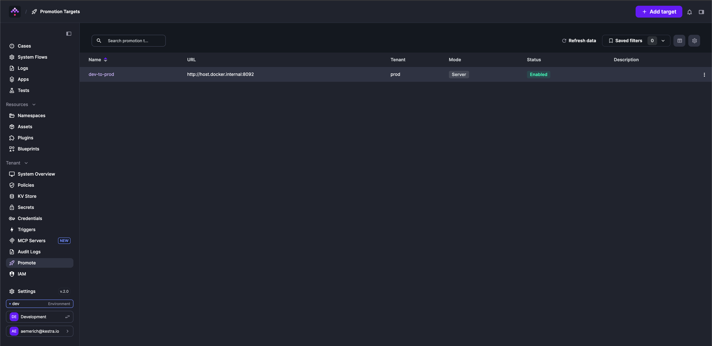
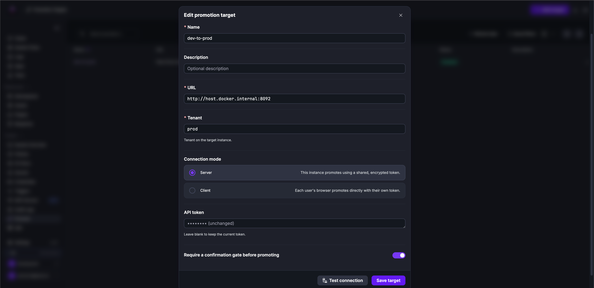
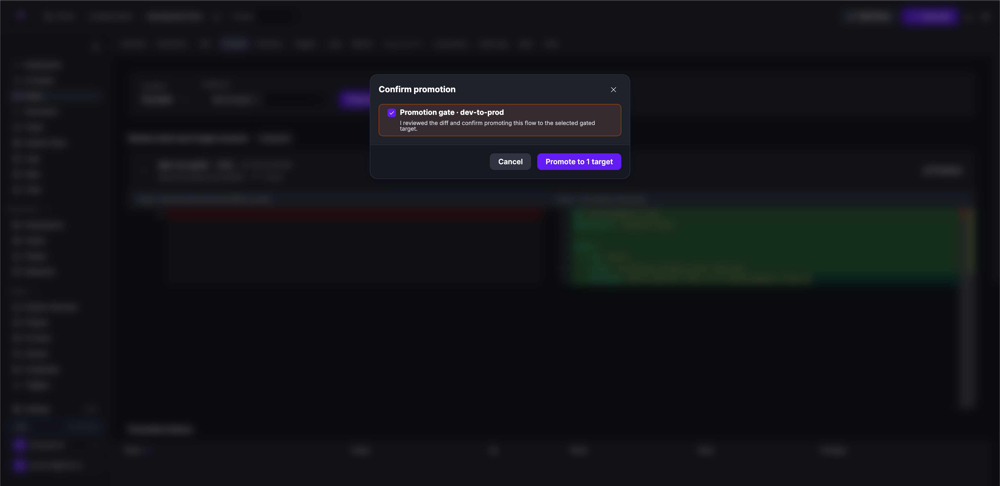
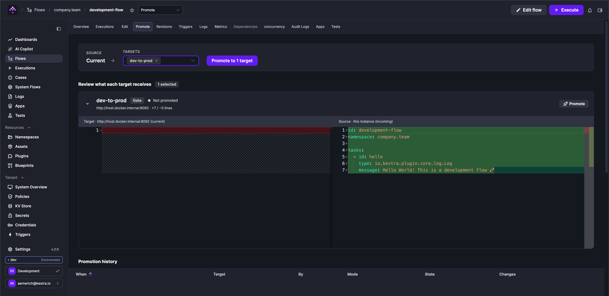
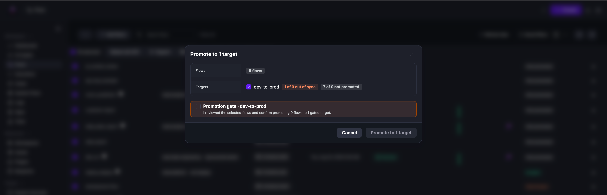
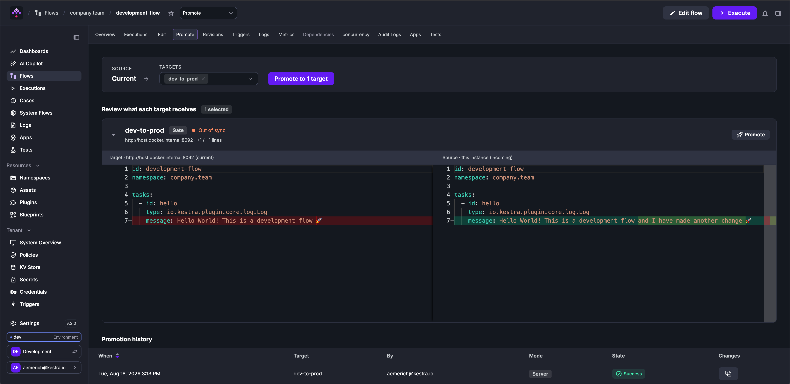

Promote copies a flow from one Kestra instance to another, with a source-to-target diff review and an optional confirmation gate before anything lands in production.

## When to use Promote

Use Promote when your team authors flows in the Kestra UI, runs separate instances per environment (dev, staging, production), and does not want to build or maintain a Git pipeline to move flows between them.

If you already treat Git as the source of truth and deploy flows on merge via CI/CD, continue with that path. Promote and [Git-based deployment](../../../version-control-cicd/04.git/index.md) solve the same problem with different tradeoffs: Promote is UI-first and requires no pipeline; Git-based deployment is automated and auditable at the repository level. See [Version Control & CI/CD](../../../version-control-cicd/index.mdx) for a comparison of all deployment paths.

---

## Promotion targets

A promotion target is a remote Kestra instance that flows are promoted into. Each target has a name, a base URL, an optional target tenant (for multi-tenant instances), and a connection mode. Targets are managed at the tenant level and are available to all users with the appropriate permissions.



### Connection modes

Each target uses one of two connection modes that control how the promote action reaches the remote instance.

**SERVER mode** — the Kestra backend holds an encrypted API token for the remote instance. When a user promotes a flow, the source Kestra server makes the API call to the target on their behalf. Users never see or handle the token.

Use SERVER mode when you want to centralize credential management and prevent users from needing direct access to the target instance.

**CLIENT mode** — no token is stored on the source instance. When a user promotes a flow, they supply their own API token for the target at promote time. The browser calls the target instance directly, then reports the result back to the source for history and audit purposes. Tokens are stored in the user's browser for convenience and are never sent to the source server.

Use CLIENT mode when users already have personal API tokens on the target, or when you want each promotion to be attributable to the individual user's identity on the target.



### Confirmation gate

Each target can optionally require explicit confirmation before any promotion runs. When **Require a confirmation gate before promoting** is enabled on a target, the UI presents the diff and requires the user to acknowledge before the flow is copied to the target. If a promote request is submitted to a gated target without confirmation, no promotion is attempted and nothing is recorded. The user must confirm and resubmit.

Use gated targets for production environments where you want a deliberate review step before deployment.



### Disabling a target

Targets can be disabled without being deleted. A disabled target is hidden from the promote UI — users cannot select it when promoting flows — but its configuration is preserved.

---

## Promote a flow

### From the Deploy tab

Each flow has a **Deploy** tab alongside the editor. From the Deploy tab, select a target, review the diff between the local revision and what is currently running on the target, and confirm. If the target is gated, an explicit confirmation is required before the promotion proceeds.



Only the flow's latest published revision can be promoted. Draft revisions are not eligible.

### From the flow editor

You can also promote a flow by clicking the **Promote** tab directly from the flow editor, without navigating away. The same diff review and gate confirmation apply.

### Bulk promote

From the flows list, select up to 100 flows and choose **Promote** from the action bar. The bulk promote dialog shows a drift summary per target (how many are out of sync, how many have never been promoted) and requires gate confirmation if any selected target has a gate enabled. Results are reported per flow — a failure on one flow does not block the others.



---

## Drift detection

The flows list includes a **Deploy** column that shows the sync state of each flow relative to a selected target. The active target for drift comparison is selected in the flows list and persisted per user session.

| State | Meaning |
|---|---|
| `IN_SYNC` | The target is running the same revision as the local instance |
| `OUT_OF_SYNC` | The target has the flow but is running a different revision |
| `NOT_PROMOTED` | The flow has never been promoted to this target |
| `UNREACHABLE` | The target could not be reached to compare hashes |
| `NEEDS_AUTH` | The target is CLIENT mode and no token has been provided for it |

Drift is computed by comparing each flow's source YAML between the local instance and the target. Only the latest published revision is included.


---

## Promotion history

Every promotion — including who initiated it, which revision was promoted, which target it went to, and whether a gate was confirmed — is recorded as an auditable event. The history for a specific flow is visible on its Deploy tab. For tenant-wide audit purposes, promotions are also available in [Audit Logs](../06.audit-logs/index.md), filtered by resource type `FLOW` and action `PROMOTE`.

From the history, you can recompute the diff of any past promotion to see exactly what changed at the time it was deployed.



---

## What is and is not promoted

Promote copies the flow's YAML definition from the selected revision to the target instance. It does not copy namespace-level resources. If the flow depends on KV pairs, secrets, variables, or namespace files that differ between environments, those must be managed separately on the target.

---

## Access control

Promote uses two distinct RBAC resources.

**Promoting flows** requires the `FLOW: PROMOTE` permission on the source flow's namespace. This permission is namespace-scoped: a user with `FLOW: PROMOTE` on `company.dev` can promote flows in that namespace, but not flows in other namespaces unless they also have the permission there.

**Managing promotion targets** (creating, editing, deleting, viewing targets) requires `PROMOTION_TARGET` permissions. Unlike flow permissions, `PROMOTION_TARGET` is not namespace-scoped — it applies at the tenant level.

| Action | Required permission |
|---|---|
| Promote a flow | `FLOW: PROMOTE` on the flow's namespace |
| View available targets when promoting | `PROMOTION_TARGET: VIEW` |
| Create or edit targets | `PROMOTION_TARGET: CREATE` / `UPDATE` |
| Delete targets | `PROMOTION_TARGET: DELETE` |
| List all targets | `PROMOTION_TARGET: LIST` |

See [RBAC](../../03.auth/rbac/index.md) for how to assign permissions to roles and groups.

---

## Configuration

### Allow insecure target URLs

By default, promotion target URLs must use HTTPS. To allow HTTP URLs — for example, when targets are on a private network without TLS — set the following in your Kestra configuration:

```yaml
kestra:
  ee:
    promote:
      allow-insecure-url: true
```

This setting applies instance-wide. Target URL validation is enforced at create and update time.

