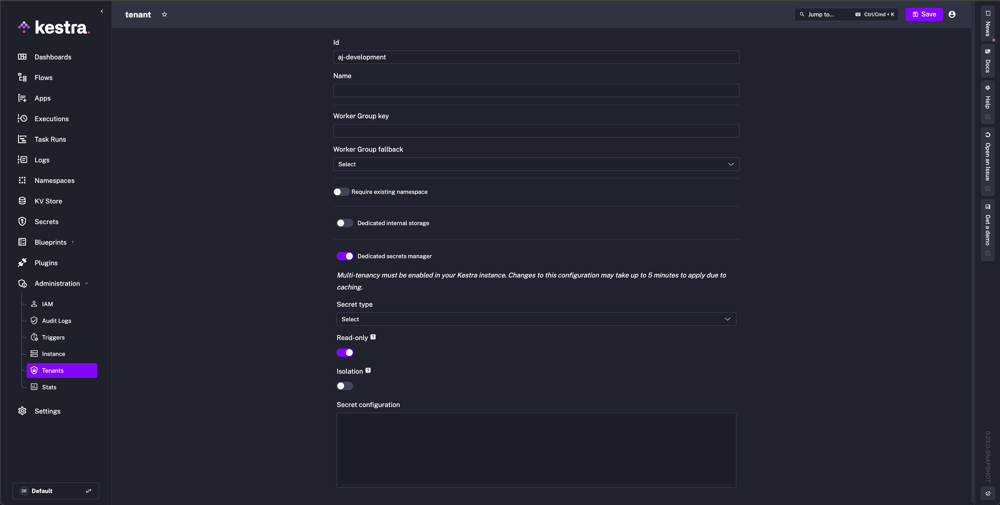
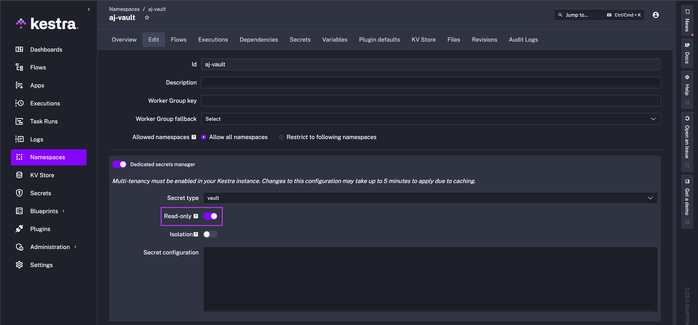

Integrate external secrets managers in a read-only mode.

<div class="video-container">
    <iframe src="https://www.youtube.com/embed/uxFyE1nsMlU?si=X3nUxXwfAu4jCElc" title="YouTube video player" allow="accelerometer; autoplay; clipboard-write; encrypted-media; gyroscope; picture-in-picture; web-share" referrerpolicy="strict-origin-when-cross-origin" allowfullscreen></iframe>
</div>

## Read-only secret manager

When integrating an external [secrets manager](../secrets-manager/index.md) with Kestra, you may want to ensure that those secrets cannot be modified within Kestra, maintaining immutability.
Currently, read-only secrets can be configured for [AWS Secret Manager](../secrets-manager/index.md#aws-secrets-manager-configuration), [Azure Key Vault](../secrets-manager/index.md#azure-key-vault-configuration), [Google Secret Manager](../secrets-manager/index.md#google-secret-manager-configuration), and [Vault](../secrets-manager/index.md#vault-configuration).

## Configure read-only secrets

Read-only secrets can be configured globally in the configuration file as well as enabled from the UI at the [Tenant](../tenants/index.md) and the [Namespace](../../../05.workflow-components/02.namespace/index.md) level.

To enable for a specific Tenant, toggle the setting on in the **Dedicated secrets manager** configuration.



To enable for a specific Namespace, toggle the setting on in the **Dedicated secrets manager** configuration of the **Edit** tab.



Secrets will display a lock icon to indicate read-only status, and the **Create New Secret** button will no longer be visible.


To configure globally, add `read-only: true` to the configuration of your external secret manager like in the examples below.

### AWS Secret Manager

For compatibility with Kestra, ensure that your AWS secrets are stored as plain text in AWS Secrets Manager and not as key-value pairs. The following example shows the configuration for AWS Secret Manager with a read-only secrets backend:

```yaml
kestra:
  secret:
    type: aws-secret-manager
    read-only: true
    aws-secret-manager:
      access-key-id: mysuperaccesskey
      secret-key-id: mysupersecretkey
      region: us-east-1
```

When adding a secret in AWS, you will need to specify the following tags:
- `namespace`: the namespace this secret should appear in.
- `key`: the key which you will use to access the secret inside of your workflow.
- `prefix`: used to store secrets separately. Will be set to `kestra` by default if secret is created inside Kestra.

:::alert{type="info"}
The secret name in AWS will not display inside of Kestra. Instead set this to something easy to differentiate between other secrets.
:::

### Azure Key Vault

The following example shows the configuration for Azure Key Vault with a read-only secrets backend:

```yaml
kestra:
  secret:
    type: azure-key-vault
    read-only: true
    azure-key-vault:
      clientSecret:
        tenantId: "id"
        clientId: "id"
        clientSecret: "secret"
```

### Google Secret Manager

The following example shows the configuration for Google Secret Manager with a read-only secrets backend:

```yaml
kestra:
  secret:
    type: google-secret-manager
    read-only: true
    google-secret-manager:
      project: gcp-project-id
      service-account: |
        Paste the contents of the service account JSON key file here.
```

### Vault

With [Vault](../secrets-manager/index.md#vault-configuration), secrets are stored in a unique structure that can vary depending on the organization and version of Vault. Typically, there is a Secret Engine that hosts different Secrets with specific paths. Those Secrets are the paths to subkeys that are the actual key value pairs such as Username or Password to a service (e.g., `MY_SECRET = MY_SECRET_PASSWORD`).

Here’s an example directory structure of a Vault secret engine used with Kestra:

```
secret/
  ├── app1/
  │   ├── db/ <-- SECRET
  │   │   ├── DATABASE_USERNAME    # Subkey
  │   │   ├── DATABASE_PASSWORD   # Subkey
  │   ├── api/ <-- SECRET
  │       ├── keys                # Subkey
  │       ├── API_TOKEN           # Subkey
  ├── app2/
      ├── config
```

- `secret`: This is the secret engine.
- `app1` and `app2`: These are the path names to the secrets. This could be for example separate business units or applications.
- `db`, `api`, and `config`: These are the secret names visible in the Kestra UI. `api` could be the Vault Secret that contains all API Keys for an application's external services.
- `DATABASE_USERNAME`, `DATABASE_PASSWORD`, `keys`, `API_TOKEN`: These are the `subkey` key value pairs that can be used in a Kestra flow.

To configure access to secrets under `app1`, use the following [Kestra configuration](../../../configuration/index.md) with the added property `secret-path-prefix`:

```yaml
address: https://my-vault:8200/
root-engine: secret
secret-path-prefix: app1
token:
  token: my-vault-access-token
```

This configuration gives Kestra access to the `db` and `api` secrets, as they are the secrets on the `app1` path. In a flow, to access the value for the subkey `API_TOKEN`, you write the `secret()` function with the specified parameters `{{ secret('api', subkey='API_TOKEN') }}`.

## Vault full example

The following steps are a full example of configuring Vault as your secret manager with read-only secrets enabled. This example uses [KV Secrets Engine - Version 2 with Vault Enterprise](../secrets-manager/index.md#kv-secrets-engine---version-2), so `root-engine` and `namespace` are used as optional properties.

In Vault, we have a Secrets Engine named `business-unit` in the `admin` namespace that hosts the path to our database password that we want to use to [add a table and populate with data in Neon](../../../15.how-to-guides/neon/index.md).


In Kestra, we can now navigate to the Namespace we want to set up Vault as a secrets manager for and enter the configuration details:


After saving, we can move to the Secrets tab and see which paths we have access to. Notice the lock icon indicating that read-only is successfully turned on. No new secrets can be created from Kestra, and existing secrets are not editable.


In Vault, we know `my-app` is the secret that hosts the subkey we are looking for, in this case, `NEON_PASSWORD`.


Now to use in our flow, we need to use the `secret()` function with the name of our secret `my-app` and the `subkey` parameter set to the key of the secret value we want to use, which in this case is `NEON_PASSWORD`.

:::collapse{title="Expand for a Flow yaml"}
```yaml
id: neon-db
namespace: company.team

tasks:

  - id: download
    type: io.kestra.plugin.core.http.Download
    uri: https://huggingface.co/datasets/kestra/datasets/raw/main/csv/orders.csv

  - id: create_columns
    type: io.kestra.plugin.jdbc.postgresql.Queries
    sql: |
      ALTER TABLE kestra_example_secret
      ADD COLUMN order_id int,
      ADD COLUMN customer_name text,
      ADD COLUMN customer_email text,
      ADD COLUMN product_id int,
      ADD COLUMN price double precision,
      ADD COLUMN quantity int,
      ADD COLUMN total double precision;

  - id: copy_in
    type: io.kestra.plugin.jdbc.postgresql.CopyIn
    table: "kestra_example_secret"
    from: "{{ outputs.download.uri }}"
    header: true
    columns: [order_id,customer_name,customer_email,product_id,price,quantity,total]
    delimiter: ","


pluginDefaults:
  - forced: true
    type: io.kestra.plugin.jdbc.postgresql
    values:
      url: jdbc:postgresql://ep-ancient-flower-a2e73um1-pooler.eu-central-1.aws.neon.tech/neondb?user=neondb_owner&password={{secret('my-app', subkey='NEON_PASSWORD')}}
```
:::


After saving the flow and executing, we can see that Kestra successfully accessed the correct value from Vault and added 100 rows to our Neon database.


## Filter secrets by tags

When integrating an external secrets manager in read-only mode, you can filter which secrets are visible in Kestra by matching [tags](../secrets-manager/index.md#default-tags). This is supported for AWS Secrets Manager, Azure Key Vault, and Google Secret Manager.

- Set `read-only: true` and configure `filter-on-tags.tags` as a map of key/value pairs to match.

Below are example configurations for AWS Secrets Manager, Azure Key Vault, and Google Secret Manager:

```yaml
kestra:
  secret:
    type: aws-secret-manager
    read-only: true
    aws-secret-manager:
      filter-on-tags:
        tags:
          application: kestra-production
```

```yaml
kestra:
  secret:
    type: azure-key-vault
    read-only: true
    azure-key-vault:
      filter-on-tags:
        tags:
          application: kestra-production
```

```yaml
kestra:
  secret:
    type: google-secret-manager
    read-only: true
    google-secret-manager:
      filter-on-tags:
        tags:
          application: kestra-production
```

## Filter secrets by prefix

For AWS Secrets Manager, you can also filter secrets by a name prefix when using read-only mode. Use `filter-on-prefix.prefix` to select secrets whose names start with the given prefix and `filter-on-prefix.keep-prefix` to control whether the prefix is kept in the Kestra secret key.

```yaml
kestra:
  secret:
    type: aws-secret-manager
    read-only: true
    aws-secret-manager:
      filter-on-prefix:
        prefix: prod_
        keep-prefix: true
```
