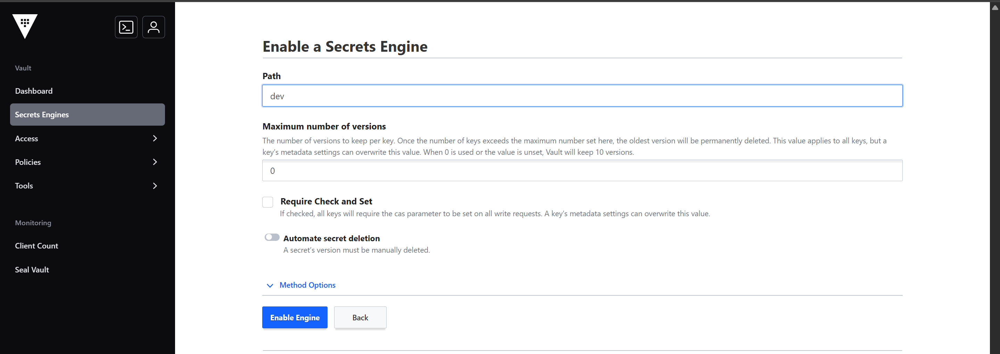
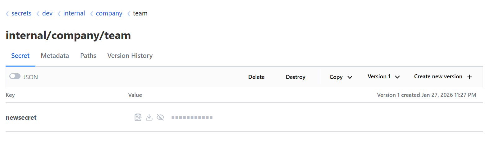

How to configure a secrets manager.

## Configure external secrets manager

Kestra integrates with various secret managers to provide secure storage and handling of sensitive data.

Kestra respects your privacy. Therefore, secrets are persisted externally in a backend of your choice. Workers fetch them at runtime and keep them only in memory.

You can add, modify, or delete secrets from the **Secrets** tab of any given namespace in the Kestra UI or programmatically via [Terraform](https://registry.terraform.io/providers/kestra-io/kestra/latest/docs/resources/namespace_secret).

<div class="video-container">
  <iframe src="https://www.youtube.com/embed/U0cNzNQ-bkw?si=20ltjCZBXJW8_QAe" title="YouTube video player" allow="accelerometer; autoplay; clipboard-write; encrypted-media; gyroscope; picture-in-picture; web-share" referrerpolicy="strict-origin-when-cross-origin" allowfullscreen></iframe>
</div>

## AWS Secrets Manager Configuration

To use [AWS Secrets Manager](https://aws.amazon.com/secrets-manager/) as a secrets backend, make sure your AWS IAM user or role has the required permissions, including `CreateSecret`, `DeleteSecret`, `DescribeSecret`, `GetSecretValue`, `ListSecrets`, `PutSecretValue`, `RestoreSecret`, `TagResource`, and `UpdateSecret`.

You can configure the authentication to AWS Cloud in multiple ways:
- Use `accessKeyId`, `secretKeyId`, and `region` properties.
- Include a `sessionToken` alongside the above credentials.
- If the above properties are not set, Kestra will use the default AWS authentication in the same way as AWS CLI handles it (i.e., trying to use the AWS CLI profile or the default environment variables `AWS_ACCESS_KEY_ID`, `AWS_SECRET_ACCESS_KEY`, and `AWS_DEFAULT_REGION`).

```yaml
kestra:
  secret:
    type: aws-secret-manager
    aws-secret-manager:
      access-key-id: mysuperaccesskey
      secret-key-id: mysupersecretkey
      sessionToken: mysupersessiontoken
      region: us-east-1
```

Additionally, you can configure the following properties:

- **Prefix**: `kestra.secret.aws-secret-manager.prefix` is an optional property to store secrets separately for a different namespace, tenant, or instance. If configured, Kestra prefixes all secret keys with that value. This allows sharing a single secrets backend across multiple Kestra instances.
- **Endpoint Override**: `kestra.secret.aws-secret-manager.endpoint-override` is an optional property to replace the default AWS endpoint with an AWS-compatible service such as [MinIO](https://min.io/).

## Azure Key Vault configuration

To configure [Azure Key Vault](https://azure.microsoft.com/products/key-vault/) as your secrets backend, make sure Kestra's user or service principal (`clientId`) has the necessary permissions, including:
- `"Get"`
- `"List"`
- `"Set"`
- `"Delete"`
- `"Recover"`
- `"Backup"`
- `"Restore"`
- `"Purge"`

Then, paste the `clientSecret` from the Azure portal to the `clientSecret` property in the configuration below.

```yaml
kestra:
  secret:
    type: azure-key-vault
    azure-key-vault:
      clientSecret:
        tenantId: "id"
        clientId: "id"
        clientSecret: "secret"
```

If no credentials are set in the above configuration, Kestra uses the default Azure authentication (the same mechanism as the Azure CLI).

Additionally, you can configure the following properties:

- **Vault Name**: `kestra.secret.azure-key-vault.vault-name` is the name of the Azure Key Vault.
- **Key Vault URI**: `kestra.secret.azure-key-vault.key-vault-uri` is an optional property allowing you to replace the Azure Key Vault name with a full URL.
- **Prefix**: `kestra.secret.azure-key-vault.prefix` is an optional property to store secrets separately for a different namespace, tenant, or instance. If configured, Kestra prefixes all secret keys with that value, which is useful when sharing one vault across multiple Kestra instances.

## Elasticsearch configuration

Elasticsearch backend stores secrets with an additional layer of security using [AES encryption](https://en.wikipedia.org/wiki/Advanced_Encryption_Standard). You need to provide a cryptographic key (at least 32 characters-long string) in order to encrypt and decrypt secrets stored in Elasticsearch.

```yaml
kestra:
  secret:
    type: elasticsearch
    elasticsearch:
      secret: "a-secure-32-character-minimum-key"
```

For Kestra instance deployed using the Kafka/Elastic backend, you can use the same configuration.

Your secret key should be encrypted. You can find an example key in our [encryption configuration documentation](../../../configuration/index.md#encryption).

## Google Secret Manager configuration

To leverage [Google Secret Manager](https://cloud.google.com/secret-manager) as your secrets backend, you need to create a **service account** with the [`roles/secretmanager.admin`](https://cloud.google.com/secret-manager/docs/access-control) permission.  For configuring the secret manager in _READ_ONLY_ mode, only `roles/secretmanager.secretAccessor` permission is sufficient.

Paste the contents of the service account JSON key file to the `serviceAccount` property in the configuration below. Alternatively, set the `GOOGLE_APPLICATION_CREDENTIALS` environment variable to point to the credentials file.

```yaml
kestra:
  secret:
    type: google-secret-manager
    google-secret-manager:
      project: gcp-project-id
      serviceAccount: |
        {
          "type": "service_account",
          "project_id": "gcp-project-id",
          "private_key_id": "...",
          "private_key": "...",
          ...
        }
```

If you opt for authentication using the `GOOGLE_APPLICATION_CREDENTIALS` environment variable, make sure that it's set on all worker nodes. Keep in mind that this authentication method is less secure than using the `serviceAccount` property.

If no credentials are set in the above configuration, Kestra will use the default Google authentication akin to the Google Cloud SDK.

Additionally, you can configure the `kestra.secret.google-secret-manager.prefix` property to store secrets separately for a different namespace, tenant, or instance. If configured, Kestra will prefix all Secret keys using that prefix. The main purpose of a prefix is to share the same secret manager between multiple Kestra instances.

When configuring the secret manager using the UI, either under Namespace or Tenant, you only need to configure the `project` and `serviceAccount` YAML configuration:


## Vault configuration

Kestra currently supports the [KV secrets engine - version 2](https://developer.hashicorp.com/vault/docs/secrets/kv/kv-v2) as a secrets backend. If you are considering alternative Vault secrets engines, please note the following:
- The [Vault's database secrets engine](https://developer.hashicorp.com/vault/docs/secrets/databases), often referred to as "dynamic secrets", is not supported as we need long-term secret storage.
- The [Vault Secrets Operator on Kubernetes](https://developer.hashicorp.com/vault/tutorials/kubernetes/vault-secrets-operator) creates a Kubernetes secret which is compatible with Kestra with some additional steps. If you are interested about this option, [reach out to us](/demo) and we can advise how you can set this up.

Follow the steps below to configure the [KV Secrets Engine - Version 2](https://www.vaultproject.io/docs/secrets/kv/kv-v2) as your secrets backend.

### KV Secrets Engine - Version 2

To authenticate Kestra with [HashiCorp Vault](https://www.vaultproject.io/), you can use Userpass, Token, AppRole, or Kubernetes [Auth Methods](https://developer.hashicorp.com/vault/docs/auth), all of which require full [read and write policies](https://www.vaultproject.io/docs/concepts/policies). You can optionally change `rootEngine` or `namespace` (_if you use Vault Enterprise_).

1. Here is how you can set up [Userpass Auth Method](https://www.vaultproject.io/docs/auth/userpass) in your Kestra configuration:

```yaml
kestra:
  secret:
    type: vault
    vault:
      address: "http://localhost:8200"
      password:
        user: john
        password: foo
```

2. Here is how you can set up [Token Auth Method](https://www.vaultproject.io/docs/auth/token) in your Kestra configuration:

```yaml
kestra:
  secret:
    type: vault
    vault:
      address: "http://localhost:8200"
      token:
        token: <your-secret-token>
```

3. Finally, here is how you can set up [AppRole Auth Method](https://www.vaultproject.io/docs/auth/approle) in your Kestra configuration:

```yaml
kestra:
  secret:
    type: vault
    vault:
      address: "http://localhost:8200"
      appRole:
        path: approle
        roleId: <your-role-id>
        secretId: <your-secret-id>
```

4. Finally, here is how you can set up [Kubernetes Auth Method](https://www.vaultproject.io/docs/auth/kubernetes) in your Kestra configuration:

```yaml
kestra:
  secret:
    type: vault
    vault:
      address: "http://localhost:8200"
      kubernetes:
        path: "kubernetes"                      # defaults to "kubernetes"
        role: "kestra"                          # <-- the Vault K8s auth role name to use
```

Additionally, you can configure the following properties:

- **Address**: `kestra.secret.vault.address` is a fully qualified address with scheme and port to your Vault instance.
- **Namespace**: `kestra.secret.vault.namespace` is an optional configuration available on [Vault Enterprise Pro](https://learn.hashicorp.com/vault/operations/namespaces) allowing you to set a global namespace for the Vault server instance.
- **Engine Version**: `kestra.secret.vault.engine-version` is an optional property allowing you to set the KV Secrets Engine version of the Vault server instance. Default is `2`.
- **Root Engine**: `kestra.secret.vault.root-engine` is an optional property allowing you to set the KV Secrets Engine of the Vault server instance. Default is `secret`.

Using the Token method with Root Engine has the following configuration:

```yaml
kestra:
  secret:
    type: vault
    vault:
      token:
        token: YOUR_TOKEN
      address: http://vault:8200
      rootEngine: dev
```

In Vault, `rootEngine: dev` translates to your KV secret engine type with path set as "dev".



And any secret that you create from Kestra would be placed under the following structure: `TENANT_ID/NAMESPACE_PARENT/NAMESPACE_CHILD/NAMESPACE_GRANDCHILD/SECRET_NAME`. Assuming a Tenant ID of `internal` and a `company.team` Namespace, Vault will show the following:



## CyberArk Configuration

Kestra integrates with [CyberArk](https://www.cyberark.com/products/secrets-management/) as a secrets backend. CyberArk stores your secrets externally, and Kestra workers retrieve them at runtime and keep them only in memory.

To use CyberArk, configure the CyberArk endpoint and credentials. This configuration can be set globally in your [Kestra configuration file](../../../configuration/index.md) or per-namespace using the **Secrets** tab with a dedicated secret manager.

```yaml
kestra:
  secret:
    type: cyberark
    cyberark:
      address: https://your-cyberark-host
      username: YOUR_USERNAME
      password: YOUR_PASSWORD
```

**Configuration properties:**

* **address**: The CyberArk API base URL.
* **username**: Username used to authenticate to CyberArk.
* **password**: Password used to authenticate to CyberArk.

## Doppler configuration

Kestra integrates with [Doppler](https://api.doppler.com) as a secrets backend. Doppler securely stores your secrets and exposes them through its API, which Kestra workers access at runtime. Secrets are only kept in memory by Kestra and are never persisted internally.

To use Doppler, generate a Doppler service token with access to the desired project and config. Then, add the following configuration either globally in your [Kestra configuration file](../../../configuration/index.md) or per-namespace using the **Secrets** tab with a dedicated secret manager.

```yaml
secret:
  type: doppler
  doppler:
    token: YOUR_TOKEN
    config: kestra_unit_test
    project: kestra_unit_test
    secretNamePrefix: kestra
```

**Configuration properties:**

* **token**: Your Doppler service token.
* **project**: The Doppler project containing the secrets.
* **config**: The Doppler config/environment to read from.
* **secretNamePrefix**: Optional prefix added to all secret keys to avoid collisions and share a Doppler backend across multiple Kestra instances or namespaces.

## 1Password Configuration

Kestra integrates with 1Password as a secrets backend. Under the hood, it relies on the [1Password Connect API](https://developer.1password.com/docs/connect/api-reference/) to read and manage secrets securely. Workers access secrets at runtime and store them only in memory.

To use 1Password, you need a running 1Password Connect server and a Connect token with access to the target vault. Then, add the following configuration either globally in your [Kestra configuration file](../../../configuration/index.md) or per-namespace using the **Secrets** tab with a dedicated secret manager.

```yaml
kestra:
  secret:
    type: 1password
    1password:
      address: http://localhost:18080
      token: YOUR_TOKEN
      vaultId: YOUR_VAULT_ID
```

**Configuration properties:**

* **address**: The base URL of your 1Password Connect server.
* **token**: Your 1Password Connect API token.
* **vaultId**: The ID of the vault containing your secrets.

## BeyondTrust Configuration

Kestra integrates with BeyondTrust Password Safe (Secrets Safe) as an external secrets backend. Secrets are stored securely in BeyondTrust using [Secret Safe API](https://docs.beyondtrust.com/bips/v24.3/docs/secrets-safe-api), and Kestra workers retrieve them at runtime and keep them only in memory.

```yaml
kestra:
  secret:
    type: beyondtrust
    beyondtrust:
      address: https://beyondtrust.example.com
      apiKey: YOUR_API_KEY
      runAs: domain\\service-account
      folderId: YOUR_SECRETS_SAFE_FOLDER_ID
```

**Configuration properties:**

* **address**: The base URL of the BeyondTrust Password Safe instance.
* **apiKey**: API key used to authenticate with BeyondTrust.
* **runAs**: User context to run API calls as (e.g. domain\\username).
* **folderId**: Secrets Safe folder ID where Kestra secrets are stored.

## JDBC (Postgres, H2, MySQL) Secret Manager

Kestra also supports internal secret backend. For the JDBC backend (H2, PostgreSQL, or MySQL), the following configuration allows you to set secret backend:

```yaml
kestra:
  secret:
    type: jdbc
    jdbc:
      secret: <your-secret-key>
```

Your secret key should be encrypted. You can find an example key in our [encryption configuration documentation](../../../configuration/index.md#encryption).

## Default tags

For each secret manager, you can configure the default tags that will be added to all newly created or updated secrets.

Configuration example:

```yaml
kestra:
  secret:
    <secret-type>:
      # a map of default key/value tags
      tags:
        application: kestra-production
```

Tags can be used as filters on your secrets in read-only mode. Refer to the [Read-only Secret Manager documentation](../read-only-secrets/index.md#filter-secrets-by-tags) for more details.

## Enable caching

If you use a secret manager provided by a cloud service provider, it may be worth enabling the secret cache to reduce
the number of calls to the secret manager API.

Configuration example:

```yaml
kestra:
  secret:
    cache:
      enabled: true
      maximum-size: 1000
      expire-after-write: 60s
```

* **`kestra.secret.cache.enabled`**: Specifies whether to enable caching for secrets.
* **`kestra.secret.cache.maximum-size`**:  The maximum number of entries the cache may contain.
* **`kestra.secret.cache.expire-after-write`**:  Specifies that each entry should be automatically removed from the cache once this duration has elapsed after the entry's creation.
