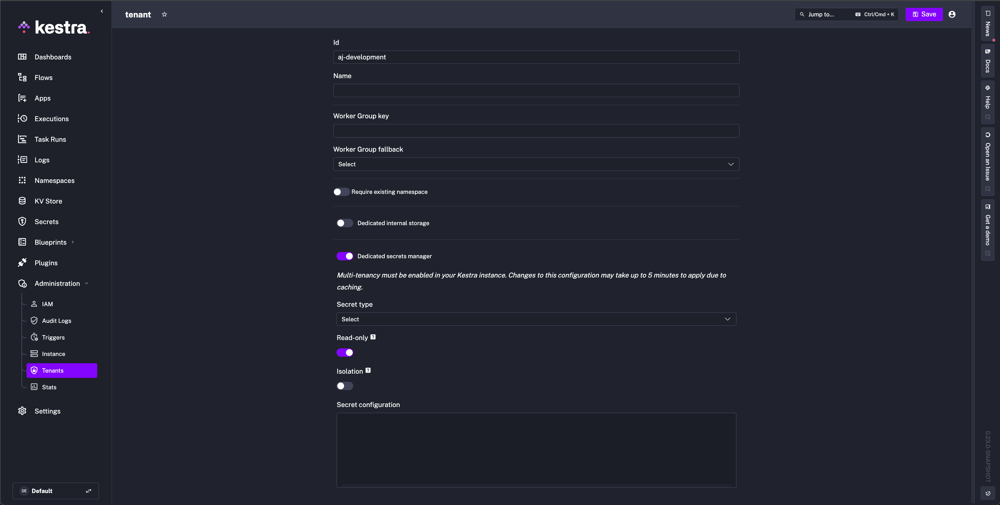
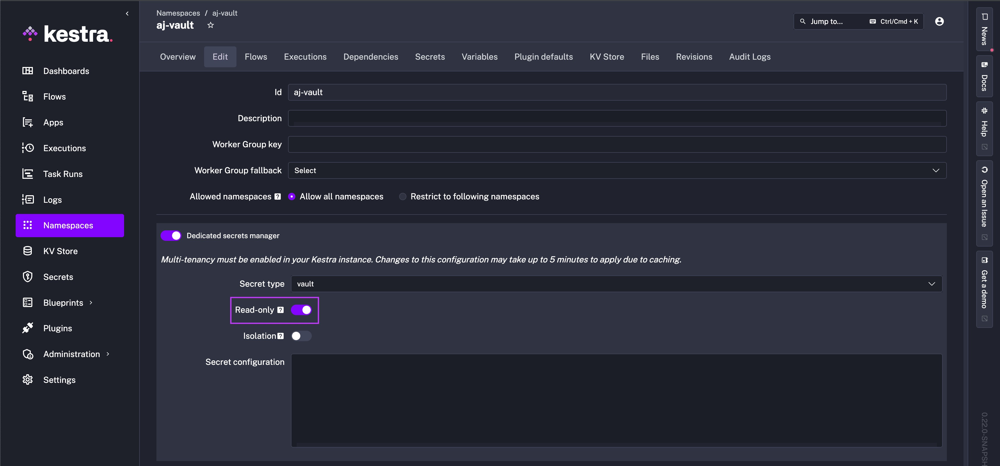
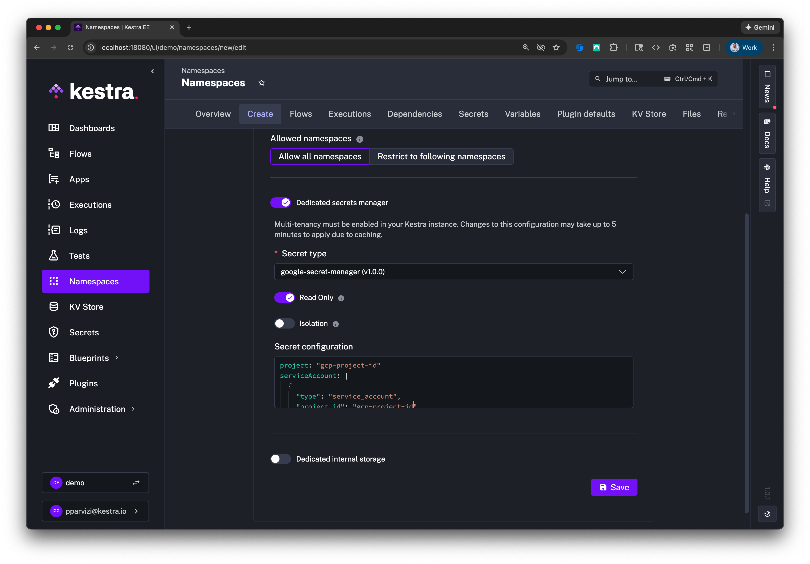
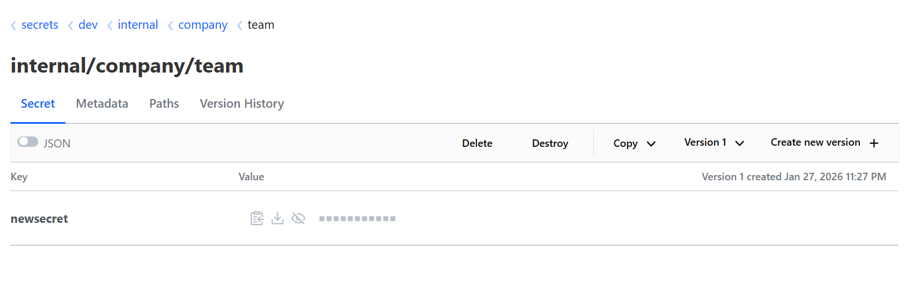
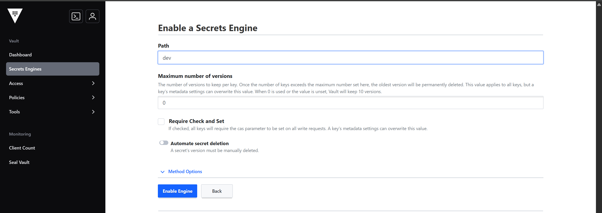

Configure Kestra to store and retrieve secrets from an external backend such as AWS Secrets Manager, Azure Key Vault, Google Secret Manager, HashiCorp Vault, and others.

:::alert{type="info"}
For short-lived OAuth-style access tokens, use a [Credential](../../03.auth/credentials/index.md) that mints and refreshes tokens from secrets stored in your external manager, then reference it with `credential()` in flows.
:::

<div class="video-container">
  <iframe src="https://www.youtube.com/embed/U0cNzNQ-bkw?si=20ltjCZBXJW8_QAe" title="YouTube video player" allow="accelerometer; autoplay; clipboard-write; encrypted-media; gyroscope; picture-in-picture; web-share" referrerpolicy="strict-origin-when-cross-origin" allowfullscreen></iframe>
</div>

## Secrets manager modes

Kestra supports two modes when integrating an external secrets backend. They differ fundamentally in **who is the source of truth** for secret metadata.

| | Managed mode (default) | Read-only mode |
|---|---|---|
| **Source of truth** | Kestra | External system |
| **Secret metadata** | Kestra tags secrets automatically | Tags must be set manually in the external backend |
| **Create / edit / delete** | From Kestra UI or Terraform | Not possible from Kestra — external system only |
| **Tag changes externally** | Not reflected in Kestra | Reflected immediately |
| **Value changes externally** | Picked up at next read | Picked up at next read |

### Managed mode (default)

Kestra is the source of truth. You create, edit, and delete secrets from the Kestra UI or via Terraform. When you create a secret, Kestra stores the encrypted value in the external backend and attaches metadata tags (`namespace`, `tenant`, `key`, `prefix`) automatically.

- Kestra reads the value from the external backend at runtime.
- Tag changes made directly in the external backend are **not** reflected in Kestra — Kestra ignores external metadata.
- The external backend is encrypted storage only; Kestra controls the index.

:::alert{type="warning"}
Secrets created directly in the external backend (without going through Kestra) will **not** appear in Kestra in managed mode. Kestra only discovers secrets it created itself. To make externally-managed secrets visible in Kestra, use [read-only mode](#read-only-mode) instead.
:::

### Read-only mode

The external system is the source of truth. You populate secrets and their metadata tags in the external backend yourself, and Kestra reads them. Kestra cannot create, edit, or delete secrets — the UI shows a lock icon and hides the **Create New Secret** button.

Read-only mode is supported for all external secrets backends. For backend-specific requirements such as secret format constraints, see the read-only subsection under the relevant backend below.

**Enable globally** — add `read-only: true` to your `kestra.secret` configuration:

```yaml
kestra:
  secret:
    type: aws-secret-manager
    read-only: true
    aws-secret-manager:
      region: us-east-1
```

**Enable per tenant** — toggle the setting in the **Dedicated secrets manager** configuration under the tenant settings:



**Enable per namespace** — toggle the setting in the **Dedicated secrets manager** section of the namespace **Edit** tab:



Once enabled, secrets display a lock icon and the **Create New Secret** button is hidden:


Required tags that must be set externally in read-only mode:
- `namespace` — the namespace the secret belongs to.
- `key` — name used to reference the secret in flows via `secret('KEY')`.
- `prefix` — defaults to `kestra` when a secret is created inside Kestra; must be set manually in read-only mode.

## Configure a secrets manager

Set the backend globally in your Kestra configuration file using `kestra.secret.type`, or scope it to a specific [tenant](../tenants/index.md) or [namespace](../../../05.workflow-components/02.namespace/index.md) via the **Dedicated secrets manager** setting in the UI. Each backend uses its own sub-key matching the type name.

:::alert{type="warning"}
**Property naming differs between global config and the UI.** In your `kestra.yml` configuration file, use kebab-case (e.g., `safe-name`, `auth-method`). When configuring a dedicated secrets manager for a namespace or tenant via the UI, use camelCase (e.g., `safeName`, `authMethod`).
:::

**Supported backends:** [AWS Secrets Manager](#aws-secrets-manager) · [AWS SSM Parameter Store](#aws-ssm-parameter-store) · [Azure Key Vault](#azure-key-vault) · [Google Secret Manager](#google-secret-manager) · [HashiCorp Vault](#hashicorp-vault) · [CyberArk](#cyberark) · [Doppler](#doppler) · [1Password](#1password) · [BeyondTrust](#beyondtrust) · [Delinea Secret Server](#delinea-secret-server) · [Bitwarden](#bitwarden) · [JDBC](#jdbc-postgresql-h2-mysql) · [Elasticsearch](#elasticsearch)

---

## AWS Secrets Manager

### Permissions

**Managed mode** — the IAM identity needs: `CreateSecret`, `DeleteSecret`, `DescribeSecret`, `GetSecretValue`, `ListSecrets`, `PutSecretValue`, `RestoreSecret`, `TagResource`, `UpdateSecret`.

**Read-only mode** — only `GetSecretValue`, `ListSecrets`, and `DescribeSecret` are needed.

### Minimum configuration

```yaml
kestra:
  secret:
    type: aws-secret-manager
    aws-secret-manager:
      region: us-east-1
```

With explicit credentials:

```yaml
kestra:
  secret:
    type: aws-secret-manager
    aws-secret-manager:
      access-key-id: YOUR_ACCESS_KEY_ID
      secret-key-id: YOUR_SECRET_KEY_ID
      region: us-east-1
```

### Configuration reference

| Property | Type | Required | Default | Description |
|---|---|---|---|---|
| `access-key-id` | string | No | — | AWS access key ID. |
| `secret-key-id` | string | No | — | AWS secret access key. |
| `session-token` | string | No | — | Temporary session token. |
| `region` | string | No | — | AWS region (e.g. `us-east-1`). |
| `prefix` | string | No | `kestra` | Prefix applied to all secret names. Use to share one backend across multiple Kestra instances. |
| `endpoint-override` | string | No | — | Replace the default AWS endpoint with a compatible service (e.g. LocalStack). |
| `sts-role-arn` | string | No | — | ARN of an IAM role to assume via STS before accessing secrets. |
| `sts-role-external-id` | string | No | — | External ID passed with the STS AssumeRole call. |
| `sts-role-session-name` | string | No | — | Session name for the STS assumed role. |
| `sts-role-session-duration` | duration | No | `PT15M` | Duration of the assumed-role session. |
| `sts-endpoint-override` | string | No | — | Override the STS endpoint URL. |
| `tags` | map | No | — | Default tags added to every new or updated secret. |
| `filter-on-tags` | map | No | — | Read-only mode: filter visible secrets by matching these tags. |
| `filter-on-prefix` | object | No | — | Read-only mode: filter by secret name prefix. |
| `excluded-tags` | map | No | — | Secrets with these tags are excluded from Kestra's view. |

### Credential resolution order

1. `access-key-id` / `secret-key-id` (+ optional `session-token`) in config.
2. STS role assumption using `sts-role-arn` (chained on top of any resolved identity).
3. `AWS_ACCESS_KEY_ID` / `AWS_SECRET_ACCESS_KEY` / `AWS_DEFAULT_REGION` environment variables.
4. AWS CLI profile (`~/.aws/credentials`).
5. EKS Pod Identity or IRSA (IAM Roles for Service Accounts).
6. EC2/ECS instance metadata profile.

### Read-only mode

Secrets must be stored as **plain text** in AWS Secrets Manager, not as key-value pairs.

```yaml
kestra:
  secret:
    type: aws-secret-manager
    read-only: true
    aws-secret-manager:
      access-key-id: YOUR_ACCESS_KEY_ID
      secret-key-id: YOUR_SECRET_KEY_ID
      region: us-east-1
```

Each secret must have the following tags set in AWS:
- `namespace` — the Kestra namespace this secret belongs to.
- `key` — the name used in `secret('KEY')` expressions.
- `prefix` — typically `kestra`.

:::alert{type="info"}
The secret name in AWS will not display in Kestra. Use the `key` tag to control what name Kestra uses.
:::

**Filter by tags** — limit visible secrets to those matching specific tags:

```yaml
kestra:
  secret:
    type: aws-secret-manager
    read-only: true
    aws-secret-manager:
      filter-on-tags:
        tags:
          application: kestra-production
```

**Filter by prefix** — limit visible secrets to those whose names start with a given prefix:

```yaml
kestra:
  secret:
    type: aws-secret-manager
    read-only: true
    aws-secret-manager:
      filter-on-prefix:
        prefix: prod_
        keep-prefix: true   # set false to strip the prefix from the Kestra key name
```

---

## AWS SSM Parameter Store

Secrets are stored as `SecureString` parameters. The parameter name is `<prefix>-<hash>`; namespace, tenant, and key are stored as parameter tags. In read-only mode, Kestra reads existing parameters by their name, so a Parameter Store already populated outside Kestra can be used directly.

### Permissions

**Managed mode** — the IAM identity needs: `ssm:PutParameter`, `ssm:GetParameter`, `ssm:DeleteParameter`, `ssm:DescribeParameters`, `ssm:AddTagsToResource`, `ssm:RemoveTagsFromResource`, `ssm:ListTagsForResource`, plus `kms:Encrypt` and `kms:Decrypt` on the KMS key used for `SecureString` encryption.

**Read-only mode** — only `ssm:GetParameter`, `ssm:DescribeParameters`, and `ssm:ListTagsForResource` are needed.

### Minimum configuration

```yaml
kestra:
  secret:
    type: aws-ssm-parameter-store
    aws-ssm-parameter-store:
      region: us-east-1
```

### Configuration reference

| Property | Type | Required | Default | Description |
|---|---|---|---|---|
| `access-key-id` | string | No | — | AWS access key ID. |
| `secret-key-id` | string | No | — | AWS secret access key. |
| `session-token` | string | No | — | Temporary session token. |
| `region` | string | No | — | AWS region. |
| `kms-key-id` | string | No | — | Customer-managed KMS key ID for `SecureString` encryption. Defaults to `alias/aws/ssm`. |
| `prefix` | string | No | `kestra` | Prefix applied to all parameter names. |
| `endpoint-override` | string | No | — | Replace the default SSM endpoint. |
| `sts-role-arn` | string | No | — | IAM role to assume via STS. |
| `sts-role-external-id` | string | No | — | External ID for STS AssumeRole. |
| `sts-role-session-name` | string | No | — | Session name for the assumed role. |
| `sts-role-session-duration` | duration | No | `PT15M` | Duration of the assumed-role session. |
| `sts-endpoint-override` | string | No | — | Override the STS endpoint URL. |
| `tags` | map | No | — | Default tags added to every new or updated parameter. |
| `filter-on-tags` | map | No | — | Read-only mode: filter visible parameters by matching tags. |
| `filter-on-prefix` | object | No | — | Read-only mode: filter by parameter name prefix. |
| `excluded-tags` | map | No | — | Parameters with these tags are excluded from Kestra's view. |

Credential resolution order is identical to [AWS Secrets Manager](#credential-resolution-order).

### Read-only mode

```yaml
kestra:
  secret:
    type: aws-ssm-parameter-store
    read-only: true
    aws-ssm-parameter-store:
      region: us-east-1
```

Tag and prefix filtering work the same as for [AWS Secrets Manager](#read-only-mode).

---

## Azure Key Vault

### Permissions

**Managed mode** — the service principal or managed identity needs: `Get`, `List`, `Set`, `Delete`, `Recover`, `Backup`, `Restore`, `Purge`.

**Read-only mode** — only `Get` and `List` are needed.

### Minimum configuration

```yaml
kestra:
  secret:
    type: azure-key-vault
    azure-key-vault:
      vault-name: my-vault-name
      client-secret:
        tenant-id: YOUR_TENANT_ID
        client-id: YOUR_CLIENT_ID
        client-secret: YOUR_CLIENT_SECRET
```

### Configuration reference

#### Connection

| Property | Type | Required | Default | Description |
|---|---|---|---|---|
| `vault-name` | string | No | — | Azure Key Vault name. Required unless `key-vault-uri` is set. |
| `key-vault-uri` | string | No | — | Full vault URI (e.g. `https://my-vault.vault.azure.net`). Overrides `vault-name`. |

#### Service principal auth

| Property | Type | Required | Default | Description |
|---|---|---|---|---|
| `client-secret` | object | No | — | Service principal credentials block. Sub-fields: `tenant-id`, `client-id`, `client-secret`. |

#### Managed identity auth

| Property | Type | Required | Default | Description |
|---|---|---|---|---|
| `managed-identity-client-id` | string | No | — | Client ID of a user-assigned managed identity. Omit for system-assigned. |
| `managed-identity-resource-id` | string | No | — | Resource ID of a user-assigned managed identity. Alternative to `managed-identity-client-id`. |

#### Workload identity auth

| Property | Type | Required | Default | Description |
|---|---|---|---|---|
| `workload-identity-client-id` | string | No | — | Client ID for Azure Workload Identity (AKS federated credentials). |

#### All auth modes

| Property | Type | Required | Default | Description |
|---|---|---|---|---|
| `additionally-allowed-tenants` | string[] | No | — | Additional tenant IDs the credential may acquire tokens for. Use `"*"` to allow any tenant. |
| `prefix` | string | No | — | Prefix applied to all secret names. |
| `tags` | map | No | — | Default tags added to every new or updated secret. |
| `filter-on-tags` | map | No | — | Read-only mode: filter visible secrets by matching tags. |
| `filter-on-prefix` | object | No | — | Read-only mode: filter by secret name prefix. Fields: `prefix` (string), `keep-prefix` (boolean). |
| `excluded-tags` | map | No | — | Secrets with these tags are excluded from Kestra's view. |

### Credential resolution order

1. `client-secret` block (service principal with client secret).
2. `managed-identity-client-id` or `managed-identity-resource-id` (managed identity).
3. `workload-identity-client-id` (workload identity / federated credentials).
4. Azure default credential chain — environment variables (`AZURE_CLIENT_ID`, `AZURE_CLIENT_SECRET`, `AZURE_TENANT_ID`), then Azure CLI, then managed identity.

### Read-only mode

```yaml
kestra:
  secret:
    type: azure-key-vault
    read-only: true
    azure-key-vault:
      client-secret:
        tenant-id: YOUR_TENANT_ID
        client-id: YOUR_CLIENT_ID
        client-secret: YOUR_CLIENT_SECRET
```

**Filter by tags:**

```yaml
kestra:
  secret:
    type: azure-key-vault
    read-only: true
    azure-key-vault:
      filter-on-tags:
        tags:
          application: kestra-production
```

**Filter by prefix:**

```yaml
kestra:
  secret:
    type: azure-key-vault
    read-only: true
    azure-key-vault:
      filter-on-prefix:
        prefix: prod_
        keep-prefix: true   # set false to strip the prefix from the Kestra key name
```

---

## Google Secret Manager

### Permissions

**Managed mode** — the service account needs `roles/secretmanager.admin`.

**Read-only mode** — `roles/secretmanager.secretAccessor` is sufficient.

### Minimum configuration

```yaml
kestra:
  secret:
    type: google-secret-manager
    google-secret-manager:
      project: my-gcp-project-id
```

With an explicit service account key:

```yaml
kestra:
  secret:
    type: google-secret-manager
    google-secret-manager:
      project: my-gcp-project-id
      service-account: |
        {
          "type": "service_account",
          "project_id": "my-gcp-project-id",
          "private_key_id": "...",
          "private_key": "...",
          ...
        }
```

### Configuration reference

| Property | Type | Required | Default | Description |
|---|---|---|---|---|
| `project` | string | No | — | GCP project ID. |
| `service-account` | string | No | — | Service account JSON key file contents. |
| `prefix` | string | No | `kestra` | Prefix applied to all secret names. |
| `tags` | map | No | — | Default labels added to every new or updated secret. |
| `filter-on-tags` | map | No | — | Read-only mode: filter visible secrets by matching labels. |
| `filter-on-prefix` | object | No | — | Read-only mode: filter by secret name prefix. |
| `excluded-tags` | map | No | — | Secrets with these labels are excluded from Kestra's view. |

### Credential resolution order

1. `service-account` JSON key in config.
2. `GOOGLE_APPLICATION_CREDENTIALS` environment variable pointing to a key file.
3. Google default application credentials (Workload Identity, GCE metadata server, gcloud CLI).

When configuring via the Kestra UI, only `project` and `service-account` fields appear:



### Read-only mode

```yaml
kestra:
  secret:
    type: google-secret-manager
    read-only: true
    google-secret-manager:
      project: my-gcp-project-id
      service-account: |
        Paste the contents of the service account JSON key file here.
```

**Filter by labels:**

```yaml
kestra:
  secret:
    type: google-secret-manager
    read-only: true
    google-secret-manager:
      filter-on-tags:
        tags:
          application: kestra-production
```

---

## HashiCorp Vault

Kestra supports the [KV Secrets Engine v2](https://developer.hashicorp.com/vault/docs/secrets/kv/kv-v2). Dynamic secrets engines and the Vault Secrets Operator on Kubernetes are not directly supported (the Vault Secrets Operator creates a Kubernetes Secret that Kestra can use with additional steps — [contact us](/demo) for guidance).

### Permissions

The token or AppRole must have a Vault policy granting the following capabilities on your secrets engine path. Replace `secret` with your `root-engine` value if different.

**Managed mode:**

```hcl
path "secret/data/*" {
  capabilities = ["create", "read", "update", "delete", "list"]
}
path "secret/metadata/*" {
  capabilities = ["create", "read", "update", "delete", "list"]
}
```

**Read-only mode:**

```hcl
path "secret/data/*" {
  capabilities = ["read", "list"]
}
path "secret/metadata/*" {
  capabilities = ["read", "list"]
}
```

### Auth methods

Choose one of the following auth methods:

**Userpass**

```yaml
kestra:
  secret:
    type: vault
    vault:
      address: "http://localhost:8200"
      password:
        user: john
        password: foo
```

**Token**

```yaml
kestra:
  secret:
    type: vault
    vault:
      address: "http://localhost:8200"
      token:
        token: YOUR_VAULT_TOKEN
```

**AppRole**

```yaml
kestra:
  secret:
    type: vault
    vault:
      address: "http://localhost:8200"
      app-role:
        path: approle
        role-id: YOUR_ROLE_ID
        secret-id: YOUR_SECRET_ID
```

**Kubernetes**

```yaml
kestra:
  secret:
    type: vault
    vault:
      address: "http://localhost:8200"
      kubernetes:
        path: "kubernetes"
        role: "kestra"
```

### Configuration reference

| Property | Type | Required | Default | Description |
|---|---|---|---|---|
| `address` | string | No | — | Fully qualified Vault address with scheme and port. |
| `password` | object | No | — | Userpass auth. Sub-fields: `user`, `password`. |
| `token` | object | No | — | Token auth. Sub-field: `token`. |
| `app-role` | object | No | — | AppRole auth. Sub-fields: `path`, `role-id`, `secret-id`. |
| `kubernetes` | object | No | — | Kubernetes auth. Sub-fields: `path`, `role`. |
| `namespace` | string | No | — | Vault Enterprise namespace. |
| `engine-version` | integer | No | `2` | KV secrets engine version. |
| `root-engine` | string | No | `secret` | KV secrets engine path in Vault. |
| `prefix` | string | No | `""` | Prefix applied to all secret paths. |
| `secret-path-prefix` | string | No | `""` | Path prefix within the engine to scope Kestra's access. |
| `role` | string | No | — | Vault role name (used with some auth methods). |
| `read-only` | boolean | No | `false` | Enable read-only mode for this backend. |
| `connect-timeout` | duration | No | `PT15S` | Vault API connection timeout. |
| `read-timeout` | duration | No | `PT1M` | Vault API read timeout. |
| `tags` | map | No | — | Default tags added to every new or updated secret. |
| `filter-on-tags` | map | No | — | Read-only mode: filter visible secrets by matching tags. |
| `excluded-tags` | map | No | — | Secrets with these tags are excluded from Kestra's view. |

In Vault, secrets created through Kestra are stored under `TENANT_ID/NAMESPACE_PARENT/.../NAMESPACE_CHILD/SECRET_NAME`. For a tenant `internal` and namespace `company.team`:



When using `root-engine: dev`, the engine path appears in Vault as:



### Read-only mode

Set `read-only: true` inside the `vault` config block (unlike other backends which use `kestra.secret.read-only`):

```yaml
kestra:
  secret:
    type: vault
    vault:
      address: https://my-vault:8200/
      root-engine: secret
      secret-path-prefix: app1
      token:
        token: my-vault-access-token
      read-only: true
```

Use `secret-path-prefix` to scope Kestra's view to a specific path within the engine. In the example above, only secrets under the `app1` path are visible. Reference a subkey in a flow with:

```twig
{{ secret('my-app', subkey='MY_SUBKEY') }}
```

For a full end-to-end walkthrough with screenshots, see [Use HashiCorp Vault as a Read-Only Secrets Backend](../../../15.how-to-guides/vault-read-only-secrets/index.md).

---

## CyberArk

Kestra integrates with CyberArk Privilege Cloud as a secrets backend using one of two authentication methods:

- **PVWA** (default) — username and password logon via the CyberArk REST API. Supports read and write.
- **CCP** — Central Credential Provider (AIM web service), authenticated by IP allowlisting and an Application ID. Read-only. No credentials stored in Kestra configuration.

### Permissions

#### PVWA

**Managed mode** — the account needs: `GetAccounts`, `AddAccounts`, `UpdateAccountContent`, `UpdateAccountProperties`, `DeleteAccounts`, `RetrieveAccounts` on the target Safe.

**Read-only mode** — only `GetAccounts` and `RetrieveAccounts` are needed.

#### CCP

CCP uses IP-based authentication — the Kestra server's IP must be registered in the CyberArk Application ID's allowed machines list. No CyberArk user account or password is required.

### Minimum configuration

#### PVWA

```yaml
kestra:
  secret:
    type: cyberark
    cyberark:
      address: https://your-cyberark-host
      username: YOUR_USERNAME
      password: YOUR_PASSWORD
      platform-id: YOUR_PLATFORM_ID
      safe-name: YOUR_SAFE_NAME
```

#### CCP

```yaml
kestra:
  secret:
    type: cyberark
    read-only: true
    cyberark:
      auth-method: CCP
      address: https://your-cyberark-host
      application-id: YOUR_APP_ID
      safe-name: YOUR_SAFE_NAME
```

### Configuration reference

| Property | Type | Required | Default | Description |
|---|---|---|---|---|
| `address` | string | **Yes** | — | CyberArk API base URL. |
| `auth-method` | enum | No | `PVWA` | Authentication method: `PVWA` or `CCP`. |
| `username` | string | PVWA only | — | Username for PVWA authentication. |
| `password` | string | PVWA only | — | Password for PVWA authentication. |
| `application-id` | string | CCP only | — | Application ID registered in CyberArk for CCP authentication. |
| `safe-name` | string | **Yes** | — | Name of the CyberArk Safe where secrets are stored. |
| `platform-id` | string | PVWA managed | — | CyberArk platform ID used when creating secrets. Not required in read-only mode or for CCP. |
| `web-service-id` | string | No | `AIMWebService` | CCP web service name. Only used when `auth-method` is `CCP`. |
| `client-certificate` | string | No | — | PEM-encoded client certificate for mutual TLS. Applies to both auth methods. |
| `client-certificate-key` | string | No | — | PEM-encoded PKCS#8 private key for the client certificate. Required if `client-certificate` is set. |
| `reason` | string | No | — | Reason recorded in the CyberArk audit log on CCP credential retrieval. |
| `query-format` | enum | No | `Exact` | CCP object query matching: `Exact` or `Regexp`. Only used when `auth-method` is `CCP`. |
| `object-property` | string | No | — | Account property to return as the secret value. Defaults to the password field. Only used when `auth-method` is `CCP`. |
| `use-proxy` | boolean | No | — | Route API calls through the configured system proxy. |
| `validate-certs` | boolean | No | `true` | Validate TLS certificates on the CyberArk endpoint. |
| `secret-path-prefix` | string | No | `""` | Path prefix within the Safe. |
| `tags` | map | No | — | Default tags added to every new or updated secret. |
| `filter-on-tags` | map | No | — | Filter visible secrets by matching tags. |
| `excluded-tags` | map | No | — | Secrets with these tags are excluded from Kestra's view. |

### Read-only mode

Set `read-only: true` to prevent Kestra from creating or modifying secrets.

**PVWA read-only** — `platform-id` is not required in this mode.

```yaml
kestra:
  secret:
    type: cyberark
    read-only: true
    cyberark:
      address: https://your-cyberark-host
      username: YOUR_USERNAME
      password: YOUR_PASSWORD
      safe-name: YOUR_SAFE_NAME
```

**CCP** is always read-only and does not support write operations.

---

## Doppler

Kestra integrates with Doppler as a secrets backend. Secrets are accessed at runtime via the Doppler API and kept only in memory.

### Minimum configuration

```yaml
kestra:
  secret:
    type: doppler
    doppler:
      token: YOUR_SERVICE_TOKEN
      project: my-project
      config: production
```

### Configuration reference

| Property | Type | Required | Default | Description |
|---|---|---|---|---|
| `token` | string | No | — | Doppler service token with access to the target project and config. |
| `project` | string | No | — | Doppler project containing the secrets. |
| `config` | string | No | — | Doppler config (environment) to read from. |
| `secret-name-prefix` | string | No | — | Prefix added to secret keys to avoid collisions when sharing a backend. |
| `connect-timeout` | duration | No | `PT15S` | HTTP connection timeout for Doppler API calls. |
| `read-timeout` | duration | No | `PT60S` | HTTP read timeout for Doppler API calls. |
| `tags` | map | No | — | Default tags for new or updated secrets. |
| `filter-on-tags` | map | No | — | Filter visible secrets by tags. |
| `excluded-tags` | map | No | — | Secrets with these tags are excluded. |

### Read-only mode

Use a service token with `read` access only. The `project` and `config` values scope Kestra's view to a single Doppler environment.

```yaml
kestra:
  secret:
    type: doppler
    read-only: true
    doppler:
      token: YOUR_SERVICE_TOKEN
      project: my-project
      config: production
```

---

## 1Password

Kestra integrates with 1Password via the [1Password Connect API](https://developer.1password.com/docs/connect/api-reference/). A running 1Password Connect server is required.

### Minimum configuration

```yaml
kestra:
  secret:
    type: 1password
    1password:
      address: http://localhost:18080
      token: YOUR_CONNECT_TOKEN
      vault-id: YOUR_VAULT_ID
```

### Configuration reference

| Property | Type | Required | Default | Description |
|---|---|---|---|---|
| `address` | string | **Yes** | — | Base URL of the 1Password Connect server. |
| `token` | string | **Yes** | — | 1Password Connect API token. |
| `vault-id` | string | **Yes** | — | ID of the vault containing the secrets. |
| `validate-certs` | boolean | No | — | Validate TLS certificates on the Connect server. |
| `secret-path-prefix` | string | No | `""` | Path prefix for secrets in the vault. |
| `tags` | map | No | — | Default tags for new or updated secrets. |
| `filter-on-tags` | map | No | — | Filter visible secrets by tags. |
| `excluded-tags` | map | No | — | Secrets with these tags are excluded. |

### Read-only mode

The Connect API token needs only read access to the target vault (`item:read` scope). No special format requirements apply to secrets.

```yaml
kestra:
  secret:
    type: 1password
    read-only: true
    1password:
      address: http://localhost:18080
      token: YOUR_CONNECT_TOKEN
      vault-id: YOUR_VAULT_ID
```

---

## BeyondTrust

Kestra integrates with BeyondTrust Password Safe (Secrets Safe) via the [Secret Safe API](https://docs.beyondtrust.com/bips/v24.3/docs/secrets-safe-api).

### Permissions

**Managed mode** — the API key must have Secrets Safe permissions to retrieve, create, update, and delete secrets in the target folder.

**Read-only mode** — only Retrieve permissions are needed.

### Minimum configuration

```yaml
kestra:
  secret:
    type: beyondtrust
    beyondtrust:
      address: https://beyondtrust.example.com
      api-key: YOUR_API_KEY
      run-as: domain\\service-account
```

### Configuration reference

| Property | Type | Required | Default | Description |
|---|---|---|---|---|
| `address` | string | **Yes** | — | Base URL of the BeyondTrust Password Safe instance. |
| `api-key` | string | **Yes** | — | API key for authentication. |
| `run-as` | string | **Yes** | — | User context for API calls (e.g. `domain\\username`). |
| `folder-id` | string | No | — | Secrets Safe folder ID where Kestra secrets are stored. |
| `owner-id` | integer | No | — | Owner ID for new secrets. |
| `owner-type` | string | No | `User` | Owner type: `User` or `Group`. |
| `api-version` | string | No | `V3_0` | API version to use: `V3_0` or `V3_1`. |
| `connect-timeout` | duration | No | `PT15S` | HTTP connection timeout. |
| `read-timeout` | duration | No | `PT1M` | HTTP read timeout. |
| `secret-path-prefix` | string | No | `""` | Path prefix for secrets. |
| `tags` | map | No | — | Default tags for new or updated secrets. |
| `filter-on-tags` | map | No | — | Filter visible secrets by tags. |
| `excluded-tags` | map | No | — | Secrets with these tags are excluded. |

### Read-only mode

In read-only mode, `folder-id`, `owner-id`, and `owner-type` are not needed — they apply only when Kestra creates new secrets. The API key needs only Retrieve (`read`) permissions on the target Secrets Safe.

```yaml
kestra:
  secret:
    type: beyondtrust
    read-only: true
    beyondtrust:
      address: https://beyondtrust.example.com
      api-key: YOUR_API_KEY
      run-as: domain\\service-account
```

---

## Delinea Secret Server

Kestra integrates with [Delinea Secret Server](https://delinea.com/products/secret-server) as a secrets backend.

### Minimum configuration

```yaml
kestra:
  secret:
    type: delinea
    delinea:
      address: https://your-delinea-instance.secretservercloud.com
      username: YOUR_USERNAME
      password: YOUR_PASSWORD
```

### Configuration reference

| Property | Type | Required | Default | Description |
|---|---|---|---|---|
| `address` | string | **Yes** | — | Base URL of the Delinea Secret Server instance. |
| `username` | string | **Yes** | — | Username for authentication. |
| `password` | string | **Yes** | — | Password for authentication. |
| `domain` | string | No | — | Active Directory domain for on-premise deployments using domain accounts. |
| `folder-id` | integer | No | — | Folder ID in Delinea where Kestra secrets are stored. Required for write operations. |
| `secret-template-id` | integer | No | — | Secret template ID for creating new secrets. Required for write operations. |
| `site-id` | integer | No | — | Site ID for distributed engine deployments. |
| `connect-timeout` | duration | No | `PT15S` | HTTP connection timeout. |
| `read-timeout` | duration | No | `PT1M` | HTTP read timeout. |
| `secret-path-prefix` | string | No | `""` | Path prefix for secrets. |
| `tags` | map | No | — | Default tags for new or updated secrets. |
| `filter-on-tags` | map | No | — | Filter visible secrets by tags. |
| `excluded-tags` | map | No | — | Secrets with these tags are excluded. |

### Reading multi-field Delinea secrets

Delinea secrets contain structured credentials — for example, an Active Directory template has a password, username, and domain as separate fields.

By default, `secret()` returns the password field:

```twig
{{ secret('AD_CREDS') }}
```

Pass `full=true` to retrieve all fields. The `value` key holds the password; `metadata` holds all other non-password, non-notes template fields keyed by their Delinea item slug:

```twig

{{ creds.value }}            {# password #}
{{ creds.metadata.username }}
{{ creds.metadata.domain }}
```

The keys available under `creds.metadata` depend on the fields defined in your Delinea secret template. The `notes` field is always excluded.

### Read-only mode

In read-only mode, `folder-id` and `secret-template-id` are not required — they are only used when Kestra creates new secrets. The Delinea account needs only view access to the target secrets.

```yaml
kestra:
  secret:
    type: delinea
    read-only: true
    delinea:
      address: https://your-delinea-instance.secretservercloud.com
      username: YOUR_USERNAME
      password: YOUR_PASSWORD
```

---

## Bitwarden

Kestra integrates with [Bitwarden Secrets Manager](https://bitwarden.com/products/secrets-manager/). Secrets are decrypted client-side by Kestra workers at runtime and kept only in memory. No Bitwarden CLI or native SDK is required.

### Minimum configuration

```yaml
kestra:
  secret:
    type: bitwarden
    bitwarden:
      access-token: YOUR_ACCESS_TOKEN
      organization-id: YOUR_ORGANIZATION_ID
```

### Configuration reference

| Property | Type | Required | Default | Description |
|---|---|---|---|---|
| `access-token` | string | No | — | Machine account access token for authentication and client-side decryption. |
| `organization-id` | string | No | — | Bitwarden organization the machine account belongs to. |
| `api-url` | string | No | `https://api.bitwarden.com` | Bitwarden API URL. Use `https://api.bitwarden.eu` for EU cloud or your instance URL for self-hosted. |
| `identity-url` | string | No | `https://identity.bitwarden.com` | Bitwarden identity URL. Use `https://identity.bitwarden.eu` for EU cloud. |
| `project-id` | string | No | — | Restrict resolution to a single Bitwarden project. |
| `secret-name-prefix` | string | No | `""` | Prefix applied to all secret names. |
| `connect-timeout` | duration | No | `PT15S` | HTTP connection timeout. |
| `read-timeout` | duration | No | `PT1M` | HTTP read timeout. |
| `tags` | map | No | — | Default tags for new or updated secrets. |
| `filter-on-tags` | map | No | — | Filter visible secrets by tags. |
| `excluded-tags` | map | No | — | Secrets with these tags are excluded. |

### Read-only mode

The machine account access token must have read access to the Bitwarden project containing the secrets. Read-only mode prevents Kestra from creating or modifying secrets.

```yaml
kestra:
  secret:
    type: bitwarden
    read-only: true
    bitwarden:
      access-token: YOUR_ACCESS_TOKEN
      organization-id: YOUR_ORGANIZATION_ID
```

---

## JDBC (PostgreSQL, H2, MySQL)

The JDBC backend stores encrypted secrets in Kestra's own database. This is the default for open-source deployments.

```yaml
kestra:
  secret:
    type: jdbc
    jdbc:
      secret: YOUR_ENCRYPTION_KEY
```

The encryption key must be at least 32 characters. See the [Security and Secrets configuration guide](../../../configuration/05.security-and-secrets/index.md) for key generation details.

---

## Elasticsearch

The Elasticsearch backend stores secrets with AES encryption in the same Elasticsearch cluster used by Kestra (Kafka/Elastic backend deployments).

```yaml
kestra:
  secret:
    type: elasticsearch
    elasticsearch:
      secret: "a-secure-32-character-minimum-key"
```

See the [Security and Secrets configuration guide](../../../configuration/05.security-and-secrets/index.md) for key generation details.

---

## Shared configuration

### Default tags

Each secret backend accepts a `tags` map. Tags are added to every secret created or updated through Kestra and can be used as read-only mode filters.

```yaml
kestra:
  secret:
    aws-secret-manager:
      tags:
        application: kestra-production
        environment: prod
```

### Filter secrets by tags (read-only mode)

When integrating an external secrets manager in read-only mode, you can filter which secrets are visible in Kestra by matching tags. Set `read-only: true` and configure `filter-on-tags` with the key/value pairs to match.

:::alert{type="info"}
AWS Secrets Manager, Azure Key Vault, and Google Secret Manager use a nested `tags` sub-key under `filter-on-tags`. All other providers accept `filter-on-tags` as a flat map of key/value pairs.
:::

```yaml
kestra:
  secret:
    type: aws-secret-manager
    read-only: true
    aws-secret-manager:
      filter-on-tags:
        tags:
          application: kestra-production
```

```yaml
kestra:
  secret:
    type: azure-key-vault
    read-only: true
    azure-key-vault:
      filter-on-tags:
        tags:
          application: kestra-production
```

```yaml
kestra:
  secret:
    type: google-secret-manager
    read-only: true
    google-secret-manager:
      filter-on-tags:
        tags:
          application: kestra-production
```

```yaml
kestra:
  secret:
    type: vault
    read-only: true
    vault:
      filter-on-tags:
        application: kestra-production
```

```yaml
kestra:
  secret:
    type: cyberark
    read-only: true
    cyberark:
      filter-on-tags:
        application: kestra-production
```

```yaml
kestra:
  secret:
    type: doppler
    read-only: true
    doppler:
      filter-on-tags:
        application: kestra-production
```

```yaml
kestra:
  secret:
    type: 1password
    read-only: true
    1password:
      filter-on-tags:
        application: kestra-production
```

```yaml
kestra:
  secret:
    type: beyondtrust
    read-only: true
    beyondtrust:
      filter-on-tags:
        application: kestra-production
```

```yaml
kestra:
  secret:
    type: delinea
    read-only: true
    delinea:
      filter-on-tags:
        application: kestra-production
```

### Exclude secrets by tags (read-only mode)

Use `excluded-tags` to hide secrets from Kestra based on their tags. Any secret whose tags match at least one key-value pair in `excluded-tags` is excluded from Kestra's view, even if it would otherwise be included by `filter-on-tags`. This filter applies only when `read-only: true` is set.

When both `filter-on-tags` and `excluded-tags` are configured, a secret must match all entries in `filter-on-tags` and must not match any entry in `excluded-tags`.

The following examples exclude secrets tagged `hidden: "true"` for each supported provider:

```yaml
kestra:
  secret:
    type: aws-secret-manager
    read-only: true
    aws-secret-manager:
      excluded-tags:
        hidden: "true"
```

```yaml
kestra:
  secret:
    type: azure-key-vault
    read-only: true
    azure-key-vault:
      excluded-tags:
        hidden: "true"
```

```yaml
kestra:
  secret:
    type: google-secret-manager
    read-only: true
    google-secret-manager:
      excluded-tags:
        hidden: "true"
```

```yaml
kestra:
  secret:
    type: vault
    read-only: true
    vault:
      excluded-tags:
        hidden: "true"
```

```yaml
kestra:
  secret:
    type: cyberark
    read-only: true
    cyberark:
      excluded-tags:
        hidden: "true"
```

```yaml
kestra:
  secret:
    type: doppler
    read-only: true
    doppler:
      excluded-tags:
        hidden: "true"
```

```yaml
kestra:
  secret:
    type: 1password
    read-only: true
    1password:
      excluded-tags:
        hidden: "true"
```

```yaml
kestra:
  secret:
    type: beyondtrust
    read-only: true
    beyondtrust:
      excluded-tags:
        hidden: "true"
```

```yaml
kestra:
  secret:
    type: delinea
    read-only: true
    delinea:
      excluded-tags:
        hidden: "true"
```

:::alert{type="info"}
AWS Secrets Manager does not support negative tag filtering in its `ListSecrets` API. Kestra evaluates `excluded-tags` client-side after fetching the secret list from AWS. For CyberArk, Doppler, 1Password, Vault, BeyondTrust, and Delinea, both `filter-on-tags` and `excluded-tags` are also evaluated client-side.
:::

### Filter secrets by prefix (AWS, read-only mode)

For AWS Secrets Manager, you can filter secrets by a name prefix when using read-only mode. Use `filter-on-prefix.prefix` to select secrets whose names start with the given prefix and `filter-on-prefix.keep-prefix` to control whether the prefix is kept in the Kestra secret key.

```yaml
kestra:
  secret:
    type: aws-secret-manager
    read-only: true
    aws-secret-manager:
      filter-on-prefix:
        prefix: prod_
        keep-prefix: true
```

### Secret caching

For cloud-backed secrets managers, enable caching to reduce the number of API calls per execution.

```yaml
kestra:
  secret:
    cache:
      enabled: true
      maximum-size: 1000
      expire-after-write: 60s
```

| Property | Description |
|---|---|
| `cache.enabled` | Enable caching (default `false`). |
| `cache.maximum-size` | Maximum number of cached secret entries. |
| `cache.expire-after-write` | TTL for each cache entry after creation. |

### Secret isolation

Restrict which Kestra services are permitted to resolve secrets. Use this to prevent components such as the Executor from accessing secret values directly, limiting resolution to Workers only.

```yaml
kestra:
  secret:
    isolation:
      enabled: true
      denied-services:
        - EXECUTOR
```

| Property | Description |
|---|---|
| `isolation.enabled` | Enable service isolation (default `false`). |
| `isolation.denied-services` | List of Kestra service names that must not resolve secrets (e.g. `EXECUTOR`, `INDEXER`, `SCHEDULER`). |

---

## Known limitations

### Pre-existing secrets are not migrated when switching backends

When a namespace or tenant switches from Kestra's internal secret backend (JDBC or Elasticsearch) to an external secrets manager, existing secrets stored in the internal backend are not automatically migrated.

Kestra will attempt to resolve those secret keys against the new external backend. Because the external backend does not hold them, resolution fails silently — the Kestra UI shows no error, but the `secret()` function fails at runtime when a flow uses one of those keys.

**Before switching backends:**

1. Export all existing secrets from the current backend.
2. Re-create them in the new external backend with the correct tags (`namespace`, `key`, `prefix`).
3. Switch the backend configuration in Kestra.

This also applies when adding a dedicated external backend to a namespace that previously used the instance-level JDBC or Elasticsearch backend.
