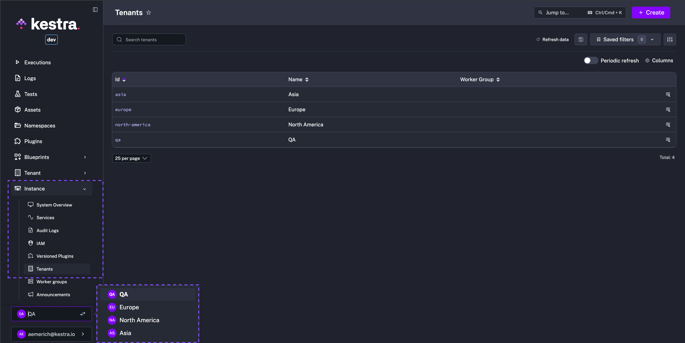
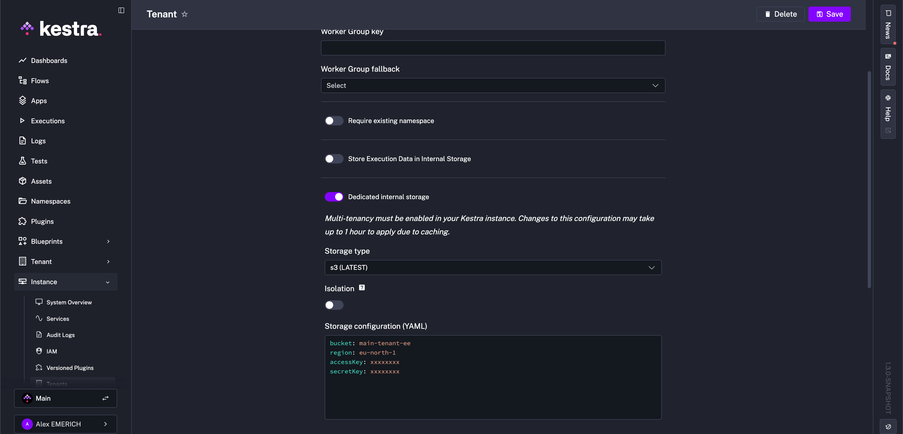
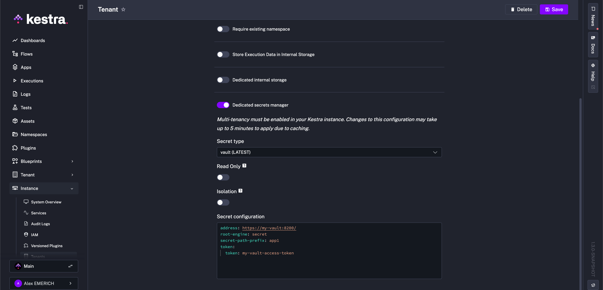

How to enable multi-tenancy in your Kestra instance.

<div class="video-container">
  <iframe src="https://www.youtube.com/embed/z4uzAyjKeoc?si=vy-CPQKNYXYZMwoo" title="YouTube video player" allow="accelerometer; autoplay; clipboard-write; encrypted-media; gyroscope; picture-in-picture; web-share" referrerpolicy="strict-origin-when-cross-origin" allowfullscreen></iframe>
</div>

## Multi-tenancy – configure and manage tenants

A tenant represents an **isolated environment within a single Kestra instance**.

Each tenant functions as a separate entity with its own resources, such as flows, triggers, or executions. Multi-tenancy enables different teams, projects, or customers to operate independently within the same Kestra instance, ensuring data privacy, security, and separation of resources between business units, teams, or customers. For example, you can have a `dev` tenant for development, a `staging` tenant for testing, and a `prod` tenant for production.

:::alert{type="info"}
You can think of multi-tenancy as running multiple virtual instances in a single physical instance of [Kestra Cloud](/cloud) or [Kestra Enterprise Edition](../../01.overview/01.enterprise-edition/index.md).
:::

All resources (such as [flows](../../../05.workflow-components/01.flow/index.md), [triggers](../../../05.workflow-components/07.triggers/index.mdx), [executions](../../../05.workflow-components/03.execution/index.md), [RBAC](../../03.auth/rbac/index.md), and more) are isolated by the tenant. This means that you can have a flow with the same identifier and the same namespace in multiple tenants at the same time.

Data stored inside the internal storage is also separated by tenants.

End-users can use the tenant selection dropdown menu from the [UI](../../../09.ui/index.mdx) to see tenants they have access to. It allows users to switch between tenants easily. Each UI page includes the tenant ID in the URL (e.g., `https://demo.kestra.io/ui/yourTenantId/executions/namespace/flow/executionId`.)



Most [API](../../../api-reference/index.mdx) endpoints also include the tenant identifier. The exception to that is instance-level endpoints such as `/configs`, `/license-info` or `/banners` that require Superadmin access.

For example, the URL of the API operation to list flows of the `products` namespace is `/api/v1/{your_tenant_id}/flows/products`. You can check the [Enterprise Edition API Guide](../../../api-reference/01.enterprise/index.mdx) for more information.

Tenants must be created upfront, and a user needs to be granted access to use a specific tenant.

## Key benefits of multi-tenancy

1. **Data Isolation**: each tenant's data, configuration, and code is isolated and inaccessible to other tenants.
2. **Resource Isolation**: each tenant's resources are isolated from other tenants — including flows, triggers, executions, logs, audit logs, secrets, etc.
3. **Simple Configuration**: you can easily create new tenants instantly giving you a fresh, fully-isolated workspace accessible from your existing Kestra instance.
4. **Intuitive UI Navigation**: the UI provides a dropdown as well as tenant identifiers included in the URL to make switching between tenants seamless.


## Creating and Managing Tenants

Tenants in Kestra can be managed in various ways: from the UI, CLI, API, or Terraform.

### Creating a Tenant from the UI

Tenants can be created and managed directly through Kestra's user interface. Go to **Instance -> Tenants**. Then, click on the **Create** button:


Fill in the form and click **Save**:


The user who creates a tenant is automatically granted the Admin Role for that tenant. You may need to refresh the UI to see updated Roles.

### Creating a Tenant from the CLI

Kestra provides CLI commands for tenant creation. The following command creates a tenant with the identifier `stage` and the name `Staging`:

```bash
kestra tenants create --tenant stage --name "Staging"
```

Running `kestra tenants create --help` shows you all available properties:

```bash
$ kestra tenants create --help
Usage: kestra tenants create [-hVv] [--internal-log]
                                [--admin-username=<adminUser>] [-c=<config>]
                                [-l=<logLevel>] [--name=<tenantName>]
                                [-p=<pluginsPath>] [--tenant=<tenantId>]
create a tenant and assign admin roles to an existing admin user
      --admin-username=<adminUser>
                            Username of an existing admin user that will be
                              admin of this tenant
  -c, --config=<config>     Path to a configuration file, default: /Users/anna/.
                              kestra/config.yml)
  -h, --help                Show this help message and exit.
      --internal-log        Change also log level for internal log, default:
                              false)
  -l, --log-level=<logLevel>
                            Change log level (values: TRACE, DEBUG, INFO, WARN,
                              ERROR; default: INFO)
      --name=<tenantName>   tenant description
  -p, --plugins=<pluginsPath>
                            Path to plugins directory , default:
                              /Users/anna/dev/plugins)
      --tenant=<tenantId>   tenant identifier
  -v, --verbose             Change log level. Multiple -v options increase the
                              verbosity.
  -V, --version             Print version information and exit.
```

### Creating a Tenant from the API

Tenants can be managed programmatically via Kestra's [API](../../../api-reference/01.enterprise/index.mdx#post-/api/v1/tenants). Here is an example of an API call for creating a tenant:

```bash
curl -X POST "https://demo.kestra.io/api/v1/tenants" \
  -H "accept: application/json" \
  -H "Content-Type: application/json" \
  -d "{ \"id\": \"stage\", \"name\": \"staging\", \"deleted\": false}"
```

### Creating a Tenant from Terraform

Tenants can be managed via Infrastructure as Code using [Kestra's Terraform provider](../../../13.terraform/resources/tenant/index.md).

:::alert{type="info"}
This example assumes you have already configured the [Kestra Terraform Provider](../../../13.terraform/index.mdx)
:::

Here is an example of a Terraform configuration for creating a tenant:

```hcl
resource "kestra_tenant" "stage" {
  tenant_id = "stage"
  name      = "staging"
}
```

### Deleting a tenant

Deleting a tenant removes all associated resources including flows, namespaces, apps, dashboards, and roles. Execution data, logs, metrics, and audit logs are retained in the database, and they can be purged if needed with their corresponding [Purge tasks](../../../10.administrator-guide/purge/index.md).

:::alert{type="warning"}
Deleting a tenant is irreversible. All resources under the tenant will be permanently removed, except for logs and execution history stored in the database.
:::

Key-value pairs and namespace files will not be deleted as they are persisted in internal storage.

### Admin role assignment

Regardless of which of the above methods you use to create a tenant, the User who creates the tenant automatically gets the Admin Role assigned. That role grants admin rights to that user on that tenant.

Note that there is an exception to this rule if a tenant is created by a Superadmin. In that case, the Superadmin has to explicitly assign the Admin Role for that tenant to themselves or any other User, Service Account, or Group.

### Dedicated storage and secrets backend per tenant

By default, each tenant uses the same [internal storage](../../../configuration/index.md#internal-storage) and [secrets backend](../secrets-manager/index.md) configured for your Kestra instance. If you need more isolation, you can configure a dedicated storage and secrets backend per tenant. This can be useful if each of your tenants serves different customers and you need to ensure complete data isolation between them.

To configure a dedicated storage and secrets backend per tenant, navigate to the **Instance - Tenants** in the UI and click on the **Details** button of the tenant you'd like to configure. Then, select the storage and secrets backend you want to use for that tenant:



For storage configuration examples, refer to [Internal Storage](../../../configuration/index.md#internal-storage) in the configuration guide.



For the different secret managers' configurations, refer to the [Secret Managers documentation](../secrets-manager/index.md).

:::alert{type="warning"}
Make sure to use `camelCase` notation. For example, if you want to use the `GCS` storage backend, you should use `projectId` as the value rather than `project-id`.
:::

### Isolate Kestra services

When using [Dedicated Storage or Secret backends](../tenants/index.md#dedicated-storage-and-secrets-backend-per-tenant), you can isolate specific [Kestra services](../../../08.architecture/02.server-components/index.md) to prevent them from accessing the storage or secret backend. For example, you may not want the [Webserver](../../../08.architecture/02.server-components/index.md#webserver) to be able to access the dedicated internal storage. This isolation is intended for Kestra instances where multiple teams or organizations share access, but storage or secret data access must be limited to specific segments.

The configuration utilizes the `deniedServices` property with a list of the services to isolate. Take the following as an example using `storage` (this can be replaced with `secret` for a dedicated secret backend), where the Executor and Webserver must be isolated:

```yaml
kestra:
  storage:   # or secret
    isolation:
      enabled: true
      deniedServices: [EXECUTOR, WEBSERVER]
```

For additional configuration details, refer to dedicated [Secrets backend](../../../configuration/index.md#secret-managers) and [Internal Storage](../../../configuration/index.md#internal-storage) in the configuration guide.

:::alert{type="info"}
If this feature is enabled some UI or flow execution capabilities may not work as expected. If unsure, contact support.
:::
