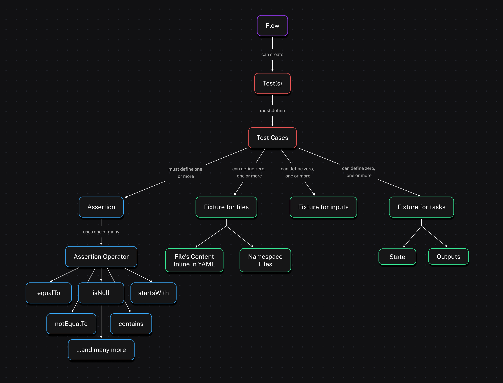
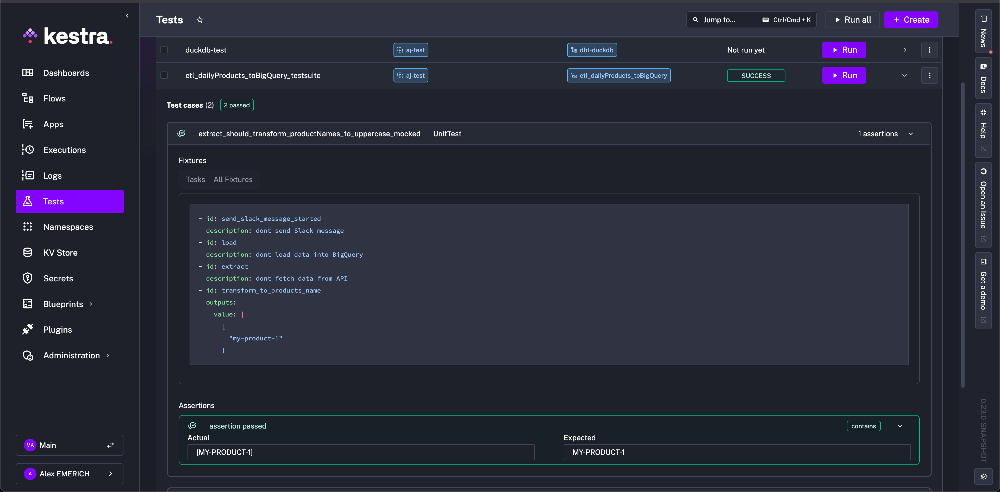
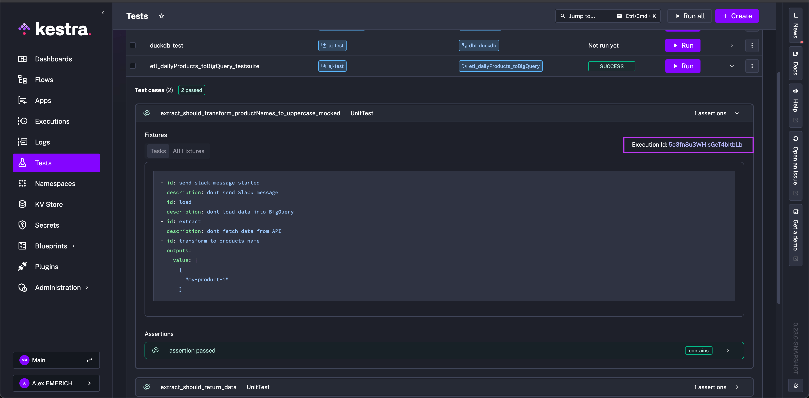

Build Tests to ensure proper Flow behavior.

## Unit tests – validate Flows safely

Tests let you verify that your flow behaves as expected, without cluttering your instance with test executions that run every task. For example, a unit test designed to mock the notification task of a flow ensures the configuration is correct without spamming dummy notifications to the recipient. They also let you isolate testing to specific changes to a task, rather than the executing the entire flow.

<div class="video-container">
  <iframe src="https://www.youtube/embed/jMZ9Cs3xxpo?si=CieI3nUrE1rY-Oew" title="YouTube video player" allow="accelerometer; autoplay; clipboard-write; encrypted-media; gyroscope; picture-in-picture; web-share" referrerpolicy="strict-origin-when-cross-origin" allowfullscreen></iframe>
</div>

## Flow unit tests

Each test runs a single flow and checks its outcomes against your **assertions**, helping you avoid regressions when you change the flow later. Each **test case** creates a new transient execution, making it easy to run multiple tests in parallel, and each test case will not affect the others. Use **fixtures** to mock specific tasks or inputs by returning predefined outputs and states without executing the tasks.

Unit tests are configured for and connected to their respective flows. To create a new Unit Test, access them either through the **Tests** tab on the lefthand side panel of the Kestra UI or via the **Tests** tab of a flow. When creating tests, you can open the YAML for both the test and its flow side by side.

<div style="position: relative; padding-bottom: calc(48.95833333333333% + 41px); height: 0; width: 100%;"><iframe src="https://demo.arcade.software/OXqOYL6Uz47IXDMD3afL?embed&embed_mobile=inline&embed_desktop=inline&show_copy_link=true" title="Unit Test UI | Kestra EE" loading="lazy" webkitallowfullscreen mozallowfullscreen allowfullscreen allow="clipboard-write" style="position: absolute; top: 0; left: 0; width: 100%; height: 100%; color-scheme: light;" ></iframe></div>

---

Once tests are created, they can all be viewed from the **Tests** tab with their respective Id, Namespace, Tested Flow, and current State listed. Additionally, tests can be run from this view with expandable results.

---


---

The following diagram illustrates the structure of flows and unit tests together in Kestra:



## Configuration

Unit tests are written in YAML like flows, and they are comprised of `testCases` which are then made up of `fixtures` and `assertions`.

- A **fixture** refers to the setup required before a test runs, such as initializing objects or configuring environments, to ensure the test has a consistent starting state.
- An **assertion** is a statement that checks if a specific condition is true during the test. If the condition is false, the test fails, indicating an issue with the code being tested, while true indicates the expectation is met.

:::alert{type="warning"}
If you don't specify any fixtures, the test will run the entire flow as in production, executing all tasks and producing outputs as usual.
:::

For example, take the following flow that does the these listed tasks:
1. Sends a message to Slack to alert a channel that it is running
2. Extracts data from an API
3. Transforms the returned data to match a certain format
4. Loads the transformed data to a BigQuery table

```yaml
id: etl_daily_products_bigquery
namespace: company.team

tasks:
  - id: send_slack_message_started
    type: io.kestra.plugin.slack.SlackIncomingWebhook
    url: "https://kestra.io/api/mock" # To use this example, replace the url with your own Slack webhook
    payload: |
      {
        "text": "{{ flow.namespace }}.{{ flow.id }}: Daily products flow has started"
      }

  - id: extract
    type: io.kestra.plugin.core.http.Download
    uri: https://huggingface.co/datasets/kestra/datasets/raw/main/json/orders.json

  - id: transform_to_products_name
    type: io.kestra.plugin.core.debug.Return
    format: "{{ fromJson(read(outputs.extract.uri)) | jq('.Account.Order[].Product[].\"Product Name\"') }}"

  - id: transform_to_uppercase
    type: io.kestra.plugin.core.debug.Return
    format: "{{ fromJson(outputs.transform_to_products_name.value) | upper }}"

  - id: load
    type: io.kestra.plugin.gcp.bigquery.Load
    from: "{{ outputs.transform_to_uppercase.value }}"
    destinationTable: "my_project.my_dataset.my_table"
    format: JSON
```

A comprehensive unit test for this flow might look like the following:

```yaml
id: etl_daily_products_bigquery_testsuite
namespace: company.team
flowId: etl_daily_products_bigquery
testCases:
  - id: extract_should_return_data
    type: io.kestra.core.tests.flow.UnitTest
    fixtures:
      tasks:
        - id: send_slack_message_started
          description: "dont send Slack message"
        - id: load
          description: "dont load data into BigQuery"
    assertions:
      - value: "{{outputs.transform_to_uppercase.value}}"
        isNotNull: true
  - id: extract_should_transform_product_names_to_uppercase_mocked
    type: io.kestra.core.tests.flow.UnitTest
    fixtures:
      tasks:
        - id: send_slack_message_started
          description: "dont send Slack message"
        - id: load
          description: "dont load data into BigQuery"
        - id: extract
          description: "dont fetch data from API"
        - id: transform_to_products_name
          outputs:
            value: |
              [
                "my-product-1"
              ]
    assertions:
      - value: "{{outputs.transform_to_uppercase.value}}"
        contains: "MY-PRODUCT-1"
```

The `id` is unique to the test suite, and the `namespace` and `flowId` must match the intended flow to be tested against. They will automatically pipe into the test when creating from a flow. The `testCases` property is composed with the aforementioned `fixtures` and `assertions`. You can design multiple tests with their own specific designs.

In the first test case, `extract_should_return_data`, the `fixtures` include tasks to replace the Slack alert and BigQuery data load so as to not clutter a Slack channel with test alert messages or a BigQuery table with test data but still test the overall design of the flow.

The `assertions` property defines the conditions for success or failure. In the example, the test aims to ensure that the outputs from the `transform_to_uppercase` task are not null. After running the test, we can see the results for the `extract_should_return_data` test by expanding the results.


The assertion passed as the `extract` task downloading data from the API returned product names and was not null. Additionally, since we did not include a fixture for the `transform_to_uppercase` task, we can see that the returned product names were also transformed successfully to uppercase in the assertion's actual result.

Because we wrote the test suite with two test cases, both executed during the run. For more isolation, you could separate test cases into multiple tests of the flow as needed. While we know from the previous test that the uppercase transformation was successful, you may not want to extract actual data during testing, as it could add load to an external service or send unnecessary alerts. To mitigate this and solely test the transformation, we added the `extract` and `transform_to_products_name` fixtures in the second test case, `extract_should_transform_product_names_to_uppercase_mocked`. The `extract` fixture prevents the API call, and the `transform_to_products_name` fixture simulates the return of the flow task with a mock output, `my-product-1`, all in lowercase.

After running, we can see that the assertion was successful and the actual result `MY-PRODUCT-1` was successfully transformed and matches the expected result defined in the `assertions` property of the test.



Execution details are not stored in the Executions page like normally run flows to protect cluttering that space with unneccesary execution details. To view an execution made from a test, you can open the test case and click on the link for the ExecutionId.



## Unit test with namespace file

You can also simulate flows with namespace files that are scripts, test data, or any other sort of file content. Taking the previous example, we can include a namespace file that includes sample data from the production API endpoint, so that we do not need to make any API calls simply to test the flow. This prevents accumulating cost for requests or any sort of limit on calls a service might have.

With the following flow:

```yaml
id: etl_download_file
namespace: company.team

tasks:
  - id: extract
    type: io.kestra.plugin.core.http.Download
    uri: https://huggingface.co/datasets/kestra/datasets/raw/main/json/orders.json
    method: GET

  - id: transform_to_products_name
    type: io.kestra.plugin.core.debug.Return
    format: "{{ fromJson(read(outputs.extract.uri)) | jq('.Account.Order[].Product[].\"Product Name\"') }}"

  - id: transform_to_uppercase
    type: io.kestra.plugin.core.debug.Return
    format: "{{ fromJson(outputs.transform_to_products_name.value) | upper}}"

  - id: load_result_to_outgoing_api
    type: io.kestra.plugin.core.log.Log
    message: "{{ outputs.transform_to_uppercase.this_task_should_not_be_run }}"
```

we can add a namespace file in the `company.team` namespace that mimics the format of the API request's return.

```json
## my-namespace-file-with-products.json to add to company.team namespace
{
  "Account": {
    "Account Name": "Firefly",
    "Order": [
      {
        "OrderID": "order103",
        "Product": [
          {
            "Product Name": "Bowler Hat",
            "ProductID": 858383,
            "SKU": "0406654608",
            "Description": {
              "Colour": "Purple",
              "Width": 300,
              "Height": 200,
              "Depth": 210,
              "Weight": 0.75
            },
            "Price": 34.45,
            "Quantity": 2
          },
          {
            "Product Name": "Trilby hat",
            "ProductID": 858236,
            "SKU": "0406634348",
            "Description": {
              "Colour": "Orange",
              "Width": 300,
              "Height": 200,
              "Depth": 210,
              "Weight": 0.6
            },
            "Price": 21.67,
            "Quantity": 1
          }
        ]
      }
    ]
  }
}
```

This way, in our mock test, we can use the following configuration to test the transformation on sample data, rather than making the API request:

```yaml
id: etl_mockfile_from_ns
namespace: company.team
flowId: etl_download_file
testCases:
  - id: extract_should_transform_productNames_to_uppercase_with_mocked_file
    type: io.kestra.core.tests.flow.UnitTest
    fixtures:
      tasks:
        - id: extract
          description: "mock extract data file"
          outputs:
            uri: "{{ fileURI('my-namespace-file-with-products.json') }}" # this file is a namespace file in the same namespace
        - id: load_result_to_outgoing_api
          description: "dont send end output"
    assertions:
      - value: "{{outputs.transform_to_uppercase.value}}"
        equalsTo: "[BOWLER HAT, TRILBY HAT]"
```

With a combination of namespace files and tests, you can target specific components of your flow for correct functionality without using up any external resources or unnecessarily communicating with external hosts for scripts or files.

## Inline file fixture

If you prefer not to use a namespace file for the file fixture in the test, you can also write the file contents inline with the `files` property to achieve the same result:

```yaml
id: etl_mockfile_from_ns
namespace: company.team
flowId: etl_download_file
testCases:
  - id: extract_should_transform_product_names_to_uppercase_with_mocked_file
    type: io.kestra.core.tests.flow.UnitTest
    fixtures:
      files:
        products.json: |
          {
            "Account": {
              "Account Name": "Firefly",
              "Order": [
                {
                  "OrderID": "order103",
                  "Product": [
                    {
                      "Product Name": "Bowler Hat",
                      "ProductID": 858383,
                      "SKU": "0406654608",
                      "Description": {
                        "Colour": "Purple",
                        "Width": 300,
                        "Height": 200,
                        "Depth": 210,
                        "Weight": 0.75
                      },
                      "Price": 34.45,
                      "Quantity": 2
                    },
                    {
                      "Product Name": "Trilby hat",
                      "ProductID": 858236,
                      "SKU": "0406634348",
                      "Description": {
                        "Colour": "Orange",
                        "Width": 300,
                        "Height": 200,
                        "Depth": 210,
                        "Weight": 0.6
                      },
                      "Price": 21.67,
                      "Quantity": 1
                    }
                  ]
                }
              ]
            }
          }
      tasks:
        - id: extract
          description: "mock extract data file"
          outputs:
            # this file is a namespace file in the same namespace, the fileURI() function will return its URI.
            uri: "{{files['products.json']}}"
```

## Available assertions operators

While the above example uses `isNotNull` and `contains` as assertion operators, there are many more that can be used when designing unit tests for your flows. The complete list is as follows:

| **Operator**         | **Description of the assertion operator**                                                         |
| -------------------- | ------------------------------------------------------------------------------------------------- |
| isNotNull            | Asserts the value is not null, e.g. `isNotNull: true`                                             |
| isNull               | Asserts the value is null, e.g. `isNull: true`                                                    |
| equalTo              | Asserts the value is equal to the expected value, e.g. `equalTo: 200`                             |
| notEqualTo           | Asserts the value is not equal to the specified value, e.g. `notEqualTo: 200`                     |
| endsWith             | Asserts the value ends with the specified suffix, e.g. `endsWith: .json`                          |
| startsWith           | Asserts the value starts with the specified prefix, e.g. `startsWith: prod-`                      |
| contains             | Asserts the value contains the specified substring, e.g. `contains: success`                      |
| greaterThan          | Asserts the value is greater than the specified value, e.g. `greaterThan: 10`                     |
| greaterThanOrEqualTo | Asserts the value is greater than or equal to the specified value, e.g. `greaterThanOrEqualTo: 5` |
| lessThan             | Asserts the value is less than the specified value, e.g. `lessThan: 100`                          |
| lessThanOrEqualTo    | Asserts the value is less than or equal to the specified value, e.g. `lessThanOrEqualTo: 20`      |
| in                   | Asserts the value is in the specified list of values, e.g. `in: [200, 201, 202]`                  |
| notIn                | Asserts the value is not in the specified list of values, e.g. `notIn: [404, 500]`                |

## Assert on Execution Outputs

Rather than assert with an operator and a set value, you can use execution outputs in your tests. To assert on execution outputs, use the `{{ execution.outputs.your_output_id }}` syntax in your test assertions. This allows you to verify that the outputs of your tasks match the expected values.

The below example assumes there is a flow that outputs a value:

```yaml
id: flow_outputs_demo
namespace: demo
tasks:
  - id: mytask
    type: io.kestra.plugin.core.output.OutputValues
    values:
      myvalue: kestra
outputs:
  - id: myvalue
    type: STRING
    value: "{{ outputs.mytask.values.myvalue }}"
```

Then, create a unit test for this flow that asserts the output value as follows:

```yaml
id: test_flow_outputs_demo
flowId: flow_outputs_demo
namespace: demo
testCases:
  - id: flow_output
    type: io.kestra.core.tests.flow.UnitTest
    assertions:
      - value: "{{ execution.outputs.myvalue }}"
        equalTo: kestra
```

When you run this test, Kestra will execute the flow and verify that the output value matches the expected value. If the assertion fails, the test will be marked as failed, and you can inspect the execution logs to see what went wrong.
