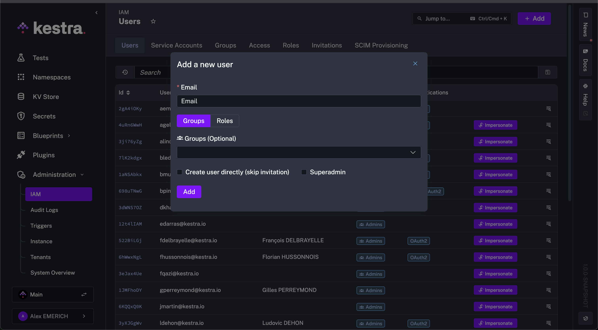
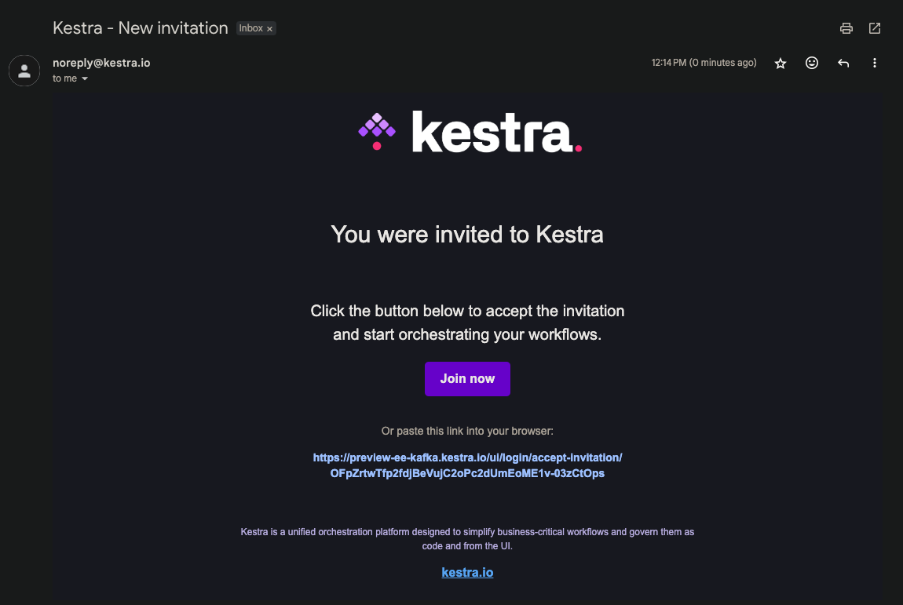

Add new users to your Tenant or Instance by using the invitation process.

<div class="video-container">
  <iframe src="https://www.youtube.com/embed/RC1RxfxBPPI?si=vy1D3W9ysK8LS2Uo" title="YouTube video player" allow="accelerometer; autoplay; clipboard-write; encrypted-media; gyroscope; picture-in-picture; web-share" referrerpolicy="strict-origin-when-cross-origin" allowfullscreen></iframe>
</div>

## Invitations – onboard users

Administrators can invite users with pre-configured RBAC permissions. Invitations can be emailed directly, and users can set up their accounts upon acceptance.

By default, if the [email server is configured in Kestra EE](../../../configuration/index.md#configuring-a-mail-server), an email with an invitation link is sent. If the email server is not configured, you can manually share the link with invited users.

## How to Invite Users

1. Navigate to the **IAM** page in the **Tenant** section
2. Click on the **Users** tab
3. Click on the **+ Add** button
4. Fill in the user's email address, and select the desired group or attach the role directly — optionally restricting the permission to one or more namespaces
5. Click the **Add** button — this will send an email to the user with an invitation link, or display the link you can share with the user manually.



:::alert{type="info"}
You can check the box to **Create user directly (skip invitation)** if one is not required. This action is recommended only with third-party authentication such as SSO or LDAP.
:::



## Accepting invitations

When a user receives an invitation, they can click on the link in the email to accept it. The user will be redirected to the Kestra login page, where they set up their account (i.e., create a password), or log in using SSO if it's enabled.

## Invite expiration time

Users have 7 days to accept the invitation. After this period, the invitation will expire and must be reissued.

If you want to change the default expiration time, you can do so by setting the `expireAfter` property in the `kestra.security.invitation` section of your `application.yaml` file. For example, to set the expiration time to 30 days, add the following configuration:

```yaml
kestra:
  security:
    invitations:
      expireAfter: P30D
```
