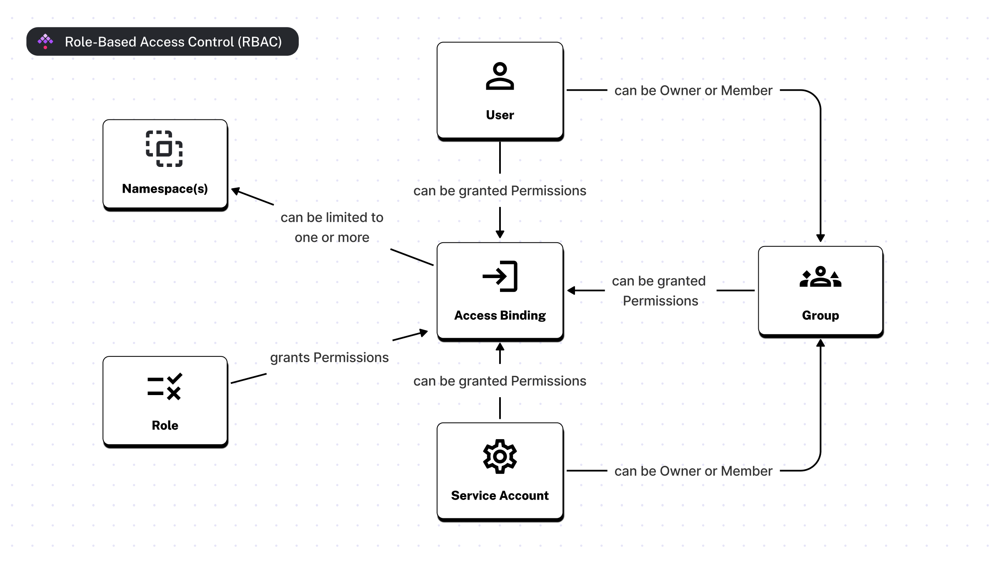
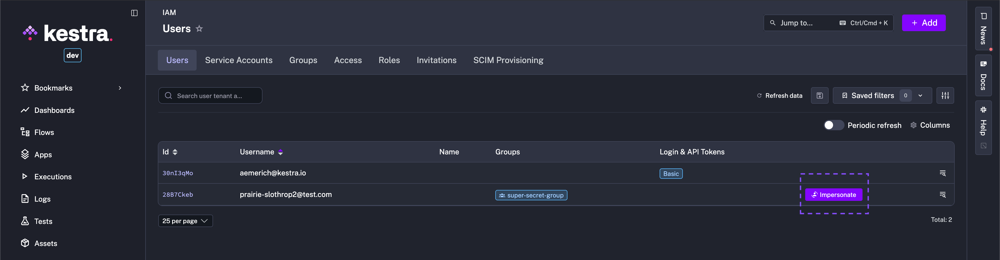
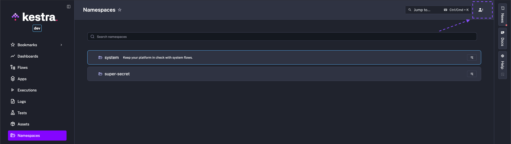
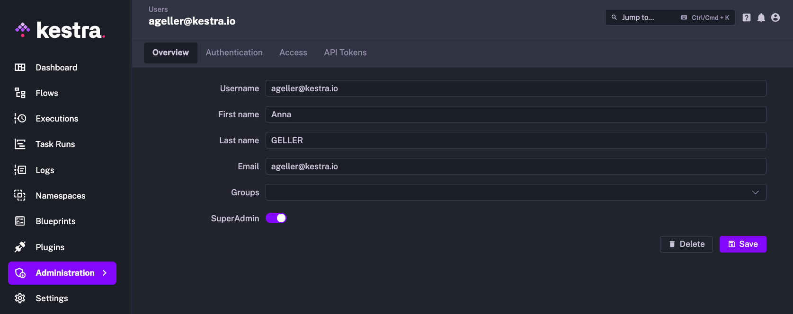
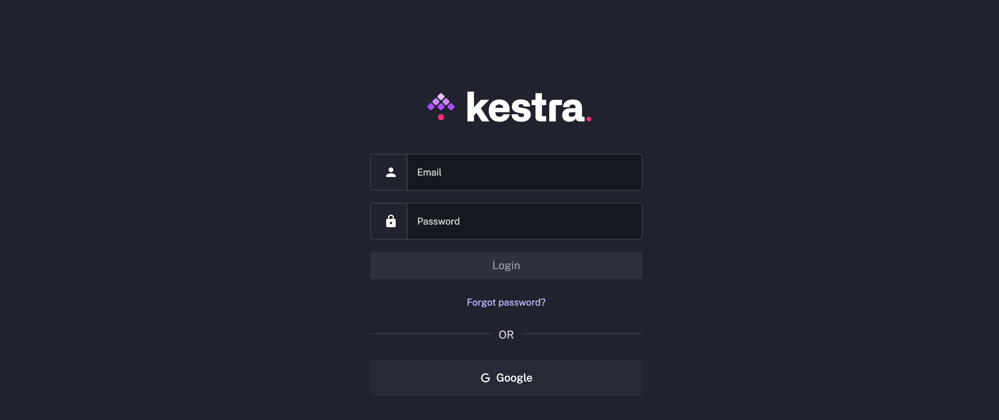
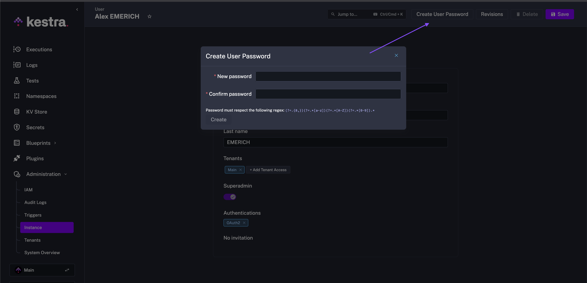

How to manage access and permissions to your instance.


Kestra Enterprise supports Role-Based Access Control (RBAC) to manage access to tenants, namespaces, flows, and resources.

In Kestra you will find three types of entities:

* Users: Represents a **person**. To add users to your Kestra instance, you can do one of the following:
  - [Invite users](../invitations/index.md) to your instance or tenant from the UI
  - Sync users from an external identity provider using [SCIM](../scim/index.mdx)
  - Create users directly using [Terraform](../../../13.terraform/index.mdx)

* Groups: Represent a collection of **Users** and **Service Accounts**. Groups are a useful mechanism for providing the same roles to multiple Users or Service Accounts at once by binding a role to a Group.
* Service Accounts: Represents an **application**. They are considered Users when binding Role assignments.

All these entities can be assigned to a role, which defines what resources the user, group, or service account can access. These entities do not belong to namespaces, but their permissions can be limited to specific namespaces via bindings on the **IAM** page.

The image below shows the relationship between Users, Groups, Service Accounts, Roles, and Bindings:



## Roles and Bindings

A role is a collection of permissions that can be assigned to users, service accounts, or groups. Each permission is a combination of a **resource** (e.g., `FLOW`, `EXECUTION`, `SECRET`) and one or more **actions** (e.g., `EXECUTE`, `VIEW`, `DELETE`). A role alone grants nothing — it must be attached to a user, service account, or group via a **binding** on the **IAM** page.

Users, service accounts, and groups can hold any number of roles simultaneously. Bindings can be scoped to one or more namespaces — scoped access automatically extends to all child namespaces (for example, binding to `prod` also grants access to `prod.engineering`). You can [configure a default role](../../../configuration/05.security-and-secrets/index.md) to assign it automatically to new users joining via [SSO](../sso/index.md). Use [Impersonate](#impersonate) to verify a user's effective permissions after assigning roles.

## Impersonate

After assigning permissions to a User, Superadmins can impersonate Users to ensure their access is as intended. Impersonation switches your view to that user's perspective and can be closed back to the Superadmin view at any time.





### Resources

A resource is a category of product entity or capability that can be controlled through RBAC. Each resource has its own set of allowed actions.

**Core resources** (namespace-scoped — bindings can restrict access to specific namespaces):

| Resource | Description |
|---|---|
| `FLOW` | Flows, their revisions, graphs, and dependencies |
| `EXECUTION` | Executions, their state, logs, outputs, and files |
| `TRIGGER` | Triggers attached to flows |
| `NAMESPACE` | Namespaces and their files, plugin defaults |
| `KVSTORE` | Key-value store entries |
| `SECRET` | Secrets stored in the namespace |
| `CREDENTIAL` | Credentials for external integrations (namespace-level and tenant-level) |

**Apps and features** (tenant-scoped):

| Resource | Description |
|---|---|
| `DASHBOARD` | Custom dashboards |
| `BLUEPRINT` | Custom blueprints |
| `APP` | Apps and their executions |
| `TESTSUITE` | Unit tests |
| `ASSET` | Data assets and lineage |
| `MCP_SERVER` | MCP servers exposing flows as AI tools |
| `COPILOT` | AI Copilot flow generation |

**Administration** (tenant-scoped):

| Resource | Description |
|---|---|
| `USER` | Users in the tenant |
| `GROUP` | Groups and their members |
| `ROLE` | RBAC roles |
| `BINDING` | Role-to-entity bindings |
| `SERVICE_ACCOUNT` | Service accounts |
| `INVITATION` | User invitations |
| `AUDITLOG` | Audit log entries |
| `SYSTEM_SETTINGS` | Instance-level settings |
| `TENANT_SETTINGS` | Tenant-level settings |

### Actions

Each resource defines its own set of allowed actions. Not every action applies to every resource.

**Common actions** (available on most resources):

| Action | Meaning |
|---|---|
| `VIEW` | Read a single item's details |
| `LIST` | Search or browse items |
| `CREATE` | Create a new item |
| `UPDATE` | Modify an existing item |
| `DELETE` | Remove an item |

**Resource-specific actions:**

| Resource | Additional actions |
|---|---|
| `FLOW` | `EXECUTE` (trigger an execution), `DISABLE`, `ENABLE`, `VALIDATE`, `EXPORT`, `IMPORT` |
| `EXECUTION` | `RESTART`, `KILL`, `REPLAY`, `PAUSE`, `RESUME`, `CHANGE_LABELS`, `ACCESS_LOGS`, `ACCESS_OUTPUTS`, `ACCESS_FILES`, `FOLLOW` (live SSE stream), `EXPORT`, `UNQUEUE`, `FORCE_RUN` |
| `TRIGGER` | `UNLOCK`, `RESTART`, `DISABLE`, `ENABLE`, `EXPORT`, `BACKFILL` |
| `NAMESPACE` | `MANAGE_FILES` (all namespace file operations), `EXPORT_PLUGIN_DEFAULTS`, `IMPORT_PLUGIN_DEFAULTS` |
| `APP` | `EXECUTE`, `ACCESS_FILES`, `ACCESS_LOGS` |
| `TESTSUITE` | `EXECUTE` |
| `AUDITLOG` | `EXPORT` |
| `USER` | `MANAGE_GROUP_MEMBERSHIP`, `IMPERSONATE` |
| `GROUP` | `MANAGE_MEMBERS` |
| `COPILOT` | `USE` (only action) |
| `SYSTEM_SETTINGS` | — (`VIEW` and `UPDATE` only; no `CREATE`, `DELETE`, or `LIST`) |
| `TENANT_SETTINGS` | — (`VIEW` and `UPDATE` only; no `CREATE`, `DELETE`, or `LIST`) |

:::alert{type="info"}
For a complete resource-to-endpoint mapping, see the [Permissions reference](./permissions-reference/index.md).

If you are upgrading from Kestra 1.x, see the [RBAC action model migration guide](../../../11.migration-guide/v2.0.0/rbac-action-model/index.md) for how old CRUD permissions map to the new actions and what was dropped.
:::

### MCP server permissions

`MCP_SERVER` is a first-class RBAC resource that controls access to [Kestra MCP servers](../../../ai-tools/mcp-server/index.md). Supported actions are `VIEW`, `LIST`, `CREATE`, `UPDATE`, and `DELETE`.

Default role assignments:

| Role | Actions granted |
|---|---|
| Admin | All (`VIEW`, `LIST`, `CREATE`, `UPDATE`, `DELETE`) |
| Developer / Editor | All (`VIEW`, `LIST`, `CREATE`, `UPDATE`, `DELETE`) |
| Launcher | — (not included) |
| Viewer | `VIEW`, `LIST` |

In addition to these permissions, access to a **private** MCP server is also flow-scoped: a user can connect to a private server only if they have `FLOW: EXECUTE` on at least one namespace that contains a flow with an `McpToolTrigger` pointing at that server.

### Managed roles

Kestra ships five managed roles. Each role's full permission set is visible under **IAM → Roles**. Superadmins can create additional custom roles on top of these. Users can hold multiple roles.

| Role | Description |
|---|---|
| **Admin** | All actions on all resources. |
| **Developer** | Everything Editor has, plus: full namespace management (including file management and plugin default import), secrets, credentials, and full blueprint CRUD. For engineers who also need platform-level access. |
| **Editor** | Full flow and execution management (create, update, delete, execute, restart, kill, etc.), triggers, KV, dashboards, apps, test suites, assets, MCP servers, settings, and Copilot. No namespace file management, no secrets or credentials, blueprint read-only. No IAM resources. |
| **Launcher** | Execute flows and monitor executions (`EXECUTE`, `REPLAY`, `RESTART`, `CHANGE_LABELS`, `ACCESS_LOGS`, `ACCESS_OUTPUTS`, `ACCESS_FILES`, `FOLLOW`, `EXPORT`). Read-only on triggers, KV, dashboards, and assets. No flow write access, no namespace management. |
| **Viewer** | `VIEW`, `LIST`, and `EXPORT` on flows, executions, triggers, and namespaces. Can access execution logs, outputs, files, and live-follow executions. No execution state changes (no restart, kill, replay, etc.). No write access anywhere. |

## Superadmin and Admin

Kestra provides two roles for managing your instance: Superadmin and Admin.

- Superadmin is a user type with elevated privileges for global control
- Admin is a customizable role that grants full access to all resources (scoped to a tenant if multi-tenancy is enabled).

:::collapse{title="Summary"}
Here's a table summarizing the key differences between an Admin and a Super Admin:

| Feature                             | Admin (scoped to a tenant if enabled)              | Super Admin                                          |
|-------------------------------------|----------------------------------------------------|------------------------------------------------------|
| Access Level                        | By default as all permissions, depends on the Role | Manages tenants and IAM across all tenants           |
| Tenant Management                   | No                                                 | View, create, update, delete tenants across all tenants |
| User/Role/Group/Bindings Management | Has the permission by default                      | View, create, update, delete across all tenants         |
| Flow/Execution Management           | Has the permission by default                      | No                                                   |
| Set Super Admin privilege           | No                                                 | Yes                                                  |
:::

## Super Admin

Super Admin is a powerful type of user. Use the role sparingly and only for use cases that require it, such as creating a new tenant, troubleshooting tenant issues, or helping a user with a problem.

Without any Role or Binding, Super Admin has access to manage tenants, users, roles, and groups within a Kestra Enterprise instance. There are multiple methods to create a Superadmin user.

### Through the UI

When you launch Kestra for the first time, if no prior action has been made through the CLI, you will be invited to setup Kestra through the [Setup Page](../../01.overview/02.setup/index.md).

This interface invites you to create your first User which will be automatically assigned the `Superadmin` privilege.

### Through the CLI

To create a User with a Superadmin privilege from the [CLI](../../../kestra-cli/kestra-server/index.md), use the `--superadmin` option:

```bash
kestra auths users create admin@kestra.io TopSecret42 --superadmin

## schema:
kestra auths users create <username> <password> \
--tenant=<tenant-id> --superadmin
```

To set or revoke Superadmin privileges, use the following in the CLI:

```bash
kestra auths users set-superadmin user@email.com true # (use false to revoke)
```

### Configuration

A Super Admin can also be created from the configuration file using the configuration below:

```yaml
kestra:
  security:
    superAdmin:
      username: <username>
      password: <password>
      tenantAdminAccess:
        - <optional>
```

For more details, check the [Security and Secrets configuration](../../../configuration/05.security-and-secrets/index.md) page.

## Grant/Revoke Super Admin permissions

:::alert{type="info"}
Note that you need to be a Superadmin yourself.
:::

### Through the UI

You can grant or revoke the Superadmin privilege using the switch in the User Edit page.



### Through the CLI

To set an existing User with a Superadmin privilege from the [CLI](../../../kestra-cli/kestra-server/index.md), use the dedicated command:

```bash
## Set a user as Super Admin
kestra auths users set-superadmin admin@kestra.io true

## Revoke Super Admin privilege
kestra auths users set-superadmin admin@kestra.io false
```

## Admin

In Kestra, the notion of Admin user does not exist; instead we create an **Admin** Role with all permissions.

This role can be assigned to any User, Service Account, or Group. This allows you to have different types of admins, to grant admin permissions to a whole group, and to revoke those admin permissions at any time without having to delete any group or user.

When using multi-tenancy, Kestra assigns the Admin Role to the user who created the tenant by default.

:::alert{type="info"}
If you see an error when creating a new User or Service Account, it might be caused by a limit on your license. In that case, [reach out to us](/contact-us) to validate and optionally upgrade your license.
:::

## Creating a User with an Admin Role

### Through the UI

When launching Kestra for the first time, if no prior action has been made through the CLI, you will be invited to setup Kestra through the [Setup Page](../../01.overview/02.setup/index.md).

This interface invites you to create the first User which will automatically create the role Admin and bind the User to the role.

Later, you can create a new User or pick an existing User and assign the Admin role to it from the Access page.

### Through the CLI

To create a User with an Admin Role from the CLI, use the `--admin` option:

```bash
kestra auths users create prod.admin@kestra.io TopSecret42 --admin

## schema:
kestra auths users create <username> <password> --admin
```
## User lockout

Use the following configuration to change the lockout behavior after too many failed login attempts. By default, Kestra locks the user for the `lock-duration` period after a `threshold` number of failed attempts within the `monitoring-window` duration. The snippet below lists the default values — adjust them based on your preferences:

```yaml
kestra:
  security:
    login:
      failed-attempts:
        threshold: 10
        monitoring-window: PT5M
        lock-duration: PT30M
```

The key attributes are:

- `threshold`: Sets the number of allowed failed attempts before a user is locked out.
- `monitoring-window`: Defines the period during which failed login attempts are counted before triggering a lock. Super Admin can unlock the user manually by resetting their password from the user's detail page.
- `lock-duration`: Defines how long the account remains locked.

In the above configuration, a user is allotted 10 failed login attempts in a 5-minute window before they are locked out. They must wait 30 minutes to try again, be unlocked by an Admin, or reset their password by clicking on the "Forgot password" link and following the instructions in the email.

## Change password

If a user wants to change their password, they can do it on their profile. This page can be accessed through the profile in the bottom left corner of the UI. "Forgot Password" settings can be configured in your Kestra configuration under `basic-auth.password-reset`. Settings to consider are the cooldown time between reset requests and how many requests can be made in a given time window.

```yaml
kestra:
  security:
    basic-auth:
      password-reset:
        cooldown: PT5M         # Minimum time required between two password reset emails for the same user
        rate-limit:
          max-requests: 10     # Maximum number of password reset requests allowed per client within the time window
          window: PT1H         # Time window during which password reset requests are counted for rate limiting
```

### Reset password (by a Super Admin)

Kestra provides a "forgot password" functionality that your users can leverage to reset their password. This functionality is available on the login page, where users can click on the "Forgot password?" link. On top of that, a Super Admin can reset a user's password from the User Edit page by going to **Instance** - **IAM - Users**.





## RBAC FAQ

:::collapse{title="Why is Admin a Role rather than User type?"}

The Admin role is a collection of permissions that can be assigned to Users, Service Accounts, or Groups. This allows you to
grant multiple users with admin permissions if needed, and you can revoke only specific admin permissions at any time
without having to delete the user.

Admin roles can be assumed by multiple users or groups, and some user may later be granted a lower or a higher
permission boundary. In the same way, some users may initially be Admins but then their permission may be revoked. The
Admin role enables all these patterns in a flexible way.

You can think of Users as **authentication** mechanism (who you are), and Roles as **authorization** mechanism (what you
are allowed to do). Decoupling authentication from authorization allows you to grant permissions to multiple users or
groups at once by attaching a single Role to a Group.
:::

:::collapse{title="Why can't I edit an existing Binding?"}

A Binding is an immutable object. If a Binding no longer reflects the desired permissions, you can delete the existing
Binding and create a new one for the same User, Service Account, or Group but with different Roles and/or namespaces.
This is a safety feature to prevent accidental changes to existing permissions.
:::

:::collapse{title="What happens if you delete a Group?"}

All users and service accounts in that group lose the permissions granted by bindings attached to it. The users and service accounts themselves still exist.
:::
