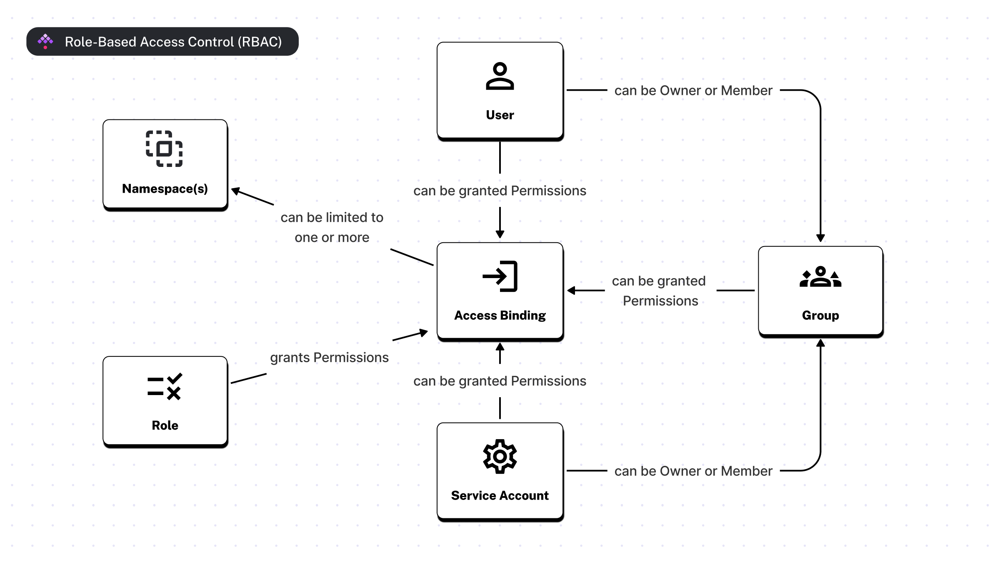
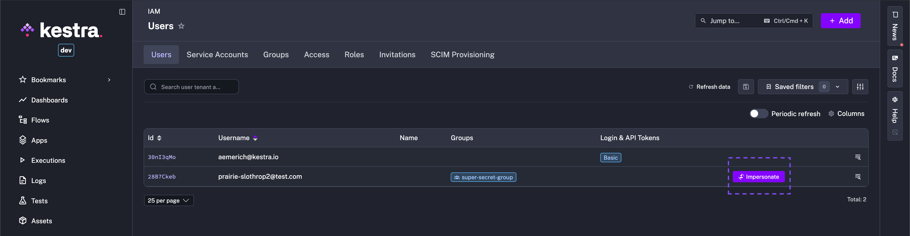
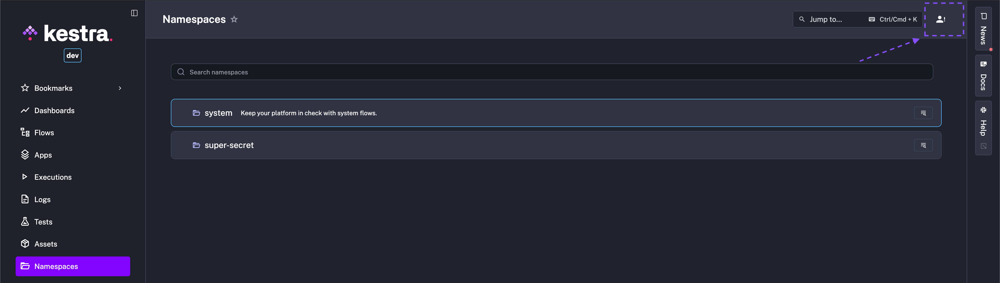
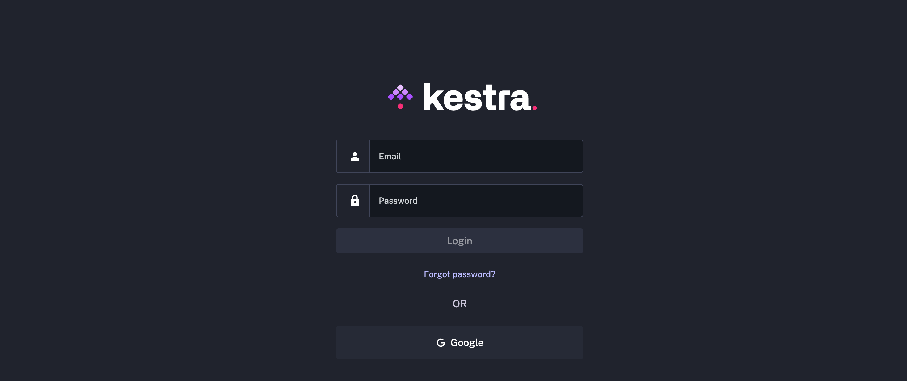
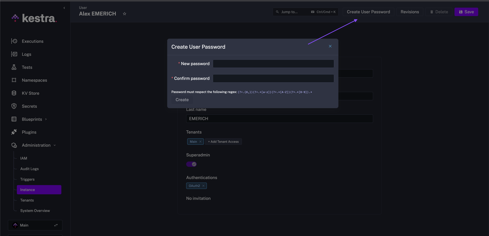

Kestra Enterprise supports Role-Based Access Control (RBAC) to manage access to tenants, namespaces, flows, and resources.

Kestra has three types of entities:

- Users: Represent a **person**. To add users to your Kestra instance, you can do one of the following:
  - [Invite users](../invitations/index.md) to your instance or tenant from the UI
  - Sync users from an external identity provider using [SCIM](../scim/index.mdx)
  - Create users directly using [Terraform](../../../13.terraform/index.mdx)
  - Automate user onboarding, offboarding, and group management from inside a flow using [IAM tasks](../../../15.how-to-guides/iam-automation/index.md)

- Groups: Represent a collection of **Users** and **Service Accounts**. Groups are a useful mechanism for providing the same roles to multiple users or service accounts at once by binding a role to a group.
- Service Accounts: Represent an **application**. They are treated as users when binding role assignments.

All these entities can be assigned to a role, which defines what resources the user, group, or service account can access. These entities do not belong to namespaces, but their permissions can be limited to specific namespaces via bindings on the **IAM** page.

The image below shows the relationship between Users, Groups, Service Accounts, Roles, and Bindings:



## Roles and Bindings

A role is a collection of permissions that can be assigned to users, service accounts, or groups. Each permission is a combination of a **resource** (e.g., `FLOW`, `EXECUTION`, `SECRET`) and one or more **actions** (e.g., `EXECUTE`, `VIEW`, `DELETE`). A role alone grants nothing — it must be attached to a user, service account, or group via a **binding** on the **IAM** page.

Users, service accounts, and groups can hold any number of roles simultaneously. You can [configure a default role](../../../configuration/05.security-and-secrets/index.md) to assign it automatically to new users joining via [SSO](../sso/index.md). Use [Impersonate](#impersonate) to verify a user's effective permissions after assigning roles.

### How permissions are evaluated

Access is granted when the identity has access to the tenant, and at least one of its bindings — direct or inherited through a group — carries a role containing the requested action on the requested resource, at a scope that covers the target location.

Three consequences follow from this:

1. **Tenant access is a prerequisite.** Without it, no binding is evaluated.
2. **Permissions add up.** The effective set is the union of all bindings. There is no deny mechanism: adding a narrower role never removes a right already granted by another binding.
3. **A tenant-wide grant covers every namespace**, including namespaces created later.

### Namespace scope

Bindings can be scoped to a specific namespace. A namespace-scoped binding covers that namespace and its entire subtree, matched by dot-separated prefix. A binding on `io.acme.data` covers `io.acme.data.etl` but not `io.acme.finance` or `io.acme.datax` — the match requires a complete segment boundary, not just a string prefix.

A tenant-wide binding always covers every namespace, so it also satisfies any namespace check.

## Impersonate

After assigning permissions to a user, Instance Owners can impersonate users to verify their access is correct. Impersonation switches your view to that user's perspective and can be closed back to the Instance Owner view at any time.





## Resources

A resource is a category of product entity or capability that can be controlled through RBAC. Resources fall into three scope classes that determine how a binding's namespace restriction is applied.

**Namespace-scopable** — a binding scoped to a namespace restricts these resources to that namespace and its subtree. A tenant-wide binding covers everything.

| Resource | Description |
|---|---|
| `FLOW` | Flows, their revisions, graphs, and dependencies |
| `EXECUTION` | Executions, their state, logs, outputs, and files |
| `TRIGGER` | Triggers attached to flows |
| `NAMESPACE` | Namespaces and their files |
| `KVSTORE` | Key-value store entries |
| `SECRET` | Secrets stored in the namespace |
| `CREDENTIAL` | Credentials for external integrations |
| `REUSABLE_INPUTS` | Reusable input definitions |
| `APP` | Apps and their executions |
| `TESTSUITE` | Test suites and their runs |
| `ASSET` | Data assets and lineage |
| `CASE` | Cases |
| `POLICY` | Governance policies controlling flow and task behavior |
| `BINDING` | Role-to-entity bindings (a namespace-scoped binding on `BINDING` delegates access management for that subtree) |

**Tenant-wide** — these resources have no namespace dimension. Scoping a binding to a namespace does not restrict them: the permission applies across the whole tenant regardless of the binding's scope.

| Resource | Description |
|---|---|
| `USER` | Users in the tenant |
| `GROUP` | Groups and their members |
| `ROLE` | RBAC roles |
| `SERVICE_ACCOUNT` | Service accounts |
| `INVITATION` | User invitations |
| `DASHBOARD` | Custom dashboards |
| `AUDITLOG` | Audit log entries |
| `COPILOT` | AI Copilot flow generation |
| `SYSTEM_SETTINGS` | Instance-level settings |
| `TENANT_SETTINGS` | Tenant-level settings |

**Global-only** — `BLUEPRINT`, `MCP_SERVER`, `PROMOTION_TARGET`, and `SUPPORT`. Only a tenant-scoped binding counts for these. A namespace-scoped binding carrying any of them grants nothing at all.

:::alert{type="warning"}
A custom role that mixes namespace-scopable and tenant-wide (or global-only) resources behaves differently than it appears. When you scope that binding to a namespace, the namespace-scopable resources are correctly restricted, but the tenant-wide resources are granted across the whole tenant regardless, and any global-only resources are silently not granted at all. Roles should not mix scope classes unless that behavior is intentional.
:::

## Actions

Each resource defines its own set of allowed actions. Not every action applies to every resource.

**Common actions** (available on most resources):

| Action | Meaning |
|---|---|
| `VIEW` | Read a single item's details |
| `LIST` | Search or browse items |
| `CREATE` | Create a new item |
| `UPDATE` | Modify an existing item |
| `DELETE` | Remove an item |

**Resource-specific actions:**

| Resource | Additional actions |
|---|---|
| `FLOW` | `EXECUTE` (trigger an execution), `DISABLE`, `ENABLE`, `VALIDATE`, `EXPORT`, `IMPORT` |
| `EXECUTION` | `RESTART`, `KILL`, `REPLAY`, `PAUSE`, `RESUME`, `CHANGE_LABELS`, `ACCESS_LOGS`, `ACCESS_OUTPUTS`, `ACCESS_FILES`, `FOLLOW` (live SSE stream), `EXPORT`, `UNQUEUE`, `FORCE_RUN` |
| `TRIGGER` | `UNLOCK`, `RESTART`, `DISABLE`, `ENABLE`, `EXPORT`, `BACKFILL` |
| `NAMESPACE` | `MANAGE_FILES` (all namespace file operations) |
| `POLICY` | `EXECUTE` (dry-run evaluate a policy against its scope), `EXPORT`, `IMPORT` |
| `APP` | `EXECUTE`, `ACCESS_FILES`, `ACCESS_LOGS` |
| `TESTSUITE` | `EXECUTE` |
| `AUDITLOG` | `EXPORT` |
| `USER` | `MANAGE_GROUP_MEMBERSHIP`, `IMPERSONATE` |
| `GROUP` | `MANAGE_MEMBERS` |
| `COPILOT` | `USE` (only action) |
| `SYSTEM_SETTINGS` | — (`VIEW` and `UPDATE` only; no `CREATE`, `DELETE`, or `LIST`) |
| `TENANT_SETTINGS` | — (`VIEW` and `UPDATE` only; no `CREATE`, `DELETE`, or `LIST`) |

:::alert{type="info"}
For a complete resource-to-endpoint mapping, see the [Permissions reference](./permissions-reference/index.md).

If you are upgrading from Kestra 1.x, see the [RBAC action model migration guide](../../../11.migration-guide/v2.0.0/rbac-action-model/index.md) for how old CRUD permissions map to the new actions and what was dropped.
:::

## MCP server permissions

`MCP_SERVER` is a first-class RBAC resource that controls access to [Kestra MCP servers](../../../ai-tools/03.mcp-server/index.md). Supported actions are `VIEW`, `LIST`, `CREATE`, `UPDATE`, and `DELETE`.

Default role assignments:

| Role | Actions granted |
|---|---|
| Admin | All (`VIEW`, `LIST`, `CREATE`, `UPDATE`, `DELETE`) |
| Developer / Editor | All (`VIEW`, `LIST`, `CREATE`, `UPDATE`, `DELETE`) |
| Launcher | — (not included) |
| Viewer | `VIEW`, `LIST` |

In addition to these permissions, access to a **private** MCP server is also flow-scoped: a user can connect to a private server only if they have `FLOW: EXECUTE` on at least one namespace that contains a flow with an `McpToolTrigger` pointing at that server.

## Managed roles

Kestra ships five managed roles. Each role's full permission set is visible under **IAM → Roles**. Instance Owners can create additional custom roles on top of these. Users can hold multiple roles.

| Role | Description |
|---|---|
| **Admin** | All actions on all resources. |
| **Developer** | Everything Editor has, plus: full namespace management (including file management and plugin default import), secrets, credentials, and full blueprint CRUD. For engineers who also need platform-level access. |
| **Editor** | Full flow and execution management (create, update, delete, execute, restart, kill, etc.), triggers, KV, dashboards, apps, test suites, assets, MCP servers, settings, and Copilot. No namespace file management, no secrets or credentials, blueprint read-only. No IAM resources. |
| **Launcher** | Execute flows and monitor executions (`EXECUTE`, `REPLAY`, `RESTART`, `CHANGE_LABELS`, `ACCESS_LOGS`, `ACCESS_OUTPUTS`, `ACCESS_FILES`, `FOLLOW`, `EXPORT`). Read-only on triggers, KV, dashboards, and assets. No flow write access, no namespace management. |
| **Viewer** | `VIEW`, `LIST`, and `EXPORT` on flows, executions, triggers, and namespaces. Can access execution logs, outputs, files, and live-follow executions. No execution state changes (no restart, kill, replay, etc.). No write access anywhere. |

## Instance Owner and Admin

Kestra provides two roles for managing your instance: Instance Owner and Admin.

- Instance Owner is a user type with elevated privileges for global control.
- Admin is a customizable role that grants full access to all resources (scoped to a tenant if multi-tenancy is enabled).

:::collapse{title="Summary"}
Key differences between Admin and Instance Owner:

| Feature                             | Admin (scoped to a tenant if enabled)              | Instance Owner                                       |
|-------------------------------------|----------------------------------------------------|------------------------------------------------------|
| Access Level                        | By default as all permissions, depends on the Role | Manages tenants and IAM across all tenants           |
| Tenant Management                   | No                                                 | View, create, update, delete tenants across all tenants |
| User/Role/Group/Bindings Management | Has the permission by default                      | View, create, update, delete across all tenants         |
| Flow/Execution Management           | Has the permission by default                      | No                                                   |
| Set Instance Owner privilege        | No                                                 | Yes                                                  |
:::

## Instance Owner

Instance Owner is a flag on a user or service account, not a role. It cannot be assigned through a binding.

Instance Owner unlocks instance-level functions — tenant management, worker groups and queues, versioned plugins, the kill switch, and instance settings. These resources carry no RBAC actions, so no role can grant access to them.

For workload resources (flows, executions, triggers, secrets, credentials, namespaces, and apps), the Instance Owner flag grants nothing. An Instance Owner is evaluated like any other user on those resources and still needs tenant access plus a binding to act on them. The bootstrap account configured at startup is given both tenant access and an Admin binding explicitly.

Instance Owners have access to every tenant without holding explicit tenant access there. As a result, they appear in every tenant's user list even when they hold no groups or bindings in that tenant. This is by design: the list shows who can act in the tenant, not just who was formally added to it.

Instance Owners access instance-wide controls through the [Instance Owner console](../../05.instance/00.instance-owner/index.md), which covers tenant management, instance IAM, infrastructure, and governance.

For how to create Instance Owner users and manage the privilege, see [Instance Owner](../../05.instance/00.instance-owner/index.md).

## Admin

Kestra has no Admin user type; Admin is a role with full permissions.

This role can be assigned to any user, service account, or group. This allows you to have different types of admins, grant admin permissions to a whole group, and revoke those permissions at any time without deleting any group or user.

When using multi-tenancy, Kestra assigns the Admin role to the user who created the tenant by default.

:::alert{type="info"}
If you see an error when creating a new User or Service Account, it might be caused by a limit on your license. In that case, [reach out to us](/contact-us) to validate and optionally upgrade your license.
:::

## Creating a user with an Admin role

### Through the UI

When launching Kestra for the first time with no prior CLI setup, you are prompted to set up Kestra through the [Setup Page](../../01.overview/02.setup/index.md).

This creates the first user, automatically assigns the Admin role, and binds it.

Later, create a new user or select an existing user and assign the Admin role from the **Access** tab in IAM.

### Through the CLI

To create a user with the Admin role from the CLI, use the `--admin` option:

```bash
kestra auths users create prod.admin@kestra.io TopSecret42 --admin

## schema:
kestra auths users create <username> <password> --admin
```

## User lockout

Use the following configuration to change the lockout behavior after too many failed login attempts. By default, Kestra locks the user for the `lock-duration` period after a `threshold` number of failed attempts within the `monitoring-window` duration. The snippet below lists the default values — adjust them based on your preferences:

```yaml
kestra:
  security:
    login:
      failed-attempts:
        threshold: 10
        monitoring-window: PT5M
        lock-duration: PT30M
```

The key attributes are:

- `threshold`: Sets the number of allowed failed attempts before a user is locked out.
- `monitoring-window`: Defines the period during which failed login attempts are counted before triggering a lock.
- `lock-duration`: Defines how long the account remains locked.

With the configuration above, a user gets 10 failed login attempts in a 5-minute window before lockout. They must wait 30 minutes, be unlocked by an Admin, or reset their password using the Forgot Password link. An Instance Owner can also unlock a user manually from the user's detail page.

## Change password

Users can change their password from their profile, accessible via the user avatar in the bottom-left corner of the UI. "Forgot Password" settings can be configured in your Kestra configuration under `basic-auth.password-reset`. Settings to consider are the cooldown time between reset requests and how many requests can be made in a given time window.

```yaml
kestra:
  security:
    basic-auth:
      password-reset:
        cooldown: PT5M         # Minimum time required between two password reset emails for the same user
        rate-limit:
          max-requests: 10     # Maximum number of password reset requests allowed per client within the time window
          window: PT1H         # Time window during which password reset requests are counted for rate limiting
```

### Reset a password as an Instance Owner

Users can reset their password via the Forgot Password link on the login page. An Instance Owner can also reset a user's password from the User Edit page at **Instance Owner → Instance IAM → Users**.





## RBAC FAQ

:::collapse{title="Why is Admin a Role rather than User type?"}

The Admin role is a collection of permissions that can be assigned to users, service accounts, or groups. This lets you grant admin permissions to multiple users or groups, and revoke them at any time without deleting anything.

A user can start as Admin and later have that permission narrowed or removed. Multiple users can share the Admin role, or the same user can hold multiple roles with different scopes.

Users represent authentication (who you are); roles represent authorization (what you can do). Decoupling the two lets you grant permissions to multiple users or groups at once by attaching a single role to a group.
:::

:::collapse{title="Why can't I edit an existing Binding?"}

A binding is immutable. If a binding no longer reflects the desired permissions, delete it and create a new one for the same user, service account, or group with different roles and/or namespaces.
This prevents accidental changes to existing permissions.
:::

:::collapse{title="What happens if you delete a Group?"}

All users and service accounts in that group lose the permissions granted by bindings attached to it. The users and service accounts themselves still exist.
:::

:::collapse{title="Why are some flows missing from a user's list?"}

Resource lists are filtered at the API boundary to the caller's allowed namespaces. Out-of-scope resources do not appear — there is no 403, no greyed-out row. A user with no binding covering a namespace sees an empty list for it, not an error. "Some of my flows are missing" almost always means a binding is missing or scoped to the wrong namespace.
:::

:::collapse{title="Why does an Instance Owner appear in a tenant they were never added to?"}

Instance Owners can act in every tenant regardless of explicit tenant access. The tenant user list shows who can operate in that tenant, so Instance Owners always appear there. Their row typically shows no groups and no roles, which distinguishes them from users with formal tenant access.
:::
