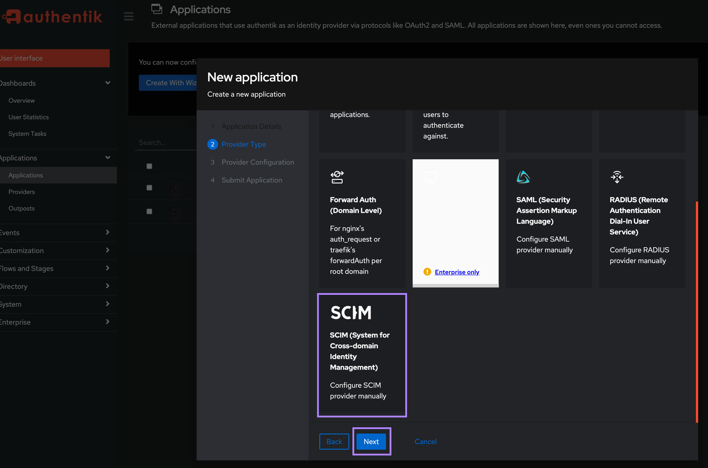
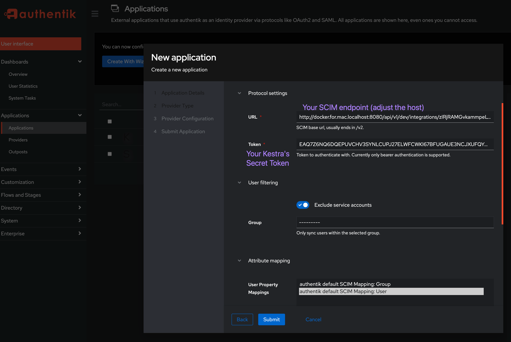
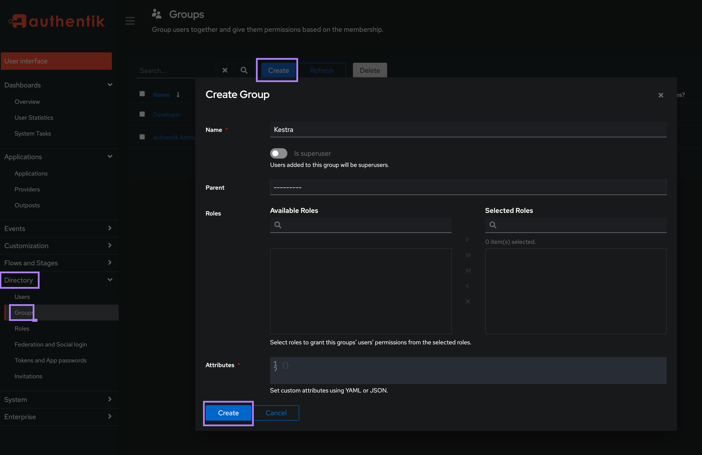
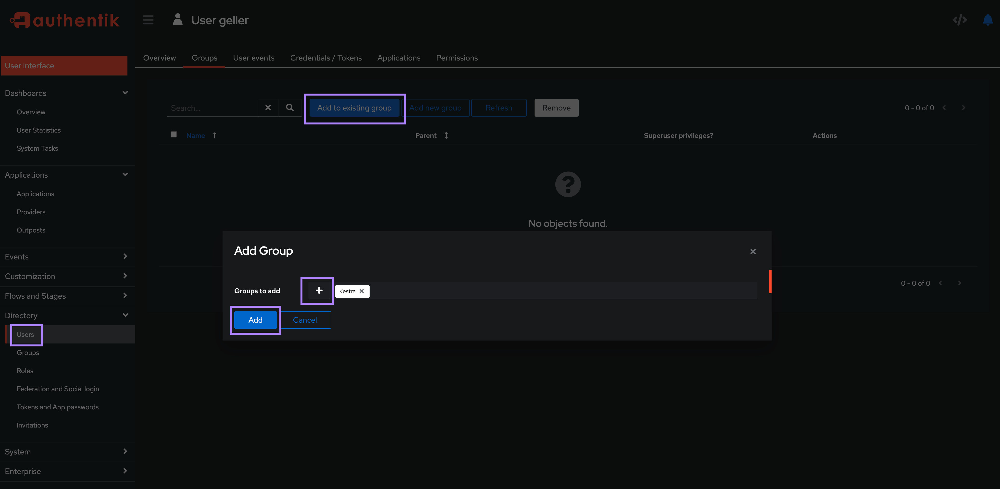
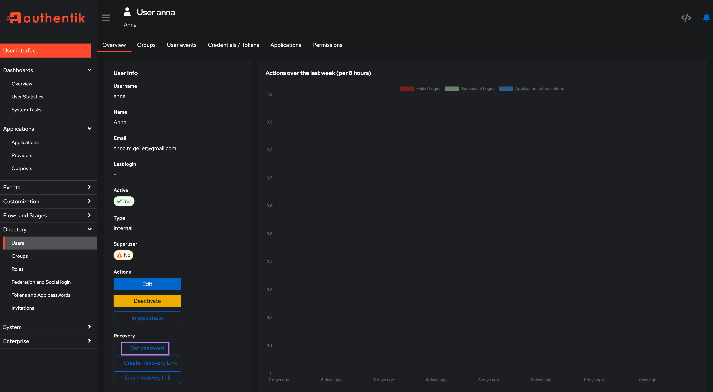
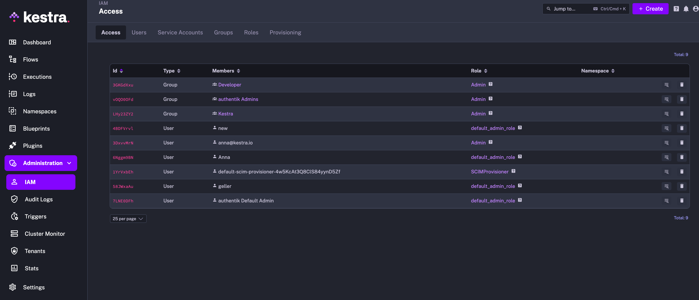

Sync users and groups from authentik to Kestra using SCIM.

## Prerequisites

- **authentik Account**: An account with administrative privileges to configure SCIM provisioning.
- **Enable multi-tenancy in Kestra**: Tenants must be enabled in Kestra to support SCIM provisioning. You can enable tenants by setting the `kestra.ee.tenants.enabled` configuration property to `true`:

```yaml
kestra:
  ee:
    tenants:
      enabled: true
```

:::alert{type="info"}
Tenants are enabled by default. Please refer to the [Migration Guide](../../../../11.migration-guide/v0.23.0/tenant-migration-ee/index.md) to assist with upgrading.
:::

## Kestra SCIM setup: create a new provisioning integration

1. Go to **Settings → Super Admin**, select your tenant from the sidebar, open **IAM**, and click the **SCIM Provisioning** tab.
2. Click **+ Create**.
3. Fill in the following fields:
   - **Name**: Enter a name for the provisioning integration.
   - **Description**: Provide a brief description of the integration.
   - **Provisioning Type**: Only SCIM 2.0 is supported — leave the default selection and click **Save**.

These steps generate a SCIM endpoint URL and a Secret Token. Save both — you will need them in the next steps.

The endpoint should look as follows:

```plaintext
https://<your_kestra_host>/api/v1/<your_tenantID>/integrations/integration_id/scim/v2
```

The Secret Token will be a long string (approximately 200 characters) used to authenticate requests from authentik to Kestra.

### Enable or disable SCIM integration

You can disable or remove the SCIM integration at any time. When disabled, all incoming requests to that endpoint are rejected.

:::alert{type="info"}
You can disable the integration while configuring authentik, then enable it once setup is complete.
:::

### IAM role and service account

When creating a new Provisioning Integration, Kestra will automatically create two additional objects:

1. Role `SCIMProvisioner` with the following permissions:
   - `GROUPS`: `CREATE`, `READ` `UPDATE`, `DELETE`
   - `USERS`: `CREATE`, `READ`, `UPDATE`
   - `BINDINGS`: `CREATE`, `READ`, `UPDATE`, `DELETE`
  

2. Service Account with an API Token which was previously displayed as a Secret Token for the integration:
  

:::alert{type="info"}
Why the `SCIMProvisioner` role doesn't have the `DELETE` permission for `USERS`? This is because you cannot delete a user through our SCIM implementation. Users are global and SCIM provisioning is per tenant. When we receive a `DELETE` query for a user, we remove their tenant access but the user itself remains in the system.
:::

## authentik SCIM 2.0 setup

Configuring SCIM 2.0 follows a process similar to SSO — you'll need to create a new `Application`. Then, in the second step, select `SCIM` as the Provider Type.



In the `Protocol settings` section, enter the `URL` and `Secret Token` obtained from Kestra.

:::alert{type="info"}
If you are running authentik on a Mac machine with [docker-compose installer](https://docs.goauthentik.io/docs/installation/docker-compose), make sure to replace `localhost` in your Kestra's SCIM endpoint with `host.docker.internal` since otherwise the sync won't work. Your URL should look as follows: `http://host.docker.internal:8080/api/v1/dev/integrations/zIRjRAMGvkammpeLVuyJl/scim/v2`.
:::




## Test both SSO and SCIM by adding users and groups

First, create `Users` and `Groups` in the `Directory` settings.



Then assign your user(s) to an existing group.



You can set a password for each authentik user to allow them to log in directly to Kestra with their username/email and password.



Once groups and users are created, they are visible in the Kestra UI under **IAM → Users** and **Groups**. Log in as the default admin user and attach the desired role to each group to set the necessary permissions.



Then, to verify access, log in as one of those new authentik users in a separate browser or incognito mode and verify that the user has the permissions you expect.

## Additional resources

- [SCIM for authentik Documentation](https://docs.goauthentik.io/docs/providers/scim/)
- [Manage applications in authentik Documentation](https://docs.goauthentik.io/docs/applications/manage_apps)
