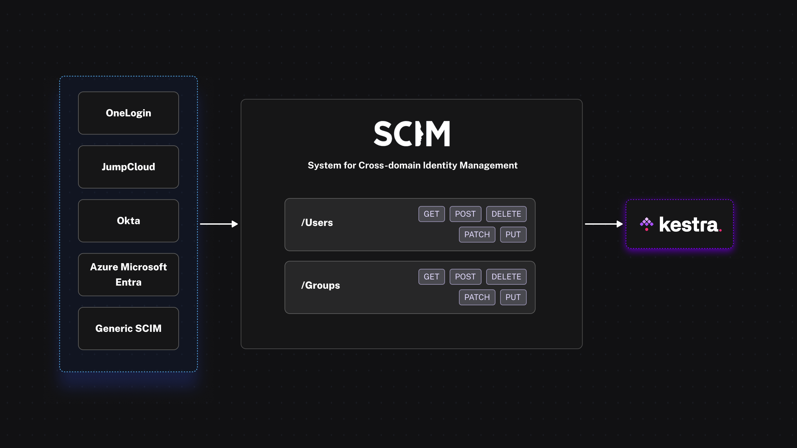

import ChildCard from "~/components/docs/ChildCard.astro"

Sync users and groups from your Identity Provider (IdP) to Kestra using SCIM.

    <iframe
        src="https://www.youtube.com/embed/WQBWxt7ruM4?si=wEYUyO5kJuWxQMft"
        title="YouTube video player"
        allow="accelerometer; autoplay; clipboard-write; encrypted-media; gyroscope; picture-in-picture; web-share"
        referrerpolicy="strict-origin-when-cross-origin"
        allowfullscreen
    ></iframe>

SCIM (System for Cross-domain Identity Management) is an open-standard protocol that automates user provisioning, de-provisioning, and group synchronization between identity providers (IdPs) such as Microsoft Entra ID or Okta and service providers such as Kestra. Kestra uses the SCIM 2.0 protocol.

## How SCIM provisioning works

1. **Automated provisioning and de-provisioning**: Users and groups are created, updated, and removed in Kestra automatically when they change in the IdP, keeping the IdP as the single source of truth for identity data.
2. **Consistency and compliance**: Identity information stays consistent across systems, supporting security and regulatory requirements without manual reconciliation.
3. **Group synchronization**: IdP group memberships map to Kestra groups, so role assignments follow the IdP structure without per-user configuration in Kestra.

## Supported identity providers

For setup guides by provider, see the pages below.

<ChildCard />