Sync users and groups from Keycloak to Kestra using SCIM.

## Keycloak SCIM provisioning

## Prerequisites

- **Keycloak Account**: An account with administrative privileges is required to configure SCIM provisioning.

::snippet{name="enterprise/scim-prerequisites"}

## Kestra SCIM setup: create a new provisioning integration

::snippet{name="enterprise/scim-setup-steps"}

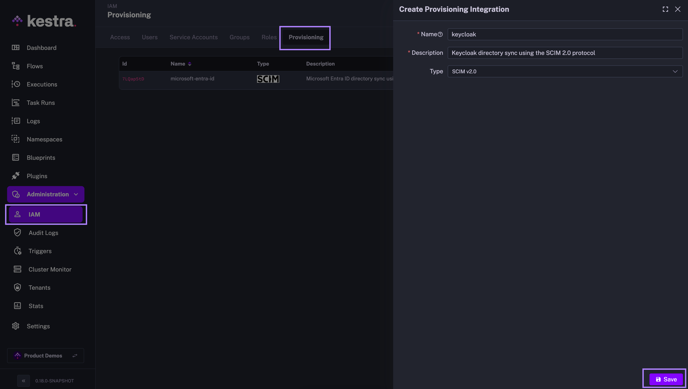

The steps above will generate a SCIM endpoint URL and a Secret Token that you will use to authenticate Keycloak with the SCIM integration in Kestra. Save those details as we will need them in the next steps.

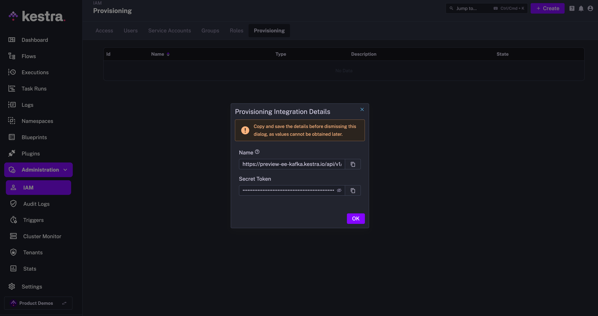

The endpoint should look as follows:

```plaintext
https://<your_kestra_host>/api/v1/<your_tenant>/integrations/integration_id/scim/v2
```

The Secret Token is a long string (approx. 200 characters) used to authenticate requests from Keycloak to Kestra.

### Enable or Disable SCIM Integration

::snippet{name="enterprise/scim-disable-note"}

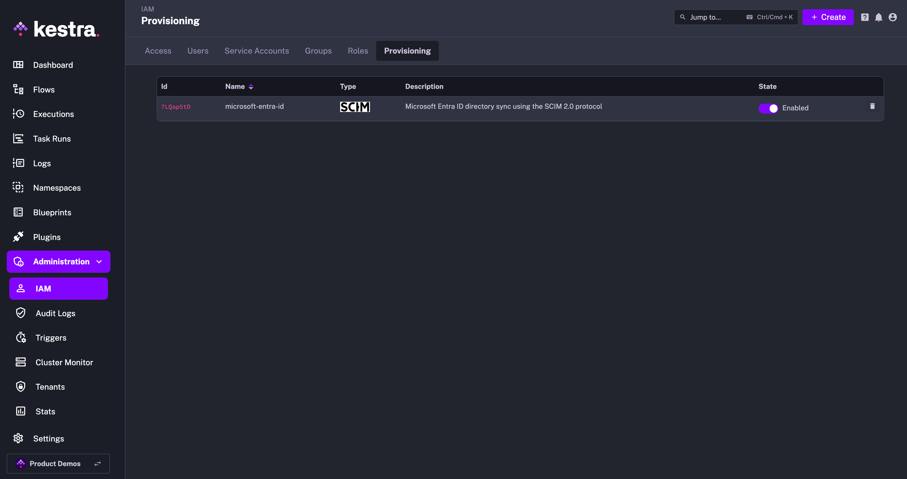


:::alert{type="info"}
At first, you can disable the integration to configure your Keycloak SCIM integration, and then enable it once the configuration is complete.
:::

### IAM Role and Service Account

::snippet{name="enterprise/scim-iam-role"}

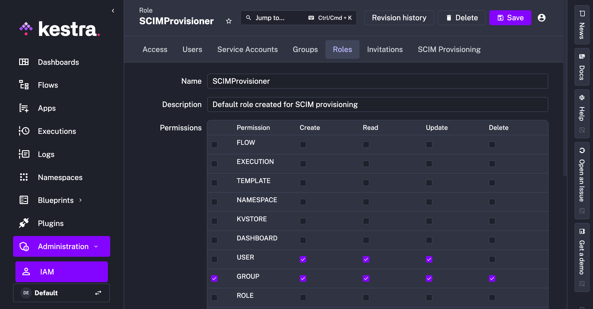

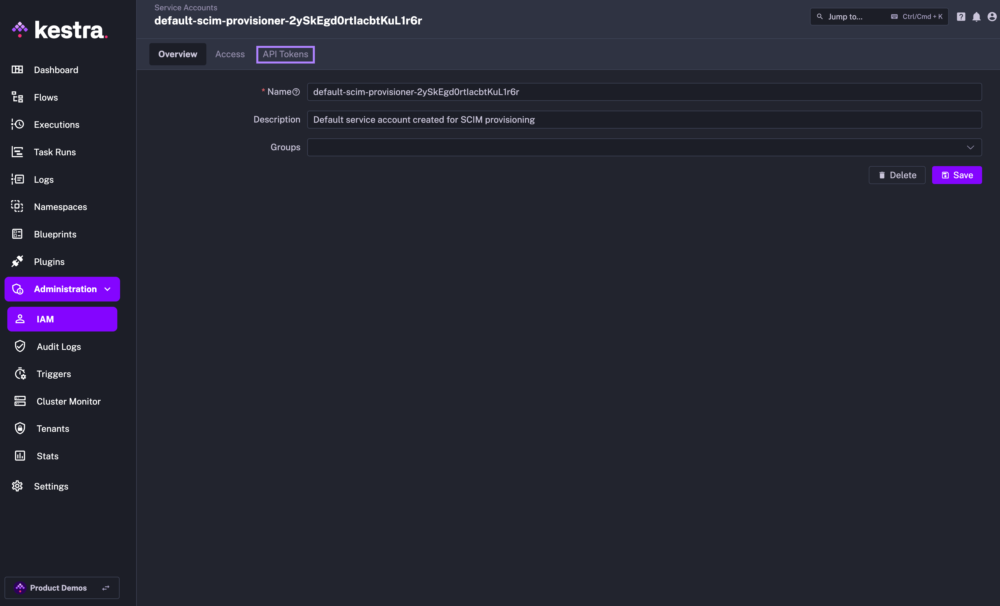

## Keycloak SCIM setup

Keycloak [does not provide](https://github.com/keycloak/keycloak/issues/13484) any built-in support for SCIM v2.0. Some [open-source solutions](https://github.com/mitodl/keycloak-scim/) support groups synchronization but not users and membership synchronization.

However, there are paid solutions such as [SCIM for Keycloak](https://scim-for-keycloak.de/) that allow you to extend Keycloak with SCIM. The setup shown below was validated with Kestra 0.18.0 and Keyclock 25.0.2 — best if you use the same or higher versions.

1. **Obtain a License**:
   - Create a new account on: https://scim-for-keycloak.de/
   - Purchase a free license (no VAT number or credit card is required for a free license).
  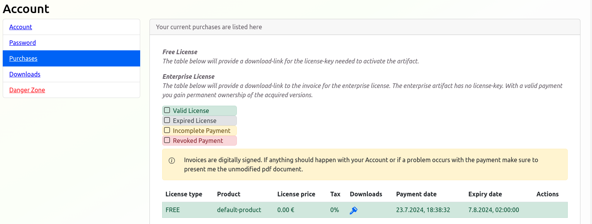
2. **Install the SCIM Provider Plugin**:
   - Download the plugin JAR file from the `Downloads` section in your Account (e.g. `scim-for-keycloak-kc-25-2.2.1-free.jar`).
  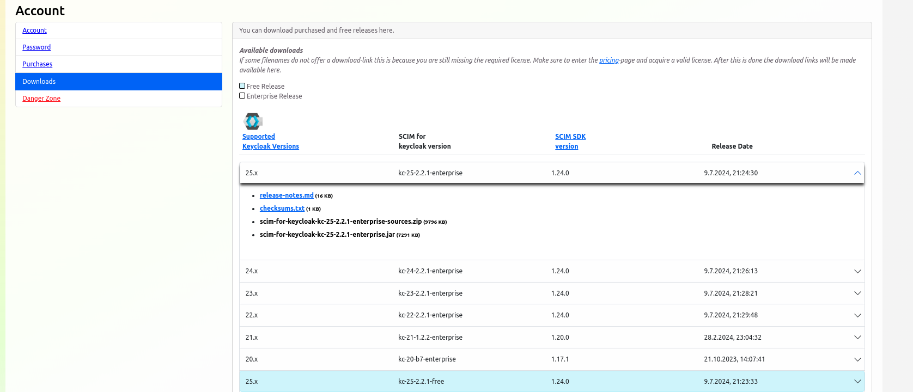
   - Place the JAR file in the `./providers` directory of your Keycloak installation (or in the current folder if Keycloak is deployed with Docker).
   - More information: [SCIM for Keycloak Installation](https://scim-for-keycloak.de/documentation/installation/install)
3. **Deploy Keycloak**:
   - Create a simple `docker-compose.yaml` file:
    ```yaml
    services:
      keyclock:
        container_name: keyclock
        image: quay.io/keycloak/keycloak:25.0.2
        ports:
          - 8085:8085
        environment:
          KEYCLOAK_ADMIN: admin
          KEYCLOAK_ADMIN_PASSWORD: admin
          KC_SPI_THEME_WELCOME_THEME: scim
          KC_SPI_REALM_RESTAPI_EXTENSION_SCIM_LICENSE_KEY: <LICENSES_KEY>
        command:
          ["start-dev", "--http-port=8085"]
        volumes:
          - ./providers:/opt/keycloak/providers
        network_mode: "host" # Optional: for accessing external Kestra
    ```
   - Run `docker compose up` to start Keycloak.
4. **Configure the SCIM for Keycloak**:
   - To synchronize Users and Groups from Keycloak to Kestra, connect to the `SCIM Administration Console` for Keycloak with SCIM.
  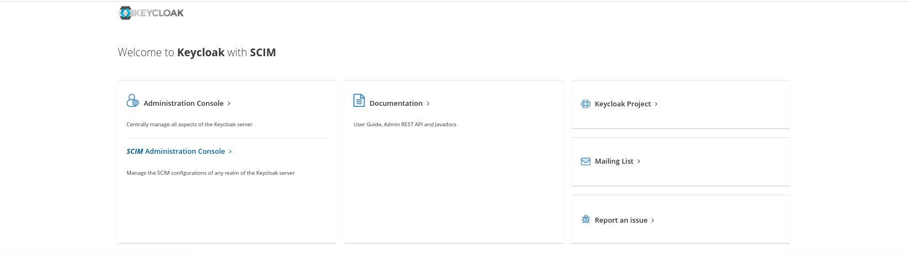
   - Enable SCIM for the Realm
  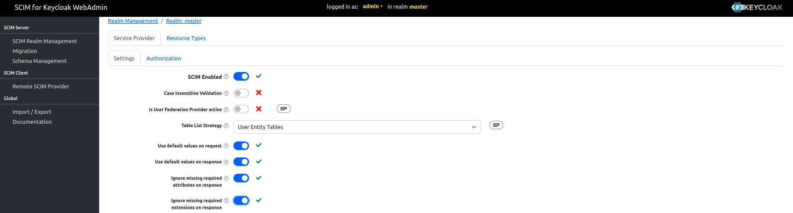
   - Note that `Bulk` and `Password synchronization` operations are currently not supported by Kestra and must be disabled in Keycloak.
5. **Create a SCIM Client**:
   - Navigate to the `Remote SCIM Provider` section
   - Fill the `Base URL` field with your Kestra `SCIM Endpoint`:
  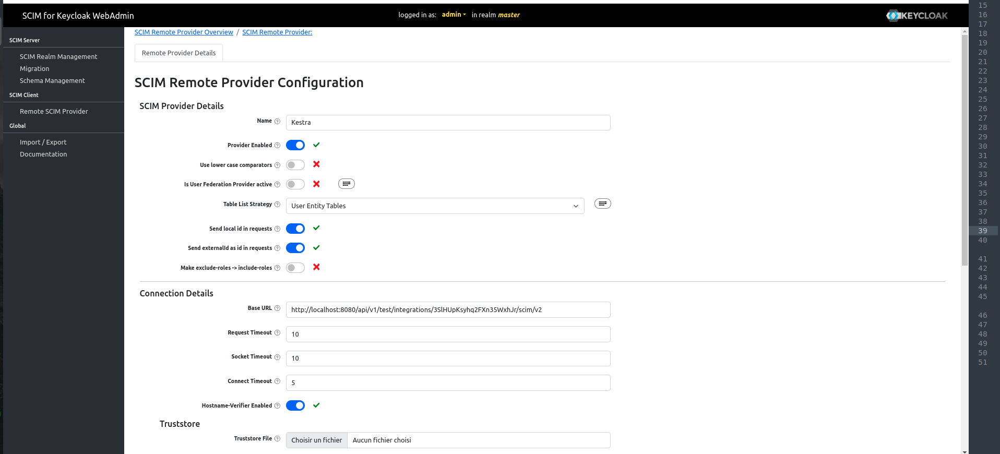
   - Fill the `Authentication` with your Kestra `Secret Token`:
  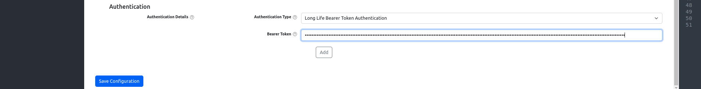
6. **Enable Provisioning**:
   - Now that everything is configured, you can toggle the `Enabled` field on in the Kestra Provisioning Integration to start syncing users and groups from Keycloak to Kestra.


## Additional resources

- [SCIM for Keycloak Documentation](https://scim-for-keycloak.de/documentation/administration/scim-client)
