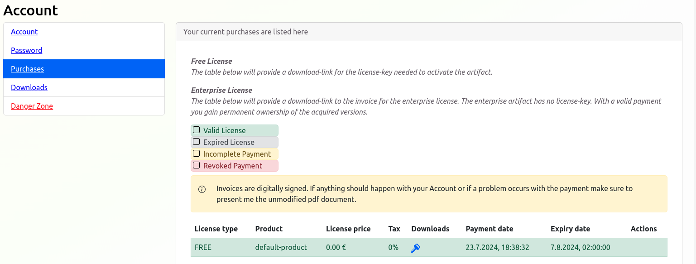
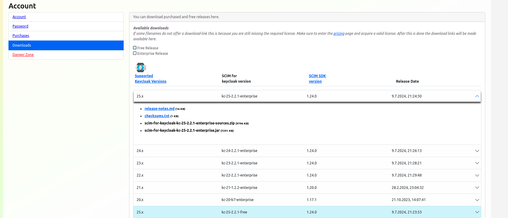
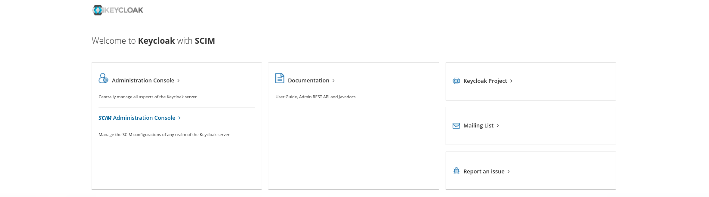
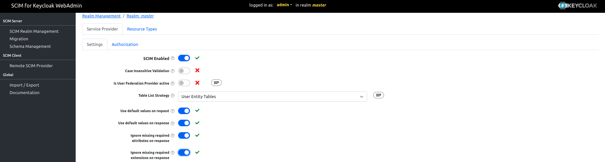
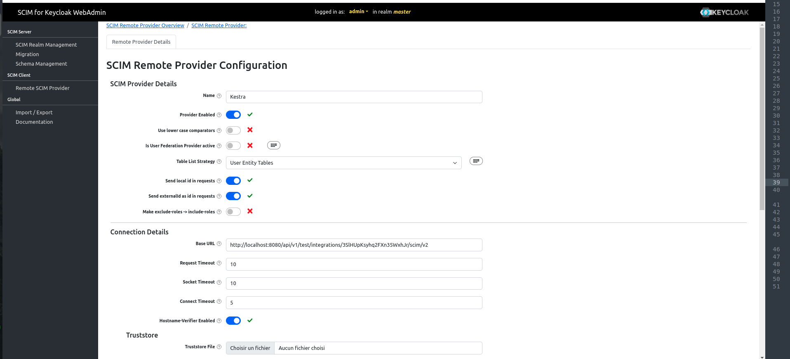
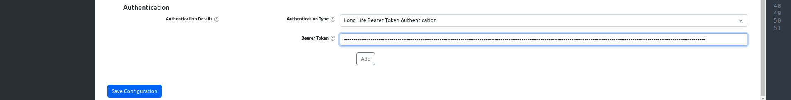

Sync users and groups from Keycloak to Kestra using SCIM.

## Prerequisites

- **Keycloak Account**: An account with administrative privileges is required to configure SCIM provisioning.
- **Enable multi-tenancy in Kestra**: Tenants must be enabled in Kestra to support SCIM provisioning. You can enable tenants by setting the `kestra.ee.tenants.enabled` configuration property to `true`:

```yaml
kestra:
  ee:
    tenants:
      enabled: true
```

:::alert{type="info"}
Tenants are enabled by default. Please refer to the [Migration Guide](../../../../11.migration-guide/v0.23.0/tenant-migration-ee/index.md) to assist with upgrading.
:::

## Kestra SCIM setup: create a new provisioning integration

1. Go to **Settings → Super Admin**, select your tenant from the sidebar, open **IAM**, and click the **SCIM Provisioning** tab.
2. Click **+ Create**.
3. Fill in the following fields:
   - **Name**: Enter a name for the provisioning integration.
   - **Description**: Provide a brief description of the integration.
   - **Provisioning Type**: Only SCIM 2.0 is supported — leave the default selection and click **Save**.

These steps generate a SCIM endpoint URL and a Secret Token. Save both — you will need them in the next steps.


The endpoint should look as follows:

```plaintext
https://<your_kestra_host>/api/v1/<your_tenant>/integrations/integration_id/scim/v2
```

The Secret Token is a long string (approx. 200 characters) used to authenticate requests from Keycloak to Kestra.

### Enable or disable SCIM integration

You can disable or remove the SCIM integration at any time. When disabled, all incoming requests to that endpoint are rejected.

:::alert{type="info"}
You can disable the integration while configuring Keycloak, then enable it once setup is complete.
:::

### IAM role and service account

When creating a new Provisioning Integration, Kestra will automatically create two additional objects:

1. Role `SCIMProvisioner` with the following permissions:
   - `GROUPS`: `CREATE`, `READ` `UPDATE`, `DELETE`
   - `USERS`: `CREATE`, `READ`, `UPDATE`
   - `BINDINGS`: `CREATE`, `READ`, `UPDATE`, `DELETE`
  

2. Service Account with an API Token which was previously displayed as the Secret Token for the integration:
  

:::alert{type="info"}
Why the `SCIMProvisioner` role doesn't have the `DELETE` permission for `USERS`? This is because you cannot delete a user using our SCIM implementation. Users are global and SCIM provisioning is per tenant. When we receive a `DELETE` query for a user, we remove their tenant access but the user itself remains in the system.
:::

## Keycloak SCIM setup

Keycloak [does not provide](https://github.com/keycloak/keycloak/issues/13484) any built-in support for SCIM v2.0. Some [open-source solutions](https://github.com/mitodl/keycloak-scim/) support groups synchronization but not users and membership synchronization.

However, there are paid solutions such as [SCIM for Keycloak](https://scim-for-keycloak.de/) that allow you to extend Keycloak with SCIM. The setup shown below was validated with Kestra 0.18.0 and Keycloak 25.0.2 — best if you use the same or higher versions.

1. Create an account at https://scim-for-keycloak.de/ and purchase a free license (no VAT number or credit card required).

  

2. Download the plugin JAR file from the **Downloads** section (e.g. `scim-for-keycloak-kc-25-2.2.1-free.jar`).

  

   Place the JAR in the `./providers` directory of your Keycloak installation. See [SCIM for Keycloak Installation](https://scim-for-keycloak.de/documentation/installation/install) for details.

3. **Deploy Keycloak**:
   - Create a simple `docker-compose.yaml` file:
    ```yaml
    services:
      keycloak:
        container_name: keycloak
        image: quay.io/keycloak/keycloak:25.0.2
        ports:
          - 8085:8085
        environment:
          KEYCLOAK_ADMIN: admin
          KEYCLOAK_ADMIN_PASSWORD: admin
          KC_SPI_THEME_WELCOME_THEME: scim
          KC_SPI_REALM_RESTAPI_EXTENSION_SCIM_LICENSE_KEY: <LICENSES_KEY>
        command:
          ["start-dev", "--http-port=8085"]
        volumes:
          - ./providers:/opt/keycloak/providers
        network_mode: "host" # Optional: for accessing external Kestra
    ```
   - Run `docker compose up` to start Keycloak.
4. **Configure the SCIM for Keycloak**:
   - Connect to the `SCIM Administration Console` to synchronize users and groups from Keycloak to Kestra.
  
   - Enable SCIM for the realm.
  
   - Disable `Bulk` and `Password synchronization` — these operations are not supported by Kestra.
5. **Create a SCIM Client**:
   - Navigate to the `Remote SCIM Provider` section
   - Fill the `Base URL` field with your Kestra `SCIM Endpoint`:
  
   - Fill the `Authentication` with your Kestra `Secret Token`:
  
6. Toggle **Enabled** in the Kestra Provisioning Integration to start syncing users and groups from Keycloak to Kestra.


## Additional resources

- [SCIM for Keycloak Documentation](https://scim-for-keycloak.de/documentation/administration/scim-client)
