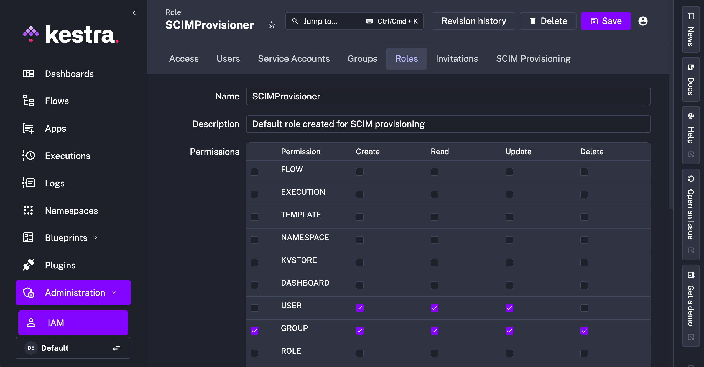
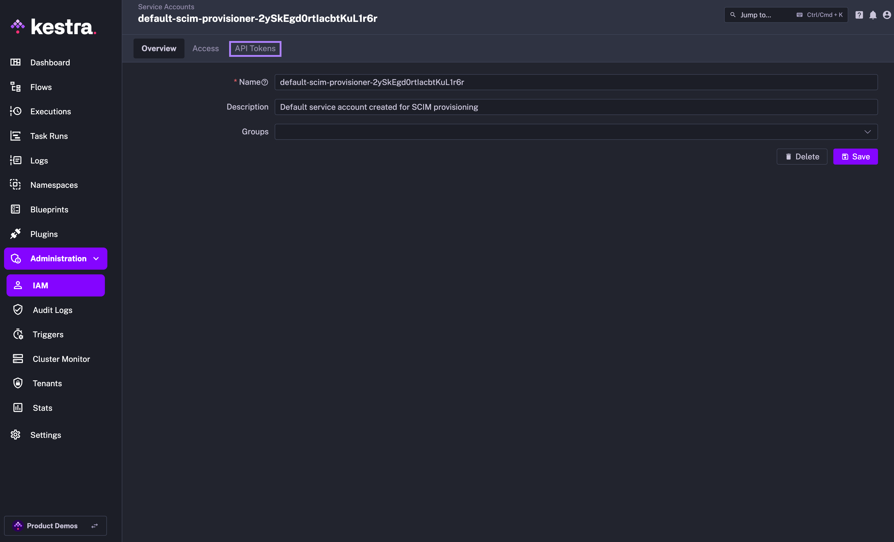
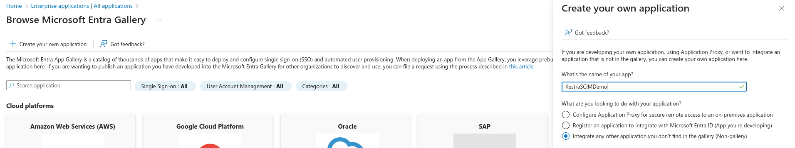
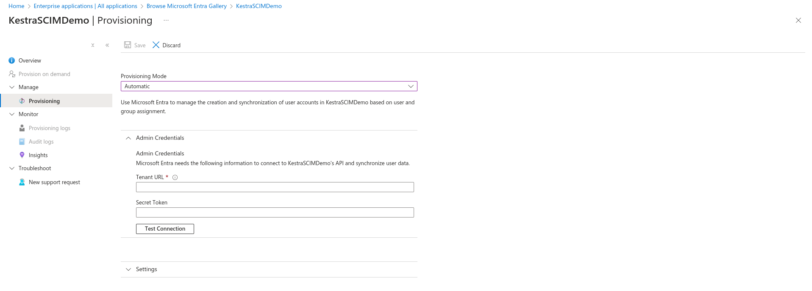

Sync users and groups from Microsoft Entra ID to Kestra using SCIM.

## Microsoft Entra ID SCIM provisioning

## Prerequisites

- **Microsoft Entra ID Account**: An account with administrative privileges is required to configure SCIM provisioning.
- **Enable multi-tenancy in Kestra**: Tenants must be enabled in Kestra to support SCIM provisioning. You can enable tenants by setting the `kestra.ee.tenants.enabled` configuration property to `true`:

```yaml
kestra:
  ee:
    tenants:
      enabled: true
```

## Kestra SCIM setup: create a new provisioning integration

1. In the Kestra UI, navigate to the `Tenant` → `IAM` → `SCIM Provisioning` page.
2. Click on the `Create` button in the top right corner of the page.
3. Fill in the following fields:
   - **Name**: Enter a name for the provisioning integration.
   - **Description**: Provide a brief description of the integration.
   - **Provisioning Type**: currently, we only support SCIM 2.0 — leave the default selection and click `Save`.


The above steps will generate a SCIM endpoint URL and a Secret Token that you will use to authenticate Microsoft Entra ID with the SCIM integration in Kestra. Save those details as they will be needed in the next steps.


The endpoint should look as follows:

```
https://<your_kestra_host>/api/v1/<your_tenant>/integrations/integration_id/scim/v2
```

The Secret Token is a long string (approx. 200 characters) used to authenticate requests from Microsoft Entra ID to Kestra.

### Enable or Disable SCIM Integration

Note that you can disable or completely remove the SCIM Integration at any time. When an integration is disabled, all incoming requests to that integration endpoint will be rejected.


:::alert{type="info"}
At first, you can disable the integration to configure your Microsoft Entra ID integration in the Azure portal, and then enable it once the configuration is complete.
:::

### IAM Role and Service Account

When creating a new Provisioning Integration, Kestra will automatically create two additional objects:

1. Role `SCIMProvisioner` with the following permissions:
   - `GROUPS`: `CREATE`, `READ` `UPDATE`, `DELETE`
   - `USERS`: `CREATE`, `READ`, `UPDATE`
   - `BINDINGS`: `CREATE`, `READ`, `UPDATE`, `DELETE`
  

2. Service Account with an API Token which was previously displayed as the Secret Token for the integration:
  

:::alert{type="info"}
Why the `SCIMProvisioner` role doesn't have the `DELETE` permission for `USERS`? This is because you cannot delete a user through our SCIM implementation. Users are global and SCIM provisioning is per tenant. When we receive a `DELETE` query for a user, we remove their tenant access but the user itself remains in the system.
:::

---

## Microsoft Entra ID SCIM setup

### 1. Register Kestra as an Enterprise Application:
   - Navigate to Microsoft Entra ID → Enterprise Applications.
   - Click on the `+ New application` button to create a new custom application. You can name the app "KestraSCIM" or any other relevant name.
  

### 2. Configure SCIM Provisioning:
   - Go to the newly created Kestra application.
   - Select "Provisioning" and set the Provisioning Mode to "Automatic".
   - Enter the SCIM endpoint URL and the Secret Token provided by Kestra. Paste Kestra's SCIM endpoint URL into the Tenant URL field and the Secret Token into the Secret Token field.
   - Finally, click on `Test Connection` and on the `Save` button.
  

### 3. Map User and Group Attributes:

After entering and saving the **Admin Credentials** for the SCIM provisioning connection in Microsoft Entra ID (i.e., the Tenant URL and Secret Token), Azure will **enable the `Mappings` section** under the Provisioning settings.

The **Mappings** section allows you to define how user and group attributes should flow between Microsoft Entra ID and Kestra.

#### SCIM Schema Support in Kestra
Kestra adheres to the [SCIM 2.0 specification (RFC 7643)](https://datatracker.ietf.org/doc/html/rfc7643#section-4), specifically supporting the following resource types:

- **User Resource**:
  - Example attributes: `userName`, `name.givenName`, `name.familyName`, `emails`, `active`
- **Group Resource**:
  - Example attributes: `displayName`, `members`

#### Retrieve supported schemas

Kestra exposes SCIM resource schemas via its `/Schemas` endpoint exposed via the SCIM URL. This allows Microsoft Entra ID to discover the required attributes automatically.

```text
GET /api/v1/<tenant>/integrations/<integration_id>/scim/v2/Schemas
```

:::alert{type="info"}
Replace `<tenant>` with your actual tenant, and `<integration_id>` with your actual Kestra SCIM integration ID.
:::

This endpoint returns a list of supported schemas and their attributes. Use it as a reference when configuring attribute mappings in Entra ID.

#### Configure user and group mapping

To configure mappings:

1. Go to:
   **Microsoft Entra Admin Center** → **Enterprise Applications** → *Your Kestra App* → **Provisioning** → **Mappings**

2. Configure attribute mappings:
  - **For Users**:
    - Map source attributes such as `userPrincipalName`, `mail` to their SCIM equivalents.
  - **For Groups**:
    - Map attributes such as `displayName`
    - Ensure group `members` are synchronized properly.
3. Refer to the `/Schemas` endpoint response from Kestra to guide accurate mapping.
4. Use attribute expressions or transformations in Entra ID if needed (e.g., to format names or emails).

:::alert{type="info"}
By default, Azure will pre-populate the mapping with many Microsoft Entra ID attributes. You may need to **remove or simplify** some of these mappings if synchronization issues occur with users or groups in Kestra.
:::

#### Test the Configuration
After mappings are configured:

- Trigger a **manual provisioning cycle** from the **Provisioning** tab.
- Verify that **users and groups** are correctly created or updated in Kestra.
- Review **provisioning logs** in Entra ID for any errors or warnings.

### 4. Enable Provisioning:
   - Once everything is configured, you can enable the provisioning integration toggle in the Kestra UI to start syncing users and groups from Microsoft Entra ID to Kestra.

## Additional resources

- [Microsoft Entra ID SCIM Documentation](https://docs.microsoft.com/en-us/azure/active-directory/app-provisioning/)
