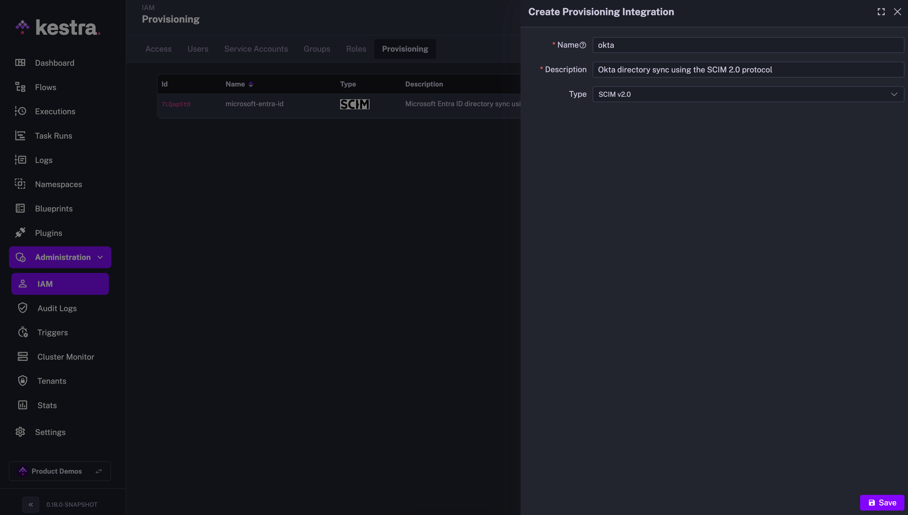
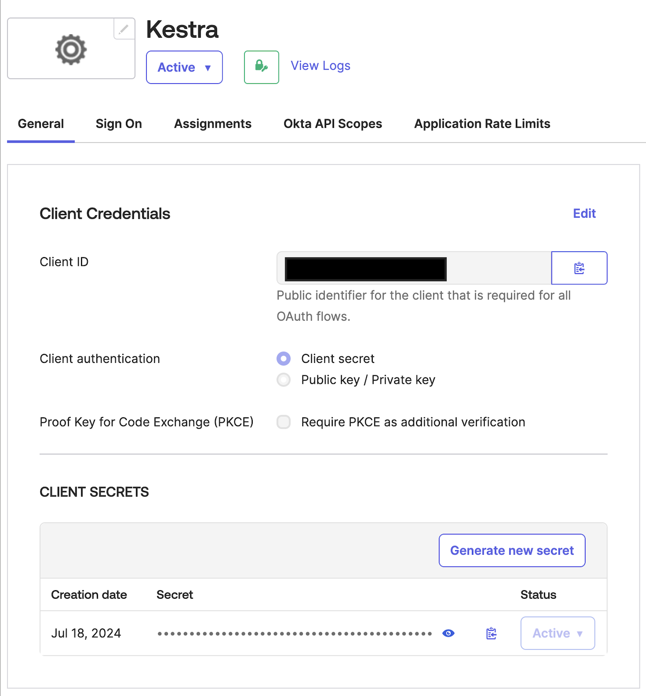
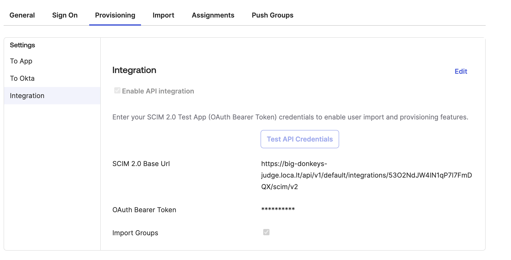

Sync users and groups from Okta to Kestra using SCIM.

## Okta SCIM provisioning

## Prerequisites

- **Okta Account**: An account with administrative privileges is required to configure SCIM provisioning.

::snippet{name="enterprise/scim-prerequisites"}

## Kestra SCIM setup: create a new provisioning integration

::snippet{name="enterprise/scim-setup-steps"}



The above steps will generate a SCIM endpoint URL and a Secret Token that you will use to authenticate Okta with the SCIM integration in Kestra. Save those details as we will need them in the next steps.


The endpoint should look as follows:

```plaintext
https://<your_kestra_host>/api/v1/<your_tenant>/integrations/integration_id/scim/v2
```

The Secret Token is a long string (approx. 200 characters) used to authenticate requests from Okta to Kestra.

### Enable or Disable SCIM Integration

::snippet{name="enterprise/scim-disable-note"}


:::alert{type="info"}
At first, you can disable the integration to configure your Okta SCIM integration, and then enable it once the configuration is complete.
:::

### IAM Role and Service Account

::snippet{name="enterprise/scim-iam-role"}


---

## Okta SCIM setup

1. **Create an App Integration**:
   - Navigate to Okta Admin Console → Applications → Applications.
   - Click on "Create App Integration" and then select:
     - Sign-in Method: **OIDC - OpenID Connect**
     - Application Type: Web Application
   - Then on the next page:
       - Give your application a name, e.g., `Kestra`
       - Grant Type: Client acting on behalf of itself → Client Credentials → True
       - Login
         - Sign-in redirect URIs → http://<kestra-hostname>/oauth/callback/okta
         - Sign-out redirect URIs → http://<kestra-hostname>/logout
   - Once application is created, select it in the Applications view and take note of the client ID and client secret.
   

2. **Configure Okta in Kestra**:
   - With the above client ID and secret, add the following in your Kestra Micronaut configuration:
    ```yaml
            micronaut:
              security:
                oauth2:
                  enabled: true
                  clients:
                    okta:
                      client-id: "CLIENT_ID"
                      client-secret: "CLIENT-SECRET"
                      openid:
                        issuer: "https://{okta-account}.okta.com/"
    ```
   - Enter the SCIM endpoint URL and API token provided by Kestra.

3. **Configure SCIM 2.0 in Okta**:
   - In Okta, navigate to Applications → Applications → Browse App Catalog
   - Search for SCIM 2.0
   - Select SCIM 2.0 Test App (OAuth Bearer Token)
   - in Sign-in options select Secure Web Authentication → user sets username/password
   - Click Done
   - Select the integration you have just created, then enter the `Provisioning` tab.
   - Fill in the SCIM 2.0 Base URL field with the endpoint URL you obtained from Kestra. Enter the Secret Token generated in Kestra into the `OAuth Bearer Token` field.
   - Finally, click `Test API Credentials` to verify the connection.
    

4. **Map Attributes**:
   - Select “Push Groups” and choose the Groups you wish to push to Kestra.
   - Perform a test to ensure that the mappings are correct and data is syncing properly.

5. **Enable Provisioning**:
   - Enable the provisioning integration toggle in the Kestra UI to begin automatic synchronization of users and groups from Okta to Kestra.

## Additional resources

- [Okta SCIM Documentation](https://developer.okta.com/docs/reference/scim/)
