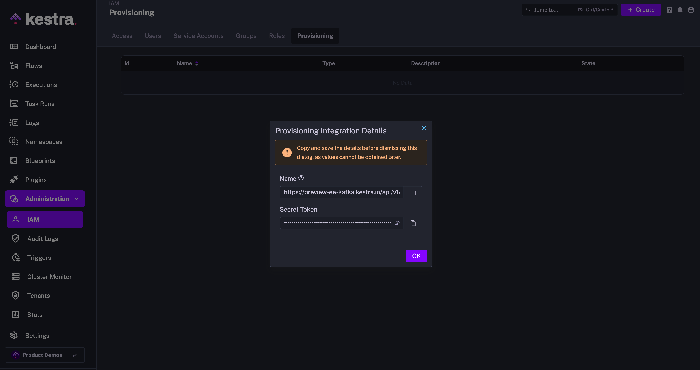
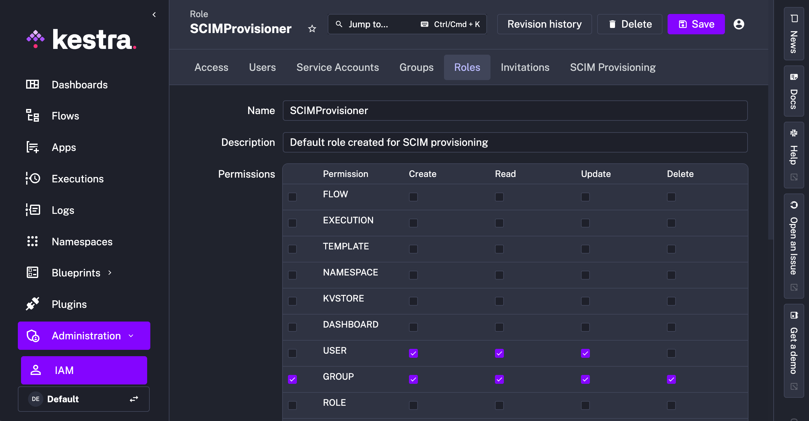
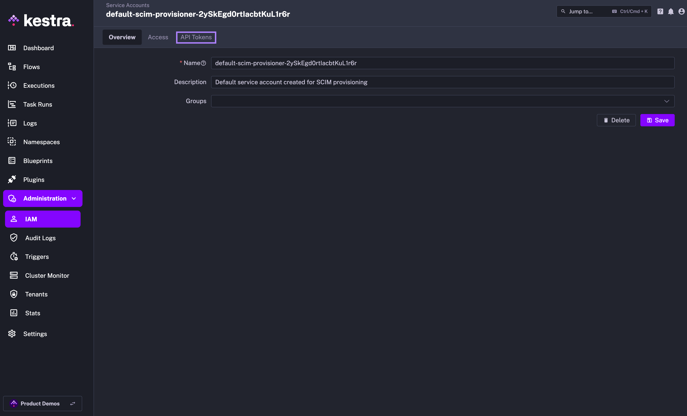
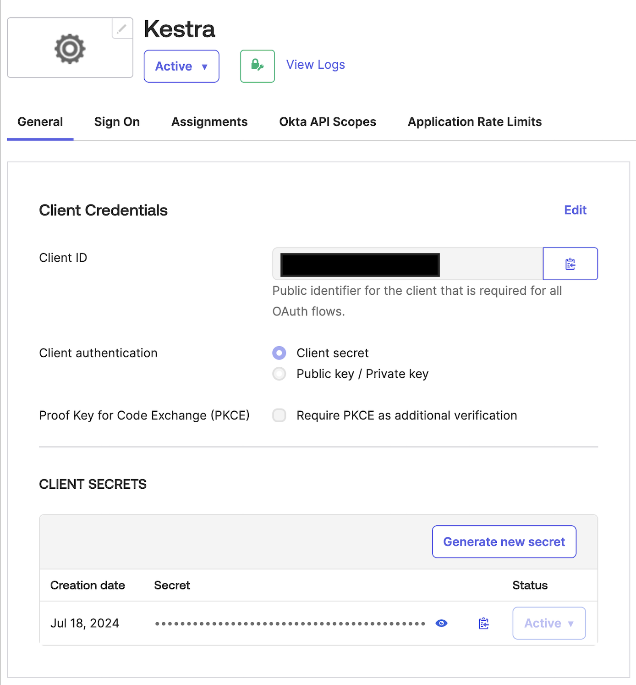
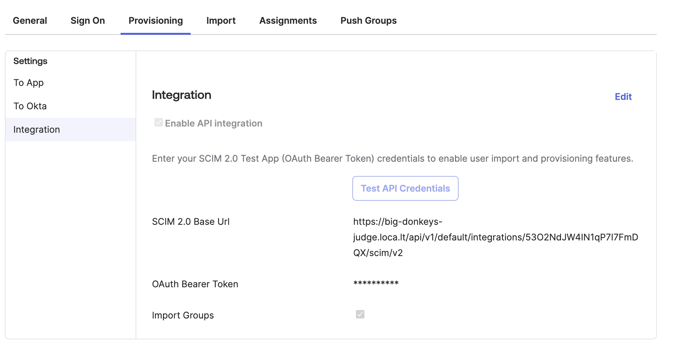

Sync users and groups from Okta to Kestra using SCIM.

## Prerequisites

- **Okta Account**: An account with administrative privileges is required to configure SCIM provisioning.
- **Enable multi-tenancy in Kestra**: Tenants must be enabled in Kestra to support SCIM provisioning. You can enable tenants by setting the `kestra.ee.tenants.enabled` configuration property to `true`:

```yaml
kestra:
  ee:
    tenants:
      enabled: true
```

:::alert{type="info"}
Tenants are enabled by default. Please refer to the [Migration Guide](../../../../11.migration-guide/v0.23.0/tenant-migration-ee/index.md) to assist with upgrading.
:::

## Kestra SCIM setup: create a new provisioning integration

1. Go to **Settings → Super Admin**, select your tenant from the sidebar, open **IAM**, and click the **SCIM Provisioning** tab.
2. Click **+ Create**.
3. Fill in the following fields:
   - **Name**: Enter a name for the provisioning integration.
   - **Description**: Provide a brief description of the integration.
   - **Provisioning Type**: Only SCIM 2.0 is supported — leave the default selection and click **Save**.

These steps generate a SCIM endpoint URL and a Secret Token. Save both — you will need them in the next steps.



The endpoint should look as follows:

```plaintext
https://<your_kestra_host>/api/v1/<your_tenant>/integrations/integration_id/scim/v2
```

The Secret Token is a long string (approx. 200 characters) used to authenticate requests from Okta to Kestra.

### Enable or disable SCIM integration

You can disable or remove the SCIM integration at any time. When disabled, all incoming requests to that endpoint are rejected.

:::alert{type="info"}
You can disable the integration while configuring Okta, then enable it once setup is complete.
:::

### IAM role and service account

When creating a new Provisioning Integration, Kestra will automatically create two additional objects:

1. Role `SCIMProvisioner` with the following permissions:
   - `GROUPS`: `CREATE`, `READ` `UPDATE`, `DELETE`
   - `USERS`: `CREATE`, `READ`, `UPDATE`
   - `BINDINGS`: `CREATE`, `READ`, `UPDATE`, `DELETE`
  

2. Service Account with an API Token which was previously displayed as the Secret Token for the integration:
  

:::alert{type="info"}
Why the `SCIMProvisioner` role doesn't have the `DELETE` permission for `USERS`? This is because you cannot delete a user through our SCIM implementation. Users are global and SCIM provisioning is per tenant. When we receive a `DELETE` query for a user, we remove their tenant access but the user itself remains in the system.
:::

## Okta SCIM setup

1. Navigate to Okta Admin Console → Applications → Applications and click **Create App Integration**:
   - Sign-in Method: **OIDC - OpenID Connect**
   - Application Type: Web Application
   - Name: `Kestra`
   - Grant Type: Client Credentials
   - Sign-in redirect URIs: `http://<kestra-hostname>/oauth/callback/okta`
   - Sign-out redirect URIs: `http://<kestra-hostname>/logout`

   Note the client ID and client secret once the application is created.

   

2. Add the client credentials to your Kestra Micronaut configuration, and enter the SCIM endpoint URL and token provided by Kestra:

    ```yaml
    micronaut:
      security:
        oauth2:
          enabled: true
          clients:
            okta:
              client-id: “CLIENT_ID”
              client-secret: “CLIENT-SECRET”
              openid:
                issuer: “https://{okta-account}.okta.com/”
    ```

3. In Okta, navigate to **Applications → Applications → Browse App Catalog**, search for **SCIM 2.0**, and select **SCIM 2.0 Test App (OAuth Bearer Token)**. In Sign-in options, select **Secure Web Authentication**, then click **Done**. Select the new integration, open the **Provisioning** tab, and enter the Kestra SCIM endpoint URL in the Base URL field and the Secret Token in the **OAuth Bearer Token** field. Click **Test API Credentials** to verify.

   

4. Select **Push Groups** and choose the groups to sync to Kestra. Run a test to verify the mappings.

5. Enable the provisioning integration toggle in the Kestra UI to begin automatic synchronization.

## Additional resources

- [Okta SCIM Documentation](https://developer.okta.com/docs/reference/scim/)
