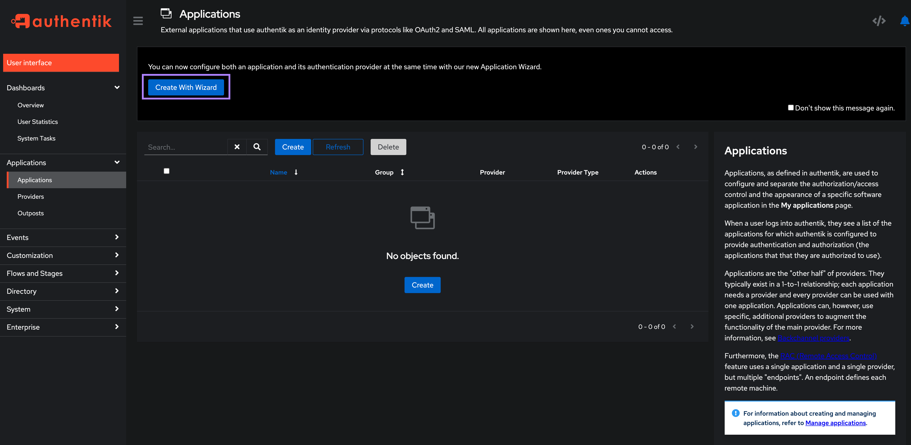
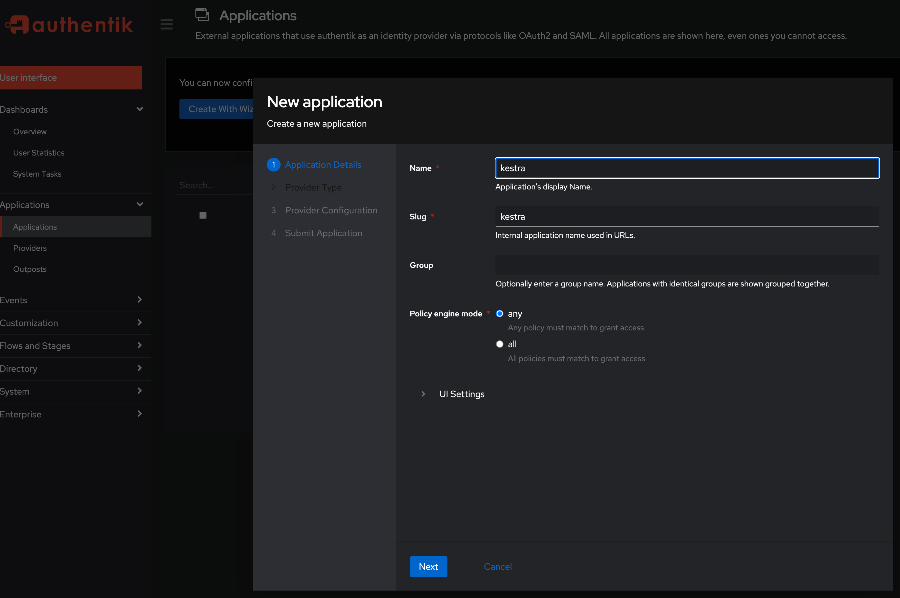
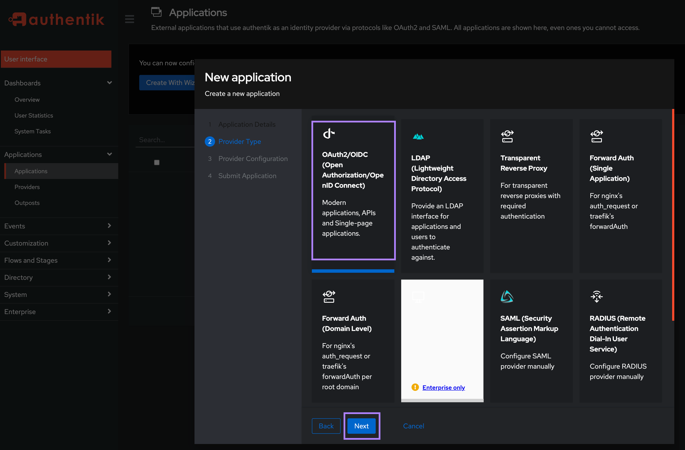
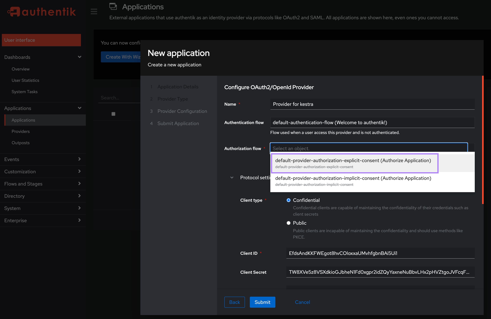
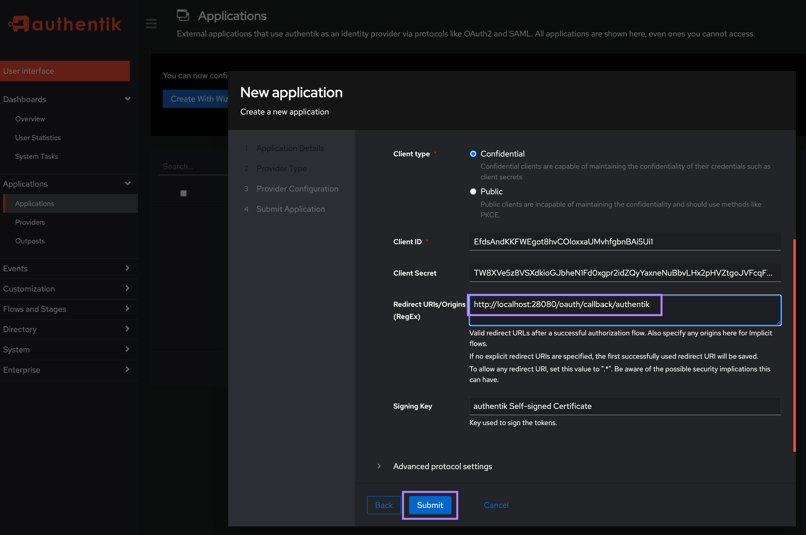

Set up authentik SSO to manage authentication for users.

## Configure authentik SSO

In conjunction with SSO, check out the [authentik SCIM provisioning guide](../../scim/authentik/index.md).

### Install authentik

Authentik provides a simple docker-compose installer for testing purposes. Follow [the instructions](https://docs.goauthentik.io/docs/installation/docker-compose) and click on the [initial setup URL](http://docker.for.mac.localhost:9000/if/flow/initial-setup/) to create your first user.


### Create Application and SSO Provider in authentik

On the left-hand side, select **Applications → Applications**. For simplicity, we’ll use the **Create with Wizard** button, as this will create both an application and a provider.



On the **Application Details** screen, fill in the application `name` and `slug`. Set both here to `kestra` and click `Next`.



On the **Provider Type** screen, select **OAuth2/OIDC** and click **Next**.



On the **Provider Configuration** screen:
1. In the **Authentication flow** field, select “default-authentication-flow (Welcome to authentik!)”.
2. In the **Authorization flow** field, select “default-provider-authorization-explicit-consent (Authorize Application)”.

3. Keep the Client type as **Confidential**. Under the **Redirect URIs/Origins (RegEx)**, enter your Kestra host's `/oauth/callback/authentik` endpoint in the format `http://<kestra_host>:<kestra_port>/oauth/callback/authentik` (e.g., http://localhost:8080/oauth/callback/authentik) and then `Submit` the Application.


Note the `Client ID` and `Client Secret` as you will need these to configure Kestra in the next step.

### Configure Authentik SSO in Kestra Settings

With the above Client ID and Secret, add the following in the `micronaut` configuration section:

```yaml
        micronaut:
          security:
            oauth2:
              enabled: true
              clients:
                authentik:
                  clientId: "CLIENT_ID"
                  clientSecret: "CLIENT_SECRET"
                  openid:
                    issuer: "http://localhost:9000/application/o/kestra/"
```

You may need to adjust the above `issuer` URL if you named your application something other than `kestra`. Make sure to update that URL to match your application name `http://localhost:9000/application/o/<application_name>/`.

### Configure a Default Role for your SSO users in Kestra Settings

To ensure that your SSO users have initial permissions within the Kestra UI, set up a default role. Add the following to the `kestra.security` section of your configuration:

```yaml
kestra:
  security:
    defaultRole:
      name: default_admin_role
      description: "Default Admin Role"
      permissions:
        FLOW:
          - VIEW
          - LIST
          - CREATE
          - UPDATE
          - DELETE
          - EXECUTE
          - DISABLE
          - ENABLE
          - VALIDATE
          - EXPORT
          - IMPORT
        EXECUTION:
          - VIEW
          - LIST
          - UPDATE
          - DELETE
          - RESTART
          - KILL
          - REPLAY
          - PAUSE
          - RESUME
          - CHANGE_LABELS
          - ACCESS_LOGS
          - ACCESS_OUTPUTS
          - ACCESS_FILES
          - EXPORT
          - UNQUEUE
          - FORCE_RUN
          - FOLLOW
        NAMESPACE:
          - VIEW
          - LIST
          - CREATE
          - UPDATE
          - DELETE
          - MANAGE_FILES
          - EXPORT_PLUGIN_DEFAULTS
          - IMPORT_PLUGIN_DEFAULTS
        SECRET: ["VIEW", "LIST", "UPDATE", "DELETE"]
        KVSTORE: ["VIEW", "LIST", "CREATE", "UPDATE", "DELETE"]
        BLUEPRINT: ["VIEW", "LIST", "CREATE", "UPDATE", "DELETE"]
        ROLE: ["VIEW", "LIST", "CREATE", "UPDATE", "DELETE"]
        GROUP: ["VIEW", "LIST", "CREATE", "UPDATE", "DELETE", "MANAGE_MEMBERS"]
        USER: ["VIEW", "LIST", "CREATE", "UPDATE", "DELETE", "MANAGE_GROUP_MEMBERSHIP"]
        BINDING: ["VIEW", "LIST", "CREATE", "DELETE"]
        AUDITLOG: ["VIEW", "LIST", "EXPORT"]
  ee:
    tenants:
      enabled: true
      defaultTenant: false
```

:::alert{type="info"}
Place `defaultRole` under `kestra.security`, not under `micronaut.security`. The example above grants broad access — adjust the action lists to match the permissions your users actually need in production.
:::
