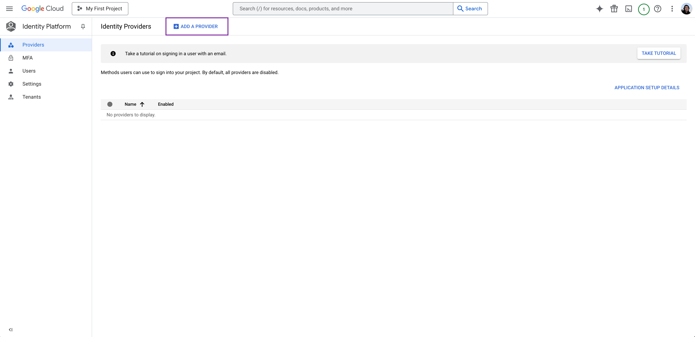
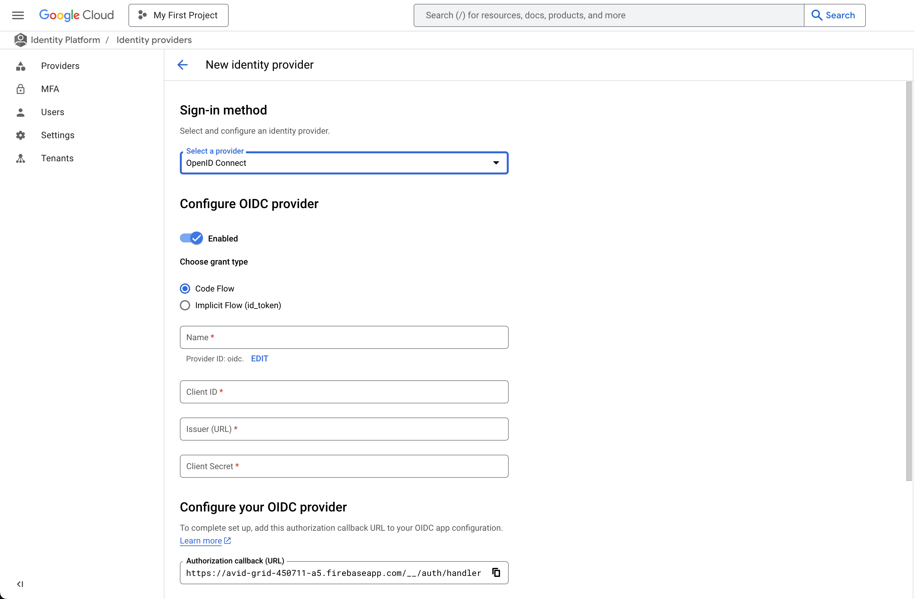

Authenticate Kestra users with their Google accounts using Google Identity Platform and OIDC.

## Prerequisites

- A Google Cloud project with billing enabled.
- Sufficient permissions to configure Identity Platform and manage identity providers.

See the [Google OIDC setup documentation](https://cloud.google.com/identity-platform/docs/web/oidc) for reference.

## Step 1: Enable Identity Platform in Google Cloud

1. Go to the [Identity Platform page](https://console.cloud.google.com/identity) in the Google Cloud Console.
2. Confirm the correct project is selected.

## Step 2: Add an OIDC Provider in Google Cloud

1. In the Identity Platform menu, select **Providers**.
2. Click **Add a Provider** and choose **OpenID Connect**.



3. Configure the OIDC Provider:
   - **Grant type**: Select the Code Flow grant type.
   - **Provider Name**: Enter a display name for the OIDC provider.
   - **Client ID**: Enter the **Client ID** obtained from Google.
   - **Client Secret**: Enter the **Client Secret** associated with the Client ID.
   - **Issuer URL**: Provide the **Issuer URL** (e.g., `https://accounts.google.com`).
   - **Scopes**: Specify any additional scopes required by your application.



4. Click **Save** to add the provider.

## Step 3: Configure Kestra

Add the following to your [Kestra Security and Secrets configuration](../../../../configuration/05.security-and-secrets/index.md):

```yaml
 micronaut:
  security:
    oauth2:
      enabled: true
      clients:
        google:
          client-id: "{{ clientId }}"
          client-secret: "{{ clientSecret }}"
          openid:
            issuer: 'https://accounts.google.com'
```
Replace `clientId` and `clientSecret` with the values from the Google Identity Platform, then restart Kestra.

## Additional resources

- [Managing SAML and OIDC Providers Programmatically](https://cloud.google.com/identity-platform/docs/managing-providers-programmatically)
- [Identity Platform Documentation](https://cloud.google.com/identity-platform/docs)
