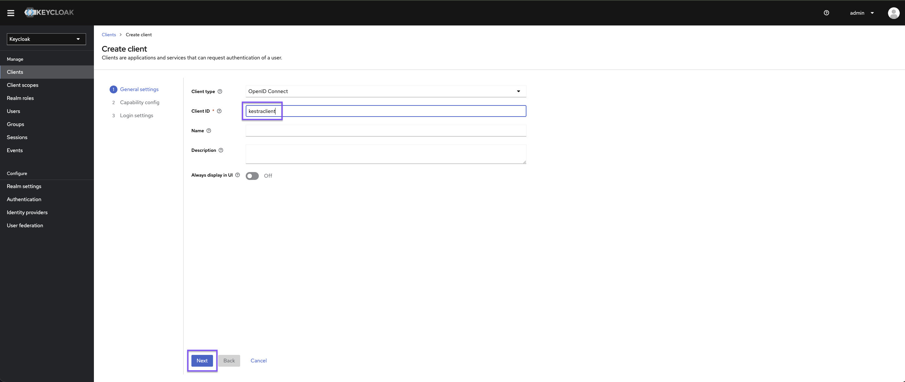
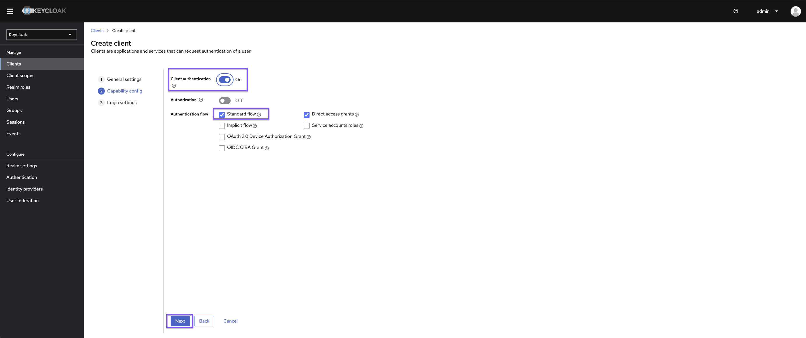
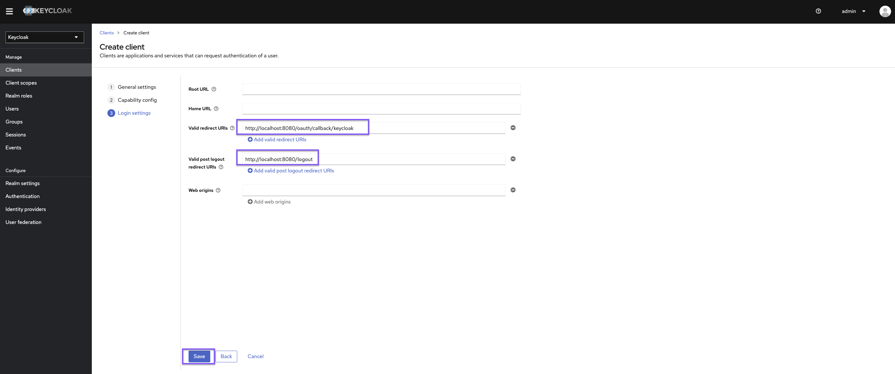
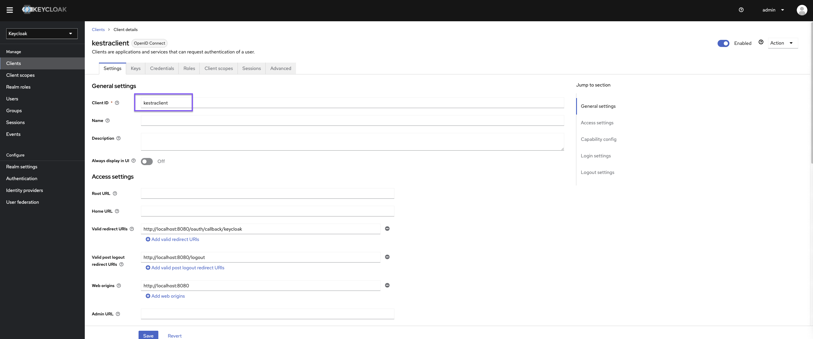
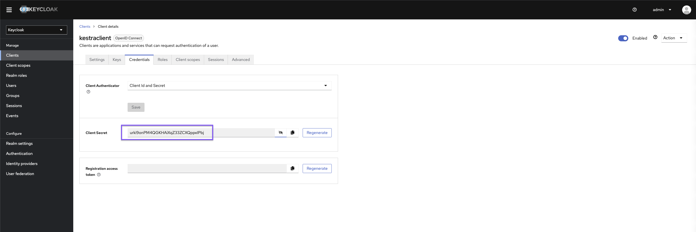

Set up Keycloak SSO to manage authentication for users.

## Configure Keycloak SSO

In conjunction with SSO, check out the [Keycloak SCIM provisioning guide](../../scim/keycloak/index.md).

## Start a Keycloak service

If you don't have a Keycloak server already running, you can use a managed service like [Cloud IAM](https://app.cloud-iam.com).

You can follow the steps described in the [Keycloak tutorial documentation](https://documentation.cloud-iam.com/get-started/complete-tutorial.html) to deploy a managed Keycloak cluster for free.

## Configure Keycloak client

Once in Keycloak, create a new client:




Set `https://{{ yourKestraInstanceURL }}/oauth/callback/keycloak` as the valid redirect URI and `https://{{ yourKestraInstanceURL }}/logout` as the valid post-logout redirect URI.



## Kestra Configuration

```yaml
micronaut:
  security:
    oauth2:
      enabled: true
      clients:
        keycloak:
          client-id: "{{clientId}}"
          client-secret: "{{clientSecret}}"
          openid:
            issuer: "https://{{keyCloakServer}}/realms/{{yourRealm}}"
    endpoints:
      logout:
        get-allowed: true
```

You can retrieve the `clientId` and `clientSecret` via Keycloak user interface




Don't forget to set a default role in your [Kestra configuration](../../../../configuration/index.md) to streamline the process of onboarding new users.

```yaml
kestra:
  security:
    defaultRole:
      name: Editor
      description: Default Editor role
      permissions:
        FLOW: ["CREATE", "READ", "UPDATE", "DELETE"]
        EXECUTION:
          - CREATE
          - READ
          - UPDATE
          - DELETE
```

:::alert{type="info"}
Note: depending on the Keycloak configuration, you might want to tune the issuer URL.
:::

For more configuration details, refer to the [Keycloak OIDC configuration guide](https://guides.micronaut.io/latest/micronaut-oauth2-keycloak-gradle-java.html).

## Manage Groups via OIDC Claims

If you are unable to use [SCIM with Keycloak](../../scim/keycloak/index.md), you can configure Kestra to source user roles and groups from OIDC claims. In this setup, your OIDC provider (e.g., Keycloak) acts as the single source of truth for user membership and roles. This method requires exposing roles via a claim in the ID Token.

To get started, you must first have a `kestra` realm and `kestra` client configured in Keycloak. Once complete, you must add the `roles` claim to the ID Token; Kestra uses the ID Token so this must be enabled. To do this in Keycloak, follow these steps:

1. Select **Client Scopes**
2. Click on the **roles** scope
3. Select **Mappers**
4. Click on **client roles**
5. Enable **Add to ID Token**

In case the interface changes to Keycloak, refer to their documentation for [managing resources and scopes](https://www.keycloak.org/docs/latest/authorization_services/#_resource_overview).

### Configure Kestra

After adding or updating your roles, configure Kestra to fetch the `roles` scope like in following Micronaut configuration; make note of the added `scopes` parameter where the information must be added:

```yaml
micronaut:
  security:
    oauth2:
      enabled: true
      clients:
        keycloak:
          client-id: "kestra"
          client-secret: "my-secret"
          openid:
            issuer: "http://localhost:8088/realms/kestra"
          scopes: ["openid", "profile", "email", "roles"] # Add this to enable role mapping
      endpoints:
        logout:
          get-allowed: true
```

With this configured, you then need to update the `kestra` property in your configuration file to synchronize groups from this claim with the `groups-claim-path`:

```yaml
kestra:
  security:
    oidc:
      groups-claim-path: "resource_access.kestra.roles"
```

Once the synchronization connection is made, you can use OAuth claims to source user roles with Keycloak as the single source of truth.
