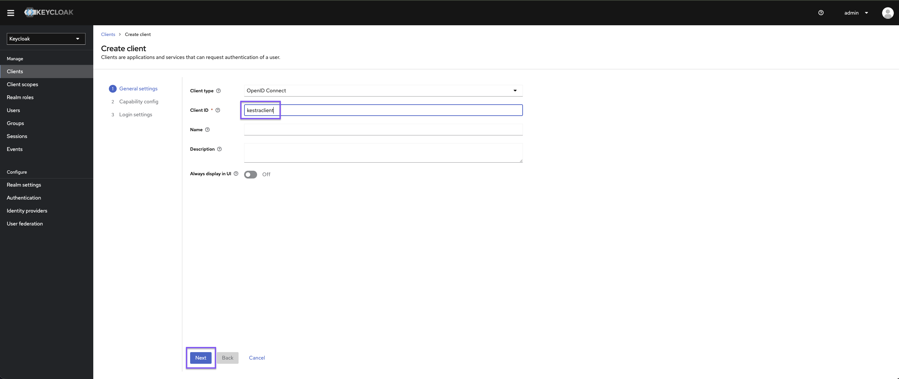
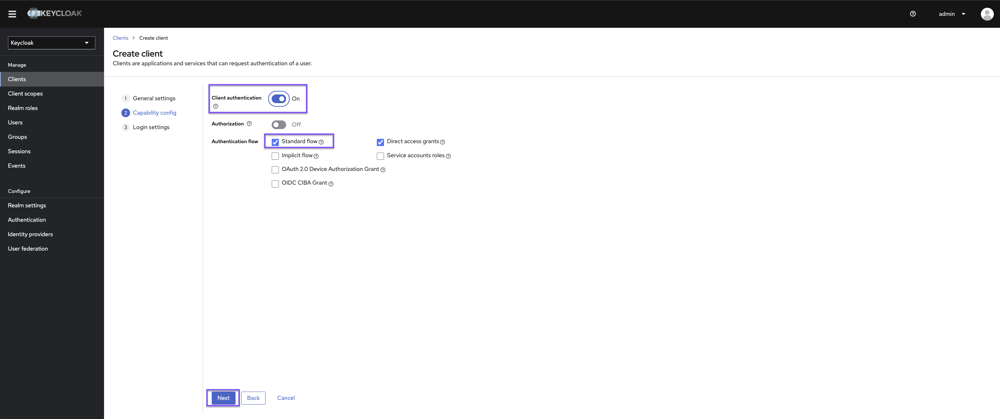
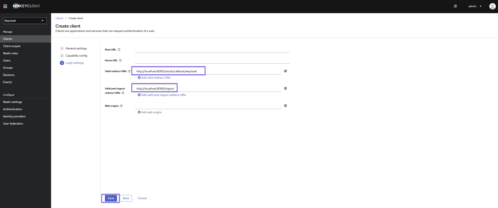
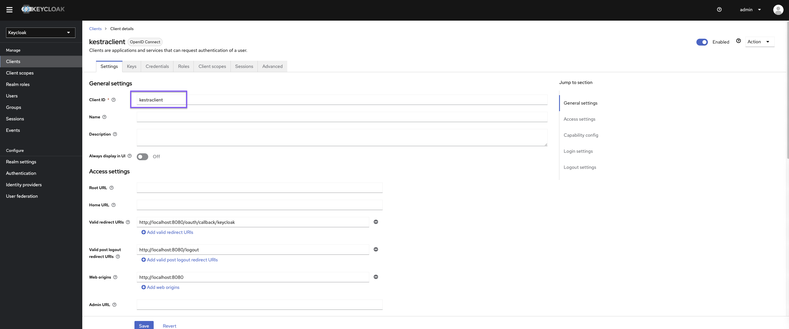
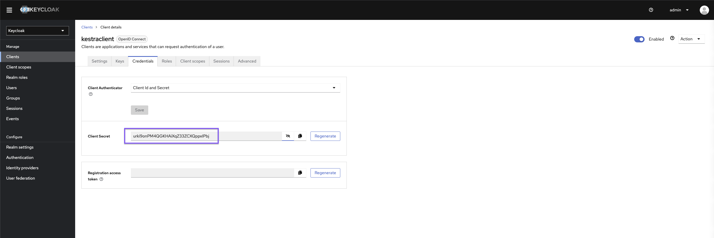
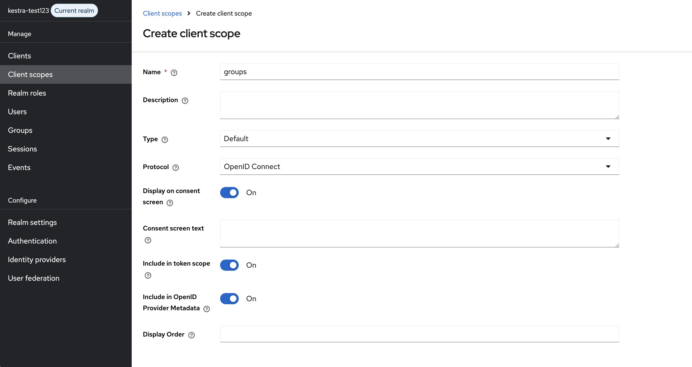
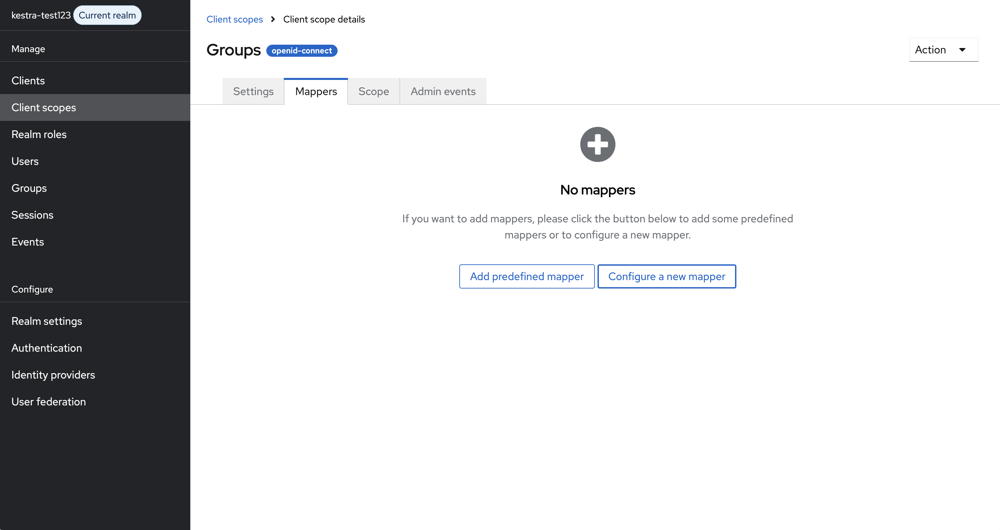
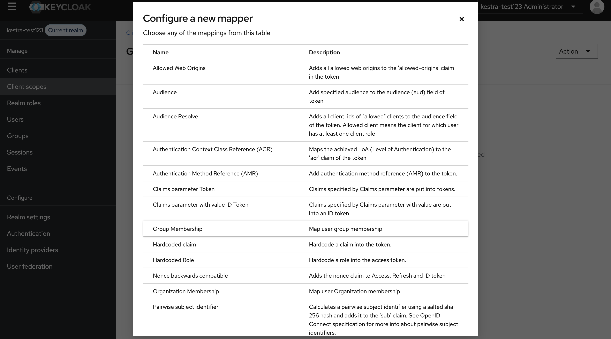
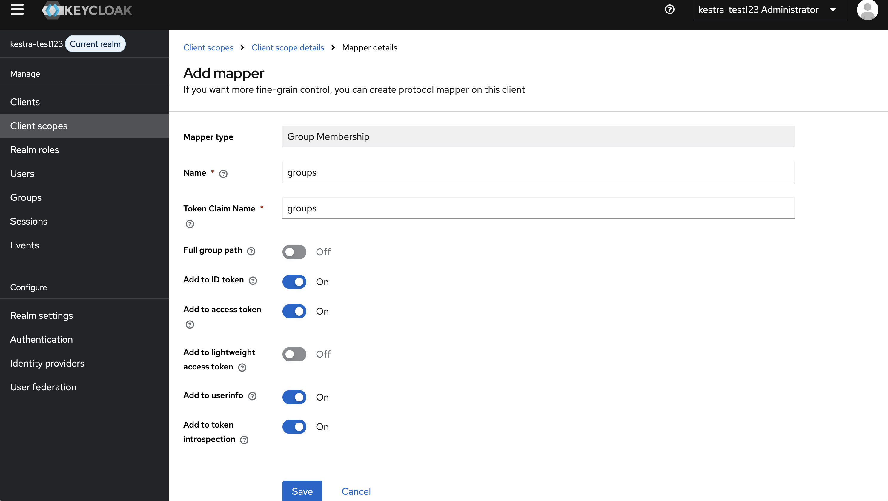
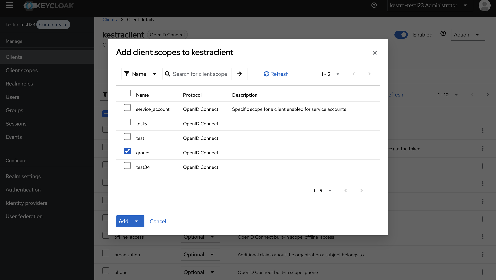

Set up Keycloak SSO to manage authentication for users.

## Configure Keycloak SSO

In conjunction with SSO, check out the [Keycloak SCIM provisioning guide](../../scim/keycloak/index.md).

## Start a Keycloak service

If you don't have a Keycloak server already running, you can use a managed service like [Cloud IAM](https://app.cloud-iam.com).

You can follow the steps described in the [Keycloak tutorial documentation](https://documentation.cloud-iam.com/get-started/complete-tutorial.html) to deploy a managed Keycloak cluster for free.

## Configure Keycloak client

Once in Keycloak, create a new client:




Set `https://{{ yourKestraInstanceURL }}/oauth/callback/keycloak` as the valid redirect URI and `https://{{ yourKestraInstanceURL }}/logout` as the valid post-logout redirect URI.



## Kestra Configuration

```yaml
micronaut:
  security:
    oauth2:
      enabled: true
      clients:
        keycloak:
          client-id: "{{clientId}}"
          client-secret: "{{clientSecret}}"
          openid:
            issuer: "https://{{keyCloakServer}}/realms/{{yourRealm}}"
    endpoints:
      logout:
        get-allowed: true
```

You can retrieve the `clientId` and `clientSecret` via Keycloak user interface




Don't forget to set a default role in your [Kestra configuration](../../../../configuration/index.md) to streamline the process of onboarding new users.

```yaml
kestra:
  security:
    defaultRole:
      name: Editor
      description: Default Editor role
      permissions:
        FLOW: ["CREATE", "READ", "UPDATE", "DELETE"]
        EXECUTION:
          - CREATE
          - READ
          - UPDATE
          - DELETE
```

:::alert{type="info"}
Note: depending on the Keycloak configuration, you might want to tune the issuer URL.
:::

For more configuration details, refer to the [Keycloak OIDC configuration guide](https://guides.micronaut.io/latest/micronaut-oauth2-keycloak-gradle-java.html).

## Manage Groups via OIDC Claims

If you are unable to use [SCIM with Keycloak](../../scim/keycloak/index.md), you can configure Kestra to source user groups from OIDC claims. In this setup, Keycloak acts as the single source of truth for user group membership. This method requires creating a `groups` client scope that exposes group membership via a claim in the ID Token.

### Create a Groups Client Scope

In Keycloak, go to **Client Scopes** and click **Create Client Scope**. Name it `groups`, set Type to **Default**, and keep Protocol as **OpenID Connect**.



### Add a Group Membership Mapper

In the newly created `groups` scope, go to the **Mappers** tab and click **Configure a new mapper**.



Select **Group Membership** from the list of available mapper types.



Configure the mapper with the following settings:
- **Name**: `groups`
- **Token Claim Name**: `groups`
- **Full group path**: Off
- **Add to ID token**: On



### Add the Client Scope to Your Client

Go to **Clients**, select your Kestra client, and add the `groups` client scope.



### Configure Kestra

Update your Micronaut configuration to include `groups` in the scopes:

```yaml
micronaut:
  security:
    oauth2:
      enabled: true
      clients:
        keycloak:
          client-id: "{{clientId}}"
          client-secret: "{{clientSecret}}"
          openid:
            issuer: "https://{{keyCloakServer}}/realms/{{yourRealm}}"
          scopes: ["openid", "profile", "email", "groups"]
    endpoints:
      logout:
        get-allowed: true
```

Then configure Kestra to synchronize groups from the `groups` claim:

```yaml
kestra:
  security:
    oidc:
      groups-claim-path: "groups"
```

Once configured, Kestra will source user groups from the `groups` claim in the ID Token, with Keycloak as the single source of truth.
