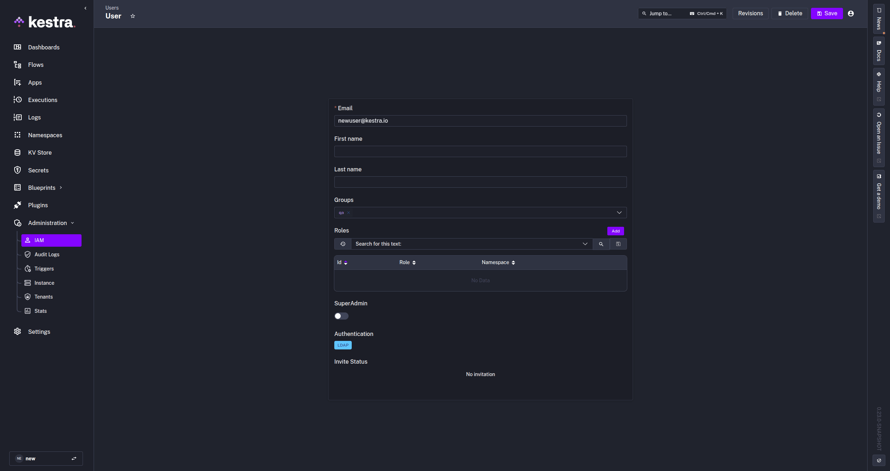

Enable LDAP authentication in Kestra to authenticate users against your existing directory and sync group memberships automatically.

## Configure LDAP authentication

Enable LDAP authentication in Kestra to authenticate users against your existing directory, sync group memberships, or both. You can also use LDAP solely for group sync while keeping an existing SSO provider for login.

<div class="video-container">
  <iframe src="https://www.youtube.com/embed/lGdoZf2SZrE?si=uPe9e-oO6e7NgKMM" title="YouTube video player" allow="accelerometer; autoplay; clipboard-write; encrypted-media; gyroscope; picture-in-picture; web-share" referrerpolicy="strict-origin-when-cross-origin" allowfullscreen></iframe>
</div>

:::alert{type="warning"}
LDAP is a licensed feature. If `micronaut.security.ldap.default` is configured but your license does not include LDAP, Kestra will refuse to start with the error: `LDAP is not supported by your license`. Contact your Kestra account team to enable it.
:::

## What is LDAP

Lightweight directory access protocol (LDAP) allows applications to quickly query user information. Organizations use directories to store usernames, passwords, email addresses, and other static data. LDAP is an open, vendor-neutral protocol for accessing and managing that data.

With Kestra, you can use an existing LDAP directory to authenticate users and sync them to groups with specific access permissions.

## Configuration

LDAP is configured under the security context of your [Kestra Security and Secrets configuration](../../../../configuration/05.security-and-secrets/index.md) file.

[LDAP with Micronaut](https://micronaut-projects.github.io/micronaut-security/4.11.3/guide/#ldap) supports `context`, `search`, and `groups` as core configuration properties supported out of the box. These properties define the connection context, user attribute mapping, and group filtering needed to synchronize users and their group memberships with Kestra.

The `user-attributes` section maps LDAP attributes such as `givenName`, `sn`, and `mail` to the corresponding Kestra user properties (first name, last name, and email).

Below are example configurations with Kestra-specific properties on top of the Micronaut configuration.

The `mode` property controls how Kestra uses the LDAP connection:

| Mode | Description |
|---|---|
| `AUTHENTICATION` | LDAP handles user login only. No group sync. **This is the default.** |
| `AUTHENTICATION_AND_GROUP_SYNC` | LDAP handles both user login and group membership sync. |
| `GROUP_SYNC_ONLY` | LDAP is used only to resolve group memberships. Users log in via an existing SSO provider. |

The examples below extend the base Micronaut LDAP configuration with these Kestra-specific mappings.

### Unix configuration

```yaml
micronaut:
  security:
    ldap:
      default:
        mode: AUTHENTICATION_AND_GROUP_SYNC  # or AUTHENTICATION to skip group sync
        user-attributes:
          firstName: givenName
          lastName: sn
          email: mail
        context:
          server: "ldap://localhost:389"
          manager-dn: "cn=admin,dc=example,dc=org"
          manager-password: "LDAP_ADMIN_PASSWORD"
        search:
          base: "ou=users,dc=example,dc=org"
          filter: "(mail={0})"
          attributes:
            - "uid"
            - "givenName"
            - "sn"
            - "mail"
        groups:
          enabled: true
          base: "ou=groups,dc=example,dc=org"
          filter: "{&(objectClass=posixGroup)(memberUid={0})}"
          filter-attribute: uid
          attribute: cn
```

### Windows configuration

```yaml
micronaut:
  security:
    ldap:
      default:
        enabled: true
        mode: AUTHENTICATION_AND_GROUP_SYNC  # or AUTHENTICATION to skip group sync
        user-attributes:
          firstName: givenName
          lastName: sn
          email: userPrincipalName
        context:
          server: "ldaps://<hostname>:636" # ldap://<hostname>:389 for non-TLS
          manager-dn: "CN=********,CN=Users,DC=domain,DC=local"
          manager-password: "********"
        search:
          base: "DC=domain,DC=local"
          filter: "(userPrincipalName={0})"
          attributes:
            - "sAMAccountName"
            - "givenName"
            - "sn"
            - "userPrincipalName"
        groups:
          enabled: true
          base: "DC=domain,DC=local"
          filter: "(&(objectClass=group)(member={0}))"
          filter-attribute: dn
          attribute: cn
```

Key points for Windows Active Directory:

- **Login format**: the `userPrincipalName` filter requires users to log in with their full UPN, e.g. `john@domain.local`. If your users expect to log in with just their short username (e.g. `john`), change the filter to `(sAMAccountName={0})` and update the `email` attribute mapping accordingly.
- **Search base**: setting `search.base` and `groups.base` to the root domain (`DC=domain,DC=local`) covers users and groups across all OUs. Narrow these to a specific OU (e.g. `OU=Engineering,DC=domain,DC=local`) if you want to restrict access to a subset of your directory.
- **Group filter attribute**: AD `member` attributes store full DNs, so `filter-attribute: dn` is required. Without it, Micronaut defaults to `cn` and group membership lookups will silently return no results.
- **TLS**: use `ldaps://` on port 636 in production. Plain `ldap://` on port 389 sends credentials in cleartext. If your AD uses a self-signed certificate, you must add it to the JVM truststore or configure certificate trust in your Kestra deployment.

#### Finding Windows Active Directory values

Use the following PowerShell commands on your Windows domain controller to look up the values needed for the configuration above.

**LDAP server hostname** (`context.server`)

```powershell
(Get-ADDomainController).HostName
```

Use the returned hostname as `ldaps://<hostname>:636` for TLS or `ldap://<hostname>:389` for non-TLS.

**Manager DN** (`context.manager-dn`)

```powershell
([adsisearcher]"(sAMAccountName=Administrator)").FindOne().Properties.distinguishedname
```

Replace `Administrator` with the service account you intend to use as the bind user. The returned distinguished name (DN) is the value for `manager-dn`.

**User distinguished name**

To look up the DN of a specific user (useful for verifying your `search.base`):

```powershell
Get-ADUser -Identity "JohnDoe" | Select-Object Name, DistinguishedName
```

**Groups for a user**

To list the groups a user belongs to (useful for planning your `groups.base` and `groups.filter`):

```powershell
Get-ADPrincipalGroupMembership -Identity "JohnDoe" | Select-Object Name, DistinguishedName
```

**Members of a group**

To verify the members of a specific group:

```powershell
Get-ADGroupMember -Identity "CN=Auto,OU=Distro,OU=Groups,DC=kestra,DC=local" | Select-Object sAMAccountName, Name
```

Replace the identity string with the DN of your target group.

### Group sync with SSO (GROUP_SYNC_ONLY)

If your users already authenticate via SSO, Basic auth, or Passwordless, you can use LDAP solely to resolve group memberships without changing how users log in. Set `mode: GROUP_SYNC_ONLY` and configure the `groups` block. No `user-attributes` mapping is required.

```yaml
micronaut:
  security:
    ldap:
      default:
        mode: GROUP_SYNC_ONLY
        context:
          server: "ldap://localhost:389"
          manager-dn: "cn=admin,dc=kestra,dc=io"
          manager-password: "LDAP_ADMIN_PASSWORD"
        search:
          base: "ou=users,dc=kestra,dc=io"
          filter: "(mail={0})"
        groups:
          enabled: true
          base: "ou=groups,dc=kestra,dc=io"
          filter: "(member={0})"
          attribute: cn
```

With this configuration:
- Users log in using their SSO provider. LDAP credentials are never checked.
- At each login, Kestra queries the LDAP directory for the user's group memberships and merges them with any groups sourced from OIDC claims.
- Groups found in LDAP are synced to Kestra using the same rules as standard LDAP group sync — new groups are created automatically, and membership is updated on login.

Two `groups` properties control how Kestra reads group entries from the directory:
- `filter`: the LDAP search filter used to find groups for a user. `{0}` is replaced with the user's distinguished name (DN).
- `attribute`: the attribute on the group entry whose value becomes the Kestra group name. Defaults to `cn`.
- `filter-attribute`: the user entry attribute substituted into `{0}` in the group filter. Use `dn` for directories that store full DNs in group membership attributes (common in Active Directory). Use `uid` for POSIX-style directories.

:::alert{type="info"}
`GROUP_SYNC_ONLY` mode requires that the user already exists in Kestra (created on first login). LDAP group sync fires on every subsequent login.
:::

:::alert{type="warning"}
If the LDAP server is unreachable or misconfigured, group sync fails silently — the user logs in successfully but receives no LDAP-sourced groups. Check server connectivity and `groups` configuration if group assignments are not appearing after login.
:::

## LDAP users in Kestra

Once LDAP is configured, when a user logs into Kestra for the first time using LDAP authentication, their credentials are validated against the LDAP directory and a corresponding user is created in Kestra. If a matching account already exists, the user is authenticated using their LDAP credentials.

If they are a part of any groups specified in the directory, those groups will be added to Kestra. If the group already exists in Kestra, they will be automatically added. If a user is added to a group after their initial login, they must log out and log back in for the new group assignment to sync, as synchronization occurs only at login. Any user authenticated via LDAP will show `LDAP` as their Authentication method in the **IAM - Users** tab in Kestra.



Any updates to a user and their group access on the LDAP server will update in Kestra at the next synchronization (typically at the next login).

:::alert{type="info"}
Users who log in via SSO with `GROUP_SYNC_ONLY` mode show their SSO provider as their Authentication method in the IAM Users tab, not `LDAP`. The LDAP connection is used only to resolve group memberships in the background.
:::

:::alert{type="warning"}
If a user is deleted from the LDAP server, they will lose access to Kestra at the next synchronization or login attempt.
:::
