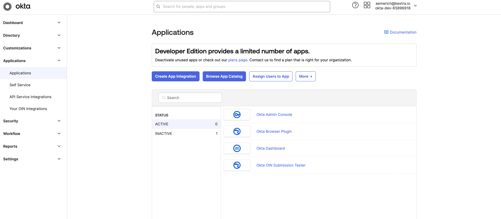
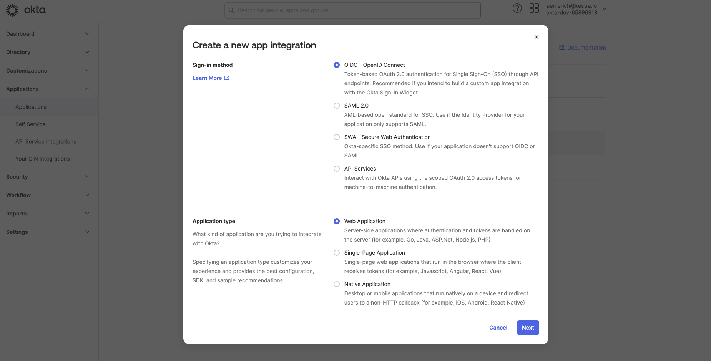
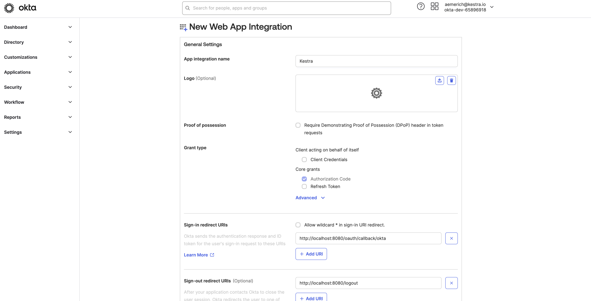
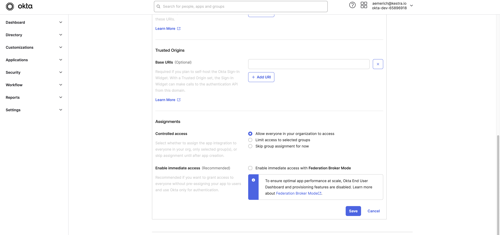
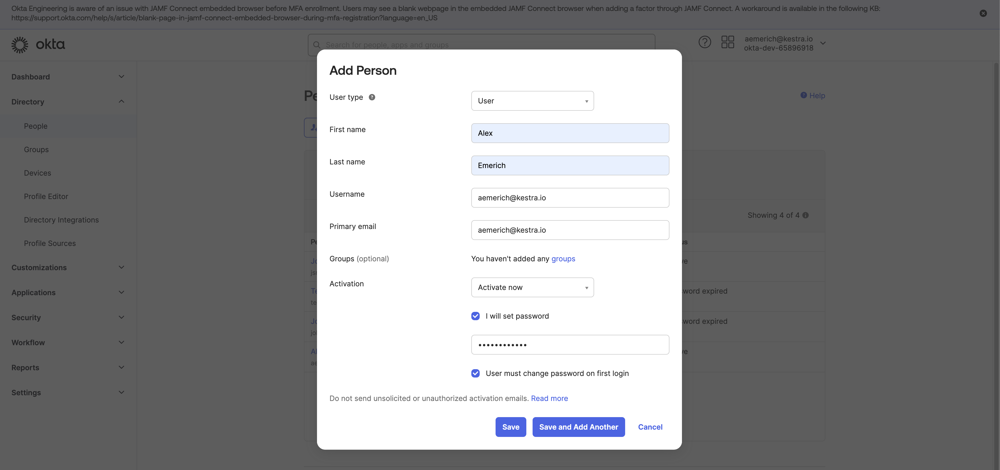
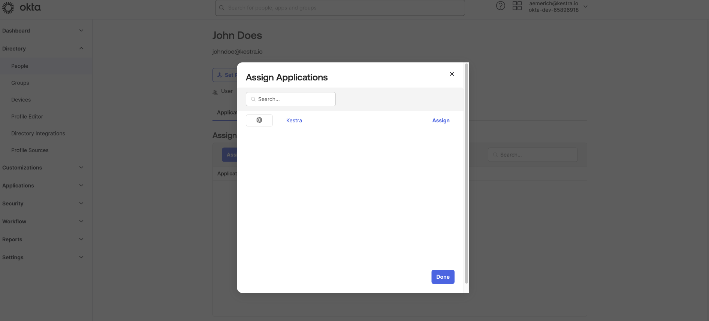
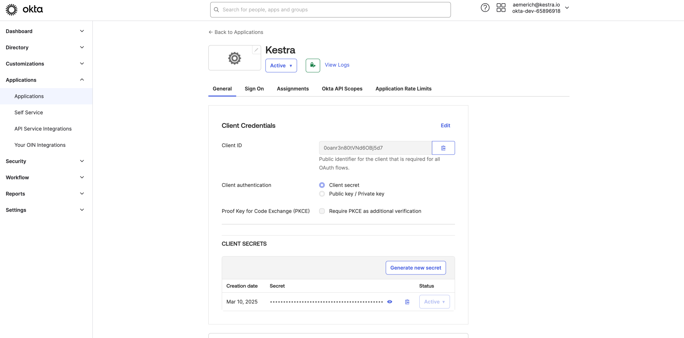
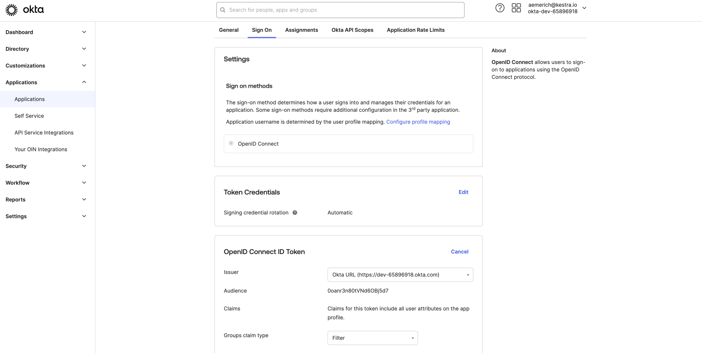
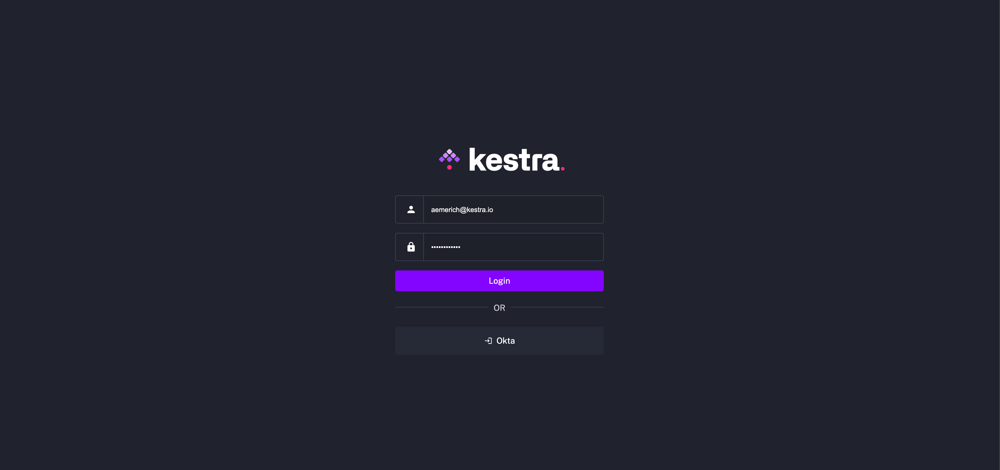
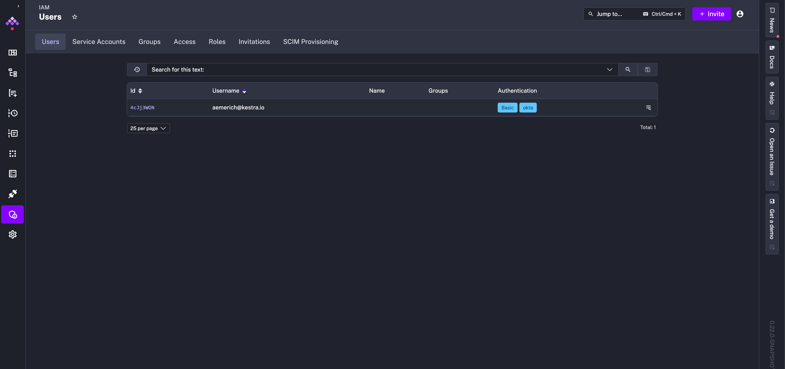

## Prerequisites

- An Okta Developer Account or Organization with administrative access.

For more detail, refer to the [Okta OIDC setup documentation](https://help.okta.com/oie/en-us/content/topics/apps/apps_app_integration_wizard_oidc.htm).

## Step 1: Create an App Integration

Log in to your Okta account and select **Applications** from the left side menu.



Next, select **Create App Integration**, select **OIDC - OpenID Connect** as the sign-in method and **Web Application** as the application type. Select **Next** to configure the general settings of the new web app integration.



## Step 2: Configure the web app integration

In the General Settings, give your App integration a name and select **Authorization Code** as the grant type. Open **Advanced Settings** to configure additional grants — Okta supports direct-auth API grants such as OTP, OOB, MFA OTP, and MFA OOB.



Set the **Sign-in redirect URI** to `http://localhost:8080/oauth/callback/okta` and the **Sign-out redirect URI** to `http://localhost:8080/logout` (adjust to match your environment). Configure optional **Trusted Origins** and **Assignments** as needed.

Set access to **Everyone** or to a more restricted group. Uncheck **Enable immediate access with Federation Broker Mode** to control app access manually. Click **Save**.



## Step 3: Add a test user (optional)

To verify the integration before enabling it for all users, add a test user in **Directory → People → Add Person**. Assign the Kestra application to that user from the user's **Applications** tab.





## Step 4: Connect to Kestra

After saving, Okta redirects you to your integration, where you can find your **Client ID** and **Client Secret**.



After copying your **Client ID** and **Client Secret**, switch to the **Sign On** tab. Under **OpenID Connect ID Token**, change the issuer from Dynamic to your Okta URL. Click **Save** and copy the URL for use in your [Kestra Security and Secrets configuration](../../../../configuration/05.security-and-secrets/index.md).



Add the following configuration to enable Okta as an OIDC provider:

```yaml
 micronaut:
  security:
    oauth2:
      enabled: true
      clients:
        okta:
          client-id: "{{ clientId }}"
          client-secret: "{{ clientSecret }}"
          openid:
            issuer: 'https://<your-domain-id>.okta.com'
```
- Replace `clientId` and `clientSecret` with the values copied from the Okta App integration.
- Replace `issuer` with your issuer URL from the application's sign-on settings.
- Restart Kestra to apply the changes and log in.

On restart, Okta appears as an available login method.



After logging in, go to **IAM → Users** to confirm the user shows both login methods in the **Login & API Tokens** column.


