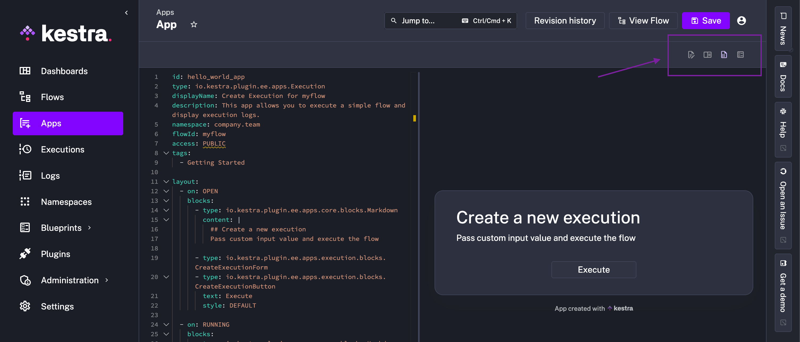
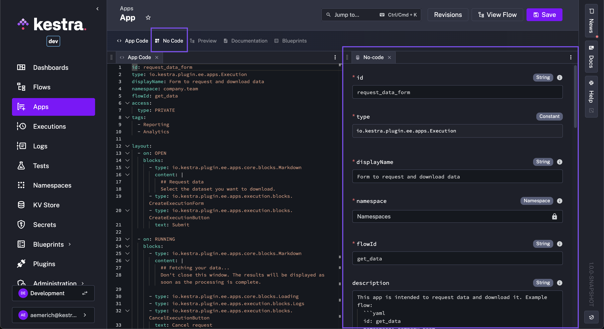
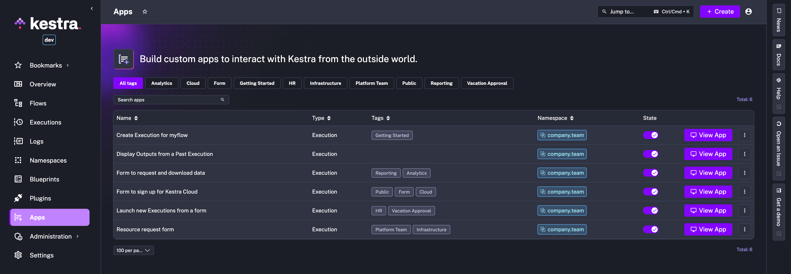
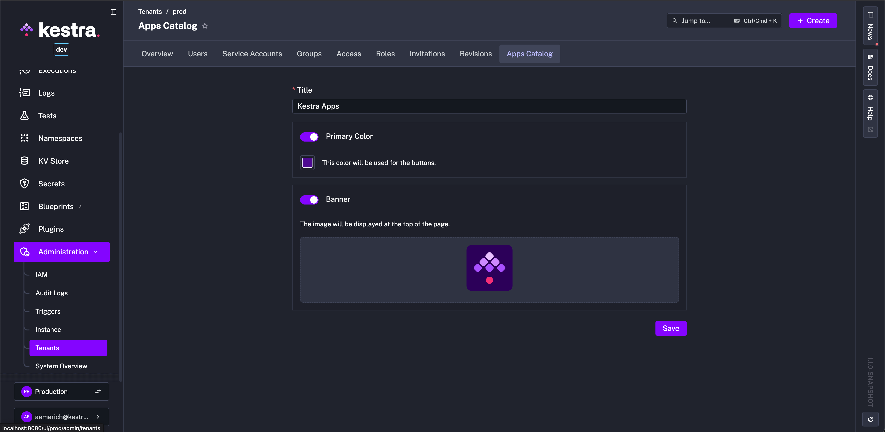
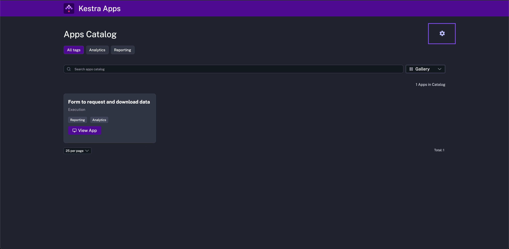
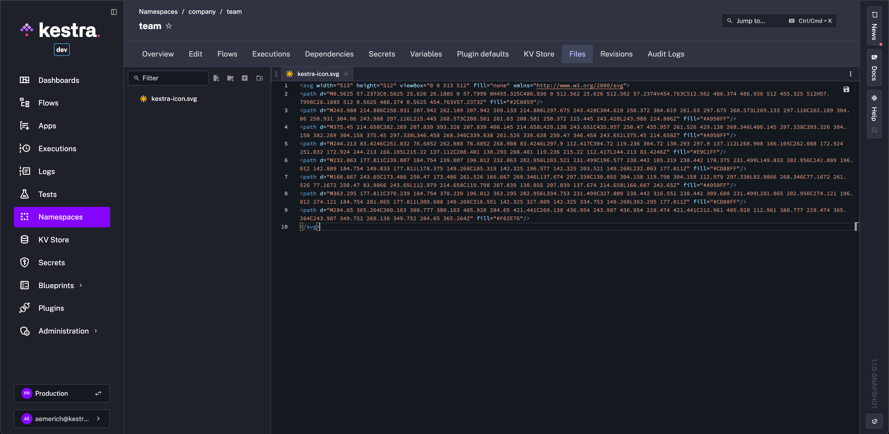
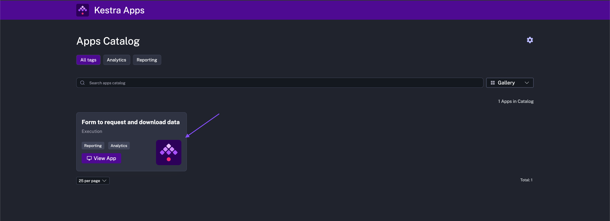

Build custom UIs to interact with Kestra from the outside world.

<div class="video-container">
  <iframe src="https://www.youtube.com/embed/KwBO8mcS3kk?si=VJC5a6YgVECR_bJ3" title="YouTube video player" allow="accelerometer; autoplay; clipboard-write; encrypted-media; gyroscope; picture-in-picture; web-share" referrerpolicy="strict-origin-when-cross-origin" allowfullscreen></iframe>
</div>

## Apps – build frontends for Flows

Apps let you use your Kestra workflows as the backend for custom applications. Within each app, you can specify custom frontend blocks, such as forms for data entry, output displays, approval buttons, or markdown blocks.

**Flows** act as the **backend**, processing data and executing tasks, while **Apps** serve as the **frontend**, allowing anyone to interact with your workflows regardless of their technical background.

Business users can trigger new workflow executions, manually approve workflows that are paused, submit data to automated processes using simple forms, and view the execution results.

You can think of Apps as **custom UIs for flows**. They are useful both for external-facing forms and for internal workflows such as approvals, requests, and guided operations.

---

## Common App use cases

Most Apps fall into one of these two patterns:
- **Execution forms**: users submit a form that starts a new execution with input parameters. For example, a requester can specify resources that need to be provisioned, and those inputs feed directly into a flow.
- **Approval or resume interfaces**: users review a paused execution and approve, reject, or resume it. For example, a platform team can validate a provisioning request before the flow continues.

## App benefits

Apps offer custom UIs on top of your Kestra workflows. Often, workflows are designed for non-technical users, and creating custom frontends for each of these workflows can be a lot of work. Imagine having to build and serve a frontend, connect it to Kestra’s API, validate user inputs, handle responses, manage workflow outputs, and deal with authentication and authorization — all from scratch. Apps generate a custom UI for any flow without custom frontend development.

Here are some common scenarios where a custom UI is useful:

- **Manual Approval**: workflows that need manual approval, such as provisioning resources, granting access to services, deploying apps, validating data results, or reviewing AI-generated outputs.
- **Report Generation**: workflows where business users request data and receive a downloadable CSV or Excel file.
- **IT Helpdesk**: workflows that accept bug reports, feature requests, or other tickets, and automatically forward the ticket to the relevant team.
- **User Feedback & Signups**: workflows that collect feedback or allow users to sign up for events or email lists.
- **Data Entry**: workflows where business users enter data that is processed and either sent back to them or stored in a database.

Apps let non-technical users interact with workflows without editing YAML or flow configuration.

## How App stages map to execution progress

Apps render different blocks based on the current execution state. This is useful when you want the page to guide users through the full lifecycle of a request, from submission to approval to delivery.

| App stage | What the user sees | What usually happens in the flow |
|-----------|--------------------|----------------------------------|
| `OPEN` | The initial form or landing page | No execution exists yet. The user is about to submit a request. |
| `CREATED` | Optional confirmation that the request was accepted | Kestra created the execution and is about to start processing it. |
| `RUNNING` | Progress text, logs, loading indicators, or intermediate outputs | Tasks are actively running. |
| `PAUSE` | Approval or review screen | The flow is waiting on a paused task or a manual decision. |
| `RESUME` | Post-approval confirmation and follow-up details | The paused execution was resumed and continues running. |
| `SUCCESS` | Final outputs, download links, or next-step buttons | The execution completed successfully. |
| `FAILURE`, `ERROR`, `FALLBACK` | Error messages, logs, retry guidance, escalation links | The execution did not complete as expected. |

For example, a VM request app might start with an `OPEN` form, move to `RUNNING` while Kestra validates the request, switch to `PAUSE` while a platform engineer reviews the requested size and environment, then show `SUCCESS` once the VM has been provisioned.

This stage-based layout is what makes Apps easier for non-technical users: they don't need to understand workflow internals, only the current step of their request.

---

## Common App patterns

The examples below are a good starting point when designing your own App:

- **FTP upload portal**: give users a simple upload form while Kestra handles the backend credentials and transfer logic. See the [business user Apps blog example](../../../../blogs/use-case-apps/index.md#requests--review).
- **Self-serve analytics request**: let users choose a dimension and time range, run a query and chart generation flow, and return the generated output on `SUCCESS`. See the [dynamic self-serve example](../../../../blogs/use-case-apps/index.md#dynamic-self-serve).
- **AI-assisted intake or user research assistant**: collect free-form context from a sales, product, or support team member, run an LLM-backed flow, and display the suggested answer or categorization back in the App. See the [everyday automation example](../../../../blogs/use-case-apps/index.md#simple-interfaces-for-everyday-automation).
- **VM or infrastructure request**: collect the requested environment, size, region, and justification on `OPEN`, show validation progress on `RUNNING`, pause for approval on `PAUSE`, then display the created VM details on `SUCCESS`. This pattern also fits the infrastructure workflows described in the [infrastructure automation blog](../../../../blogs/infra-automation/index.md).
- **Human-in-the-loop review**: display task outputs, logs, or model results, then let an approver accept or reject the execution from the same screen.

When in doubt, start by mapping the user journey first:

1. What should the user submit?
2. What should they see while the flow is running?
3. Does the flow need approval or review?
4. What is the final outcome you want to show back in the App?

Once you know those answers, it becomes much easier to choose the right blocks for each stage.

If you want inspiration beyond the examples on this page, browse the Apps-focused posts in the [blog section](../../../../blogs/introducing-apps/index.md) and [solutions content](../../../../blogs/use-case-apps/index.md).

---

## Creating Apps in code

<div class="video-container">
  <iframe src="https://www.youtube.com/embed/P0MN9Lrmkvc?si=Ynq2iB2kP0-xmT_r" title="YouTube video player" allow="accelerometer; autoplay; clipboard-write; encrypted-media; gyroscope; picture-in-picture; web-share" referrerpolicy="strict-origin-when-cross-origin" allowfullscreen></iframe>
</div>

To create a new app, go to the **Apps** page in the main UI and click **+ Create**. Add your app configuration as YAML and click **Save**. Like flows, apps have multiple editor views — you can configure the app while viewing documentation, previewing the layout, or searching the blueprint repository.

You can set `disabled: true` in the YAML to create an app in an inactive state. A disabled app does not appear in the catalog and cannot be opened via its URL until you enable it. This is useful for staging an app before you are ready to release it.



### App to run a Hello World flow

Apps serve as custom UIs for workflows, so you need to first create a flow. Here is a simple configuration for a parameterized flow that logs a message when triggered:

```yaml
id: myflow
namespace: company.team

inputs:
  - id: user
    type: STRING
    defaults: World

tasks:
  - id: hello
    type: io.kestra.plugin.core.log.Log
    message: Hello {{ inputs.user }}
```

Then add an app that triggers that flow:

```yaml
id: hello_world_form
type: io.kestra.plugin.ee.apps.Execution
displayName: Hello World Form
namespace: company.team
flowId: myflow
access:
  type: PUBLIC

layout:
  - on: OPEN
    blocks:
      - type: io.kestra.plugin.ee.apps.core.blocks.Markdown
        content: |
          ## Say hello
          Enter a name and submit the form.
      - type: io.kestra.plugin.ee.apps.execution.blocks.CreateExecutionForm
      - type: io.kestra.plugin.ee.apps.execution.blocks.CreateExecutionButton
        text: Submit

  - on: SUCCESS
    blocks:
      - type: io.kestra.plugin.ee.apps.core.blocks.Alert
        style: SUCCESS
        showIcon: true
        content: Your request completed successfully.
      - type: io.kestra.plugin.ee.apps.execution.blocks.Logs
```

You can find a related example in the [enterprise-edition-examples repository](https://github.com/kestra-io/enterprise-edition-examples/blob/main/apps/06_hello_world_app.yaml).

This app is `PUBLIC`, so anyone with the URL can access it without requiring login. Alternatively, you can set the `access` type to `PRIVATE` to restrict the app only to specific users.

This app is perfect for building **public forms** that anyone in the world can access.

### App to request and download data

Let's create a flow that fetches the relevant dataset based on user input: [flow source code](https://github.com/kestra-io/enterprise-edition-examples/blob/main/flows/company.team.get_data.yaml).

Now, from the Apps page, you can create a new app that allows users to select the data they want to download: [app source code](https://github.com/kestra-io/enterprise-edition-examples/blob/main/apps/05_request_data_form.yaml).

This app is perfect for reporting and analytics use cases where users can request data and download the results.

### App to request a VM and get it approved

One common enterprise use case is a self-service infrastructure request. A requester fills out a form with the VM size, environment, and justification. Kestra validates the request, pauses for approval, and resumes the flow only after the request is approved.

Add a flow simulating a request for compute resources that needs manual approval: [flow source code](https://github.com/kestra-io/enterprise-edition-examples/blob/main/flows/company.team.request_resources.yaml).

Then, add your app configuration to create a form that requests the VM and routes it through the approval process: [app source code](https://github.com/kestra-io/enterprise-edition-examples/blob/main/apps/03_compute_resources_approval.yaml).

In practice, that app often uses the following stages:

- `OPEN`: request form with VM size, environment, owner, and business justification.
- `RUNNING`: validation of the request, available quotas, tags, or naming conventions.
- `PAUSE`: approval screen for the platform, security, or operations team.
- `RESUME` or `SUCCESS`: confirmation that the request was approved and the VM is being created or is ready to use.

This pattern also works for adjacent use cases such as database access requests, sandbox environment creation, firewall rule approvals, or SaaS account provisioning.


---

## Creating Apps without code

Like flows, Apps can also be created using the no-code editor. Every element available in code — such as blocks, properties, and configuration options — is fully supported in the no-code interface. When you build or update an App in the no-code editor, those changes are immediately reflected in the code view, preserving the declarative YAML definition behind the scenes. This ensures consistency between visual and code-first approaches, allowing teams to switch seamlessly between them without losing control, readability, or versioning.



---

## App catalog

The App Catalog is where users can find available apps. You can filter apps by name, type, namespace, or tags. From this page, you can also create new apps, edit existing ones, enable or disable individual apps, or delete them.



Kestra provides a direct access URL to the Apps Catalog in the format `http://your_host/ui/your_tenant/apps/catalog`. Any Kestra user with at least `APP`-Read and `APPEXECUTION`-Read permissions in that tenant can reach this URL (adding all `APPEXECUTION` permissions is recommended).

The catalog page requires authentication, so it is never publicly accessible. Users see only the apps they are permitted to see based on their RBAC permissions. You can limit visibility to specific groups by setting the `groups` property in the `access` block:

```yaml
access:
  catalog: true
  type: PRIVATE
  groups:
    - Admins
```

### Hiding an app from the catalog

Setting `catalog: false` removes the app from the browseable catalog while keeping its direct URL fully functional. Use this when you want to share an app with a specific audience via URL without surfacing it to everyone who can browse the catalog.

```yaml
access:
  catalog: false
  type: PRIVATE
```

### Managing apps in bulk

From the Apps Catalog, you can select multiple apps and enable, disable, or delete them in a single operation. Bulk operations report partial failures individually so you can see which apps were affected and which were not.

You can also export a selection of apps as a ZIP archive (`kestra-{tenant}-apps.zip`) and import that archive — or a multi-document YAML file — into another tenant or environment. The export produces one `{namespace}-{id}.yaml` file per app. On import, each app is validated independently; errors are reported per file so a single bad app does not block the rest.

### Customize the Apps Catalog

You can customize your Apps Catalog to align with organization branding by navigating to the **Tenant** tab and then **Apps Catalog**.



Here, you can give your catalog a display title, set a primary banner display color, and upload an image for banner (typically an organization logo).

:::alert{type="info"}
Currently, the uploaded banner display image must be an `.svg` file.
:::

Once saved, navigate to the Apps Catalog, and see your branding:



From the Apps Catalog, you can also access the customization settings directly at any time by clicking on the **gear icon**.

---

## App tags

You can add custom tags to organize and filter apps in the App Catalog. For example, you might tag apps with `DevOps`, `data-team`, `project-x`. You can then filter apps by tags to quickly find the apps you are looking for.

---

## App expiration

You can limit an app to a specific time window using the `expiration` property. Once the window closes, the app is filtered out of the catalog and blocks new submissions — existing executions are unaffected.

```yaml
id: survey_form
type: io.kestra.plugin.ee.apps.Execution
displayName: Q2 Survey
namespace: company.team
flowId: survey_processor
access:
  type: PUBLIC
expiration:
  startDate: "2025-06-01T00:00:00Z"
  endDate:   "2025-06-30T23:59:59Z"
layout:
  - on: OPEN
    blocks:
      - type: io.kestra.plugin.ee.apps.core.blocks.Markdown
        content: "## Please complete the survey before the end of June."
      - type: io.kestra.plugin.ee.apps.execution.blocks.CreateExecutionForm
      - type: io.kestra.plugin.ee.apps.execution.blocks.CreateExecutionButton
        text: Submit
```

Both fields are optional:
- Omit `startDate` and the app is available immediately.
- Omit `endDate` and the app never expires.
- Omit `expiration` entirely and the app stays active indefinitely.

Expiration is evaluated against the server clock at the moment a user opens or submits the app.

---

## App thumbnails

Design Apps with thumbnails to clearly display their intended use case or function to catalog users. To add a thumbnail to your app, upload an image file as a [namespace file](../../../06.concepts/02.namespace-files/index.md) to the same namespace as the App's connected flow. For example, add an `.svg` (it can also be `.jpg`, `.png`, or other image file extension) to the `company.team` namespace. The example below adds `kestra-icon.svg`.



In your app code, add the `thumbnail` string property and point it towards the correct namespace file using `nsfiles:///<your-file>`. For example:

```yaml
id: request_data_form
type: io.kestra.plugin.ee.apps.Execution
displayName: Form to request and download data
namespace: company.team
flowId: get_data
thumbnail: "nsfiles:///kestra-icon.svg" # Point this property to the correct namespace file.
access:
  type: PRIVATE
tags:
  - Reporting
  - Analytics
```

Once added, navigate to the Apps Catalog, and a new thumbnail will display on the connected app to help designate its use case:



---

## App URL

Each app has a unique URL that you can share with others. When someone opens the URL, they see the app and can submit requests. You can share the URL with team members, customers, or partners.

The URL format is: `https://yourHost/ui/tenantId/apps/appUid`, for example `http://localhost:8080/ui/release/apps/5CS8qsm7YTif4PWuAUWHQ5`.

You can copy the URL from the Apps Catalog page in the Kestra UI.

:::alert{type="info"}
App URL generation relies on the `kestra.url` server configuration property. If this property is not set, generated links may be broken or missing. Set it to the externally reachable base URL of your Kestra instance, for example `kestra.url: https://kestra.example.com`.
:::

### App expressions

From within flows, you can generate app URLs using the Enterprise-only `appLink` expression. See [Workflow Functions](../../../expressions/04.functions/04.workflow/index.mdx) for parameters and examples.

---

## App access and RBAC permissions

Each app has an `access` block that controls who can open and submit it.

### Public access

When an app is set to `PUBLIC`, anyone with the URL can open the form and submit requests without logging in. This is suitable for public-facing forms, surveys, or intake pages you share via email or embed on a website.

:::alert{type="info"}
For `PUBLIC` apps, execution IDs exposed through file download or log links are encrypted so that anonymous users cannot reference executions outside the app.
:::

### Private access for using apps

When an app is set to `PRIVATE`, only authenticated users with the `APPEXECUTION` permission on the app’s namespace can open or submit it. You can further narrow access to specific IAM groups using the `groups` field:

```yaml
access:
  type: PRIVATE
  groups:
    - DataOps
    - Finance
```

Group membership is checked at runtime on every request. Users who belong to at least one listed group are granted access; users outside those groups are denied even if they have `APPEXECUTION` permission on the namespace. If `groups` is omitted, any authenticated user with `APPEXECUTION` permission on the namespace can use the app.

The `APPEXECUTION` permission is also namespace-scoped. A user with `APPEXECUTION` on `company.team` cannot dispatch an app in `company.other`, even if both apps appear in the same catalog view.

This makes the `PRIVATE` + `groups` combination useful when you want to allow a specific group of business stakeholders or external partners to use an app without giving them access to the broader Kestra UI.

### Private access for building apps

The `APP` permission controls who can create, read, update, or delete apps within a tenant. Like `APPEXECUTION`, it can be scoped to specific namespaces. Unlike `APPEXECUTION`, which governs the ability to submit requests through an app, `APP` governs the ability to build and manage apps.

---

## App executions

Each time a user creates an execution by submitting a form in the app, a new execution is generated with the system label `system.app` and a value of `yourAppId`. For example, to filter all executions created by the `computeResourcesForm` app, you can search for `system.app:computeResourcesForm` in the label filter.

For every execution, you can track the user inputs, see the current state, view logs, and check the outputs — all from the Kestra UI. This lets you observe, troubleshoot and manage issues with your apps just as you would with any other workflow execution in Kestra.

---

## App layout blocks

Each app is made up of blocks that define the layout and content of the app. You can add blocks for markdown text, forms, buttons, logs, inputs, outputs, and more. The blocks are displayed in a specific order based on the app’s state (e.g. on `OPEN`, `RUNNING`, `SUCCESS`, `FAILURE`, `PAUSE`, `RESUME`).

By combining different blocks, you can create a custom UI that guides users through the app’s workflow. For example, you could start with a markdown block that explains the purpose of the app, followed by a form block for users to enter their inputs, and a button block to submit the request. You can also add blocks to display execution logs, outputs, and buttons for approving or rejecting paused workflows.

| Block type               | Available on                                                             | Properties                                                                                  | Example                                                                                                                                                                                                                               |
|--------------------------|--------------------------------------------------------------------------|---------------------------------------------------------------------------------------------|---------------------------------------------------------------------------------------------------------------------------------------------------------------------------------------------------------------------------------------|
| `Markdown`               | OPEN, CREATED, RUNNING, PAUSE, RESUME, SUCCESS, FAILURE, FALLBACK       | - `content`                                                                                 | `- type: io.kestra.plugin.ee.apps.core.blocks.Markdown`<br> &nbsp;&nbsp;&nbsp;&nbsp;`content: "## Please validate the request. Inspect the logs and outputs below. Then, approve or reject the request."`                             |
| `RedirectTo`             | OPEN, CREATED, RUNNING, PAUSE, RESUME, SUCCESS, FAILURE, ERROR, FALLBACK | - `url`: redirect URL <br> - `delay`: delay in seconds                                      | `- type: io.kestra.plugin.ee.apps.core.blocks.RedirectTo`<br> &nbsp;&nbsp;&nbsp;&nbsp;`url: "https://kestra.io/docs"`<br> &nbsp;&nbsp;&nbsp;&nbsp;`delay: "PT60S"`                                                                         |
| `CreateExecutionForm`    | OPEN                                                                     | None                                                                                        | `- type: io.kestra.plugin.ee.apps.execution.blocks.CreateExecutionForm`                                                                                                                                                               |
| `ResumeExecutionForm`    | PAUSE                                                                    | None                                                                                        | `- type: io.kestra.plugin.ee.apps.execution.blocks.ResumeExecutionForm`                                                                                                                                                               |
| `CreateExecutionButton`  | OPEN                                                                     | - `text` <br> - `style`: DEFAULT, SUCCESS, DANGER, INFO <br> - `size`: SMALL, MEDIUM, LARGE | `- type: io.kestra.plugin.ee.apps.execution.blocks.CreateExecutionButton`<br> &nbsp;&nbsp;&nbsp;&nbsp;`text: "Submit"`<br> &nbsp;&nbsp;&nbsp;&nbsp;`style: "SUCCESS"`<br> &nbsp;&nbsp;&nbsp;&nbsp;`size: "MEDIUM"`                    |
| `CancelExecutionButton`  | CREATED, RUNNING, PAUSE                                                 | - `text` <br> - `style`: DEFAULT, SUCCESS, DANGER, INFO <br> - `size`: SMALL, MEDIUM, LARGE | `- type: io.kestra.plugin.ee.apps.execution.blocks.CancelExecutionButton`<br> &nbsp;&nbsp;&nbsp;&nbsp;`text: "Reject"`<br> &nbsp;&nbsp;&nbsp;&nbsp;`style: "DANGER"`<br> &nbsp;&nbsp;&nbsp;&nbsp;`size: "SMALL"`                      |
| `ResumeExecutionButton`  | PAUSE                                                                    | - `text` <br> - `style`: DEFAULT, SUCCESS, DANGER, INFO <br> - `size`: SMALL, MEDIUM, LARGE | `- type: io.kestra.plugin.ee.apps.execution.blocks.ResumeExecutionButton`<br> &nbsp;&nbsp;&nbsp;&nbsp;`text: "Approve"`<br> &nbsp;&nbsp;&nbsp;&nbsp;`style: "SUCCESS"`<br> &nbsp;&nbsp;&nbsp;&nbsp;`size: "LARGE"`                    |
| `ExecutionInputs`        | PAUSE, RESUME, SUCCESS, FAILURE                                          | - `filter`: include, exclude                                                                | `- type: io.kestra.plugin.ee.apps.execution.blocks.Inputs`<br> &nbsp;&nbsp;&nbsp;&nbsp;`filter:`<br>&nbsp;&nbsp;&nbsp;&nbsp;&nbsp;&nbsp;&nbsp;&nbsp;`include: []`<br>&nbsp;&nbsp;&nbsp;&nbsp;&nbsp;&nbsp;&nbsp;&nbsp;`exclude: []`    |
| `ExecutionOutputs`       | PAUSE, RESUME, SUCCESS, FAILURE                                          | - `filter`: include, exclude                                                                | `- type: io.kestra.plugin.ee.apps.execution.blocks.Outputs`<br> &nbsp;&nbsp;&nbsp;&nbsp;`filter:`<br>&nbsp;&nbsp;&nbsp;&nbsp;&nbsp;&nbsp;&nbsp;&nbsp;`include: []`<br>&nbsp;&nbsp;&nbsp;&nbsp;&nbsp;&nbsp;&nbsp;&nbsp;`exclude: []`   |
| `ExecutionLogs`          | PAUSE, RESUME, SUCCESS, FAILURE, FALLBACK                                | - `filter`: logLevel, taskIds                                                               | `- type: io.kestra.plugin.ee.apps.execution.blocks.Logs`<br> &nbsp;&nbsp;&nbsp;&nbsp;`filter:`<br>&nbsp;&nbsp;&nbsp;&nbsp;&nbsp;&nbsp;&nbsp;&nbsp;`logLevel: "INFO"`<br>&nbsp;&nbsp;&nbsp;&nbsp;&nbsp;&nbsp;&nbsp;&nbsp;`taskIds: []` |
| `Loading`                | RUNNING                                                                  | None                                                                                        | `- type: io.kestra.plugin.ee.apps.core.blocks.Loading`                                                                                                                                                                                |
| `Alert`                  | FAILURE                                                                  | - `style`: SUCCESS, WARNING, ERROR, INFO <br> - `showIcon`: true, false                     | `- type: io.kestra.plugin.ee.apps.core.blocks.Alert`<br> &nbsp;&nbsp;&nbsp;&nbsp;`style: "WARNING"`<br> &nbsp;&nbsp;&nbsp;&nbsp;`showIcon: true`<br> &nbsp;&nbsp;&nbsp;&nbsp;`content: "An error occurred!"`                          |
| `Button`                 | SUCCESS, FAILURE                                                        | - `text` <br> - `url` <br> - `style`: DEFAULT, SUCCESS, DANGER, INFO                        | `- type: io.kestra.plugin.ee.apps.core.blocks.Button`<br> &nbsp;&nbsp;&nbsp;&nbsp;`text: "More examples"`<br> &nbsp;&nbsp;&nbsp;&nbsp;`url: "https://github.com/kestra-io/examples"`<br> &nbsp;&nbsp;&nbsp;&nbsp;`style: "INFO"`      |
| `TaskOutputs`            | RUNNING, PAUSE, RESUME, SUCCESS                                         | - `outputs`: list of outputs with `displayName`, `value`, and `type`                        | `- type: io.kestra.plugin.ee.apps.execution.blocks.TaskOutputs`<br> &nbsp;&nbsp;&nbsp;&nbsp;`outputs:`<br> &nbsp;&nbsp;&nbsp;&nbsp;&nbsp;&nbsp;&nbsp;&nbsp;`- displayName: My Task Output`<br> &nbsp;&nbsp;&nbsp;&nbsp;&nbsp;&nbsp;&nbsp;&nbsp;`value: "{{ outputs.test.value }}"`<br> &nbsp;&nbsp;&nbsp;&nbsp;&nbsp;&nbsp;&nbsp;&nbsp;`type: FILE` |

Everything is customizable, from the text and style of buttons to the messages displayed before and after submissions.

### File preview and download

The `Outputs` and `TaskOutputs` blocks can render file download links for outputs stored in Kestra's internal storage. File preview, metadata, and download are only available when:

- The app type is `io.kestra.plugin.ee.apps.Execution`.
- The layout includes an `Outputs` or `TaskOutputs` block.
- The storage path belongs to an execution that the app has access to.

By default, file preview shows the first 100 rows. You can change this server-side with `kestra.server.preview.initial-rows` (default `100`) and cap it with `kestra.server.preview.max-rows` (default `5000`).

### Log download

The `ExecutionLogs` block renders an inline log viewer. When a `Logs` block is present in the layout, users can also download the full log file directly from the app. Log download is only available for `Execution`-type apps that include a `Logs` block in their layout.
