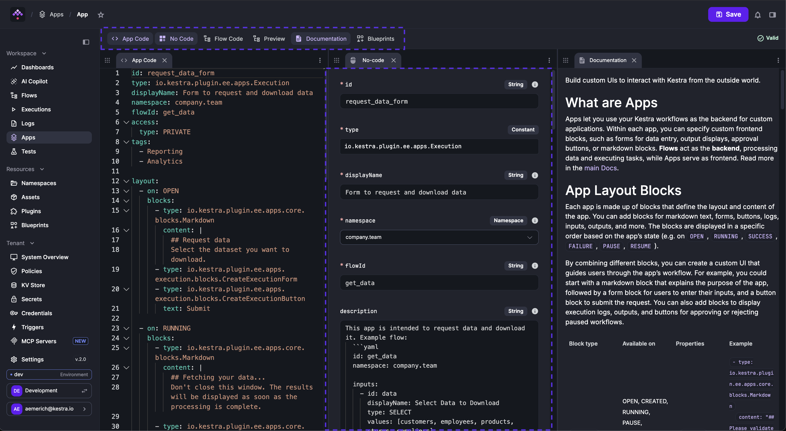
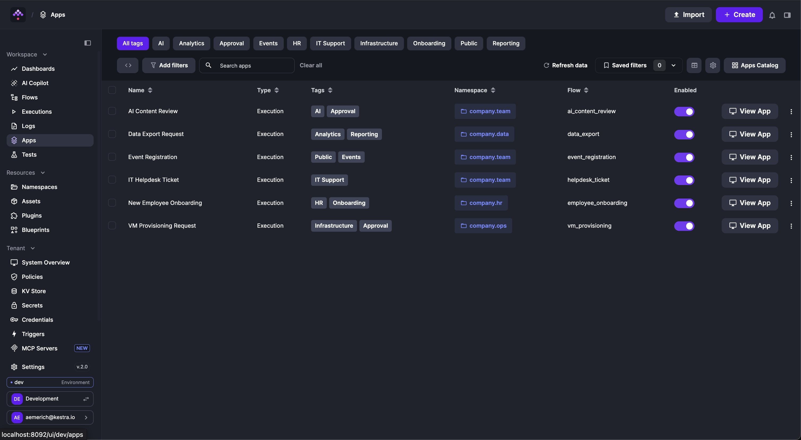
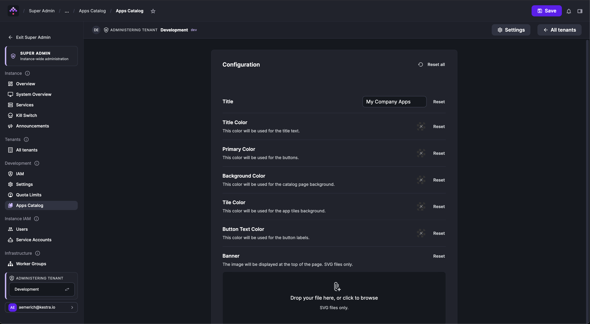
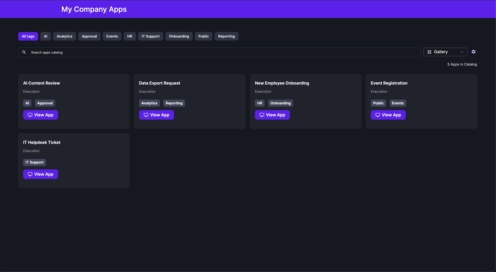
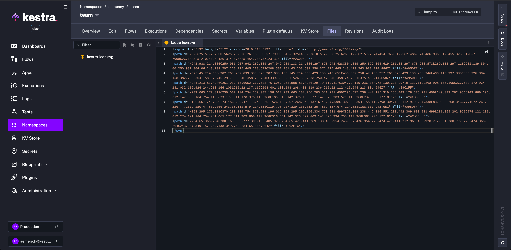
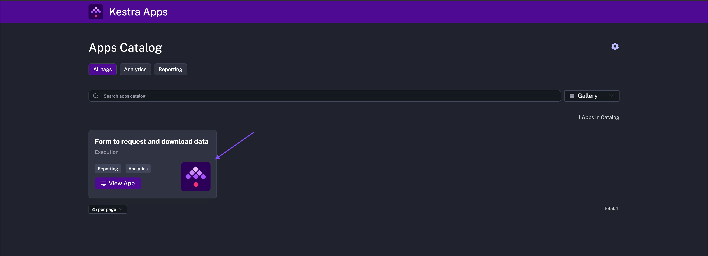

Build custom UIs to interact with Kestra from the outside world.

<div class="video-container">
  <iframe src="https://www.youtube.com/embed/KwBO8mcS3kk?si=VJC5a6YgVECR_bJ3" title="YouTube video player" allow="accelerometer; autoplay; clipboard-write; encrypted-media; gyroscope; picture-in-picture; web-share" referrerpolicy="strict-origin-when-cross-origin" allowfullscreen></iframe>
</div>

## What are Apps

Apps let you wrap any Kestra flow in a custom UI — forms for data entry, output displays, approval buttons, progress indicators, and markdown blocks — without writing any frontend code. Building and serving a frontend, connecting it to Kestra's API, validating user inputs, handling responses, managing workflow outputs, and handling authentication and authorization — Apps take care of all of that.

Flows act as the backend, processing data and executing tasks. Apps act as the frontend, giving anyone — including business users without Kestra access — a clean interface to trigger executions, submit approvals, and view results.

Apps work well for external-facing forms and for internal workflows such as approvals, requests, and guided operations.

---

## Common App patterns

Start with one of these patterns when designing your own App:

- **FTP upload portal**: give users a simple upload form while Kestra handles the backend credentials and transfer logic. See the [business user Apps blog example](../../../../blogs/use-case-apps/index.md#requests--review).
- **Self-serve analytics request**: let users choose a dimension and time range, run a query and chart generation flow, and return the generated output on `SUCCESS`. See the [dynamic self-serve example](../../../../blogs/use-case-apps/index.md#dynamic-self-serve).
- **AI-assisted intake or user research assistant**: collect free-form context from a sales, product, or support team member, run an LLM-backed flow, and display the suggested answer or categorization back in the App. See the [everyday automation example](../../../../blogs/use-case-apps/index.md#simple-interfaces-for-everyday-automation).
- **VM or infrastructure request**: collect the requested environment, size, region, and justification on `OPEN`, show validation progress on `RUNNING`, pause for approval on `PAUSE`, then display the created VM details on `SUCCESS`. This pattern also fits the infrastructure workflows described in the [infrastructure automation blog](../../../../blogs/infra-automation/index.md).
- **Human-in-the-loop review**: display task outputs, logs, or model results, then let an approver accept or reject the execution from the same screen.

Start by mapping the user journey:

1. What should the user submit?
2. What should they see while the flow is running?
3. Does the flow need approval or review?
4. What is the final outcome you want to show back in the App?

Those answers determine which blocks to choose for each stage.

For more patterns, browse the Apps-focused posts in the [blog section](../../../../blogs/introducing-apps/index.md) and [solutions content](../../../../blogs/use-case-apps/index.md).

---

## How App stages map to execution progress

The stage-based model lets a single app guide users through the full request lifecycle — from submission through approval to delivery — by rendering different blocks based on the current execution state.

| App stage | What the user sees | What usually happens in the flow |
|-----------|--------------------|----------------------------------|
| `OPEN` | The initial form or landing page | No execution exists yet. The user is about to submit a request. |
| `CREATED` | Optional confirmation that the request was accepted | Kestra created the execution and is about to start processing it. |
| `RUNNING` | Progress text, logs, loading indicators, or intermediate outputs | Tasks are actively running. |
| `PAUSE` | Approval or review screen | The flow is waiting on a paused task or a manual decision. |
| `RESUME` | Post-approval confirmation and follow-up details | The paused execution was resumed and continues running. |
| `SUCCESS` | Final outputs, download links, or next-step buttons | The execution completed successfully. |
| `FAILURE`, `ERROR`, `FALLBACK` | Error messages, logs, retry guidance, escalation links | The execution did not complete as expected. |

For example, a VM request app might start with an `OPEN` form, move to `RUNNING` while Kestra validates the request, switch to `PAUSE` while a platform engineer reviews the requested size and environment, then show `SUCCESS` once the VM has been provisioned.

This stage-based layout is what makes Apps easier for non-technical users: they don't need to understand workflow internals, only the current step of their request.

---

## Creating Apps in code

<div class="video-container">
  <iframe src="https://www.youtube.com/embed/P0MN9Lrmkvc?si=Ynq2iB2kP0-xmT_r" title="YouTube video player" allow="accelerometer; autoplay; clipboard-write; encrypted-media; gyroscope; picture-in-picture; web-share" referrerpolicy="strict-origin-when-cross-origin" allowfullscreen></iframe>
</div>

If you already have a flow, building an App is a single YAML file: point it at the flow's `namespace` and `flowId`, define what users see at each execution stage with layout blocks, and save. No additional backend code is required — your flow is already the backend.

To create a new app, go to **Apps** and click **+ Create**. Add your app configuration as YAML and click **Save**. Like flows, apps have multiple editor views — you can configure the app while viewing documentation, previewing the layout, or searching the blueprint repository.

Set `disabled: true` to stage an app before release. A disabled app does not appear in the catalog and cannot be opened via its URL until you enable it.

For the full list of available blocks and their properties, see [App layout blocks](#app-layout-blocks) below.



### App to run a Hello World flow

Every app is backed by a flow. The following flow accepts a name input and logs a message when triggered:

```yaml
id: myflow
namespace: company.team

inputs:
  - id: user
    type: STRING
    defaults: World

tasks:
  - id: hello
    type: io.kestra.plugin.core.log.Log
    message: Hello {{ inputs.user }}
```

Then add an app that triggers that flow:

```yaml
id: hello_world_form
type: io.kestra.plugin.ee.apps.Execution
displayName: Hello World Form
namespace: company.team
flowId: myflow
access:
  type: PUBLIC

layout:
  - on: OPEN
    blocks:
      - type: io.kestra.plugin.ee.apps.core.blocks.Markdown
        content: |
          ## Say hello
          Enter a name and submit the form.
      - type: io.kestra.plugin.ee.apps.execution.blocks.CreateExecutionForm
      - type: io.kestra.plugin.ee.apps.execution.blocks.CreateExecutionButton
        text: Submit

  - on: SUCCESS
    blocks:
      - type: io.kestra.plugin.ee.apps.core.blocks.Alert
        style: SUCCESS
        showIcon: true
        content: Your request completed successfully.
      - type: io.kestra.plugin.ee.apps.execution.blocks.Logs
```

You can find a related example in the [enterprise-edition-examples repository](https://github.com/kestra-io/enterprise-edition-examples/blob/main/apps/06_hello_world_app.yaml).

This app is `PUBLIC`, so anyone with the URL can access it without logging in. Set `access.type` to `PRIVATE` to restrict it to authenticated users.

### App to request and download data

A common pattern is to let business users request a filtered dataset and download it as a file — no Kestra access required. The flow fetches data from an external API, filters and sorts it based on user inputs, writes a CSV, and surfaces a summary string and the file as typed flow outputs. The app wraps that flow in a form, shows a loading indicator while it runs, and presents the summary and a download button on success.

**Flow:**

```yaml
id: product-report
namespace: company.ops

inputs:
  - id: requested_by
    type: STRING
    displayName: Requested By

  - id: category
    type: SELECT
    displayName: Product Category
    values:
      - smartphones
      - laptops
      - fragrances
      - skincare
      - groceries
      - furniture

  - id: min_rating
    type: FLOAT
    displayName: Minimum Rating
    defaults: 4.0

  - id: sort_by
    type: SELECT
    displayName: Sort By
    values:
      - rating
      - price
      - stock

tasks:
  - id: fetch_products
    type: io.kestra.plugin.core.http.Download
    uri: "https://dummyjson.com/products/category/{{ inputs.category }}?limit=100"

  - id: build_report
    type: io.kestra.plugin.scripts.python.Script
    containerImage: python:3.12-slim
    inputFiles:
      data.json: "{{ outputs.fetch_products.uri }}"
    script: |
      import csv
      import json

      with open("data.json") as f:
          products = json.load(f)["products"]

      filtered = [p for p in products if p["rating"] >= {{ inputs.min_rating }}]
      filtered.sort(key=lambda p: p["{{ inputs.sort_by }}"], reverse=True)

      fields = ["title", "brand", "category", "price", "rating", "stock", "discountPercentage"]
      with open("report.csv", "w", newline="") as f:
          writer = csv.DictWriter(f, fieldnames=fields, extrasaction="ignore")
          writer.writeheader()
          writer.writerows(filtered)

      avg_price = sum(p["price"] for p in filtered) / len(filtered) if filtered else 0
      avg_rating = sum(p["rating"] for p in filtered) / len(filtered) if filtered else 0

      summary = (
          f"Report for {{ inputs.requested_by }}: "
          f"{len(filtered)} {{'{{ inputs.category }}'}} products rated ≥ {{ inputs.min_rating }}. "
          f"Avg price ${avg_price:.2f} · Avg rating {avg_rating:.2f}/5 · "
          f"Sorted by {{ inputs.sort_by }}."
      )

      print("::" + json.dumps({"outputs": {"summary": summary, "count": len(filtered)}}) + "::")
    outputFiles:
      - report.csv

outputs:
  - id: report_summary
    type: STRING
    value: "{{ outputs.build_report.vars.summary }}"

  - id: report_file
    type: FILE
    value: "{{ outputs.build_report.outputFiles['report.csv'] }}"
```

**App:**

```yaml
id: product_report
type: io.kestra.plugin.ee.apps.Execution
namespace: company.ops
displayName: Product Report
flowId: product-report
access:
  type: PRIVATE
  catalog: true

layout:
  - on: OPEN
    blocks:
      - type: io.kestra.plugin.ee.apps.core.blocks.Markdown
        content: "## Submit a request"
      - type: io.kestra.plugin.ee.apps.execution.blocks.CreateExecutionForm
      - type: io.kestra.plugin.ee.apps.execution.blocks.CreateExecutionButton
        text: Submit

  - on: RUNNING
    blocks:
      - type: io.kestra.plugin.ee.apps.core.blocks.Markdown
        content: "## Keep this page open to see the results"
      - type: io.kestra.plugin.ee.apps.core.blocks.Loading
      - type: io.kestra.plugin.ee.apps.execution.blocks.Logs
      - type: io.kestra.plugin.ee.apps.execution.blocks.CancelExecutionButton
        text: Cancel request
        style: WARNING

  - on: SUCCESS
    blocks:
      - type: io.kestra.plugin.ee.apps.core.blocks.Alert
        style: SUCCESS
        showIcon: true
        content: Your request has completed.
      - type: io.kestra.plugin.ee.apps.execution.blocks.Outputs
      - type: io.kestra.plugin.ee.apps.execution.blocks.Logs
      - type: io.kestra.plugin.ee.apps.core.blocks.Button
        text: Submit a new request
        url: "{{ app.url }}"
        style: DEFAULT

  - on: FAILURE
    blocks:
      - type: io.kestra.plugin.ee.apps.core.blocks.Alert
        style: ERROR
        showIcon: true
        content: The request failed. The logs below show what went wrong.
      - type: io.kestra.plugin.ee.apps.execution.blocks.Logs
        filter:
          logLevel: ERROR
```

#### Interactive demo

<div style="position: relative; padding-bottom: calc(48.6979% + 41px); height: 0px; width: 100%;"><iframe src="https://demo.arcade.software/JWgKWxXUEKSkDVZcvH1j?embed&embed_mobile=tab&embed_desktop=inline&show_copy_link=true" title="Build and Download a Product Report from a Flow in Kestra" frameborder="0" loading="lazy" webkitallowfullscreen mozallowfullscreen allowfullscreen allow="clipboard-write; autoplay" style="position: absolute; top: 0; left: 0; width: 100%; height: 100%; color-scheme: light;" ></iframe></div>

This pattern works for any reporting or analytics use case where users need to request and download data without accessing Kestra directly.

### App to request a VM and get it approved

Self-service infrastructure requests are one of the most common approval-based App patterns. A requester fills out a form with the VM size, environment, region, and business justification. The flow logs and validates the request, then pauses for review. A platform engineer opens the same app in its `PAUSE` state, sees the original request details, adds reviewer notes, and either approves (resumes the execution) or rejects (cancels it). On approval, the flow continues to provisioning.

This example demonstrates two distinct user roles interacting with the same app at different stages.

**Flow:**

```yaml
id: vm-request
namespace: company.ops

inputs:
  - id: requested_by
    type: STRING
    displayName: Requested By

  - id: vm_size
    type: SELECT
    displayName: VM Size
    values:
      - "small (2 vCPU / 4 GB)"
      - "medium (4 vCPU / 8 GB)"
      - "large (8 vCPU / 16 GB)"

  - id: environment
    type: SELECT
    displayName: Environment
    values:
      - dev
      - staging
      - production

  - id: region
    type: SELECT
    displayName: Region
    values:
      - us-east-1
      - eu-west-1
      - ap-southeast-1

  - id: justification
    type: STRING
    displayName: Business Justification

tasks:
  - id: validate_request
    type: io.kestra.plugin.core.log.Log
    message: |
      New VM request from {{ inputs.requested_by }}.
      Size: {{ inputs.vm_size }}, Environment: {{ inputs.environment }}, Region: {{ inputs.region }}.
      Justification: {{ inputs.justification }}

  - id: await_approval
    type: io.kestra.plugin.core.flow.Pause
    onResume:
      - id: notes
        type: STRING
        displayName: Reviewer Notes
        required: false

  - id: provision_vm
    type: io.kestra.plugin.core.log.Log
    message: |
      Provisioning {{ inputs.vm_size }} in {{ inputs.environment }}/{{ inputs.region }} for {{ inputs.requested_by }}.
      Reviewer notes: {{ resume.notes }}
```

The `Pause` task's `onResume` inputs define what the reviewer submits when approving — in this case, optional notes. Those values are available to downstream tasks as `{{ resume.<id> }}`.

**App:**

```yaml
id: vm_request
type: io.kestra.plugin.ee.apps.Execution
displayName: VM Request
namespace: company.ops
flowId: vm-request
access:
  type: PRIVATE
  catalog: true

layout:
  - on: OPEN
    blocks:
      - type: io.kestra.plugin.ee.apps.core.blocks.Markdown
        content: |
          ## Request a Virtual Machine
          Fill in the details below. Your request will be validated and sent for approval before provisioning begins.
      - type: io.kestra.plugin.ee.apps.execution.blocks.CreateExecutionForm
      - type: io.kestra.plugin.ee.apps.execution.blocks.CreateExecutionButton
        text: Submit Request
        style: SUCCESS

  - on: RUNNING
    blocks:
      - type: io.kestra.plugin.ee.apps.core.blocks.Markdown
        content: "## Validating your request…"
      - type: io.kestra.plugin.ee.apps.core.blocks.Loading
      - type: io.kestra.plugin.ee.apps.execution.blocks.Logs

  - on: PAUSE
    blocks:
      - type: io.kestra.plugin.ee.apps.core.blocks.Markdown
        content: |
          ## Review this VM request
          Inspect the request details below, then approve or reject.
      - type: io.kestra.plugin.ee.apps.execution.blocks.Inputs
      - type: io.kestra.plugin.ee.apps.execution.blocks.ResumeExecutionForm
      - type: io.kestra.plugin.ee.apps.execution.blocks.ResumeExecutionButton
        text: Approve
        style: SUCCESS
      - type: io.kestra.plugin.ee.apps.execution.blocks.CancelExecutionButton
        text: Reject
        style: DANGER

  - on: SUCCESS
    blocks:
      - type: io.kestra.plugin.ee.apps.core.blocks.Alert
        style: SUCCESS
        showIcon: true
        content: Your VM has been provisioned.
      - type: io.kestra.plugin.ee.apps.execution.blocks.Logs
      - type: io.kestra.plugin.ee.apps.core.blocks.Button
        text: Submit a new request
        url: "{{ app.url }}"
        style: DEFAULT

  - on: FAILURE
    blocks:
      - type: io.kestra.plugin.ee.apps.core.blocks.Alert
        style: ERROR
        showIcon: true
        content: The request could not be processed. Review the logs for details.
      - type: io.kestra.plugin.ee.apps.execution.blocks.Logs
        filter:
          logLevel: ERROR
```

The `PAUSE` stage shows the original request inputs (`ExecutionInputs`), the `onResume` form for reviewer notes (`ResumeExecutionForm`), and the approve/reject buttons. Clicking **Approve** resumes the execution; clicking **Reject** cancels it.

This pattern applies directly to database access requests, sandbox environment creation, firewall rule approvals, SaaS account provisioning, and any other workflow that needs a human gate before it continues.

---

## Creating Apps without code

Apps can also be built using the no-code editor. Every block, property, and configuration option available in YAML is fully supported visually. Changes made in the no-code editor are immediately reflected in the code view, and vice versa — teams can switch between approaches at any time without losing the underlying YAML definition.

---

## App catalog

The App Catalog lists all available apps in a tenant. Filter by name, type, namespace, or tags. From this page you can also create new apps, edit existing ones, enable or disable individual apps, or delete them.



Kestra provides a direct access URL to the Apps Catalog in the format `http://your_host/ui/your_tenant/apps/catalog`. Any Kestra user with at least `APP: VIEW` permission in that tenant can reach this URL.

The catalog page requires authentication, so it is never publicly accessible. Users see only the apps they are permitted to see based on their RBAC permissions. You can limit visibility to specific groups by setting the `groups` property in the `access` block:

```yaml
access:
  catalog: true
  type: PRIVATE
  groups:
    - Admins
```

### Hiding an app from the catalog

Setting `catalog: false` removes the app from the browseable catalog while keeping its direct URL fully functional. Use this when you want to share an app with a specific audience via URL without surfacing it to everyone who can browse the catalog.

```yaml
access:
  catalog: false
  type: PRIVATE
```

### Managing apps in bulk

From the Apps Catalog, you can select multiple apps and enable, disable, or delete them in a single operation. Bulk operations report partial failures individually so you can see which apps were affected and which were not.

You can also export a selection of apps as a ZIP archive (`kestra-{tenant}-apps.zip`) and import that archive — or a multi-document YAML file — into another tenant or environment. The export produces one `{namespace}-{id}.yaml` file per app. On import, each app is validated independently; errors are reported per file so a single bad app does not block the rest.

### Customize the Apps Catalog

Customize the catalog's title, colors, and banner image to match your organization's look and feel. Go to **Super Admin**, then in the left sidebar under your tenant, click **Apps Catalog**.



The configuration panel lets you set a **Title**, **Title Color**, **Primary Color** (used for buttons), **Background Color**, **Tile Color**, **Button Text Color**, and a **Banner** image displayed at the top of the catalog page.

:::alert{type="info"}
The banner image must be an `.svg` file.
:::

Once saved, open the **Apps Catalog** to see your branding:



Access these settings any time from the **gear icon** in the catalog.

### App tags

Add custom tags to organize and filter apps in the catalog. For example: `DevOps`, `data-team`, `project-x`.

---

## App URL

Each app has a unique URL — share it with team members, customers, or partners, or embed it in internal tools. Anyone with the link (and appropriate access) can open the app directly.

The URL format is: `https://yourHost/ui/tenantId/apps/appUid`, for example `http://localhost:8080/ui/release/apps/5CS8qsm7YTif4PWuAUWHQ5`.

Copy the URL from the **Apps Catalog**.

:::alert{type="info"}
App URL generation relies on the `kestra.url` server configuration property. If this property is not set, generated links may be broken or missing. Set it to the externally reachable base URL of your Kestra instance, for example `kestra.url: https://kestra.example.com`.
:::

### App expressions

From within flows, you can generate app URLs using the Enterprise-only `appLink` expression. See [Workflow Functions](../../../expressions/04.functions/04.workflow/index.mdx) for parameters and examples.

---

## App access and RBAC permissions

Each app has an `access` block that controls who can open and submit it.

### Public access

When an app is set to `PUBLIC`, anyone with the URL can open the form and submit requests without logging in. This is suitable for public-facing forms, surveys, or intake pages you share via email or embed on a website.

:::alert{type="info"}
For `PUBLIC` apps, execution IDs exposed through file download or log links are encrypted so that anonymous users cannot reference executions outside the app.
:::

### Private access for using apps

When an app is set to `PRIVATE`, only authenticated users with `APP: EXECUTE` permission on the app's namespace can open or submit it. You can further narrow access to specific IAM groups using the `groups` field:

```yaml
access:
  type: PRIVATE
  groups:
    - DataOps
    - Finance
```

Group membership is checked at runtime on every request. Users who belong to at least one listed group are granted access; users outside those groups are denied even if they have `APP: EXECUTE` permission on the namespace. If `groups` is omitted, any authenticated user with `APP: EXECUTE` permission on the namespace can use the app.

`APP: EXECUTE` is namespace-scoped. A user with `APP: EXECUTE` on `company.team` cannot dispatch an app in `company.other`, even if both apps appear in the same catalog view.

This makes the `PRIVATE` + `groups` combination useful when you want to allow a specific group of business stakeholders or external partners to use an app without giving them access to the broader Kestra UI.

### Private access for building apps

The `APP` resource controls who can create, view, update, or delete apps within a tenant. It can be scoped to specific namespaces. `APP: EXECUTE`, `APP: ACCESS_FILES`, and `APP: ACCESS_LOGS` govern the ability to submit requests through an app and access its artifacts; the remaining `APP` actions govern the ability to build and manage apps.

---

## App executions

Each time a user creates an execution by submitting a form in the app, a new execution is generated with the system label `system.app` and a value of `yourAppId`. For example, to filter all executions created by the `computeResourcesForm` app, you can search for `system.app:computeResourcesForm` in the label filter.

For every execution, you can track the user inputs, see the current state, view logs, and check the outputs — all from the Kestra UI. This lets you observe, troubleshoot, and manage app executions just as you would any other workflow execution.

---

## App expiration

You can limit an app to a specific time window using the `expiration` property. Once the window closes, the app is filtered out of the catalog and blocks new submissions — existing executions are unaffected.

```yaml
id: survey_form
type: io.kestra.plugin.ee.apps.Execution
displayName: Q2 Survey
namespace: company.team
flowId: survey_processor
access:
  type: PUBLIC
expiration:
  startDate: "2025-06-01T00:00:00Z"
  endDate:   "2025-06-30T23:59:59Z"
layout:
  - on: OPEN
    blocks:
      - type: io.kestra.plugin.ee.apps.core.blocks.Markdown
        content: "## Please complete the survey before the end of June."
      - type: io.kestra.plugin.ee.apps.execution.blocks.CreateExecutionForm
      - type: io.kestra.plugin.ee.apps.execution.blocks.CreateExecutionButton
        text: Submit
```

Both fields are optional:
- Omit `startDate` and the app is available immediately.
- Omit `endDate` and the app never expires.
- Omit `expiration` entirely and the app stays active indefinitely.

Expiration is evaluated against the server clock at the moment a user opens or submits the app.

---

## App thumbnails

Add a thumbnail to give catalog users a visual indicator of what the app does. Upload an image file as a [namespace file](../../../06.concepts/02.namespace-files/index.md) to the same namespace as the app's connected flow. Supported formats include `.svg`, `.jpg`, and `.png`. The example below adds `kestra-icon.svg`.



In your app code, add the `thumbnail` string property and point it towards the correct namespace file using `nsfiles:///<your-file>`. For example:

```yaml
id: request_data_form
type: io.kestra.plugin.ee.apps.Execution
displayName: Form to request and download data
namespace: company.team
flowId: get_data
thumbnail: "nsfiles:///kestra-icon.svg" # Point this property to the correct namespace file.
access:
  type: PRIVATE
tags:
  - Reporting
  - Analytics
```

Once added, open the **Apps Catalog** — a new thumbnail displays on the connected app:



---

## App layout blocks

Each app layout is a list of stage-specific blocks. Each block renders when the execution reaches the matching stage (`OPEN`, `RUNNING`, `SUCCESS`, `FAILURE`, `PAUSE`, `RESUME`). Combine blocks to guide users through the full lifecycle of a request — form on `OPEN`, progress indicator on `RUNNING`, download link and logs on `SUCCESS`.

| Block type               | Available on                                                             | Properties                                                                                  | Example                                                                                                                                                                                                                               |
|--------------------------|--------------------------------------------------------------------------|---------------------------------------------------------------------------------------------|---------------------------------------------------------------------------------------------------------------------------------------------------------------------------------------------------------------------------------------|
| `Markdown`               | OPEN, CREATED, RUNNING, PAUSE, RESUME, SUCCESS, FAILURE, FALLBACK       | - `content` (Pebble template)                                                               | `- type: io.kestra.plugin.ee.apps.core.blocks.Markdown`<br> &nbsp;&nbsp;&nbsp;&nbsp;`content: "## Please validate the request. Inspect the logs and outputs below. Then, approve or reject the request."`                             |
| `RedirectTo`             | OPEN, CREATED, RUNNING, PAUSE, RESUME, SUCCESS, FAILURE, ERROR, FALLBACK | - `url`: redirect URL <br> - `delay`: delay in seconds                                      | `- type: io.kestra.plugin.ee.apps.core.blocks.RedirectTo`<br> &nbsp;&nbsp;&nbsp;&nbsp;`url: "https://kestra.io/docs"`<br> &nbsp;&nbsp;&nbsp;&nbsp;`delay: "PT60S"`                                                                         |
| `CreateExecutionForm`    | OPEN                                                                     | None                                                                                        | `- type: io.kestra.plugin.ee.apps.execution.blocks.CreateExecutionForm`                                                                                                                                                               |
| `ResumeExecutionForm`    | PAUSE                                                                    | None                                                                                        | `- type: io.kestra.plugin.ee.apps.execution.blocks.ResumeExecutionForm`                                                                                                                                                               |
| `CreateExecutionButton`  | OPEN                                                                     | - `text` <br> - `style`: DEFAULT, SUCCESS, DANGER, INFO <br> - `size`: SMALL, MEDIUM, LARGE | `- type: io.kestra.plugin.ee.apps.execution.blocks.CreateExecutionButton`<br> &nbsp;&nbsp;&nbsp;&nbsp;`text: "Submit"`<br> &nbsp;&nbsp;&nbsp;&nbsp;`style: "SUCCESS"`<br> &nbsp;&nbsp;&nbsp;&nbsp;`size: "MEDIUM"`                    |
| `CancelExecutionButton`  | CREATED, RUNNING, PAUSE                                                 | - `text` <br> - `style`: DEFAULT, SUCCESS, DANGER, INFO <br> - `size`: SMALL, MEDIUM, LARGE | `- type: io.kestra.plugin.ee.apps.execution.blocks.CancelExecutionButton`<br> &nbsp;&nbsp;&nbsp;&nbsp;`text: "Reject"`<br> &nbsp;&nbsp;&nbsp;&nbsp;`style: "DANGER"`<br> &nbsp;&nbsp;&nbsp;&nbsp;`size: "SMALL"`                      |
| `ResumeExecutionButton`  | PAUSE                                                                    | - `text` <br> - `style`: DEFAULT, SUCCESS, DANGER, INFO <br> - `size`: SMALL, MEDIUM, LARGE | `- type: io.kestra.plugin.ee.apps.execution.blocks.ResumeExecutionButton`<br> &nbsp;&nbsp;&nbsp;&nbsp;`text: "Approve"`<br> &nbsp;&nbsp;&nbsp;&nbsp;`style: "SUCCESS"`<br> &nbsp;&nbsp;&nbsp;&nbsp;`size: "LARGE"`                    |
| `ExecutionInputs`        | PAUSE, RESUME, SUCCESS, FAILURE                                          | - `filter`: include, exclude                                                                | `- type: io.kestra.plugin.ee.apps.execution.blocks.Inputs`<br> &nbsp;&nbsp;&nbsp;&nbsp;`filter:`<br>&nbsp;&nbsp;&nbsp;&nbsp;&nbsp;&nbsp;&nbsp;&nbsp;`include: []`<br>&nbsp;&nbsp;&nbsp;&nbsp;&nbsp;&nbsp;&nbsp;&nbsp;`exclude: []`    |
| `ExecutionOutputs`       | PAUSE, RESUME, SUCCESS, FAILURE                                          | - `filter`: include, exclude                                                                | `- type: io.kestra.plugin.ee.apps.execution.blocks.Outputs`<br> &nbsp;&nbsp;&nbsp;&nbsp;`filter:`<br>&nbsp;&nbsp;&nbsp;&nbsp;&nbsp;&nbsp;&nbsp;&nbsp;`include: []`<br>&nbsp;&nbsp;&nbsp;&nbsp;&nbsp;&nbsp;&nbsp;&nbsp;`exclude: []`   |
| `ExecutionLogs`          | PAUSE, RESUME, SUCCESS, FAILURE, FALLBACK                                | - `filter`: logLevel, taskIds                                                               | `- type: io.kestra.plugin.ee.apps.execution.blocks.Logs`<br> &nbsp;&nbsp;&nbsp;&nbsp;`filter:`<br>&nbsp;&nbsp;&nbsp;&nbsp;&nbsp;&nbsp;&nbsp;&nbsp;`logLevel: "INFO"`<br>&nbsp;&nbsp;&nbsp;&nbsp;&nbsp;&nbsp;&nbsp;&nbsp;`taskIds: []` |
| `Loading`                | RUNNING                                                                  | None                                                                                        | `- type: io.kestra.plugin.ee.apps.core.blocks.Loading`                                                                                                                                                                                |
| `Alert`                  | OPEN, CREATED, RUNNING, PAUSE, RESUME, SUCCESS, FAILURE, FALLBACK       | - `style`: SUCCESS, WARNING, ERROR, INFO <br> - `showIcon`: true, false                     | `- type: io.kestra.plugin.ee.apps.core.blocks.Alert`<br> &nbsp;&nbsp;&nbsp;&nbsp;`style: "WARNING"`<br> &nbsp;&nbsp;&nbsp;&nbsp;`showIcon: true`<br> &nbsp;&nbsp;&nbsp;&nbsp;`content: "An error occurred!"`                          |
| `Button`                 | SUCCESS, FAILURE                                                        | - `text` <br> - `url` <br> - `style`: DEFAULT, SUCCESS, DANGER, INFO                        | `- type: io.kestra.plugin.ee.apps.core.blocks.Button`<br> &nbsp;&nbsp;&nbsp;&nbsp;`text: "More examples"`<br> &nbsp;&nbsp;&nbsp;&nbsp;`url: "https://github.com/kestra-io/examples"`<br> &nbsp;&nbsp;&nbsp;&nbsp;`style: "INFO"`      |
| `TaskOutputs`            | RUNNING, PAUSE, RESUME, SUCCESS                                         | - `outputs`: list of outputs with `displayName`, `value`, and `type`                        | `- type: io.kestra.plugin.ee.apps.execution.blocks.TaskOutputs`<br> &nbsp;&nbsp;&nbsp;&nbsp;`outputs:`<br> &nbsp;&nbsp;&nbsp;&nbsp;&nbsp;&nbsp;&nbsp;&nbsp;`- displayName: My Task Output`<br> &nbsp;&nbsp;&nbsp;&nbsp;&nbsp;&nbsp;&nbsp;&nbsp;`value: "{{ outputs.test.value }}"`<br> &nbsp;&nbsp;&nbsp;&nbsp;&nbsp;&nbsp;&nbsp;&nbsp;`type: FILE` |

### Dynamic content in the OPEN state

The `Markdown` block's `content` property is a Pebble template. When the layout includes a `CreateExecutionForm`, `{{ inputs.<id> }}` is available in the render context and updates live as the user interacts with the form — useful for context-sensitive descriptions that react to dropdown changes.

For example, given a flow with a `product` SELECT input, the app below renders the current selection inline:

```yaml
id: software_request_form
type: io.kestra.plugin.ee.apps.Execution
displayName: Software Request Form
namespace: company.team
flowId: software_request
access:
  type: PRIVATE

layout:
  - on: OPEN
    blocks:
      - type: io.kestra.plugin.ee.apps.execution.blocks.CreateExecutionForm
      - type: io.kestra.plugin.ee.apps.core.blocks.Markdown
        content: "You are requesting access to: **{{ inputs.product }}**"
      - type: io.kestra.plugin.ee.apps.execution.blocks.CreateExecutionButton
        text: Submit

  - on: SUCCESS
    blocks:
      - type: io.kestra.plugin.ee.apps.core.blocks.Alert
        style: SUCCESS
        content: Your request has been submitted.
```

Before the user interacts with the form, `{{ inputs.* }}` resolves to each input's default value. In other states (RUNNING, SUCCESS, FAILURE), `{{ inputs.* }}` references the execution's submitted values.

:::alert{type="info"}
When the flow uses [`FORM` inputs](../../../05.workflow-components/05.inputs/index.md#form-inputs), `CreateExecutionForm` renders a multi-step Next/Back wizard — one step per FORM group, a step for ungrouped inputs, then a recap. No additional App configuration is required; the wizard is driven entirely by the flow's input definition.
:::

### File preview and download

The `Outputs` and `TaskOutputs` blocks can render file download links for outputs stored in Kestra's internal storage. File preview, metadata, and download are only available when:

- The app type is `io.kestra.plugin.ee.apps.Execution`.
- The layout includes an `Outputs` or `TaskOutputs` block.
- The storage path belongs to an execution that the app has access to.

By default, file preview shows the first 100 rows. You can change this server-side with `kestra.server.preview.initial-rows` (default `100`) and cap it with `kestra.server.preview.max-rows` (default `5000`).

### Log download

The `ExecutionLogs` block renders an inline log viewer. When a `Logs` block is present in the layout, users can also download the full log file directly from the app. Log download is only available for `Execution`-type apps that include a `Logs` block in their layout.
