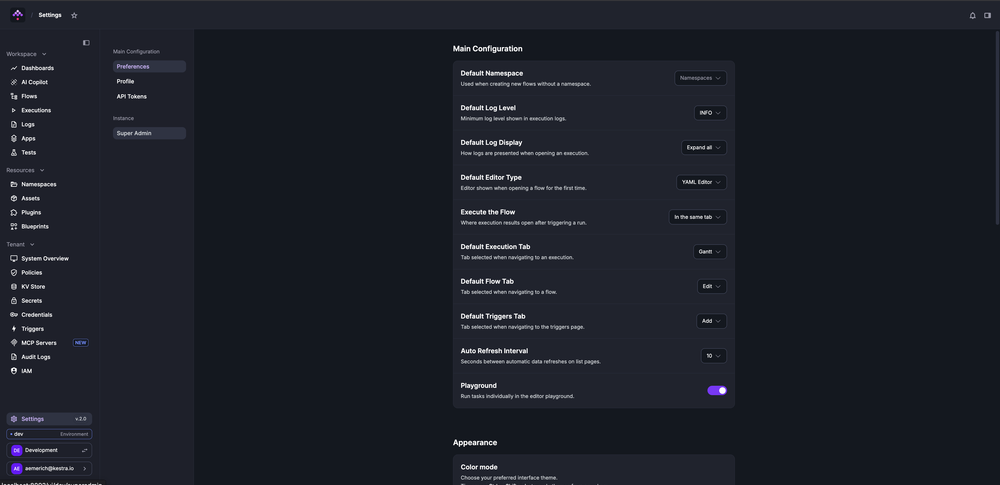
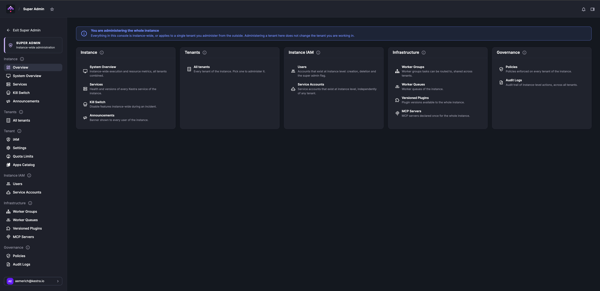
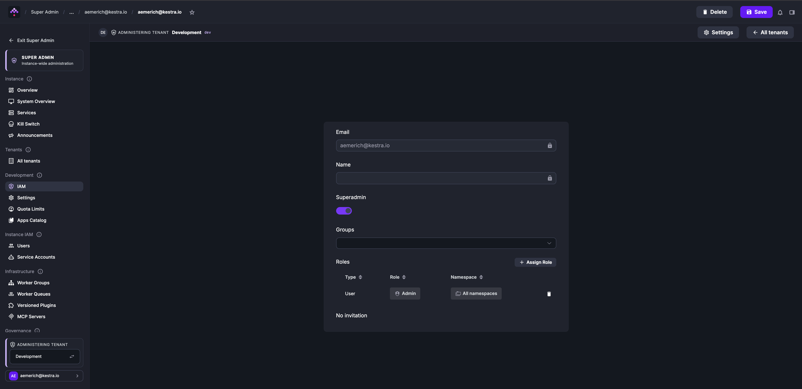

The Super Admin console provides instance-wide administration for tenants, IAM, infrastructure, and governance — separate from the tenant workspace you work in day to day.

:::alert{type="warning"}
Super Admin operations are instance-wide. Changes to tenants, users, worker groups, and instance-level policies affect the entire Kestra instance, not just the tenant you are currently logged into.
:::

## Entering Super Admin

From the bottom-left corner of any page, click **Settings**. Under the **Instance** section, select **Super Admin**:



The UI switches to the Super Admin console and shows a banner confirming you are administering the whole instance. Your regular tenant workspace is unaffected — you can return to it at any time.

## The Super Admin console

The console organizes instance-wide administration into five sections:



| Section | What you can manage |
| :--- | :--- |
| **Instance** | Overview, System Overview, Services, Kill Switch, Announcements |
| **Tenants** | Create, edit, and delete tenants; configure dedicated storage and secrets backends per tenant |
| **Instance IAM** | Users and Service Accounts that exist at the instance level, independently of any tenant |
| **Infrastructure** | Worker Groups, Worker Queues, Versioned Plugins, MCP Servers |
| **Governance** | Instance-level Policies and Audit Logs across all tenants |

## Exiting Super Admin

Click **Exit Super Admin** at the top of the left sidebar to return to your tenant workspace.

## Who can access Super Admin

Only users with the Superadmin privilege can enter the Super Admin console.

## Creating a Superadmin user

### Through the setup wizard

When you launch Kestra for the first time, the [setup wizard](../../01.overview/02.setup/index.md) invites you to create the first user, which is automatically assigned the Superadmin privilege.

### Through the CLI

To create a new user with the Superadmin privilege:

```bash
kestra auths users create admin@kestra.io TopSecret42 --superadmin

## with tenant scoping:
kestra auths users create <username> <password> \
--tenant=<tenant-id> --superadmin
```

### Through configuration

A Superadmin can also be defined in the configuration file:

```yaml
kestra:
  security:
    superAdmin:
      username: <username>
      password: <password>
      tenantAdminAccess:
        - <optional>
```

For the full list of security configuration options, see [Security and Secrets configuration](../../../configuration/05.security-and-secrets/index.md).

## Granting and revoking Super Admin access

You must be a Superadmin yourself to grant or revoke the privilege.

### Through the UI

Open the user's detail page and toggle the Superadmin switch:



### Through the CLI

```bash
kestra auths users set-superadmin admin@kestra.io true   # grant
kestra auths users set-superadmin admin@kestra.io false  # revoke
```
