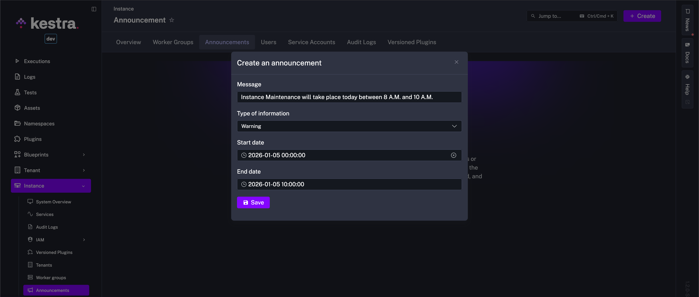
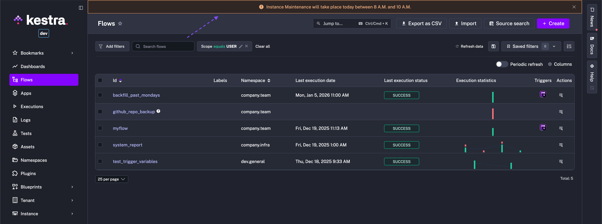

Communicate planned maintenance or incidents with in-app banners

  <iframe src="https://www.youtube.com/embed/2QqGABneiNI?si=iT2NleQpZFYL2g66" title="YouTube video player" allow="accelerometer; autoplay; clipboard-write; encrypted-media; gyroscope; picture-in-picture; web-share" referrerpolicy="strict-origin-when-cross-origin" allowfullscreen></iframe>

## Announcements – in-app banners

Announcements allow you to notify your users about any important events such as planned maintenance downtime.

## How to create an announcement

To add a custom in-app banner, go to the **Instance → Announcements** tab.

As a user with an Admin role, you can configure the following within each announcement:

- **Message**: the text to display in the banner
- **Type**: the type of banner to display (**INFO, WARNING, ERROR**)
- The **START** and **END** date during which the announcement should be displayed.

