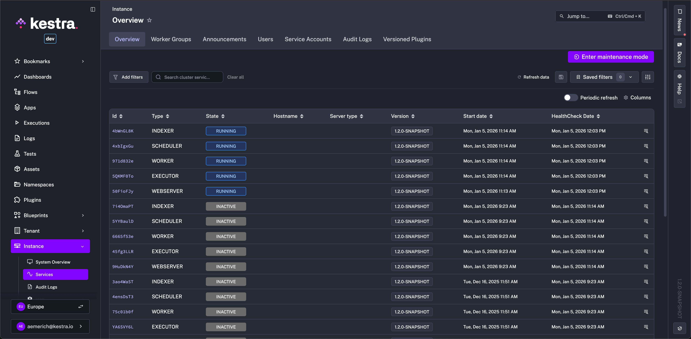
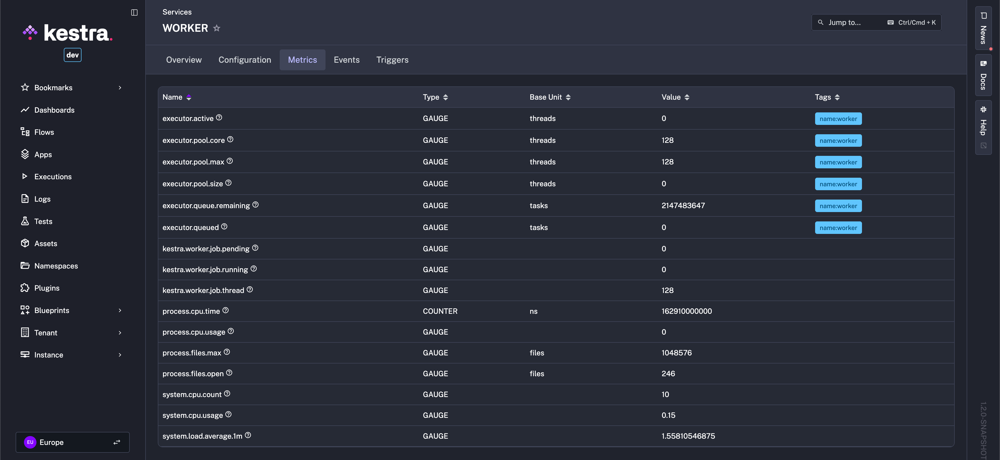
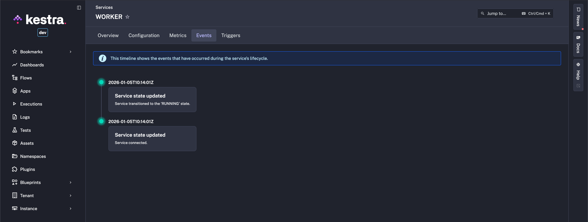

import ChildCard from "~/components/docs/ChildCard.astro"

The Instance menu gives you a centralized view of your Kestra deployment's health along with controls for upgrades, maintenance, and user notifications.

    <iframe
        src="https://www.youtube.com/embed/pcC3OAJPQao?si=x9LWlBHG-WMuHTdW"
        title="YouTube video player"
        allow="accelerometer; autoplay; clipboard-write; encrypted-media; gyroscope; picture-in-picture; web-share"
        referrerpolicy="strict-origin-when-cross-origin"
        allowfullscreen
    ></iframe>

## Overview

The **Instance** menu provides centralized control over your platform’s infrastructure so administrators can monitor service health, manage configurations, and communicate announcements (like planned maintenance downtime) to users without relying on additional observability tools. The **System Overview** tab gives a high-level snapshot of your instance’s operational status. Here, you can:

- View **License Details**: validity, usage statistics, and installed secrets and storage plugins.

## Services

Kestra tracks the health of critical components, including:

- **Workers**: Execute tasks.
- **Schedulers**: Trigger workflows.
- **Executors**: Manage task execution.
- **Webservers**: Host the UI and API.

Each service displays:

- **State**: Whether the service is active (`RUNNING`) or unresponsive.
- **Host Name**: Identifier of the server/pod (e.g., `kafka-ee-preview-79fb7755f8-zhlhq`).
- **Server Type**: For example, STANDALONE.
- **Version**
- **Start Date**
- **Health Check Date**

### Service states

- **RUNNING** — service is active and healthy.
- **MAINTENANCE** — intentionally paused; executions are blocked until resumed.
- **DISCONNECTED** — lost a required dependency (e.g., DB/queue) and may recover or shut down.
- **TERMINATING** — shutting down; tries to drain work before stopping.
- **TERMINATED_GRACEFULLY / TERMINATED_FORCED** — shutdown completed (clean or forced), moves to `NOT_RUNNING`.
- **NOT_RUNNING / INACTIVE** — post-shutdown, final states reported in the UI.

States come from the service lifecycle. Typical flow:
- **CREATED** → **RUNNING** after a clean start; **MAINTENANCE** can be set directly for planned work.
- **DISCONNECTED** signals a lost dependency (DB/queue) and may recover to **RUNNING** or proceed to shutdown.
- **TERMINATING** attempts graceful stop; it ends in **TERMINATED_GRACEFULLY** or **TERMINATED_FORCED**, then **NOT_RUNNING** → **INACTIVE**.

### Server information and liveness

Each service instance provides technical details for debugging when clicked on:

- **Hostname**: Identifier of the server/pod (e.g., `kafka-ee-preview-79fb7755f8-zhlhq`).
- **Session Timeout**: Time before an unresponsive service is marked offline (e.g., `60 seconds`).
- **Heartbeat Interval**: The expected time between heartbeats.
- **Last Heartbeat**: Timestamp of the latest health check.
- **Termination Grace Period**: The expected time for this service to complete all its tasks before initiating a graceful shutdown.

Additional tabs include **Configuration** to display port configuration, **Metrics** such as CPU Usage and Executor Thread Count:

And an **Events Timeline** to give an overview of the service's lifecycle:

## Announcements

Notify users about planned maintenance or updates:

1. **Create Announcements**: Specify a title, message, and date range.
2. **Choose Type**: Define severity of the announcement (e.g., `info`, `warning`, `error`).

[Announcements](./announcements/index.md) appear in the UI during the selected period, ensuring users stay informed.

## Maintenance Mode

From the **Instance - Services** tab, enter [Maintenance Mode](../05.instance/maintenance-mode/index.md) to temporarily pause all workflows and services for upgrades:

- Services enter a paused state, and new executions are blocked.
- Combine it with the Announcements feature so users see a maintenance banner while running workflows gracefully terminate.

## Worker Groups

Create [Worker Groups](../04.scalability/worker-group/index.md) to isolate workloads or delegate tasks to specific workers:

- **Add Worker Groups**: Define groups with specific resource limits or labels.
- **Assign Tasks**: Route workflows to designated groups via worker group key within a task or trigger.

## Audit Logs

View [Audit Logs](../02.governance/06.audit-logs/index.md) at a glance to monitor actions on all resource types taken by users in the instance.

## Versioned Plugins

View all installed [Versioned Plugins](../05.instance/versioned-plugins/index.md) on the instance and upgrade, install, or uninstall as needed.

## Instance management – services and maintenance

<ChildCard />
