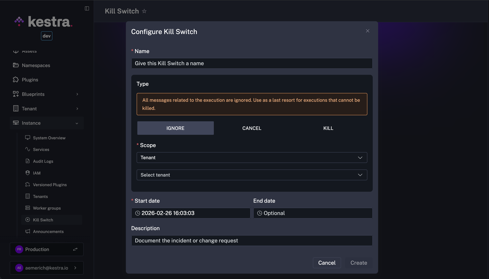

Kill Switch is an operational safety lever that lets administrators stop misbehaving executions directly from the UI.

## Why a Kill Switch exists

A runaway flow, a bad deployment, or a tenant-specific incident can flood workers with problematic executions. The Kill Switch lets administrators halt or quarantine those executions instantly, without pausing the entire platform or touching infrastructure.

Use it when you need to:

- Contain impact quickly while you ship a fix or rollback.
- Target only the affected tenant/namespace/flow/execution instead of stopping everything.
- Keep an auditable record of who intervened, when, and why.
- Surface a visible banner so impacted users know what happened.

Kill Switch replaces the CLI-only `--skip-executions` and `--skip-flows` commands with a scoped, auditable administration interface.

## Configure a Kill Switch

To configure a Kill Switch, navigate to your **Instance → Kill Switch** section in Kestra. From there, name the Kill Switch (e.g., `Kill Switch – Payments Namespace Outage (TEMP)` ) and configure the switch's specifications.



### Kill Switch types

| Type | Behavior |
|------|----------|
| **KILL** | Kills running executions after the current task completes; any remaining tasks in the execution will not run. New executions are transitioned to `KILLED` state instantly. |
| **CANCEL** | Blocks new executions; lets current task runs finish before marking the execution `CANCELLED`. |
| **IGNORE** | Ignores all messages for matching executions—use as a last resort when an execution cannot be killed or cancelled. |

For **KILL** and **CANCEL**, executions receive a [system label](../../../06.concepts/system-labels/index.md) identifying which Kill Switch applied.

### Scope

Scope sets the reach of the Kill Switch with **Tenant** being the most inclusive and **Execution** the most specific. A **Namespace** scope requires a **Tenant**, and a **Flow** scope requires a **Tenant** and **Namespace**. The UI automatically adjusts to show only the relevant scope requirements depending on your first selection. 

All possible scopes are listed below:

- **Tenant**
- **Namespace**
- **Flow**
- **Execution**

### Scheduling

The Kill Switch requires a **Start Date** and can be kept open ended if needed.

- Mandatory **Start Date** (default: now)
- Optional **End Date**
- Enable/disable from the **Kill Switch** tab at any time

### Description

Admins can optionally include a free-text reason stored with the Kill Switch and surfaced in banners to document the incident or change request.

## Lifecycle and audit

Creation and updates are written to [**Audit Logs**](../../02.governance/06.audit-logs/index.md), and every state change—create, enable, disable, or archive—is recorded. Deleting a Kill Switch performs a soft delete, so the archived entry remains visible for traceability.

## Announcement banner

Kill Switches raise contextual banners to alert affected users. A namespace-scoped Kill Switch shows the banner only to users working in that namespace, while a tenant-scoped one surfaces the banner across the UI for all users in the tenant.

## CLI compatibility

The CLI remains for open-source parity, with renamed flags to match the behavior:

```bash
# Old
--skip-executions / --skip-flows

# New
--ignore-executions / --ignore-flows
```

## Relationship to maintenance mode

[Maintenance Mode](../maintenance-mode/index.md) pauses the platform broadly (queues new executions, lets running ones finish). Kill Switch keeps services up and targets specific tenants/namespaces/flows/executions to stop or ignore problematic runs—an operational tool rather than a platform pause.
