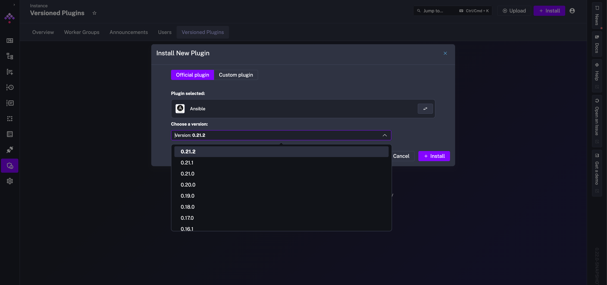
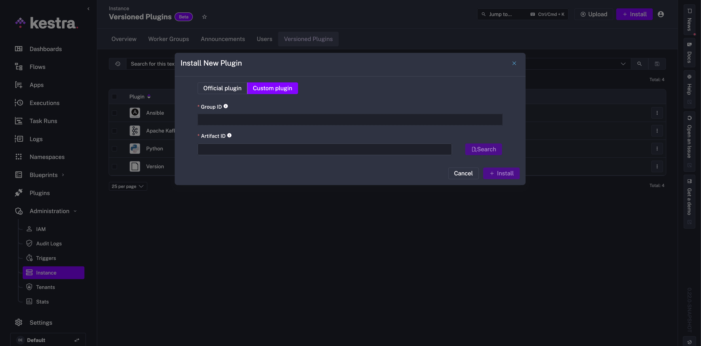

Use multiple versions of a plugin depending on your instance requirements and upgrade path.

## Versioned plugins – manage plugin upgrades

<div class="video-container">
    <iframe src="https://www.youtube.com/embed/h-vmMGlTGM8?si=BC_157leuRzfC0yt" title="YouTube video player" allow="accelerometer; autoplay; clipboard-write; encrypted-media; gyroscope; picture-in-picture; web-share" referrerpolicy="strict-origin-when-cross-origin" allowfullscreen></iframe>
</div>

---

Versioned plugins simplify the upgrade process. They allow you to pin older plugin versions to your production and legacy flows while using the latest version for newer flows, enabling granular version management in your Kestra instance.

## Configuration

Versioned plugins support several properties that can be modified in your Kestra configuration:

- `remoteStorageEnabled`: Specifies whether remote storage is enabled (i.e., plugins are stored on the internal storage).
- `localRepositoryPath`: The local path where managed plugins will be synced.
- `autoReloadEnabled`: Whether the server should periodically rescan repositories for new or removed plugins.
- `autoReloadInterval`: How often to rescan (duration, e.g., `60s`).
- `defaultVersion`: The version to use when none is specified in a flow. Accepted values: `LATEST`, `CURRENT`, `OLDEST`, `NONE`, or an explicit version (e.g., `0.20.0`).

An example configuration looks as follows:

```yaml
kestra:
  plugins:
      management:
        enabled: true # setting to false will make Versioned plugin tab disappear + API will return an error
        remoteStorageEnabled: true
        customPluginsEnabled: true # setting to false will disable installing or uploading custom plugins
        localRepositoryPath: /tmp/kestra/plugins-repository
        autoReloadEnabled: true
        autoReloadInterval: 60s
        defaultVersion: LATEST
```

### Allow-list URLs

In order to properly use Versioned Plugins, the following 3 URLs need to be allowed through your configuration:

- https://repo.maven.apache.org/maven2/
- https://registry.kestra.io/maven/
- https://api.kestra.io/

A default configuration looks like:

```yaml
kestra:
  plugins:
    repositories:
      central:
        url: https://repo.maven.apache.org/maven2/
      kestra:
        url: https://registry.kestra.io/maven
```

Refer to the [Plugins section](../../../configuration/index.md#plugins) in the Configuration guide for custom Maven repositories.

With remote storage enabled, installed plugins are stored in a plugins repository in the `_plugins/repository` path. For example, the below paths show the storage for 0.19.0 and 0.20.0 versions of the Shell script plugin:

```bash
_plugins/repository/io_kestra_plugin__plugin-script-shell__0_19_0
_plugins/repository/io_kestra_plugin__plugin-script-shell__0_19_0.jar
_plugins/repository/io_kestra_plugin__plugin-script-shell__0_20_0
_plugins/repository/io_kestra_plugin__plugin-script-shell__0_20_0.jar
```

Artifact files are renamed using the format: `<groupId>__<artifactId>__<version>` to be easily parseable (dots `.` are replaced with `_` for `groupId` and `version`).

For locally stored plugins configured by the `localRepositoryPath` attribute, the file path looks like `/tmp/kestra/plugins-repository`. For example, the following plugins are stored locally, where the local repository contains a JSON `plugins.meta` file that contains metadata about remote plugins. This file is used for synchronization, where only plugins with detected changes are synchronized.

```bash
├── io_kestra_plugin__plugin-kafka__0_20_0.jar
├── io_kestra_plugin__plugin-script-shell__0_20_0.jar
├── io_kestra_plugin__plugin-terraform__0_20_0.jar
├── io_kestra_plugin__plugin-transform-grok__0_20_0.jar
└── plugins.meta
```

## Configuration for EE-specific plugins

Some plugins are available only in the Enterprise Edition (EE) of Kestra. To install EE-specific plugins, you need to make sure that your [Kestra configuration](../../../configuration/index.md) has the `kestra.ee.license.fingerprint` property set (apart from the `kestra.ee.license.id` and `kestra.ee.license.key` properties). The `kestra.ee.license.fingerprint` property is used to verify that the EE license is valid and allows you to use EE-specific plugins.

## Install versioned plugins

Versioned plugins can be installed from the Kestra UI as well as programmatically.

### From the UI

Below is an video demonstration walking through each step from installation to application in a flow.

<div style="position: relative; padding-bottom: calc(48.95833333333333% + 41px); height: 0; width: 100%;"><iframe src="https://demo.arcade.software/xPS6BoFZhJkDgU9hQoCA?embed&embed_mobile=inline&embed_desktop=inline&show_copy_link=true" title="Versioned Plugins | Kestra EE" loading="lazy" webkitallowfullscreen mozallowfullscreen allowfullscreen allow="clipboard-write" style="position: absolute; top: 0; left: 0; width: 100%; height: 100%; color-scheme: light;" ></iframe></div>

Here are the steps again, listed one by one. Both Kestra official plugins and custom plugins can be installed from the UI. Navigate to the **Instance > Versioned Plugins** section. You can click **+ Install** and open up the full library of available plugins.


From the list, search and select the plugin to install and select the version.



After installing plugins, the full list of versioned plugins is displayed. Kestra alerts you that a newer version of your plugin is available and allows you to upgrade by installing the latest version. When upgrading, the previous version of the plugin is preserved, and a separate, fresh installation of the latest version is added.


For a custom plugin, after clicking **+ Install**, switch from Official plugin to Custom plugin. You need to specify two identifiers for each custom plugin installation:

- Group ID: The group identifier of the plugin to be installed.
- Artifact ID: The artifact identifier of the plugin to be installed.


Instead of installing a new plugin, you can **Upload** a plugin by choosing a valid Java archive file (`.jar`).



### From the API

Only Super Admin users can install versioned plugins with the API. To install a versioned plugin, you can use the API POST request with your username and password with `-u` or an [API token](../../03.auth/api-tokens/index.md).

With Kestra username and password:

```bash
curl -X POST http://0.0.0.0:8080/api/v1/cluster/versioned-plugins/install \
-u 'admin@kestra.io:kestra' \
-H "Content-Type: application/json" \
-d '{"plugins":["io.kestra.plugin:plugin-airbyte:0.21.0"]}'
```

With API Token:

```bash
curl -X POST http://0.0.0.0:8080/api/v1/cluster/versioned-plugins/install /
-H "Authorization: Bearer YOUR-API-TOKEN" \
-H "Content-Type: application/json" \
-d '{"plugins":["io.kestra.plugin:plugin-airbyte:0.21.0"]}'
```

To uninstall a versioned plugin, use the following DELETE request:

```bash
curl -X DELETE http://0.0.0.0:8080/api/v1/cluster/versioned-plugins/uninstall \
-u 'admin@kestra.io:kestra' \
-H "Content-Type: application/json" \
-d '{"plugins":["io.kestra.plugin:plugin-airbyte:0.21.0"]}'
```

To check for all available versions of a plugin, you can use the following API request to resolve:

```bash
curl -X POST http://0.0.0.0:8080/api/v1/cluster/versioned-plugins/resolve \
-u 'admin@kestra.io:kestra' \
-H "Content-Type: application/json" \
-d '{"plugins":["io.kestra.plugin:plugin-airbyte:0.21.0"]}'
```

If you want to install a newer plugin version, use the install request with the specified version or use `LATEST` instead of the version number. This creates a second, separate installation of the plugin, so you can keep using an old version in production flows and test using the newer version in development.

```bash
curl -X POST http://0.0.0.0:8080/api/v1/cluster/versioned-plugins/install \
-u 'admin@kestra.io:kestra' \
-H "Content-Type: application/json" \
-d '{"plugins":["io.kestra.plugin:plugin-airbyte:LATEST"]}'
```

### From the CLI

To install versioned plugins from the [Kestra CLI](../../../server-cli/index.md), you can use the following command:

```bash
./kestra plugins install --locally=false io.kestra.plugin:plugin-jdbc-duckdb:0.21.2
```

The `--locally` flag specifies whether the plugin should be installed locally or according to your Kestra configuration, where remote storage can be enabled.

- `--locally=true` installs the plugin locally.
- `--locally=false` checks if `remoteStorageEnabled` is enabled and then plugins are downloaded and pushed to the [configured internal storage](../../../configuration/index.md#internal-storage) directly.

## `version` property in a Flow

In Flow tasks or triggers, you can specify the version of the plugin to use with the `version` property. For example, if the instance has both 0.22.0 and 0.21.0 versions installed of the Shell script plugin, the version to use can be specified in the flow as follows:

```yaml
id: shell_script_example
namespace: company.team

tasks:
  - id: http_download
    type: io.kestra.plugin.core.http.Download
    uri: https://huggingface.co/datasets/kestra/datasets/raw/main/csv/orders.csv

  - id: shell_script_task
    type: io.kestra.plugin.scripts.shell.Script
    version: "0.21.0"
    outputFiles:
      - first.txt
    script: |
      echo "The current execution is : {{ execution.id }}"
      echo "1" >> first.txt
      cat {{ outputs.http_download.uri }}
```

The `version` property also accepts specific, non-case-sensitive values like in the configuration file:

- `LATEST` (or `latest`): To use the latest available version of a Kestra plugin.
- `OLDEST` (or `oldest`): To use the oldest available version of a Kestra plugin.

When there are multiple versions of a plugin available, Kestra resolves the version of a plugin by following this priority order:
1. **Task-Level**: Using the version specified in the `version` property.
2. **Flow-Level**: Using the plugin’s default version.
3. **Namespace-Level**: Using the plugin’s default version for the namespace.
4. **Instance-Level**: Using the value set in `kestra.plugins.management.defaultVersion` (default: `LATEST`).
    - This property can be configured to `NONE` to enforce that a version is always explicitly defined.

**Note**: By default, Kestra defaults to `LATEST` for core plugins if no version can be resolved. For other plugins, if no version can be resolved, the Flow will be considered invalid.

:::alert{type="info"}
The version is resolved both at flow creation time and execution time to ensure the correct plugin version is used during both stages. This means that a Task/Trigger can only be deserialized after ensuring that all default versions are properly resolved.
:::
