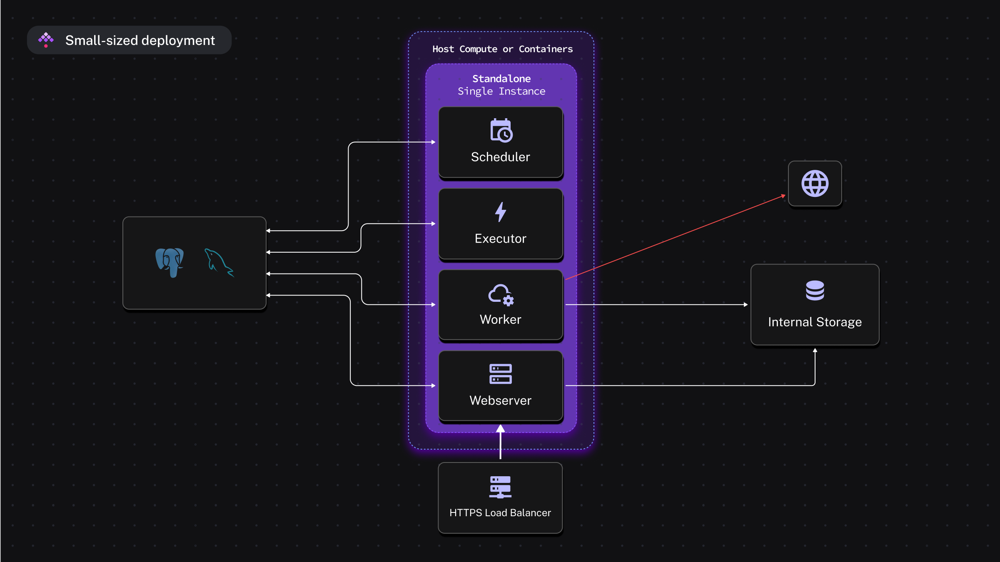
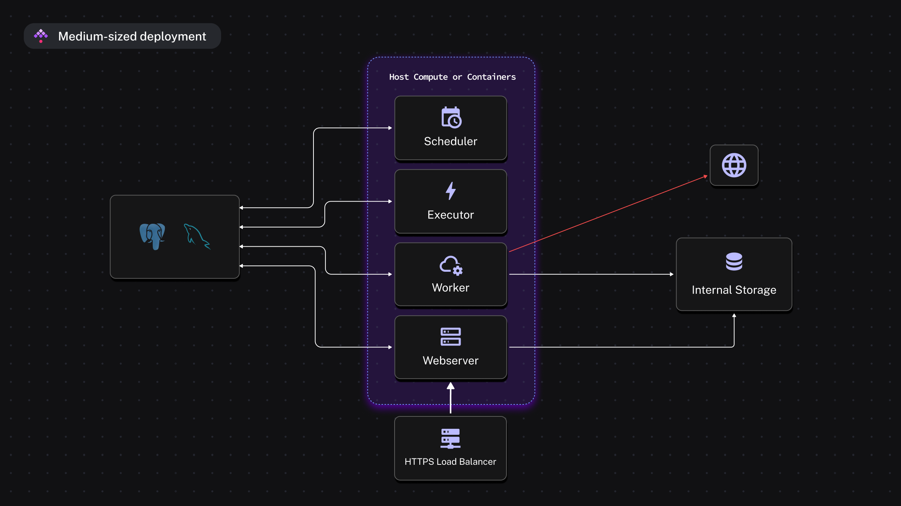
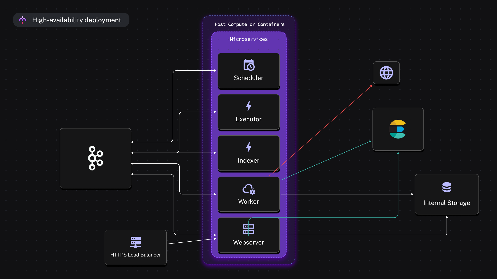

Kestra is a Java application distributed as an executable. It supports multiple deployment options:

- [Docker](../../02.installation/02.docker/index.md)
- [Kubernetes](../../02.installation/03.kubernetes/index.md)
- Manual deployment

Kestra's plugin system allows you to choose the dependency types that best match your requirements.

## Small-sized deployment

For small-scale deployments, you can use the Kestra **standalone server**, which runs all server components in a single process. This architecture has no scaling capability.

In this setup, a database is the only dependency, minimizing the stack to maintain. Supported databases include:

- PostgreSQL
- MySQL
- H2

## Medium-sized deployment

For medium-scale deployments where high availability is not required, Kestra can be run with a relational database (PostgreSQL or MySQL) as the only dependency. H2 is not recommended in distributed setups.

- Supported databases: PostgreSQL and MySQL
- All server components communicate through the database queue
- Each server role runs as its own process and can be scaled independently
- Workers communicate with the Worker Controller via gRPC; they never access the queue or database directly

If components are distributed across multiple hosts, use a shared [internal storage](../data-components/index.md#internal-storage) implementation such as [Google Cloud Storage](../../02.installation/09.gcp-vm/index.md), [AWS S3](../../02.installation/08.aws-ec2/index.md), or [Azure Blob Storage](../../02.installation/10.azure-vm/index.md).

## High-availability deployment

For high throughput and full horizontal and vertical scaling, replace the database queue with Kafka and Elasticsearch. This architecture removes single points of failure and enables scaling of all server components.

- Dependencies: Kafka and Elasticsearch
- Available only in the [Enterprise Edition](../../07.enterprise/01.overview/01.enterprise-edition/index.md)

As with medium deployments, a distributed [internal storage](../data-components/index.md#internal-storage) solution is required if components run on different hosts.

### Kafka

[Kafka](https://kafka.apache.org/) is the queue backbone of the high-availability deployment. The Executor, Scheduler, Worker Controller, Webserver, and Indexer emit to and subscribe from named Kafka topics — no two roles call each other directly.

Workers do not subscribe to Kafka topics. They connect to the Worker Controller via gRPC, and all job dispatch, result intake, and broadcast events travel over that stream.

Executors scale horizontally — each instance subscribes to the queue and processes the executions assigned to it. Because the executor performs lightweight orchestration work (state transitions, dispatch decisions), it typically requires minimal resources.

### Elasticsearch

[Elasticsearch](https://www.elastic.co/elasticsearch) acts as the search and read backend for Kestra's webserver, providing fast retrieval and aggregation of flows, executions, and logs. It is used exclusively by the API and UI.

The Indexer subscribes to Kafka topics and writes to Elasticsearch, keeping the search index in sync. Because the queue and search index are separate, executions continue processing even if Elasticsearch is temporarily unavailable.
