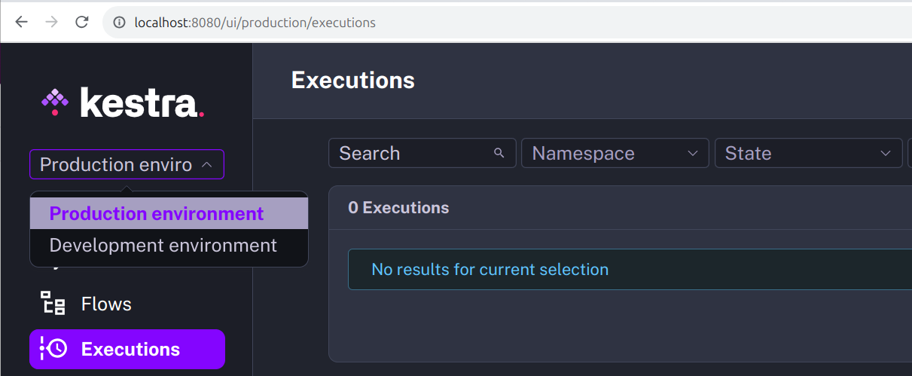

Multi-tenancy allows you to manage **multiple environments** (e.g., dev, staging, prod) in a single Kestra instance.

Multi-tenancy is a software architecture in which a single instance of software serves multiple tenants. You can think of it as running multiple virtual instances in a single physical instance. You can use multi-tenancy to **separate resources** between business units, teams, or customers.

This feature requires the [Enterprise Edition](../../07.enterprise/index.mdx).

## How does multi-tenancy work in Kestra

Every resource in Kestra belongs to exactly one tenant. The following are fully isolated per tenant:

| Resource | Description |
|---|---|
| [Flows](../../05.workflow-components/01.flow/index.md), [triggers](../../05.workflow-components/07.triggers/index.mdx), [executions](../../05.workflow-components/03.execution/index.md) | Core workflow resources — the same flow ID and namespace can exist independently in multiple tenants |
| [Namespaces](../../07.enterprise/02.governance/07.namespace-management/index.md) | Namespace hierarchy, variables, KV store, namespace files, and task defaults |
| [RBAC](../../07.enterprise/03.auth/rbac/index.md) — roles, users, groups, service accounts | Access control is fully scoped to the tenant |
| [Secrets](../../07.enterprise/02.governance/secrets-manager/index.md) | Secret keys and values are never shared across tenants |
| [Policies](../../07.enterprise/02.governance/policies/index.md) | Governance rules (injection, validation, enforcement) are scoped to tenant and namespace |
| [Worker Queues](../../07.enterprise/04.scalability/worker-group/index.md) | Task routing rules are tenant-scoped |
| [Audit logs](../../07.enterprise/02.governance/06.audit-logs/index.md) | Activity logs are isolated and queryable per tenant |
| [Internal storage](../data-components/index.md#internal-storage) | Execution outputs and task data are stored in tenant-specific paths |

Instance-level resources — configuration, license, static policies, and superadmin banners — sit above the tenant layer and require Superadmin access.

Users switch between tenants using the tenant dropdown in the bottom-left corner of the UI. The dropdown lists every tenant the user has access to; the active tenant is indicated with a checkmark. Each UI page also includes the tenant ID in the URL (e.g., `https://demo.kestra.io/ui/yourTenantId/executions/namespace/flow/executionId`).

Tenants are created and managed through the **Super Admin console** (**Settings → Super Admin → Tenants**) — only users with the Superadmin role can create, edit, or delete tenants. Users must be granted access to a tenant before they can switch to it. See [Tenants](../../07.enterprise/02.governance/tenants/index.md) for configuration details.

Most [API](../../api-reference/index.mdx) endpoints are scoped to a tenant and include the tenant identifier in the path — for example, `/api/v1/{tenant_id}/flows/products` to list flows in the `products` namespace. Instance-level endpoints such as `/api/v1/configs` or `/api/v1/license-info` have no tenant segment. See the [Enterprise Edition API Guide](../../api-reference/01.enterprise/index.mdx) for the full reference.
