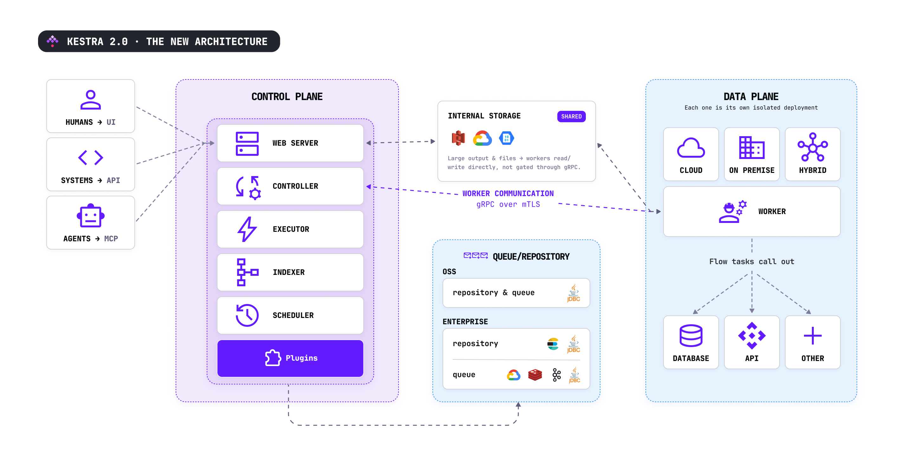
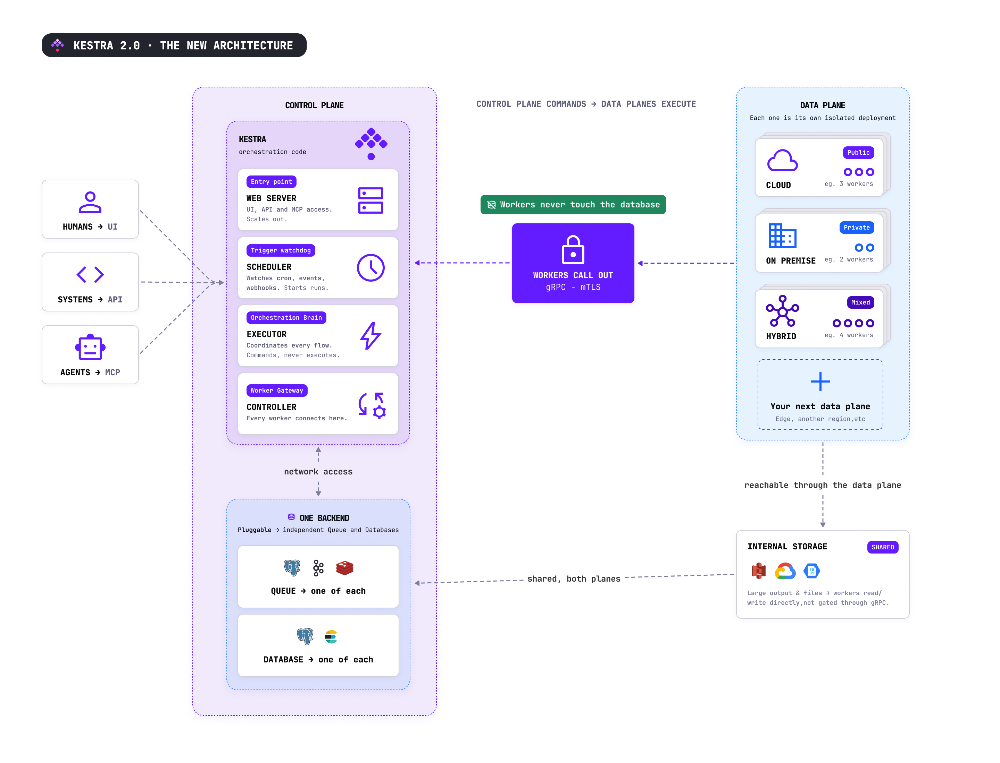

Kestra is built on a single unified, pluggable backend. One set of queue and persistence contracts is satisfied by your chosen backend — a relational database by default, or a broker-backed alternative for higher throughput. All server roles are stateless and communicate only through the queue layer; no role calls another directly.

## Control plane and data plane

Kestra's server roles divide into two planes:

- **Control plane** — the stateless coordination roles: Executor, Worker Controller, Scheduler, Webserver, and Indexer. These roles never execute user code and have no access to user infrastructure. They communicate exclusively through the queue.
- **Data plane** — the Worker. Workers execute runnable tasks and polling triggers, and are the only roles that access user infrastructure and internal storage. A Worker connects to the control plane's Worker Controller over a bidirectional gRPC stream and can run in cloud, on-premises, or hybrid environments independently of the rest of the deployment.

This separation enables hybrid deployments where the control plane is managed by Kestra while Workers run inside your own infrastructure, or both are self-hosted.

## Server roles

Kestra has six server roles. In a standalone deployment, all six run as threads inside a single process. In a distributed deployment, each role runs as its own independently scaled process.

| Role | Responsibility |
|------|---------------|
| **Executor** | Drives the execution state machine. Consumes execution events and worker results, determines the next task to run, and dispatches work. Runs no user code. |
| **Worker Controller** | The sole communication point for workers. Dispatches jobs to workers over a bidirectional gRPC stream; accepts results, logs, and metrics back. Workers never touch the queue or database directly. |
| **Worker** | Executes runnable tasks and polling triggers. Connects to the Worker Controller via gRPC. The only role that accesses user infrastructure and [internal storage](./data-components/index.md#internal-storage). |
| **Scheduler** | Evaluates trigger conditions (except flow triggers, which the Executor handles) and submits executions to the queue. |
| **Webserver** | Serves the [REST API](../api-reference/index.mdx) and [UI](../09.ui/index.mdx). |
| **Indexer** | Reads from the queue and writes indexed content — flows, executions, logs, metrics, and audit logs — to the repository backend. Required in all deployments. |

## Queue and repository

The queue layer is the only channel through which server roles communicate. A server emits a typed message onto a named queue; another server consumes it. One backend implementation satisfies all queue contracts:

- **JDBC** (default) — backed by any supported relational database (PostgreSQL, MySQL). Available in all editions.
- **Kafka** — Enterprise Edition. Pairs with Elasticsearch for the search and read model.
- **Redis**, **AMQP**, **GCP Pub/Sub** — Enterprise Edition. Additional broker-backed options for higher throughput.

The repository stores all domain entities: flows, executions, logs, triggers, and secrets. In a JDBC deployment, the relational database handles both the queue and repository. In a Kafka deployment, Elasticsearch backs the high-volume read model; the Indexer keeps it in sync.

## Worker communication

Workers do not subscribe to the job queue directly. Each worker opens a persistent bidirectional gRPC stream to the Worker Controller and uses that stream for the lifetime of its connection:

- The Worker Controller dispatches jobs from the queue onto the stream.
- Workers return results, logs, and metrics over the same stream.
- Kill signals and metadata changes are broadcast to all connected workers.

gRPC transport is available in all editions. TLS and mTLS secure the connection in all editions; JWT-based worker authentication is an Enterprise Edition feature.

## How an execution runs

1. A user or client defines a flow through the Webserver's REST API. The flow is validated and stored in the repository under its namespace.
2. A trigger fires — a schedule comes due, an external event matches, or an API call requests a run. The Scheduler (for schedule and polling triggers) or the Webserver (for manual runs) emits a new execution onto the queue.
3. The Executor picks up the execution and runs its state machine to decide the next task.
4. For each task, the Executor asks the worker-queue resolver for a routing decision, then dispatches a worker task onto the queue.
5. The Worker Controller routes the job to a matching worker. The worker loads the task plugin, reads any inputs from internal storage, executes the task code, writes outputs back to internal storage, and emits the result.
6. The Executor joins the result back into the execution, advances the state machine, and either dispatches the next task or terminates the execution.
7. The Webserver serves the evolving execution state and logs to the UI by reading the repository. The Indexer keeps the read model in sync.

## Execution context

Task outputs are stored separately from the execution row and fetched on demand. This keeps the execution record small as flows grow in complexity and improves performance at high concurrency.

## Enterprise Edition

Enterprise Edition is an additive overlay on the open-source core — not a fork. It adds multi-tenancy, action-based RBAC, identity-provider integration, audit logging, and additional queue backends by supplying alternative implementations of the same core contracts the open-source engine depends on. All open-source behavior is preserved.

## Monitoring

Every server role exposes a Prometheus scrape endpoint and OpenTelemetry traces. Three platform-wide metrics serve as primary health signals:

| Metric | Description |
|--------|-------------|
| `kestra.queue.message.lag.count` | Backlog of unprocessed messages, tagged by worker queue. A steadily rising lag means consumers cannot keep up with producers. |
| `kestra.worker.job.pending` | Worker jobs waiting for a free worker thread across the cluster. |
| `kestra.worker.job.running` | Worker jobs currently executing across the cluster. |

Per-role metrics are documented on each component's page.

## Components in detail

import ChildCard from "~/components/docs/ChildCard.astro"

<ChildCard />
