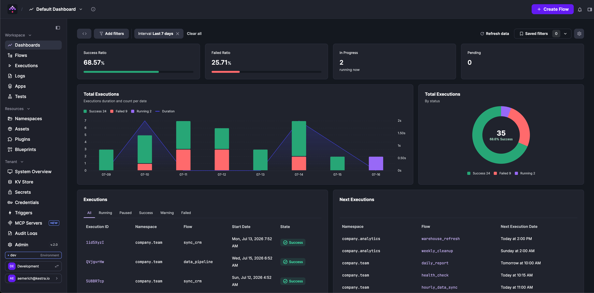
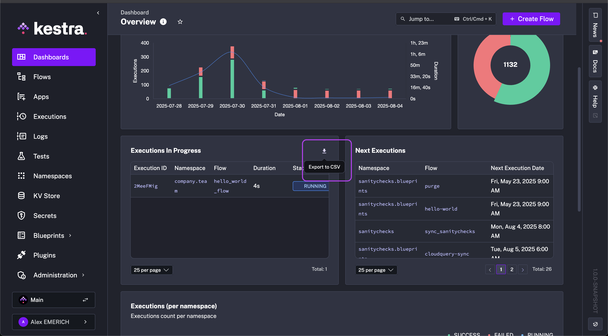

Get insights into your workflows with Dashboards.

## Monitor Kestra executions with dashboards

The first time you access the main **Dashboard**, you'll see the **Welcome Page** and you can click **Create my first flow** to launch a Guided Tour.

Once you have executed a flow, you will see your flow executions in the dashboard.

## Dashboard page

The Dashboard page displays both the **default dashboard** and any **custom dashboards** you've created. To switch between dashboards, use the hamburger menu. If you have over 10 dashboards, type the dashboard name in the search bar to quickly find it. The same menu also lets you edit or delete existing dashboards. From your dashboard, you can apply and save filters, refresh data, and set an automatic periodic refresh.



Dashboards provide a load of useful data right at your finger tips, including:
- Executions over time
- Execution Status for Today, Yesterday as well as Last 30 days
- Executions per namespace
- Execution errors per namespace
- List of failed Executions
- List of error logs
- A ratio of execution successes to total executions

## Custom dashboards

Dashboards let you define custom queries and charts to visualize data on your executions, logs, and metrics. Rather than relying only on the default dashboard on Kestra's home screen, you can create a custom dashboard with charts that answer specific questions and track key metrics. Each chart's configuration can be modified individually using the pencil icon in the dashboard view.

:::alert{type="info"}
Check out the [No-Code Dashboards guide](../../no-code/02.no-code-dashboards/index.md) to know more about building Dashboards without touching YAML.
:::

### Chart types

Dashboards support six chart types: **Bar**, **Pie**, **TimeSeries**, **Table**, **KPI**, and **Markdown**. Each data chart type is composed of `chartOptions` and `data`.

A chart's `chartOptions` property is where you customize display names and descriptions, and choose whether to add legends and tooltips to complement the visualization. A chart's `data` property is where you specify which Kestra data to use as a column, how you want the data displayed (e.g., an aggregate count or an `ORDER BY`), and add any [filters](#querying-data) you might want applied to the chart (e.g., REGEX match, greater or less than, or not Null).

Each chart's options are listed in the [Chart Plugin Documentation](/plugins/core/chart) where you can dive further into the properties of each type.

#### Common chart properties

All chart types share the following `chartOptions` properties:

| Property | Required | Default | Description |
| --- | --- | --- | --- |
| `displayName` | Yes | — | The title displayed on the chart |
| `description` | No | — | An optional subtitle or description |
| `width` | No | `6` | Width of the chart on a 12-column grid (1–12) |

#### Bar chart

`type: io.kestra.plugin.core.dashboard.chart.Bar`

Compares categorical data across groups. Requires exactly one aggregation column.

Additional `chartOptions` properties:

| Property | Required | Default | Description |
| --- | --- | --- | --- |
| `column` | Yes | — | The data column to use as the x-axis categories |
| `legend.enabled` | No | `true` | Show or hide the legend |
| `tooltip` | No | `ALL` | Tooltip display behavior: `NONE`, `ALL`, or `SINGLE` |

```yaml
charts:
  - id: executions_per_namespace_bars
    type: io.kestra.plugin.core.dashboard.chart.Bar
    chartOptions:
      displayName: Executions per Namespace
      description: Execution count per namespace
      column: namespace
      legend:
        enabled: true
    data:
      type: io.kestra.plugin.core.dashboard.data.Executions
      columns:
        namespace:
          field: NAMESPACE
        state:
          field: STATE
        total:
          displayName: Executions
          agg: COUNT
```

#### Pie chart

`type: io.kestra.plugin.core.dashboard.chart.Pie`

Shows proportions and distributions. Requires exactly one aggregation column.

Additional `chartOptions` properties:

| Property | Required | Default | Description |
| --- | --- | --- | --- |
| `graphStyle` | No | `DONUT` | Chart style: `PIE` or `DONUT` |
| `colorByColumn` | No | — | The column whose values determine segment colors |
| `legend.enabled` | No | `true` | Show or hide the legend |
| `tooltip` | No | `ALL` | Tooltip display behavior: `NONE`, `ALL`, or `SINGLE` |

```yaml
charts:
  - id: executions_pie
    type: io.kestra.plugin.core.dashboard.chart.Pie
    chartOptions:
      displayName: Total Executions
      description: Total executions per state
      graphStyle: DONUT
      colorByColumn: state
      legend:
        enabled: true
    data:
      type: io.kestra.plugin.core.dashboard.data.Executions
      columns:
        state:
          field: STATE
        total:
          agg: COUNT
```

#### TimeSeries chart

`type: io.kestra.plugin.core.dashboard.chart.TimeSeries`

Tracks trends over time. Requires between one and two aggregation columns.

Additional `chartOptions` properties:

| Property | Required | Default | Description |
| --- | --- | --- | --- |
| `column` | Yes | — | The data column to use as the time (x) axis |
| `colorByColumn` | No | — | The column whose values determine series colors |
| `legend.enabled` | No | `true` | Show or hide the legend |
| `tooltip` | No | `ALL` | Tooltip display behavior: `NONE`, `ALL`, or `SINGLE` |

The `graphStyle` property can be set per column in `data.columns` to control how each series is rendered: `LINES`, `BARS`, or `POINTS`. It defaults to `LINES` when an aggregation is set.

```yaml
charts:
  - id: executions_timeseries
    type: io.kestra.plugin.core.dashboard.chart.TimeSeries
    chartOptions:
      displayName: Executions
      description: Executions last week
      column: date
      colorByColumn: state
      legend:
        enabled: true
    data:
      type: io.kestra.plugin.core.dashboard.data.Executions
      columns:
        date:
          field: START_DATE
          displayName: Date
        state:
          field: STATE
        total:
          displayName: Executions
          agg: COUNT
          graphStyle: BARS
        duration:
          displayName: Duration
          field: DURATION
          agg: SUM
          graphStyle: LINES
```

#### KPI chart

`type: io.kestra.plugin.core.dashboard.chart.KPI`

Displays a single key performance indicator value. Requires exactly one aggregation column. Use `ExecutionsKPI`, `FlowsKPI`, `LogsKPI`, or `MetricsKPI` as the data type for KPI charts.

To display a ratio (e.g., success rate), use the `numerator` property to filter the subset of rows that count toward the numerator. All rows matching the chart's `where` clause form the denominator.

Additional `chartOptions` properties:

| Property | Required | Default | Description |
| --- | --- | --- | --- |
| `numberType` | No | `FLAT` | Display format: `FLAT` (raw count) or `PERCENTAGE` |

```yaml
charts:
  - id: kpi_success_percentage
    type: io.kestra.plugin.core.dashboard.chart.KPI
    chartOptions:
      displayName: Success Ratio
      numberType: PERCENTAGE
      width: 3
    data:
      type: io.kestra.plugin.core.dashboard.data.ExecutionsKPI
      columns:
        field: FLOW_ID
        agg: COUNT
      numerator:
        - field: STATE
          type: IN
          values:
            - SUCCESS
      where:
        - field: NAMESPACE
          type: EQUAL_TO
          value: "company.team"
```

#### Table

`type: io.kestra.plugin.core.dashboard.chart.Table`

Displays structured data in a sortable, paginated table.

Additional `chartOptions` properties:

| Property | Required | Default | Description |
| --- | --- | --- | --- |
| `header.enabled` | No | `true` | Show or hide the table header row |
| `pagination.enabled` | No | `true` | Show or hide table pagination controls |

Column-level properties unique to tables:

| Property | Required | Default | Description |
| --- | --- | --- | --- |
| `columnAlignment` | No | `LEFT` | Text alignment within the column: `LEFT`, `RIGHT`, or `CENTER` |

```yaml
charts:
  - id: table_metrics
    type: io.kestra.plugin.core.dashboard.chart.Table
    chartOptions:
      displayName: Sum of sales per namespace
    data:
      type: io.kestra.plugin.core.dashboard.data.Metrics
      columns:
        namespace:
          field: NAMESPACE
        value:
          field: VALUE
          agg: SUM
          columnAlignment: RIGHT
      where:
        - field: NAME
          type: EQUAL_TO
          value: sales_count
      orderBy:
        - column: value
          order: DESC
```

#### Markdown

`type: io.kestra.plugin.core.dashboard.chart.Markdown`

Adds explanatory text or context alongside data charts. No `data` property is required.

The content of a Markdown chart is set via the `source` property. Two source types are available:

**Text** — inline Markdown content:

```yaml
charts:
  - id: markdown_insight
    type: io.kestra.plugin.core.dashboard.chart.Markdown
    chartOptions:
      displayName: Chart Insights
      description: How to interpret this chart
    source:
      type: Text
      content: |
        ## Execution Success Rate

        This chart displays the percentage of successful executions over time.

        - A **higher success rate** indicates stable and reliable workflows.
        - Sudden **drops** may signal issues in task execution or external dependencies.
```

**FlowDescription** — pulls the description from a specific flow:

```yaml
charts:
  - id: markdown_flow_desc
    type: io.kestra.plugin.core.dashboard.chart.Markdown
    chartOptions:
      displayName: Flow Overview
    source:
      type: FlowDescription
      namespace: company.team
      flowId: my_flow
```

:::alert{type="info"}
The `content` shorthand (used in earlier examples) sets plain text content directly. The `source` property gives you access to the `FlowDescription` type to pull dynamic content from a flow's description field.
:::

## Create a new custom dashboard as code

Clicking on the `+ Create new dashboard` button opens a code editor where you can define the dashboard layout and data sources as code.

The top-level dashboard properties are:

| Property | Description |
| --- | --- |
| `title` | Dashboard title |
| `description` | Optional description |
| `timeWindow.default` | Default time range, as an ISO 8601 duration (e.g., `P7D`) |
| `timeWindow.max` | Maximum selectable time range (e.g., `P365D`) |
| `charts` | List of chart definitions |

Below is an example of a dashboard definition that displays executions over time, flow execution success ratio, a table that uses metrics to display the sum of sales per namespace, a table that shows the log count by level per namespace, and a Markdown insights panel:

:::collapse{title="Expand for an example dashboard definition"}
```yaml
title: Getting Started
description: First custom dashboard
timeWindow:
  default: P7D
  max: P365D
charts:
  - id: executions_timeseries
    type: io.kestra.plugin.core.dashboard.chart.TimeSeries
    chartOptions:
      displayName: Executions
      description: Executions last week
      legend:
        enabled: true
      column: date
      colorByColumn: state
    data:
      type: io.kestra.plugin.core.dashboard.data.Executions
      columns:
        date:
          field: START_DATE
          displayName: Date
        state:
          field: STATE
        total:
          displayName: Executions
          agg: COUNT
          graphStyle: BARS
        duration:
          displayName: Duration
          field: DURATION
          agg: SUM
          graphStyle: LINES

  - id: kpi_success_percentage
    type: io.kestra.plugin.core.dashboard.chart.KPI
    chartOptions:
      displayName: Success Ratio
      numberType: PERCENTAGE
      width: 3
    data:
      type: io.kestra.plugin.core.dashboard.data.ExecutionsKPI
      columns:
        field: FLOW_ID
        agg: COUNT
      numerator:
        - field: STATE
          type: IN
          values:
            - SUCCESS
      where:
        - field: NAMESPACE
          type: EQUAL_TO
          value: "company.team"

  - id: table_metrics
    type: io.kestra.plugin.core.dashboard.chart.Table
    chartOptions:
      displayName: Sum of sales per namespace
    data:
      type: io.kestra.plugin.core.dashboard.data.Metrics
      columns:
        namespace:
          field: NAMESPACE
        value:
          field: VALUE
          agg: SUM
      where:
        - field: NAME
          type: EQUAL_TO
          value: sales_count
        - field: NAMESPACE
          type: IN
          values:
            - dev_graph
            - prod_graph
      orderBy:
        - column: value
          order: DESC

  - id: table_logs
    type: io.kestra.plugin.core.dashboard.chart.Table
    chartOptions:
      displayName: Log count by level for filtered namespace
    data:
      type: io.kestra.plugin.core.dashboard.data.Logs
      columns:
        level:
          field: LEVEL
        count:
          agg: COUNT
      where:
        - field: NAMESPACE
          type: IN
          values:
            - dev_graph
            - prod_graph

  - id: markdown
    type: io.kestra.plugin.core.dashboard.chart.Markdown
    chartOptions:
      displayName: Chart Insights
      description: How to interpret this chart
    source:
      type: Text
      content: |
        ## Execution Success Rate

        This chart displays the percentage of successful executions over time.

        - A **higher success rate** indicates stable and reliable workflows.
        - Sudden **drops** may signal issues in task execution or external dependencies.
        - Use this insight to identify trends and optimize performance.
```
:::

:::alert{type="info"}
To see all available properties to configure a custom dashboard as code, see examples provided in the [Enterprise Edition Examples](https://github.com/kestra-io/enterprise-edition-examples) repository.
:::

## Exporting data

Table data can be exported as a CSV file by hovering over the top-right corner and clicking the download icon. This enables dashboard users to build custom queries in Dashboards and to export data with one click without having to worry about pagination.



## Querying data

The `data` property of a chart defines the type of data that is queried and displayed. The `type` determines which columns are available.

### Data source types

Dashboards can query data from these source `types`:

| Type | Description |
| --- | --- |
| `io.kestra.plugin.core.dashboard.data.Executions` | Workflow execution data |
| `io.kestra.plugin.core.dashboard.data.ExecutionsKPI` | Execution data for KPI charts (supports `numerator`) |
| `io.kestra.plugin.core.dashboard.data.Flows` | Flow definition data |
| `io.kestra.plugin.core.dashboard.data.FlowsKPI` | Flow data for KPI charts (supports `numerator`) |
| `io.kestra.plugin.core.dashboard.data.Logs` | Log entries produced by your workflows |
| `io.kestra.plugin.core.dashboard.data.LogsKPI` | Log data for KPI charts (supports `numerator`) |
| `io.kestra.plugin.core.dashboard.data.Metrics` | Metrics emitted by your plugins |
| `io.kestra.plugin.core.dashboard.data.MetricsKPI` | Metrics data for KPI charts (supports `numerator`) |
| `io.kestra.plugin.core.dashboard.data.Triggers` | Trigger state and scheduling data |

### Available fields by data source

After defining the data source, specify the columns to display in the chart. Each column is defined by its `field`. The fields available depend on the data source type:

**Executions / ExecutionsKPI:**

| Field | Description |
| --- | --- |
| `ID` | Execution ID |
| `NAMESPACE` | Namespace of the flow |
| `FLOW_ID` | Flow identifier |
| `FLOW_REVISION` | Flow revision number |
| `STATE` | Execution state (e.g., `SUCCESS`, `FAILED`) |
| `DURATION` | Execution duration |
| `LABELS` | Key-value labels attached to the execution |
| `START_DATE` | Execution start timestamp |
| `END_DATE` | Execution end timestamp |
| `TRIGGER_EXECUTION_ID` | ID of the execution that triggered this one |
| `SCOPE` | Execution scope |

**Flows / FlowsKPI:**

| Field | Description |
| --- | --- |
| `ID` | Flow identifier |
| `NAMESPACE` | Namespace of the flow |
| `REVISION` | Flow revision number |

**Logs / LogsKPI:**

| Field | Description |
| --- | --- |
| `NAMESPACE` | Namespace of the flow |
| `FLOW_ID` | Flow identifier |
| `EXECUTION_ID` | Associated execution ID |
| `TASK_ID` | Task that produced the log |
| `DATE` | Log timestamp |
| `TASK_RUN_ID` | Task run identifier |
| `ATTEMPT_NUMBER` | Task attempt number |
| `TRIGGER_ID` | Trigger identifier |
| `LEVEL` | Log level (e.g., `INFO`, `WARN`, `ERROR`) |
| `MESSAGE` | Log message text (cannot be aggregated) |

**Metrics / MetricsKPI:**

| Field | Description |
| --- | --- |
| `NAMESPACE` | Namespace of the flow |
| `FLOW_ID` | Flow identifier |
| `TASK_ID` | Task that emitted the metric |
| `EXECUTION_ID` | Associated execution ID |
| `TASK_RUN_ID` | Task run identifier |
| `TYPE` | Metric type |
| `NAME` | Metric name |
| `VALUE` | Metric value |
| `DATE` | Metric timestamp |

**Triggers:**

| Field | Description |
| --- | --- |
| `ID` | Trigger identifier |
| `NAMESPACE` | Namespace of the flow |
| `FLOW_ID` | Flow identifier |
| `TRIGGER_ID` | Trigger identifier within the flow |
| `EXECUTION_ID` | Last execution ID triggered |
| `NEXT_EXECUTION_DATE` | Scheduled next execution date |
| `WORKER_ID` | Worker handling the trigger |

### Column properties

Each entry in `data.columns` supports the following properties:

| Property | Description |
| --- | --- |
| `field` | The only required property; specifies which field from the data source to use |
| `displayName` | Sets the label displayed in the chart |
| `agg` | Aggregation function: `AVG`, `COUNT`, `MAX`, `MIN`, or `SUM` |
| `graphStyle` | Series render style for TimeSeries charts: `LINES`, `BARS`, or `POINTS` (defaults to `LINES` when `agg` is set) |
| `columnAlignment` | Column text alignment for Table charts: `LEFT`, `RIGHT`, or `CENTER` |
| `labelKey` | When `field: LABELS`, filters to a specific [label](../../05.workflow-components/08.labels/index.md) key |

### Filtering data

Use the `where` property to filter the result set before it is displayed. Filters can apply to any field in the data source. Multiple conditions in `where` are combined with `AND` by default. To use `OR` logic, set `type: OR` on a condition.

Available filter types:
- `CONTAINS`
- `ENDS_WITH`
- `EQUAL_TO`
- `GREATER_THAN`
- `GREATER_THAN_OR_EQUAL_TO`
- `IN`
- `IS_FALSE`
- `IS_NOT_NULL`
- `IS_NULL`
- `IS_TRUE`
- `LESS_THAN`
- `LESS_THAN_OR_EQUAL_TO`
- `NOT_EQUAL_TO`
- `NOT_IN`
- `OR`
- `REGEX`
- `STARTS_WITH`
