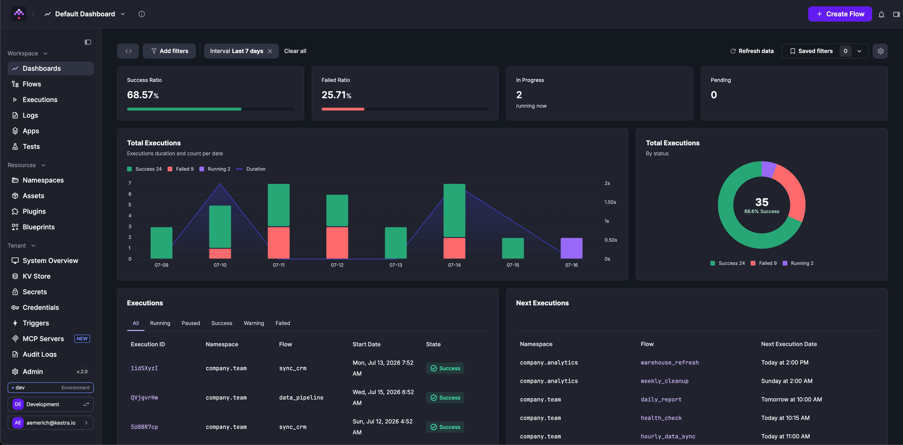
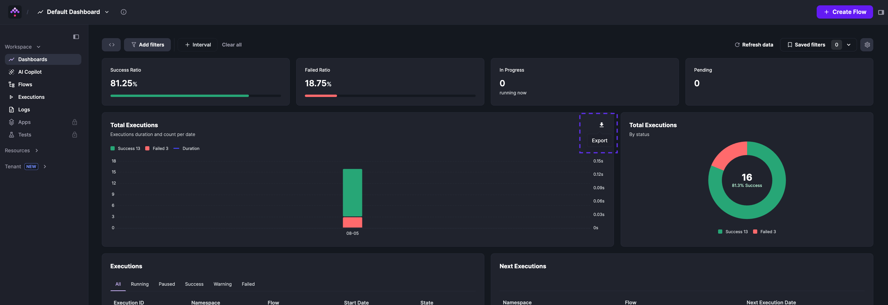

The **Dashboards** page displays the default dashboard and any custom dashboards you've created. Switch between them using the hamburger menu — if you have more than 10, use the search bar. The same menu lets you edit or delete dashboards. From any dashboard you can apply and save filters, refresh data, and set an automatic periodic refresh.



## Custom dashboards

Custom dashboards let you define queries and charts to visualize execution, log, and metric data. Edit each chart individually using the pencil icon in the dashboard view.

Build dashboards using the **No Code editor** (no YAML required) or by **writing YAML directly**. Both produce the same schema-validated output.

### No Code editor

The No Code editor lets you design dashboards using structured forms. As you configure charts and data sources, YAML is generated in real time and the live preview stays in sync. Switch to YAML at any point for filters, dynamic queries, or advanced layout logic — both views reflect the same underlying definition.

#### Interactive demo

<div style="position: relative; padding-bottom: calc(48.9583% + 41px); height: 0px; width: 100%;"><iframe src="https://demo.arcade.software/A1Gzd3z79SqN1t2cSqGN?embed&embed_mobile=tab&embed_desktop=inline&show_copy_link=true" title="Dashboard No Code | Kestra" frameborder="0" loading="lazy" webkitallowfullscreen mozallowfullscreen allowfullscreen allow="clipboard-write; autoplay" style="position: absolute; top: 0; left: 0; width: 100%; height: 100%; color-scheme: light;" ></iframe></div>

For a step-by-step walkthrough of building your first KPI chart using the No Code editor, see [Build a KPI success ratio chart](../../15.how-to-guides/dashboard-kpi-chart/index.md).

### Chart types

Dashboards support six chart types: **Bar**, **Pie**, **TimeSeries**, **Table**, **KPI**, and **Markdown**. Each data chart type is composed of `chartOptions` and `data`.

A chart's `chartOptions` property controls display names, descriptions, legends, and tooltips. The `data` property specifies the data source, which columns to display (including aggregations and sort order), and any [filters](#querying-data) to apply.

Each chart's options are listed in the [Chart Plugin Documentation](/plugins/core/chart) where you can dive further into the properties of each type.

#### Common chart properties

All chart types share the following `chartOptions` properties:

| Property | Required | Default | Description |
| --- | --- | --- | --- |
| `displayName` | Yes | — | The title displayed on the chart |
| `description` | No | — | An optional subtitle or description |
| `width` | No | `6` | Width of the chart on a 12-column grid (1–12) |

#### Bar chart

`type: io.kestra.plugin.core.dashboard.chart.Bar`

Compares categorical data across groups. Requires exactly one aggregation column.

Additional `chartOptions` properties:

| Property | Required | Default | Description |
| --- | --- | --- | --- |
| `column` | Yes | — | The data column to use as the x-axis categories |
| `legend.enabled` | No | `true` | Show or hide the legend |
| `tooltip` | No | `ALL` | Tooltip display behavior: `NONE`, `ALL`, or `SINGLE` |

```yaml
charts:
  - id: executions_per_namespace_bars
    type: io.kestra.plugin.core.dashboard.chart.Bar
    chartOptions:
      displayName: Executions per Namespace
      description: Execution count per namespace
      column: namespace
      legend:
        enabled: true
    data:
      type: io.kestra.plugin.core.dashboard.data.Executions
      columns:
        namespace:
          field: NAMESPACE
        state:
          field: STATE
        total:
          displayName: Executions
          agg: COUNT
```

#### Pie chart

`type: io.kestra.plugin.core.dashboard.chart.Pie`

Shows proportions and distributions. Requires exactly one aggregation column.

Additional `chartOptions` properties:

| Property | Required | Default | Description |
| --- | --- | --- | --- |
| `graphStyle` | No | `DONUT` | Chart style: `PIE` or `DONUT` |
| `colorByColumn` | No | — | The column whose values determine segment colors |
| `legend.enabled` | No | `true` | Show or hide the legend |
| `tooltip` | No | `ALL` | Tooltip display behavior: `NONE`, `ALL`, or `SINGLE` |

```yaml
charts:
  - id: executions_pie
    type: io.kestra.plugin.core.dashboard.chart.Pie
    chartOptions:
      displayName: Total Executions
      description: Total executions per state
      graphStyle: DONUT
      colorByColumn: state
      legend:
        enabled: true
    data:
      type: io.kestra.plugin.core.dashboard.data.Executions
      columns:
        state:
          field: STATE
        total:
          agg: COUNT
```

#### TimeSeries chart

`type: io.kestra.plugin.core.dashboard.chart.TimeSeries`

Tracks trends over time. Requires between one and two aggregation columns.

Additional `chartOptions` properties:

| Property | Required | Default | Description |
| --- | --- | --- | --- |
| `column` | Yes | — | The data column to use as the time (x) axis |
| `colorByColumn` | No | — | The column whose values determine series colors |
| `legend.enabled` | No | `true` | Show or hide the legend |
| `tooltip` | No | `ALL` | Tooltip display behavior: `NONE`, `ALL`, or `SINGLE` |

The `graphStyle` property can be set per column in `data.columns` to control how each series is rendered: `LINES`, `BARS`, or `POINTS`. It defaults to `LINES` when an aggregation is set.

```yaml
charts:
  - id: executions_timeseries
    type: io.kestra.plugin.core.dashboard.chart.TimeSeries
    chartOptions:
      displayName: Executions
      description: Executions last week
      column: date
      colorByColumn: state
      legend:
        enabled: true
    data:
      type: io.kestra.plugin.core.dashboard.data.Executions
      columns:
        date:
          field: START_DATE
          displayName: Date
        state:
          field: STATE
        total:
          displayName: Executions
          agg: COUNT
          graphStyle: BARS
        duration:
          displayName: Duration
          field: DURATION
          agg: SUM
          graphStyle: LINES
```

#### KPI chart

`type: io.kestra.plugin.core.dashboard.chart.KPI`

Displays a single key performance indicator value. Requires exactly one aggregation column. Use `ExecutionsKPI`, `FlowsKPI`, `LogsKPI`, or `MetricsKPI` as the data type for KPI charts.

To display a ratio (e.g., success rate), use the `numerator` property to filter the subset of rows that count toward the numerator. All rows matching the chart's `where` clause form the denominator.

Additional `chartOptions` properties:

| Property | Required | Default | Description |
| --- | --- | --- | --- |
| `numberType` | No | `FLAT` | Display format: `FLAT` (raw count) or `PERCENTAGE` |

```yaml
charts:
  - id: kpi_success_percentage
    type: io.kestra.plugin.core.dashboard.chart.KPI
    chartOptions:
      displayName: Success Ratio
      numberType: PERCENTAGE
      width: 3
    data:
      type: io.kestra.plugin.core.dashboard.data.ExecutionsKPI
      columns:
        field: FLOW_ID
        agg: COUNT
      numerator:
        - field: STATE
          type: IN
          values:
            - SUCCESS
      where:
        - field: NAMESPACE
          type: EQUAL_TO
          value: "company.team"
```

#### Table

`type: io.kestra.plugin.core.dashboard.chart.Table`

Displays structured data in a sortable, paginated table.

Additional `chartOptions` properties:

| Property | Required | Default | Description |
| --- | --- | --- | --- |
| `header.enabled` | No | `true` | Show or hide the table header row |
| `pagination.enabled` | No | `true` | Show or hide table pagination controls |

Column-level properties unique to tables:

| Property | Required | Default | Description |
| --- | --- | --- | --- |
| `columnAlignment` | No | `LEFT` | Text alignment within the column: `LEFT`, `RIGHT`, or `CENTER` |

```yaml
charts:
  - id: table_metrics
    type: io.kestra.plugin.core.dashboard.chart.Table
    chartOptions:
      displayName: Sum of sales per namespace
    data:
      type: io.kestra.plugin.core.dashboard.data.Metrics
      columns:
        namespace:
          field: NAMESPACE
        value:
          field: VALUE
          agg: SUM
          columnAlignment: RIGHT
      where:
        - field: NAME
          type: EQUAL_TO
          value: sales_count
      orderBy:
        - column: value
          order: DESC
```

#### Markdown

`type: io.kestra.plugin.core.dashboard.chart.Markdown`

Adds explanatory text or context alongside data charts. No `data` property is required.

The content of a Markdown chart is set via the `source` property. Two source types are available:

**Text** — inline Markdown content:

```yaml
charts:
  - id: markdown_insight
    type: io.kestra.plugin.core.dashboard.chart.Markdown
    chartOptions:
      displayName: Chart Insights
      description: How to interpret this chart
    source:
      type: Text
      content: |
        ## Execution Success Rate

        This chart displays the percentage of successful executions over time.

        - A **higher success rate** indicates stable and reliable workflows.
        - Sudden **drops** may signal issues in task execution or external dependencies.
```

**FlowDescription** — pulls the description from a specific flow:

```yaml
charts:
  - id: markdown_flow_desc
    type: io.kestra.plugin.core.dashboard.chart.Markdown
    chartOptions:
      displayName: Flow Overview
    source:
      type: FlowDescription
      namespace: company.team
      flowId: my_flow
```

## Dashboard as code

The **+ Create new dashboard** button opens the editor. Select the YAML view to define the dashboard layout and charts directly as code.

The top-level dashboard properties are:

| Property | Description |
| --- | --- |
| `title` | Dashboard title |
| `description` | Optional description |
| `timeWindow.default` | Default time range, as an ISO 8601 duration (e.g., `P7D`) |
| `timeWindow.max` | Maximum selectable time range (e.g., `P365D`) |
| `charts` | List of chart definitions |

The example below defines a dashboard with a TimeSeries execution chart, a success ratio KPI, two data tables, and a Markdown panel:

:::collapse{title="Expand for an example dashboard definition"}
```yaml
title: Getting Started
description: First custom dashboard
timeWindow:
  default: P7D
  max: P365D
charts:
  - id: executions_timeseries
    type: io.kestra.plugin.core.dashboard.chart.TimeSeries
    chartOptions:
      displayName: Executions
      description: Executions last week
      legend:
        enabled: true
      column: date
      colorByColumn: state
    data:
      type: io.kestra.plugin.core.dashboard.data.Executions
      columns:
        date:
          field: START_DATE
          displayName: Date
        state:
          field: STATE
        total:
          displayName: Executions
          agg: COUNT
          graphStyle: BARS
        duration:
          displayName: Duration
          field: DURATION
          agg: SUM
          graphStyle: LINES

  - id: kpi_success_percentage
    type: io.kestra.plugin.core.dashboard.chart.KPI
    chartOptions:
      displayName: Success Ratio
      numberType: PERCENTAGE
      width: 3
    data:
      type: io.kestra.plugin.core.dashboard.data.ExecutionsKPI
      columns:
        field: FLOW_ID
        agg: COUNT
      numerator:
        - field: STATE
          type: IN
          values:
            - SUCCESS
      where:
        - field: NAMESPACE
          type: EQUAL_TO
          value: "company.team"

  - id: table_metrics
    type: io.kestra.plugin.core.dashboard.chart.Table
    chartOptions:
      displayName: Sum of sales per namespace
    data:
      type: io.kestra.plugin.core.dashboard.data.Metrics
      columns:
        namespace:
          field: NAMESPACE
        value:
          field: VALUE
          agg: SUM
      where:
        - field: NAME
          type: EQUAL_TO
          value: sales_count
        - field: NAMESPACE
          type: IN
          values:
            - dev_graph
            - prod_graph
      orderBy:
        - column: value
          order: DESC

  - id: table_logs
    type: io.kestra.plugin.core.dashboard.chart.Table
    chartOptions:
      displayName: Log count by level for filtered namespace
    data:
      type: io.kestra.plugin.core.dashboard.data.Logs
      columns:
        level:
          field: LEVEL
        count:
          agg: COUNT
      where:
        - field: NAMESPACE
          type: IN
          values:
            - dev_graph
            - prod_graph

  - id: markdown
    type: io.kestra.plugin.core.dashboard.chart.Markdown
    chartOptions:
      displayName: Chart Insights
      description: How to interpret this chart
    source:
      type: Text
      content: |
        ## Execution Success Rate

        This chart displays the percentage of successful executions over time.

        - A **higher success rate** indicates stable and reliable workflows.
        - Sudden **drops** may signal issues in task execution or external dependencies.
        - Use this insight to identify trends and optimize performance.
```
:::

More dashboard examples are available in the [Enterprise Edition Examples](https://github.com/kestra-io/enterprise-edition-examples) repository.

## Exporting data

Export table data as CSV using the download icon in the top-right corner of a table chart — no pagination required.



## Querying data

The `data` property of a chart defines the type of data that is queried and displayed. The `type` determines which columns are available.

### Data source types

Dashboards can query data from these source `types`:

| Type | Description |
| --- | --- |
| `io.kestra.plugin.core.dashboard.data.Executions` | Workflow execution data |
| `io.kestra.plugin.core.dashboard.data.ExecutionsKPI` | Execution data for KPI charts (supports `numerator`) |
| `io.kestra.plugin.core.dashboard.data.Flows` | Flow definition data |
| `io.kestra.plugin.core.dashboard.data.FlowsKPI` | Flow data for KPI charts (supports `numerator`) |
| `io.kestra.plugin.core.dashboard.data.Logs` | Log entries produced by your workflows |
| `io.kestra.plugin.core.dashboard.data.LogsKPI` | Log data for KPI charts (supports `numerator`) |
| `io.kestra.plugin.core.dashboard.data.Metrics` | Metrics emitted by your plugins |
| `io.kestra.plugin.core.dashboard.data.MetricsKPI` | Metrics data for KPI charts (supports `numerator`) |
| `io.kestra.plugin.core.dashboard.data.Triggers` | Trigger state and scheduling data |
| `io.kestra.plugin.ee.dashboard.data.Assets` | Asset inventory data (EE and Cloud only). Not filtered by the dashboard time range — charts always reflect the current inventory. |

### Available fields by data source

After defining the data source, specify the columns to display in the chart. Each column is defined by its `field`. The fields available depend on the data source type:

**Executions / ExecutionsKPI:**

| Field | Description |
| --- | --- |
| `ID` | Execution ID |
| `NAMESPACE` | Namespace of the flow |
| `FLOW_ID` | Flow identifier |
| `FLOW_REVISION` | Flow revision number |
| `STATE` | Execution state (e.g., `SUCCESS`, `FAILED`) |
| `DURATION` | Execution duration |
| `LABELS` | Key-value labels attached to the execution |
| `START_DATE` | Execution start timestamp |
| `END_DATE` | Execution end timestamp |
| `TRIGGER_EXECUTION_ID` | ID of the execution that triggered this one |
| `SCOPE` | Execution scope |

**Flows / FlowsKPI:**

| Field | Description |
| --- | --- |
| `ID` | Flow identifier |
| `NAMESPACE` | Namespace of the flow |
| `REVISION` | Flow revision number |

**Logs / LogsKPI:**

| Field | Description |
| --- | --- |
| `NAMESPACE` | Namespace of the flow |
| `FLOW_ID` | Flow identifier |
| `EXECUTION_ID` | Associated execution ID |
| `TASK_ID` | Task that produced the log |
| `DATE` | Log timestamp |
| `TASK_RUN_ID` | Task run identifier |
| `ATTEMPT_NUMBER` | Task attempt number |
| `TRIGGER_ID` | Trigger identifier |
| `LEVEL` | Log level (e.g., `INFO`, `WARN`, `ERROR`) |
| `MESSAGE` | Log message text (cannot be aggregated) |

**Metrics / MetricsKPI:**

| Field | Description |
| --- | --- |
| `NAMESPACE` | Namespace of the flow |
| `FLOW_ID` | Flow identifier |
| `TASK_ID` | Task that emitted the metric |
| `EXECUTION_ID` | Associated execution ID |
| `TASK_RUN_ID` | Task run identifier |
| `TYPE` | Metric type |
| `NAME` | Metric name |
| `VALUE` | Metric value |
| `DATE` | Metric timestamp |

**Triggers:**

| Field | Description |
| --- | --- |
| `ID` | Trigger identifier |
| `NAMESPACE` | Namespace of the flow |
| `FLOW_ID` | Flow identifier |
| `TRIGGER_ID` | Trigger identifier within the flow |
| `EXECUTION_ID` | Last execution ID triggered |
| `NEXT_EXECUTION_DATE` | Scheduled next execution date |
| `WORKER_ID` | Worker handling the trigger |

#### Assets (EE and Cloud only)

| Field | Description |
| --- | --- |
| `ID` | Asset identifier |
| `TYPE` | Asset type (e.g., `io.kestra.plugin.ee.assets.VM`) |
| `NAMESPACE` | Asset namespace |
| `DISPLAY_NAME` | Asset display name |
| `METADATA` | Asset metadata map. Use `metadataKey` in the column definition to group or filter by a specific metadata key. |
| `CREATED` | Asset creation timestamp |
| `UPDATED` | Asset last updated timestamp |

Asset charts are not filtered by the dashboard time range — they always reflect the current inventory. `Assets` is compatible with `Bar`, `Pie`, and `Table` chart types. Use `NAMESPACE` in a `where` clause to scope results to a specific namespace.

### Column properties

Each entry in `data.columns` supports the following properties:

| Property | Description |
| --- | --- |
| `field` | Required. The field from the data source to display. |
| `displayName` | Sets the label displayed in the chart |
| `agg` | Aggregation function: `AVG`, `COUNT`, `MAX`, `MIN`, or `SUM` |
| `graphStyle` | Series render style for TimeSeries charts: `LINES`, `BARS`, or `POINTS` (defaults to `LINES` when `agg` is set) |
| `columnAlignment` | Column text alignment for Table charts: `LEFT`, `RIGHT`, or `CENTER` |
| `labelKey` | When `field: LABELS`, filters to a specific [label](../../05.workflow-components/08.labels/index.md) key |

### Filtering data

Use the `where` property to filter the result set before it is displayed. Filters can apply to any field in the data source. Multiple conditions in `where` are combined with `AND` by default. To use `OR` logic, set `type: OR` on a condition.

Available filter types:
- `CONTAINS`
- `ENDS_WITH`
- `EQUAL_TO`
- `GREATER_THAN`
- `GREATER_THAN_OR_EQUAL_TO`
- `IN`
- `IS_FALSE`
- `IS_NOT_NULL`
- `IS_NULL`
- `IS_TRUE`
- `LESS_THAN`
- `LESS_THAN_OR_EQUAL_TO`
- `NOT_EQUAL_TO`
- `NOT_IN`
- `OR`
- `PREFIX`
- `REGEX`
- `STARTS_WITH`
