Manage your flows in one place.

On the **Flows** page, you see a list of flows that you can edit and execute. You can also create a new flow in the top-right corner.

Click a flow ID or the eye icon to open a flow.

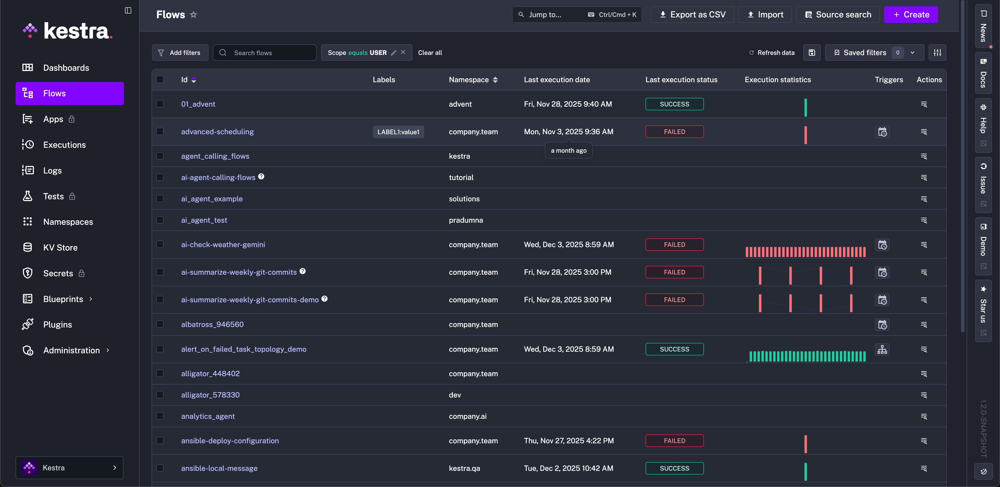

A **Flow** page has multiple tabs that allow you to: see the flow topology, all flow executions, edit the flow, view its revisions, logs, metrics, and dependencies. You can also edit namespace files in the Flow editor.

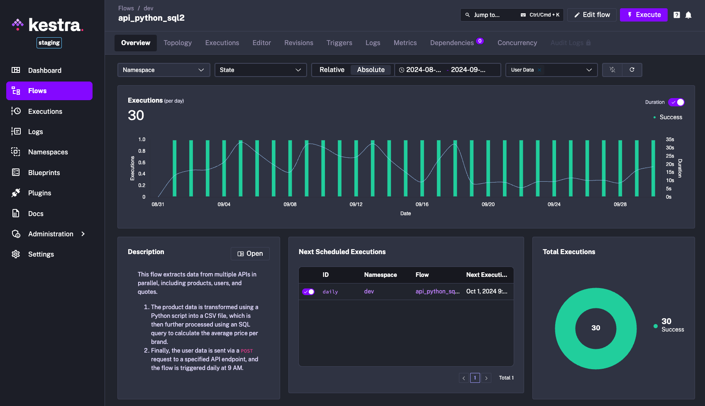

## Filters

From the main Flows page, you can filter the displayed flows on fields like namespace, scope, labels, and open text. The filters are key based with comma-separated OR-conditions and spaced-separated AND-conditions. The following video demonstrates the filters in action:

<iframe src="https://demo.arcade.software/JS0GtzW6yWmF2m11yIYV?embed&embed_mobile=tab&embed_desktop=inline&show_copy_link=true" title="Flow Filters | Kestra" loading="lazy" webkitallowfullscreen mozallowfullscreen allowfullscreen allow="clipboard-write" style="position: absolute; top: 0; left: 0; width: 100%; height: 100%; color-scheme: light;" ></iframe>

## Edit

The Edit interface provides a rich view of your workflow, as well as Namespace Files. The editor allows you to add multiple panels:
- Flow code
- No Code
- Topology
- Documentation
- Files
- Blueprints

Additionally, from the **Actions** menu, you can export your flow as a YAML file, delete, or copy your flow.

  <iframe src="https://www.youtube.com/embed/SGlzRmJqFBI?si=ZIGsOoyp1KlXus72" title="YouTube video player" allow="accelerometer; autoplay; clipboard-write; encrypted-media; gyroscope; picture-in-picture; web-share" referrerpolicy="strict-origin-when-cross-origin" allowfullscreen></iframe>

### Flow code view

The **Flow** code view allows you to edit your workflows with YAML. Autocomplete is available as you write. As new tasks are added, they automatically appear in the No-code and topology views.

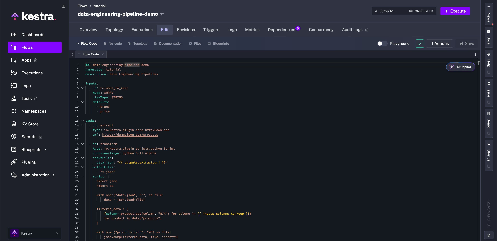

### No Code view

The **No Code** view lets you edit workflows directly in the UI using structured forms. As you modify your flow, YAML is generated in real time in the code view and you can switch between both views at any time.

- **Speed & onboarding**: Build flows without writing YAML first; switch to code view whenever you need advanced control.
- **Consistency**: UI-driven forms align with plugin schemas and validation, reducing drift.
- **No ceiling**: When you outgrow forms, switch to YAML, add files/scripts, and keep everything in one place.

#### Build a flow in No Code

1. **Create a flow** from **Flows → + Create**; confirm namespace and identifiers.
2. **Open No Code view** from the editor panel. Browse or search the plugin catalog and select a plugin to reveal its form fields.

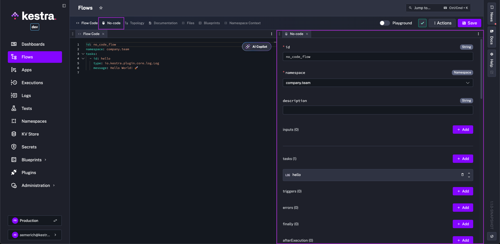

You can close, open, and reposition panels at any time. In the example below, the Slack plugin documentation is open alongside the No Code editor with the YAML view closed.

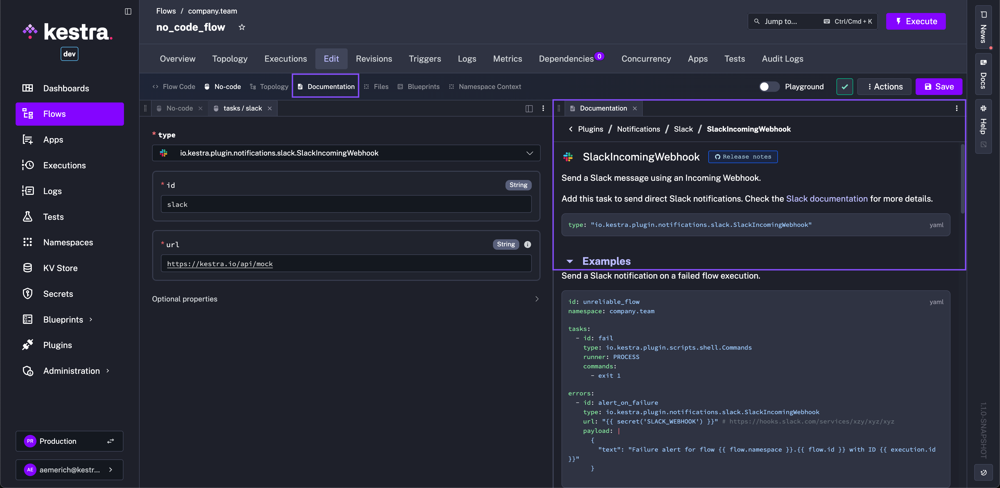

3. **Configure inputs** by clicking **+ Add** in the inputs section. Each input opens a configuration tab. If the YAML view is open, you'll see it update in real time as you add inputs.

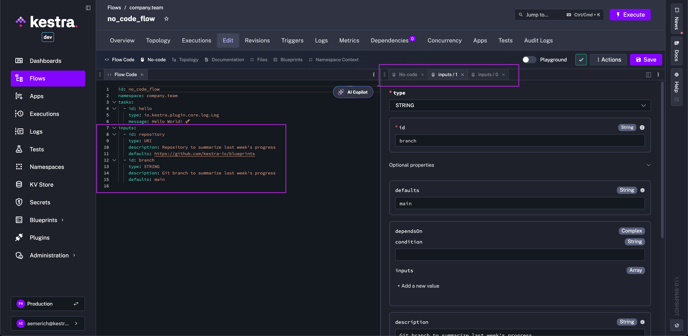

4. **Configure task properties** via forms. Each task opens a No Code tab and generates YAML as you select properties. Fields can autocomplete expressions from inputs you've already configured.

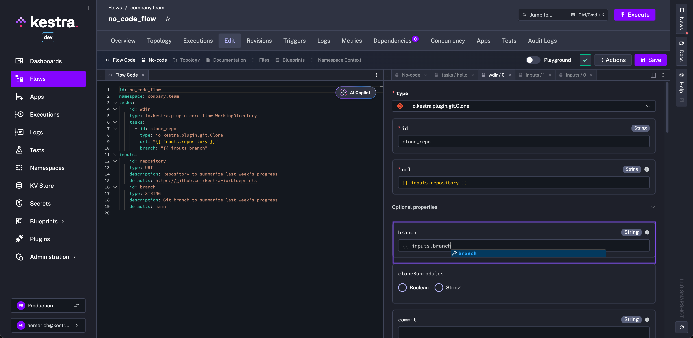

5. **Add flow logic** — If, Switch, Loop, and Subflow tasks — to control execution paths.
6. **Add a trigger** (schedule, file event, webhook) to automate runs.

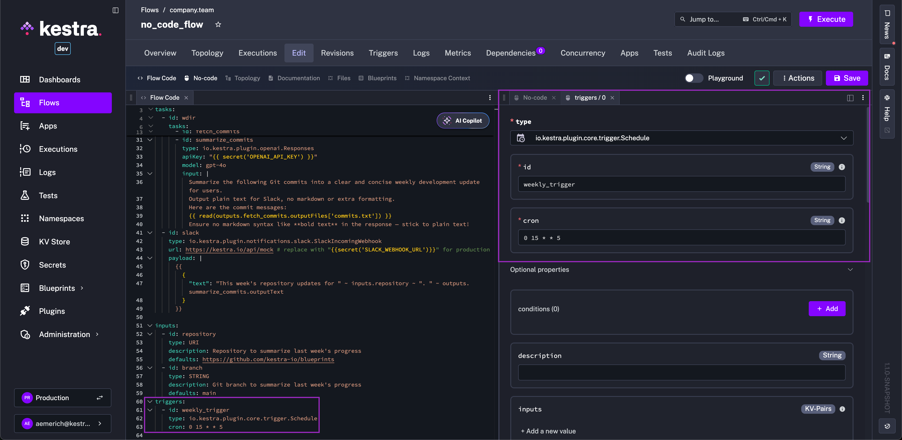

7. **Add additional flow components** such as [outputs](../../05.workflow-components/06.outputs/index.md), [retry](../../05.workflow-components/12.retries/index.md), [SLA](../../05.workflow-components/18.sla/index.md), [afterExecution](../../05.workflow-components/20.afterexecution/index.md), and [Plugin Defaults](../../05.workflow-components/09.plugin-defaults/index.md). Everything possible in YAML is available in No Code.

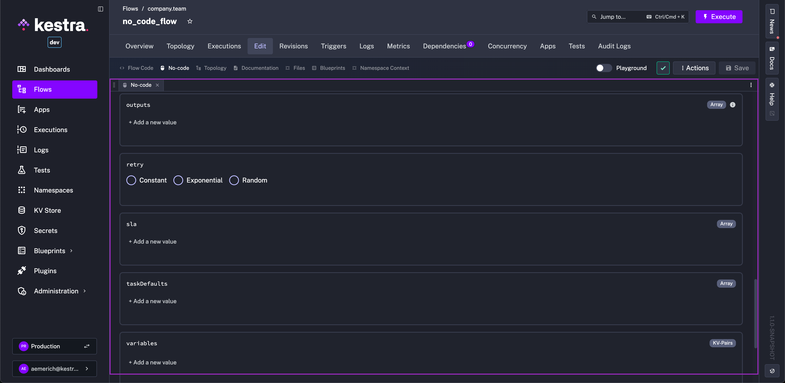

8. **Save and run**: execute from the UI to see logs and results.

Edits in No Code forms update YAML instantly, and edits in YAML reflect back in No Code. For complex expressions, advanced plugin fields, or bulk edits, switch to the YAML view — then switch back. Use the **Actions** menu to export or copy the flow at any time.

:::alert{type="info"}
You can also skip YAML with the [AI Copilot](../../ai-tools/ai-copilot/index.md), which generates a flow from a plain-language description.
:::

### Topology view

The **Topology** view allows you to visualize the structure of your flow. This is especially useful when you have complex flows with multiple branches of logic. From the bottom left corner of the Topology view, you can zoom in, zoom out, and export your flow topology as a `.png` file.

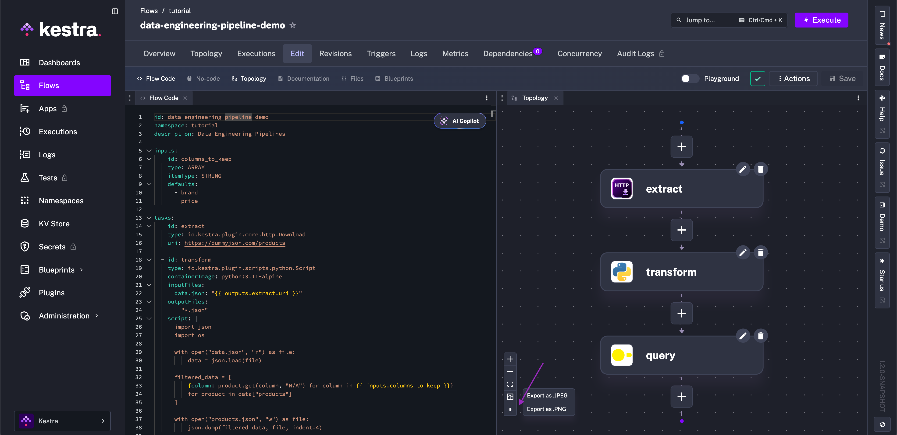

### Documentation view

The **Documentation** view displays Kestra's documentation directly inside the editor. As you move your cursor around the editor, the documentation panel updates to reflect the specific task type documentation.

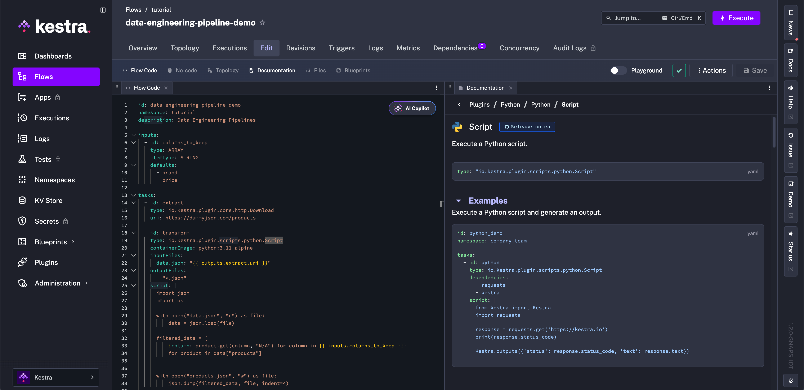

:::alert{type="warning"}
If you use the [Brave browser](https://brave.com/), you may need to disable Brave Shields to make the editor work as expected. To view task documentation, set the `Block cookies` option to `Disabled` in Shields settings: `brave://settings/shields`.

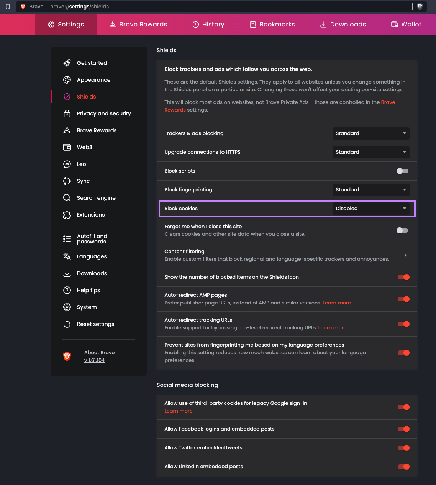
:::

## Files view

The **Files** view allows you to create, edit and delete [Namespaces Files](../../06.concepts/02.namespace-files/index.md). Multiple files can be opened at the same time, as well as displayed side by side using multiple panels.

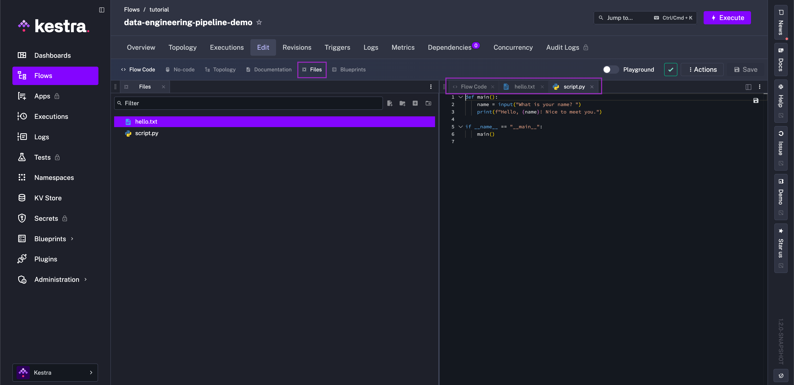

### Blueprints view

The **Blueprints** view gives you example flows to copy directly into your flow. Blueprints are especially useful when working with a new plugin, since you can start from a working example.

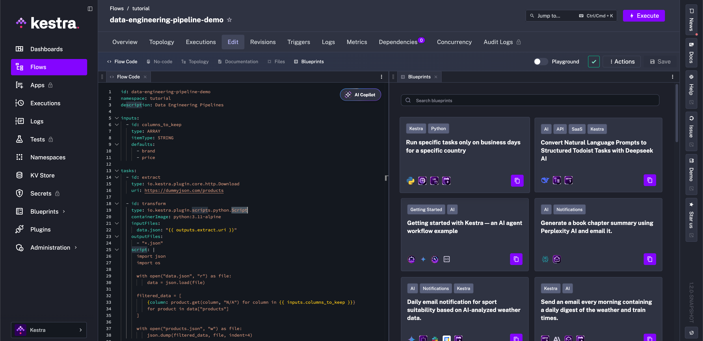

### Namespace context (Enterprise)

In the **Namespace Context** view, you can directly access your Variables, KV pairs, and Secrets managed at the namespace level. You can also render expressions that fall within those categories.

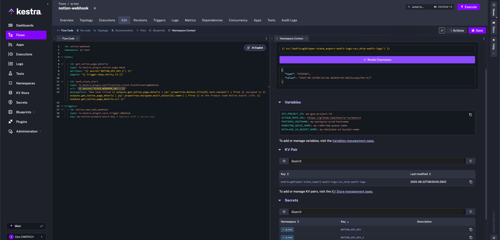

## Revisions

You can view the history of your flow code changes under the **Revisions** tab. For more details, see [Revisions](../../06.concepts/03.revision/index.md).

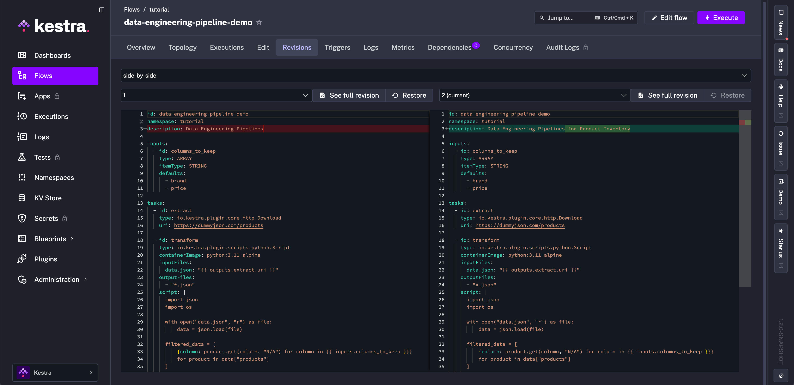

## Dependencies

<iframe src="https://demo.arcade.software/k3WASzX7Oi0F1kRHOBKj?embed&embed_mobile=tab&embed_desktop=inline&show_copy_link=true" title="Dependencies | Kestra" loading="lazy" webkitallowfullscreen mozallowfullscreen allowfullscreen allow="clipboard-write" style="position: absolute; top: 0; left: 0; width: 100%; height: 100%; color-scheme: light;" ></iframe>

The **Dependencies** page shows the relationship dependencies between other flows and the selected flow, and lets you navigate between them.

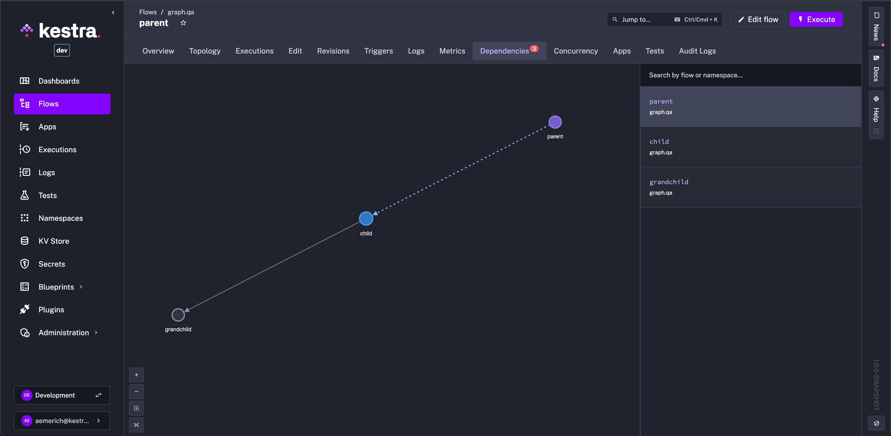

:::alert{type="info"}
The **Dependencies View** on the **Namespaces** page shows all the flows in the namespace and how they each relate to one another, if at all, whereas the Flow Dependencies view is only for the selected flow.
:::

