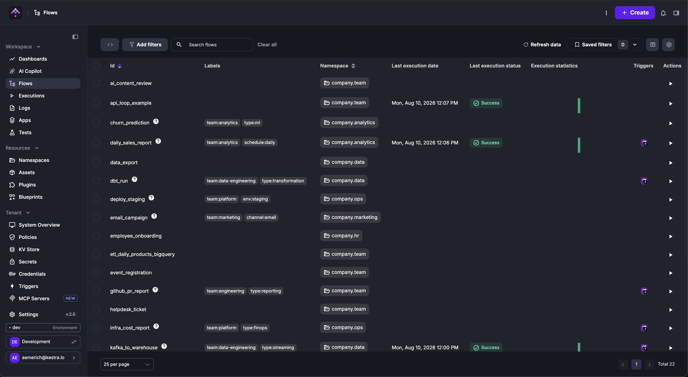
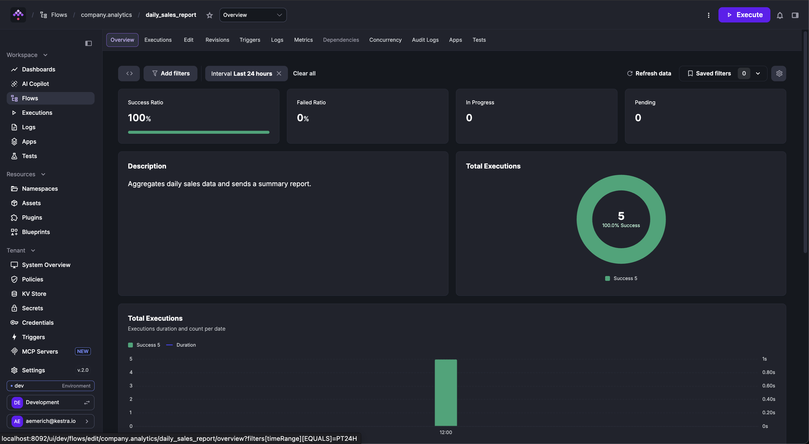
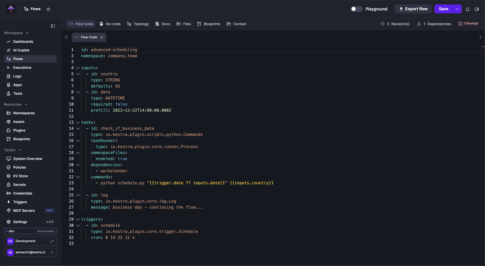
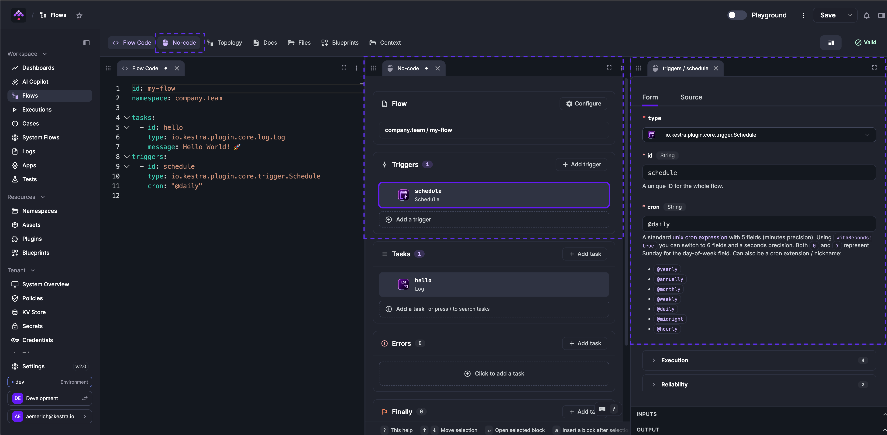
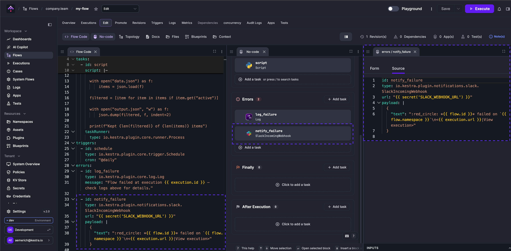
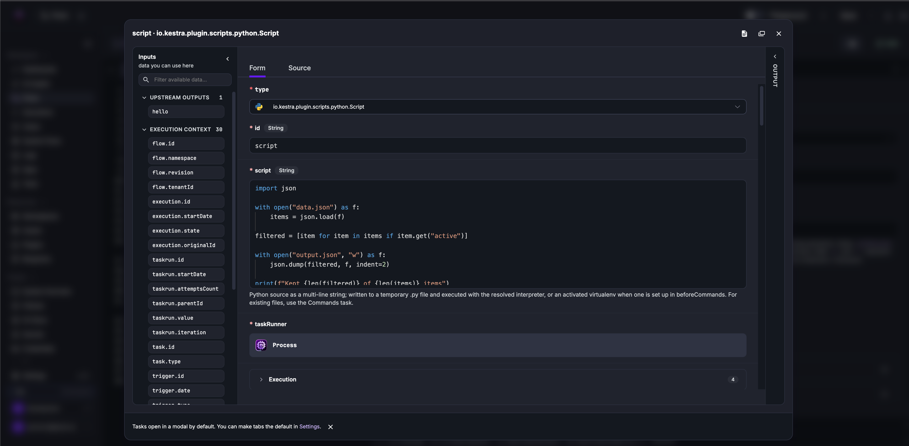
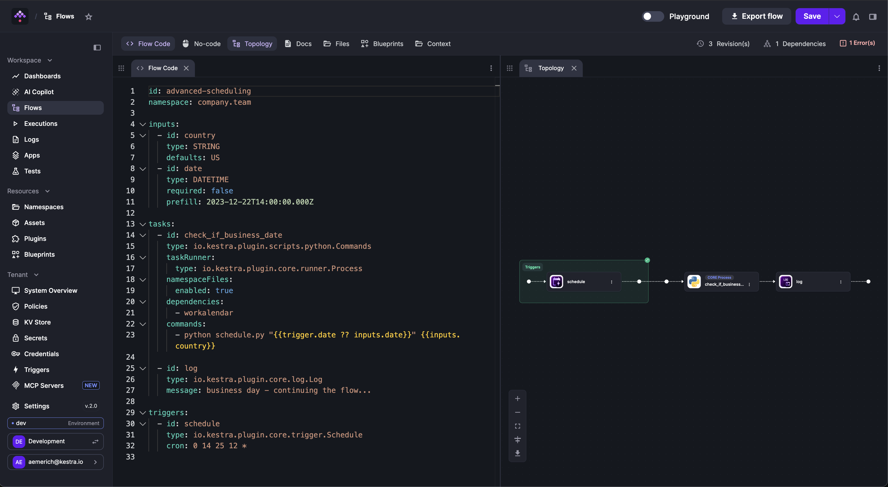

Manage your flows in one place.

The **Flows** page lists all flows. Click a flow ID to open it, or create a new flow from the top-right corner.

A **Flow** page has tabs for Overview, Executions, Edit, Revisions, Triggers, Logs, Metrics, Dependencies, and more.

## Filters

From the main Flows page, you can filter the displayed flows on fields like namespace, scope, labels, and open text. The filters are key based with comma-separated OR-conditions and spaced-separated AND-conditions. The following video demonstrates the filters in action:

<iframe src="https://demo.arcade.software/azAPQSNOo4z4I3CZcF9c?embed&embed_mobile=tab&embed_desktop=inline&show_copy_link=true" title="Flows Filters | Kestra" frameborder="0" loading="lazy" webkitallowfullscreen mozallowfullscreen allowfullscreen allow="clipboard-write; autoplay" style="position: absolute; top: 0; left: 0; width: 100%; height: 100%; color-scheme: light;" ></iframe>

## Edit

The **Edit** tab is the main authoring environment. Open panels from the tab bar and arrange them side by side:
- **Flow Code** — YAML editor with autocomplete
- **No-code** — visual flow builder with task cards and a structured outline
- **Topology** — visual DAG of the flow
- **Docs** — plugin documentation, updates as you move the cursor
- **Files** — namespace files editor
- **Blueprints** — ready-to-use flow examples
- **Context** — namespace variables, KV pairs, and secrets (Enterprise)

From the top-right of the editor, you can access **Revisions**, **Dependencies**, and any validation **Errors**. Use **Export flow** to download the flow as a YAML file.

  <iframe src="https://www.youtube.com/embed/SGlzRmJqFBI?si=ZIGsOoyp1KlXus72" title="YouTube video player" allow="accelerometer; autoplay; clipboard-write; encrypted-media; gyroscope; picture-in-picture; web-share" referrerpolicy="strict-origin-when-cross-origin" allowfullscreen></iframe>

### Flow Code view

The **Flow Code** view is a YAML editor with autocomplete. Tasks added here appear immediately in the No-code and Topology views.

### No Code view

The **No Code** view is a canvas-based flow editor. The canvas displays each flow section — Triggers, Tasks, Errors, Finally, and After Execution — as a group of visual blocks. Selecting a block opens its configuration form in a third panel alongside the canvas.

Click any block to open its form. The form has two tabs: **Form** (guided fields with inline documentation) and **Source** (raw YAML for that block). You can switch to **Source** to write or paste YAML directly — the flow YAML editor on the left stays in sync instantly.

To add a block, click **+ Add task** or **+ Add trigger** in the relevant section, or press `/` anywhere on the canvas to search and insert a block at the cursor position. Use the keyboard shortcuts shown in the bottom bar to navigate (`↑ ↓`), open a selected block (`⇧`), or insert after the current selection.

Click **Configure** at the top of the canvas to edit flow-level properties (namespace, description, inputs, outputs, variables, and more).

#### Focused view

Opening a block expands it into a focused modal by default. The modal has two panels:

- **Left — Inputs**: lists every value you can reference in this task's properties. **Upstream Outputs** shows the output keys of all tasks that run before this one; **Execution Context** lists all built-in variables available at runtime (`flow.id`, `execution.id`, `taskrun.id`, `trigger.date`, and so on). Use these as a reference when writing Pebble expressions in the form fields.
- **Right — Form / Source**: the task configuration form. Switch to **Source** to edit raw YAML for the block. An **Output** panel on the right edge shows the task's output schema.

Tasks open as a modal by default. To open blocks as tabs in the editor instead, change the default in **Settings**.

You can open multiple panels simultaneously — for example, keep **Docs** open alongside the canvas to reference plugin documentation while configuring a task. Use the **Actions** menu to export or copy the flow at any time.

:::alert{type="info"}
Flow Code, No-code, and [AI Copilot](../../ai-tools/01.ai-copilot/index.md) all stay in sync. Start in any mode — write YAML, describe your flow to the Copilot, or build visually on the canvas — and switch freely at any point. Every change is reflected across all three views instantly.
:::

### Topology view

The **Topology** view shows a visual DAG of the flow — useful for complex flows with multiple branches. Zoom controls and a `.png` export are in the bottom-left corner.

### Documentation view

The **Documentation** view displays plugin docs directly inside the editor. The panel updates as you move your cursor to reflect the task type at the current position.

:::alert{type="warning"}
If you use the [Brave browser](https://brave.com/), you may need to disable Brave Shields to make the editor work as expected. To view task documentation, set the **Block cookies** option to **Disabled** in Shields settings at `brave://settings/shields`.
:::

### Files view

The **Files** view lets you create, edit, and delete [Namespace Files](../../06.concepts/02.namespace-files/index.md). Open multiple files side by side using the multi-panel layout.

### Blueprints view

The **Blueprints** view gives you example flows to copy directly into the editor — useful when working with a new plugin.

### Context panel (Enterprise)

The **Context** panel gives you direct access to namespace Variables, KV pairs, and Secrets from within the editor. You can also render expressions against those values inline.

## Revisions

You can view the history of your flow code changes under the **Revisions** tab. For more details, see [Revisions](../../06.concepts/03.revision/index.md).

## Dependencies

The **Dependencies** tab shows the relationship between this flow and other flows, and lets you navigate between them. The **Dependencies View** on the **Namespaces** page shows all flows in the namespace and how they relate to one another — the flow-level Dependencies view is scoped to the selected flow only.

