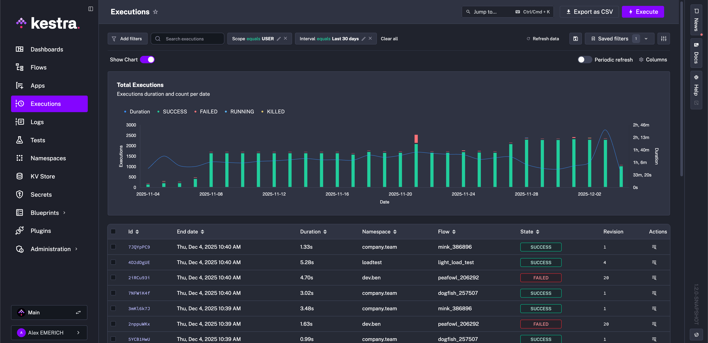
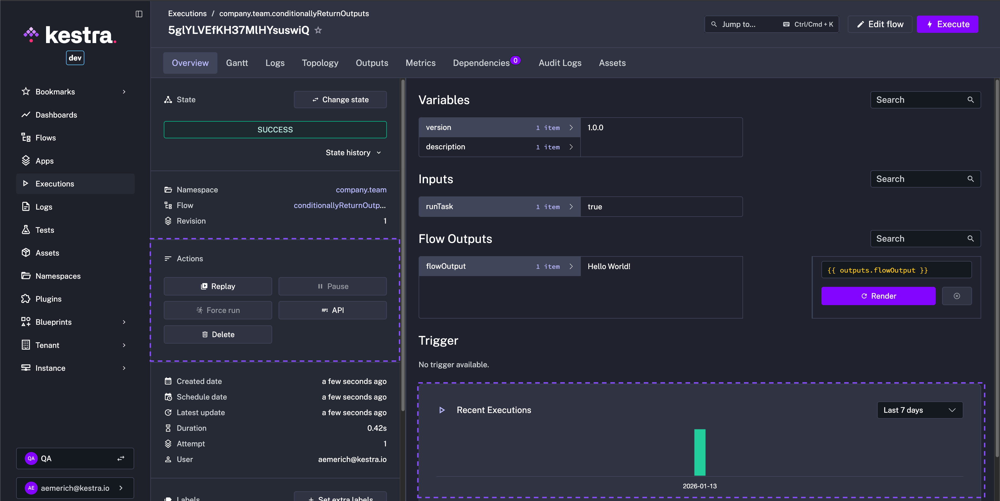
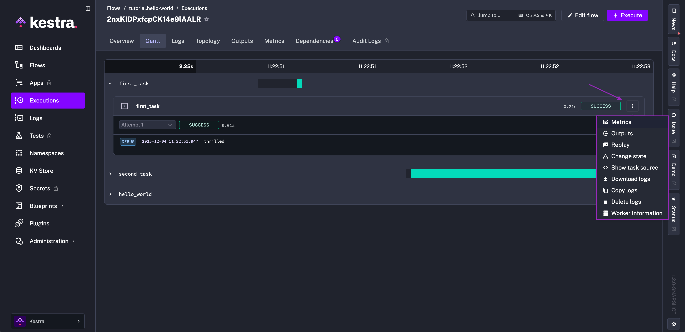
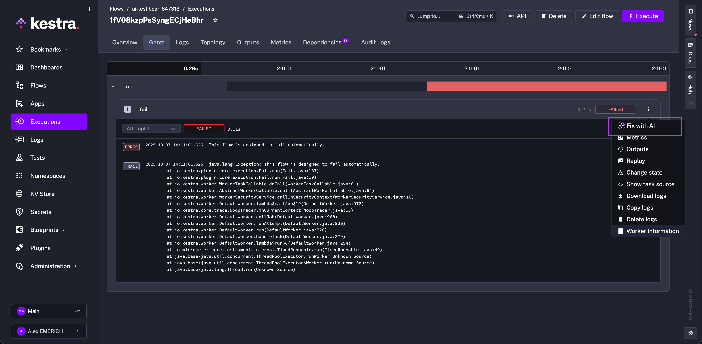
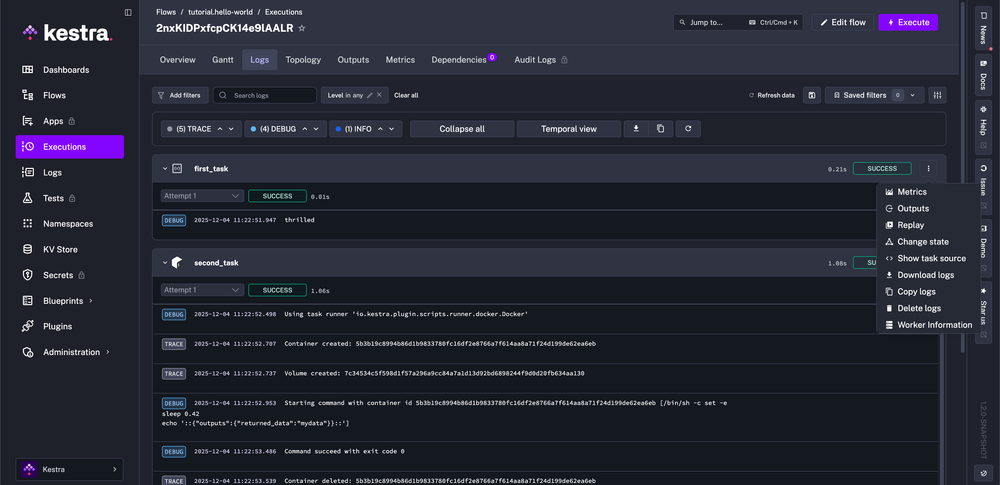
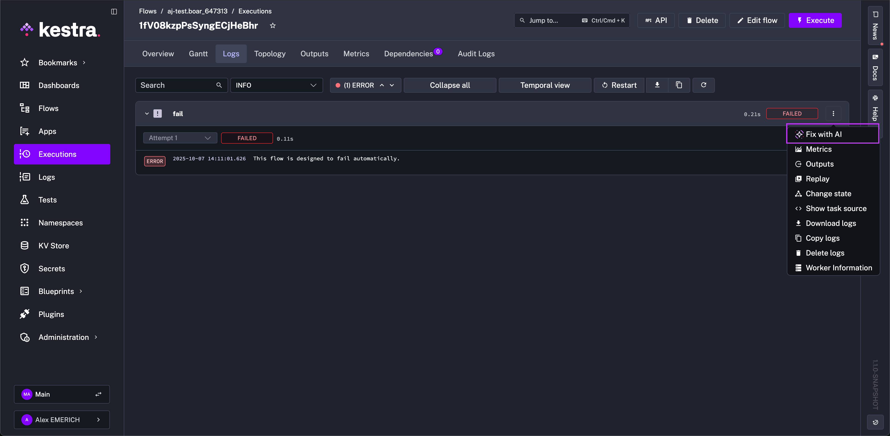
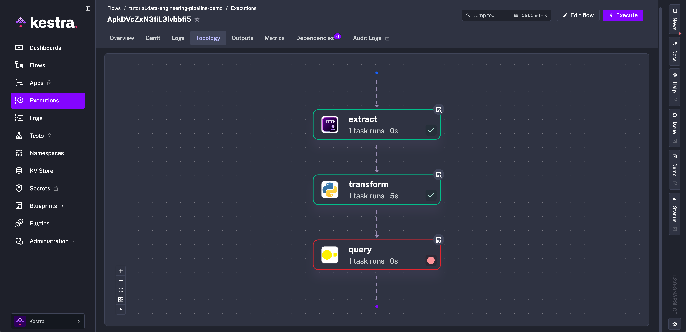
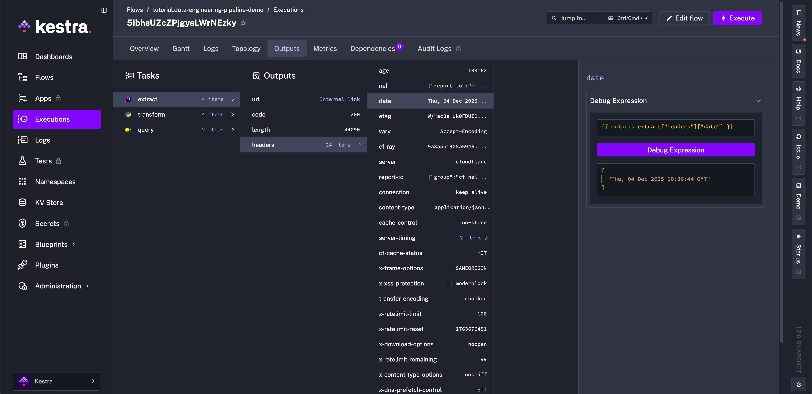
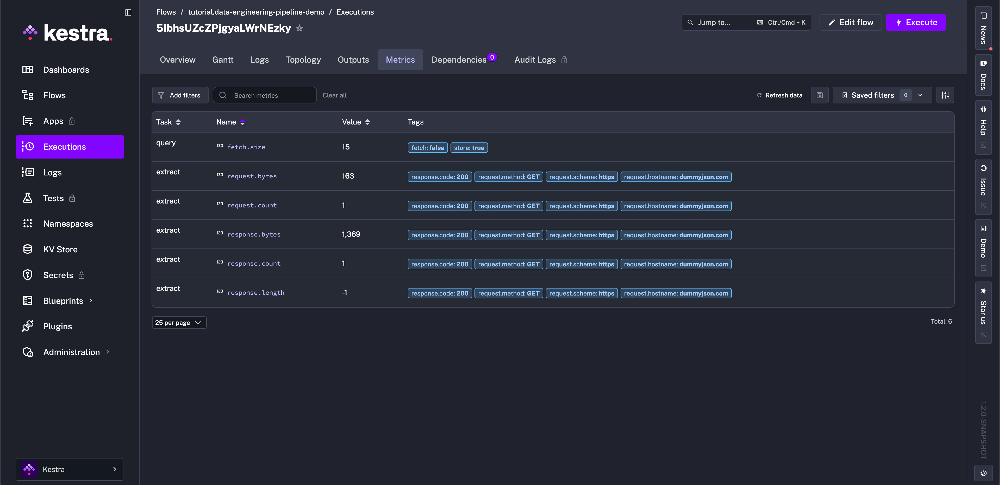
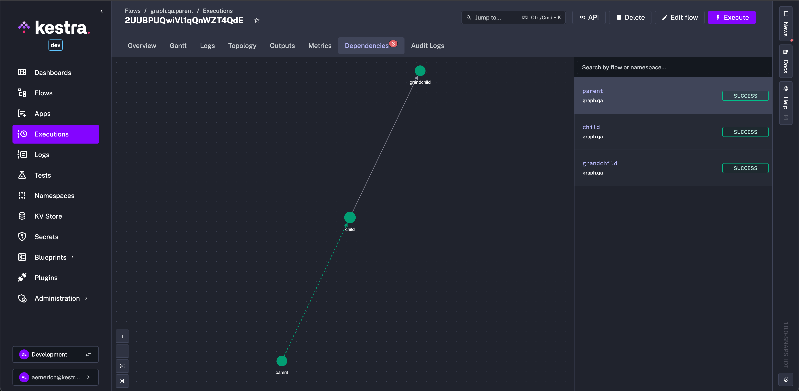

Inspect and manage flow executions.

The **Executions** page lists all flow executions. Select one or more to perform bulk actions (Restart, Kill, Pause, Force Run), or click an execution ID to open it.



## Overview

An **Execution's Overview** page displays the details of a flow execution, organized into the following sections. For reference, below is an example flow and its **Execution Overview**.

```yaml
id: conditionallyReturnOutputs
namespace: company.team

labels:
  - key: environment
    value: dev
  - key: owner
    value: data-team
variables:
  description: This is a demo flow
  version: 1.0.0

inputs:
  - id: runTask
    type: BOOL
    defaults: true

tasks:
  - id: taskA
    runIf: "{{ inputs.runTask }}"
    type: io.kestra.plugin.core.debug.Return
    format: Hello World!

  - id: taskB
    type: io.kestra.plugin.core.debug.Return
    format: Fallback output

outputs:
  - id: flowOutput
    type: STRING
    value: "{{ tasks.taskA.state != 'SKIPPED' ? outputs.taskA.value : outputs.taskB.value }}"

triggers:
  - id: every_minute_schedule
    type: io.kestra.plugin.core.trigger.Schedule
    cron: "* * * * *"
```



From the **Overview** tab, you can:
- Set Labels: give a label to the execution for tracking or filtering.
- Change State: change the execution state.
- Force Run: forces the execution to run. This may create duplicate task executions — use with caution.

The **Previous** and **Next Execution** buttons step through past and scheduled future executions.

- Execution **state** is displayed along with a timestamped state history from `CREATED` to `RUNNING` to `SUCCESS` (or any other possible state).
- Flow [Variables](../../05.workflow-components/04.variables/index.md) and [Inputs](../../05.workflow-components/05.inputs/index.md) are clearly listed along with execution details including dates and the corresponding namespace and flow.
- Flow outputs and trigger data are captured with expression rendering.

From the **Overview** page, you can also take actions such as [**Replay**](../../06.concepts/10.replay/index.md) or **Pause**, and view executions over time to compare previous runs.

## Filters

Filter executions by namespace, flow ID, labels, state, start date, or free text. Save applied filters or export results. The following video demonstrates the filters in action:

<div style="position: relative; padding-bottom: calc(48.9583% + 41px); height: 0px; width: 100%;"><iframe src="https://demo.arcade.software/RwazDJghgx81hvQqOt5e?embed&embed_mobile=tab&embed_desktop=inline&show_copy_link=true" title="Executions Filters | Kestra" loading="lazy" webkitallowfullscreen mozallowfullscreen allowfullscreen allow="clipboard-write" style="position: absolute; top: 0; left: 0; width: 100%; height: 100%; color-scheme: light;" ></iframe></div>

## Gantt

The **Gantt** tab visualizes each task's duration. From this interface, you can replay a specific task, see task source code, change task status, or look at task metrics and outputs.



The **Gantt** view displays all successful and failed tasks in the execution. For failed tasks, use **Fix with AI** from the task menu to open the flow editor with [AI Copilot](../../ai-tools/ai-copilot/index.md) pre-loaded with the error context.



## Logs

The **Logs** tab gives access to a task's logs. You can filter by log level, copy logs into your clipboard, or download logs as a file. Logs can be viewed per task in the **Default View** or temporally based on timestamp in the **Temporal View**.



For failed tasks, use **Fix with AI** from the task menu to open the flow editor with [AI Copilot](../../ai-tools/ai-copilot/index.md) pre-loaded with the error context.



## Topology

Similar to the Editor view, you can see your execution's topology. **Topology** provides a graphical view to access specific task logs, replay certain tasks, or change task status. Tasks' state progression is shown and updated as the status changes. For example, green indicates a task has reached **SUCCESS** while red indicates **FAILED**.



From a failed task, open the logs to read the error and use **Fix with AI** if [AI Copilot](../../ai-tools/ai-copilot/index.md) is configured.

## Outputs

The **Outputs** tab shows all task outputs — variables to pass downstream or files to download and inspect. The example below downloads a file generated from a SQL query.

<div style="position: relative; padding-bottom: calc(48.9583% + 41px); height: 0px; width: 100%;"><iframe src="https://demo.arcade.software/BTW4jefHMCoxw5VgY9mB?embed&embed_mobile=tab&embed_desktop=inline&show_copy_link=true" title="Execution Outputs | Kestra" loading="lazy" webkitallowfullscreen mozallowfullscreen allowfullscreen allow="clipboard-write" style="position: absolute; top: 0; left: 0; width: 100%; height: 100%; color-scheme: light;" ></iframe></div>

The **Debug Expression** button lets you evaluate [expressions](../../expressions/index.mdx) against task outputs to verify they match what you expect. Select a task first to enable it.



## Metrics

The Metrics tab shows every metric exposed by tasks after execution. For example, a [BigQuery load task](/plugins/plugin-gcp/google-cloud-bigquery/io.kestra.plugin.gcp.bigquery.load) might show the amount of files inputted, rows inserted, and how long the operation took to complete. Another example, a flow using an AI plugin shows token usage as a metric for the task.



## Dependencies

The **Dependencies** tab shows the relationship between other flows and the selected execution, including extra execution metadata such as state.


