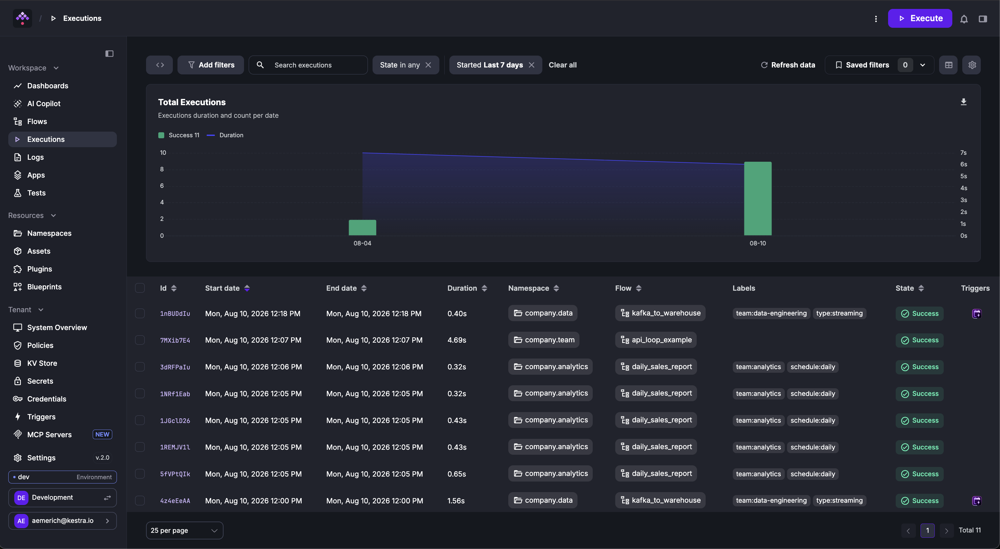
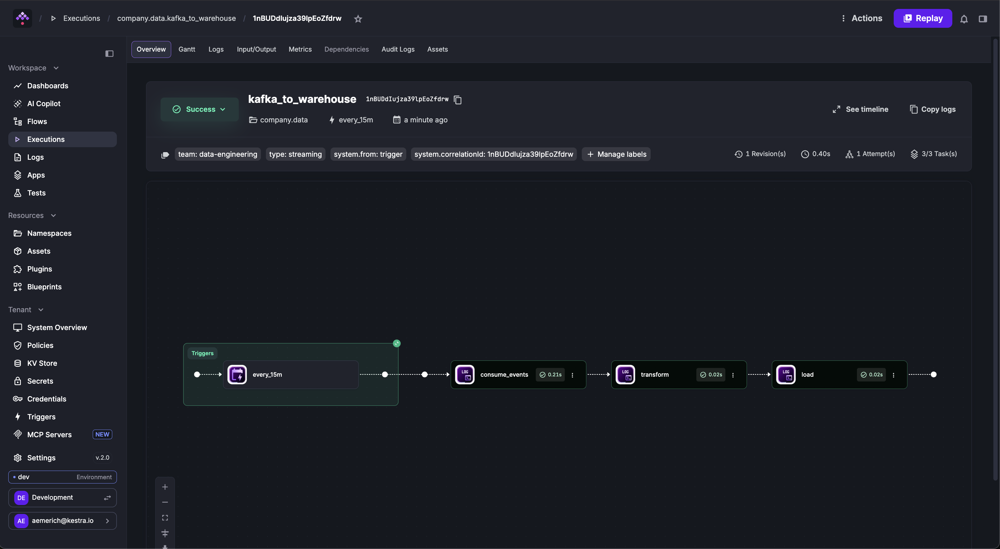
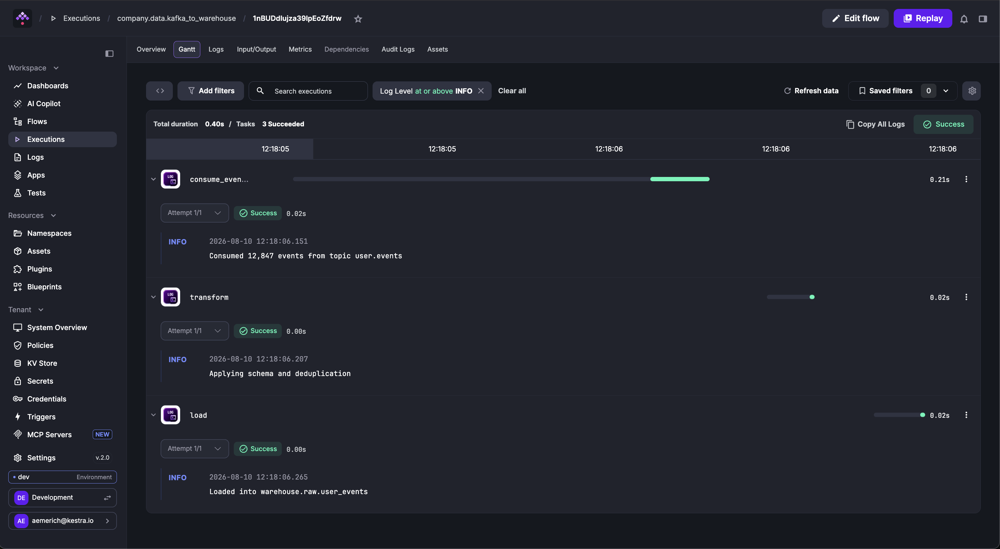
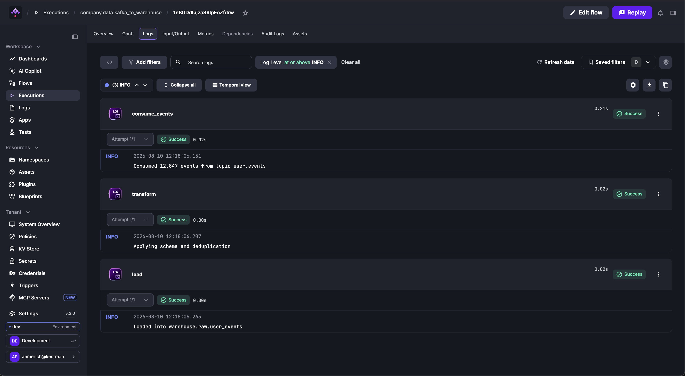
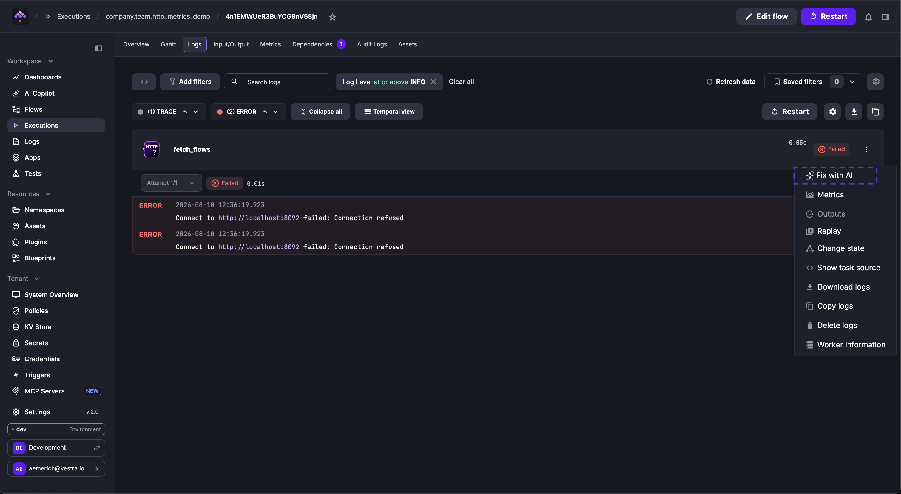
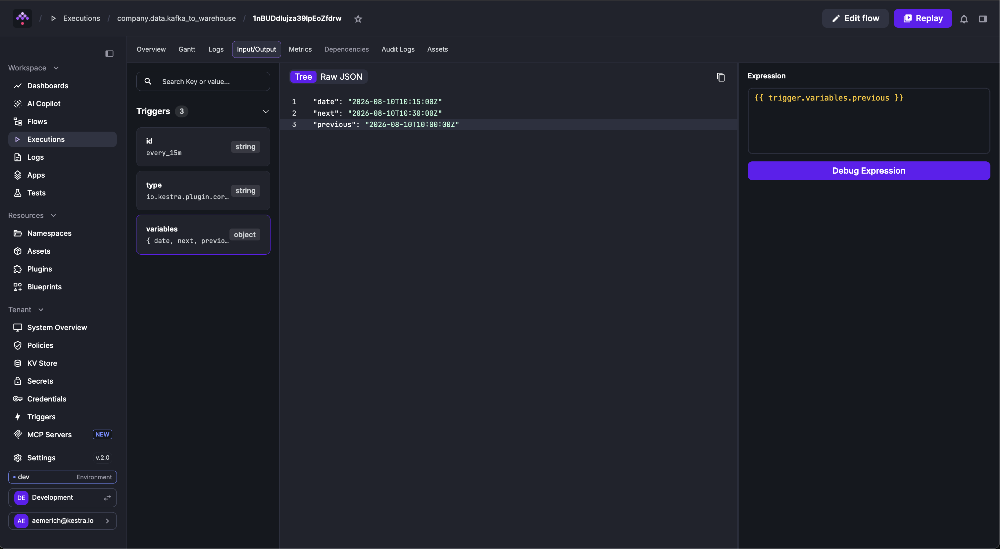
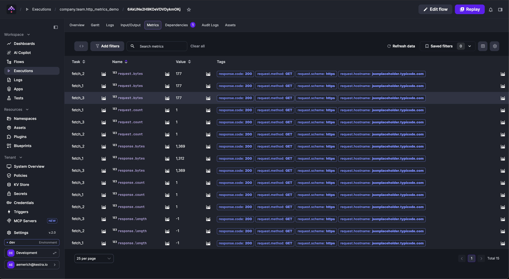
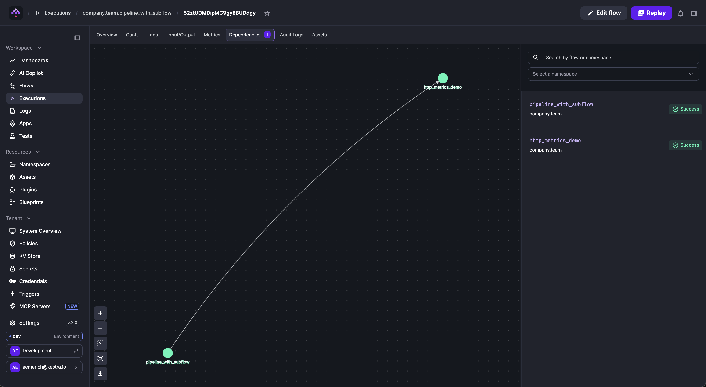

Inspect and manage flow executions.

The **Executions** page lists all flow executions. Select one or more to perform bulk actions (Restart, Kill, Pause, Force Run), or click an execution ID to open it.

## Overview

The **Overview** tab displays the details of a flow execution.

From the **Overview** tab, you can:
- **Set Labels** — add a label to the execution for tracking or filtering.
- **Change State** — manually update the execution state.
- **Force Run** — force the execution to run; may create duplicate task executions, so use with caution.

The **Previous** and **Next Execution** buttons step through past and scheduled future executions.

- Execution **state** is displayed along with a timestamped state history from `CREATED` to `RUNNING` to `SUCCESS` (or any other possible state).
- Flow [Variables](../../05.workflow-components/04.variables/index.md) and [Inputs](../../05.workflow-components/05.inputs/index.md) are clearly listed along with execution details including dates and the corresponding namespace and flow.
- Flow outputs and trigger data are captured with expression rendering.

From the **Overview** tab, you can also take actions such as [**Replay**](../../06.concepts/10.replay/index.md) or **Pause**, and view executions over time to compare previous runs.

The Overview tab also embeds a **topology diagram** showing each task's state in the execution graph — green for `SUCCESS`, red for `FAILED`. Click any task node to access its logs, replay it, or change its status.

## Filters

Filter executions by namespace, flow ID, labels, state, start date, or free text. Save applied filters or export results. The following video demonstrates the filters in action:

<iframe src="https://demo.arcade.software/1zqBYvR7JifFkwNSa7Qh?embed&embed_mobile=tab&embed_desktop=inline&show_copy_link=true" title="Executions | Kestra EE" frameborder="0" loading="lazy" webkitallowfullscreen mozallowfullscreen allowfullscreen allow="clipboard-write; autoplay" style="position: absolute; top: 0; left: 0; width: 100%; height: 100%; color-scheme: light;" ></iframe>

## Gantt

The **Gantt** tab visualizes each task's duration. From this interface, you can replay a specific task, see task source code, change task status, or look at task metrics and outputs.

The **Gantt** view displays all successful and failed tasks in the execution. For failed tasks, use **Fix with AI** from the task menu to open the flow editor with [AI Copilot](../../ai-tools/01.ai-copilot/index.md) pre-loaded with the error context.

## Logs

The **Logs** tab gives access to a task's logs. You can filter by log level, copy logs into your clipboard, or download logs as a file. Logs can be viewed per task in the **Default View** or temporally based on timestamp in the **Temporal View**.

For failed tasks, use **Fix with AI** from the task menu to open the flow editor with [AI Copilot](../../ai-tools/01.ai-copilot/index.md) pre-loaded with the error context.

## Input/Output

The **Input/Output** tab shows execution inputs and all task outputs — variables to pass downstream or files to download and inspect. The example below downloads a file generated from a SQL query.

<iframe src="https://demo.arcade.software/BTW4jefHMCoxw5VgY9mB?embed&embed_mobile=tab&embed_desktop=inline&show_copy_link=true" title="Execution Outputs | Kestra" loading="lazy" webkitallowfullscreen mozallowfullscreen allowfullscreen allow="clipboard-write" style="position: absolute; top: 0; left: 0; width: 100%; height: 100%; color-scheme: light;" ></iframe>

The **Debug Expression** button lets you evaluate [expressions](../../expressions/index.mdx) against task outputs to verify they match what you expect. Select a task first to enable it.

## Metrics

The **Metrics** tab shows every metric exposed by tasks after execution. For example, an HTTP Request task emits `request.bytes`, `response.bytes`, and `response.length` per request. A BigQuery load task might expose rows inserted and bytes processed. An AI plugin task might show token usage.

## Dependencies

The **Dependencies** tab shows the relationship between other flows and the selected execution, including extra execution metadata such as state.

