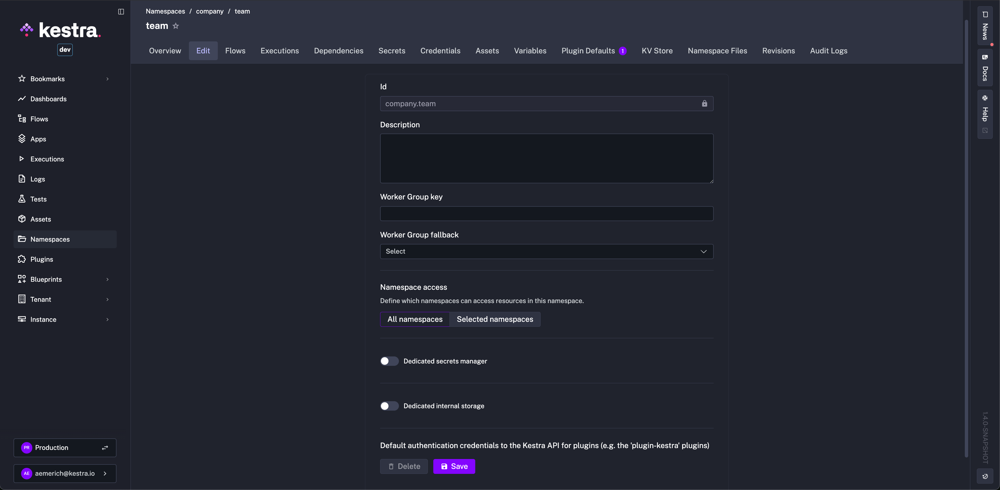
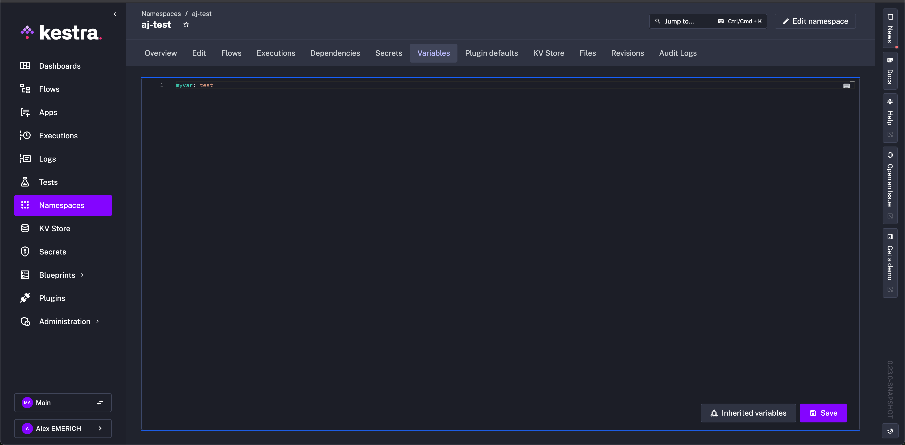
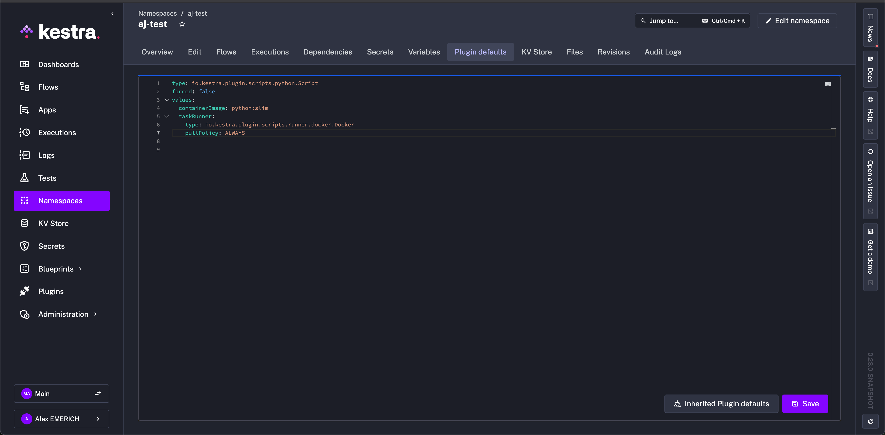
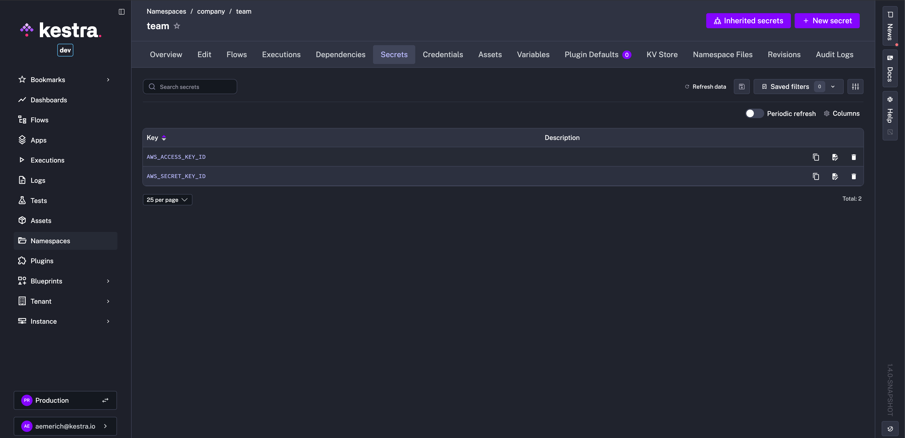
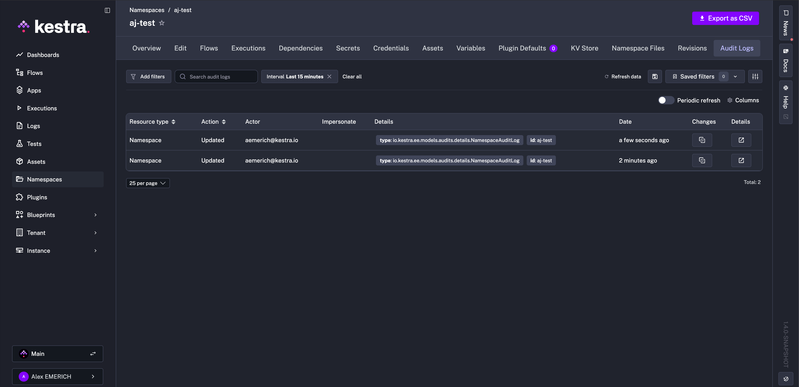

Manage enterprise features at the namespace level.

## Use enterprise namespace governance

:::alert{type="info"}
This feature requires the [Enterprise Edition](../../../07.enterprise/index.mdx).
:::

The Enterprise Edition introduces several additional namespace pages for enhanced governance and configuration:

- Edit
- Namespace-wide variables
- Namespace-wide plugin defaults
- Secrets
- Audit logs

## Edit

The **Edit** page lets you manage namespace-level settings such as descriptions, [worker groups](../../../07.enterprise/04.scalability/worker-group/index.md), and permissions.

## Variables

Define variables at the namespace level for use in any flow under that namespace using the syntax `{{ namespace.variable_name }}`.

Read more about [variables](../../../07.enterprise/02.governance/07.namespace-management/index.md#variables).

## Plugin defaults

Define **plugin defaults** at the namespace level. These defaults automatically apply to all tasks of the corresponding type within flows under that namespace.

Read more about [plugin defaults](../../../07.enterprise/02.governance/07.namespace-management/index.md#plugin-defaults).

## Secrets

Manage **secrets** directly in the UI. Namespace-level secrets are accessible to all flows within the same namespace.

Read more about [secrets](../../../07.enterprise/02.governance/secrets/index.md).

## Audit logs

**Audit logs** record every action performed in your Kestra instance by users or service accounts. This page displays all logs relevant to the selected namespace.

Read more about [audit logs](../../../07.enterprise/02.governance/06.audit-logs/index.md).
