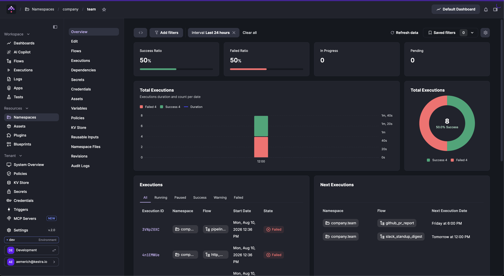
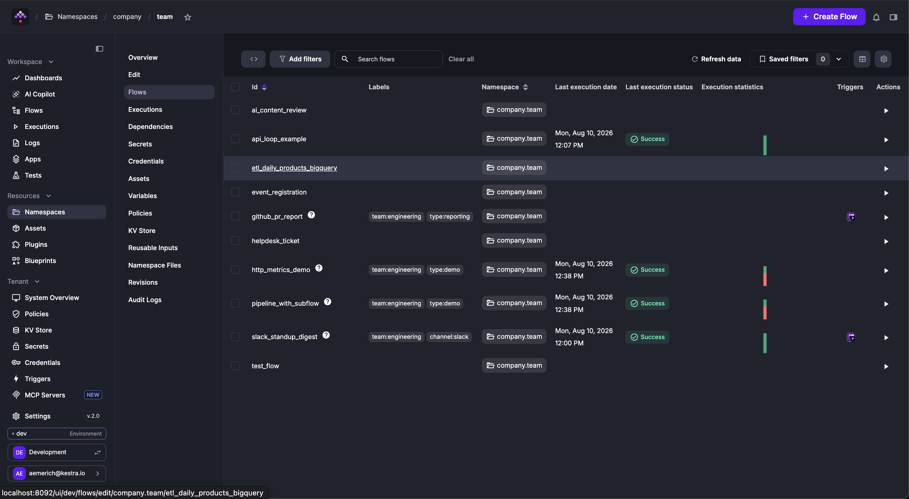

Manage all resources associated with a Namespace in one place.

The **Namespaces** page lists all namespaces in your Kestra instance.

    <iframe src="https://www.youtube.com/embed/MbG9BHJIMzU?si=9gVEROGc5hXcIJR2" title="YouTube video player" allow="accelerometer; autoplay; clipboard-write; encrypted-media; gyroscope; picture-in-picture; web-share" referrerpolicy="strict-origin-when-cross-origin" allowfullscreen></iframe>

## Overview

The **Overview** tab is the default landing page of a Namespace. It displays dashboards and summaries of flow executions within that Namespace.

## Flows

The **Flows** tab lists all flows within the namespace, showing flow ID, labels, last execution date and status, and execution statistics.

## Dependencies

The **Dependencies** tab visualizes relationships between flows, showing which flows depend on one another (for example, through subflows or flow triggers).

This view is similar to the **Dependencies** page in the Flow Editor but focuses on inter-flow relationships within a single Namespace — even if some flows are independent.

## KV store

The **KV Store** tab lets you manage key-value pairs scoped to the namespace. For more information, see the [KV Store concept guide](../../06.concepts/05.kv-store/index.md).

    <iframe src="https://www.youtube.com/embed/CNv_z-tnwnQ?si=llG-CMXRBG9PG3nF" title="YouTube video player" allow="accelerometer; autoplay; clipboard-write; encrypted-media; gyroscope; picture-in-picture; web-share" referrerpolicy="strict-origin-when-cross-origin" allowfullscreen></iframe>

## Files

The **Files** tab lets you create, edit, and manage Namespace Files used in your flows — from custom Python scripts to images. Learn more in [Namespace Files](../../06.concepts/02.namespace-files/index.md).

## Additional tabs

Each namespace also has tabs for **Executions**, **Variables**, and **Reusable Inputs**, as well as a **Revisions** history for namespace-level configuration changes.

[Kestra Enterprise Edition](../../07.enterprise/01.overview/01.enterprise-edition/index.md) adds **Secrets**, **Credentials**, **Assets**, **Policies**, and **Audit Logs** tabs. Learn more on the [Enterprise Namespace Management page](../../07.enterprise/02.governance/07.namespace-management/index.md).
