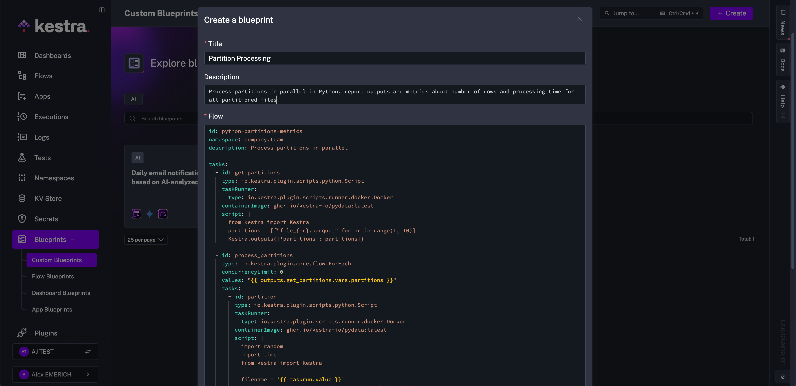

Ready-to-use examples designed to kickstart your workflow.

## Jumpstart workflows with blueprints

  <iframe src="https://www.youtube.com/embed/5mvYVLKLzGk?si=Ga4ndYv_pI3NIlLK" title="YouTube video player" allow="accelerometer; autoplay; clipboard-write; encrypted-media; gyroscope; picture-in-picture; web-share" referrerpolicy="strict-origin-when-cross-origin" allowfullscreen></iframe>

---

Blueprints are a curated, organized, and searchable catalog of ready-to-use examples designed to help you kickstart your workflow. Each Blueprint combines code and documentation and can be assigned several tags for organization and discoverability.

All Blueprints are validated and documented. You can easily customize and integrate them into your new or existing flows with a single click on the **Use** button.

## Custom blueprints

:::badge{editions="EE,Cloud"}
:::

You can also create custom blueprints shared within your organization. Custom blueprints promote reusability and consistency across an organization or team.

:::alert{type="info"}
Custom blueprints require the [Enterprise Edition](../../07.enterprise/index.mdx).
:::

Check the [Blueprints documentation](../../06.concepts/07.blueprints/index.md) for more details.
