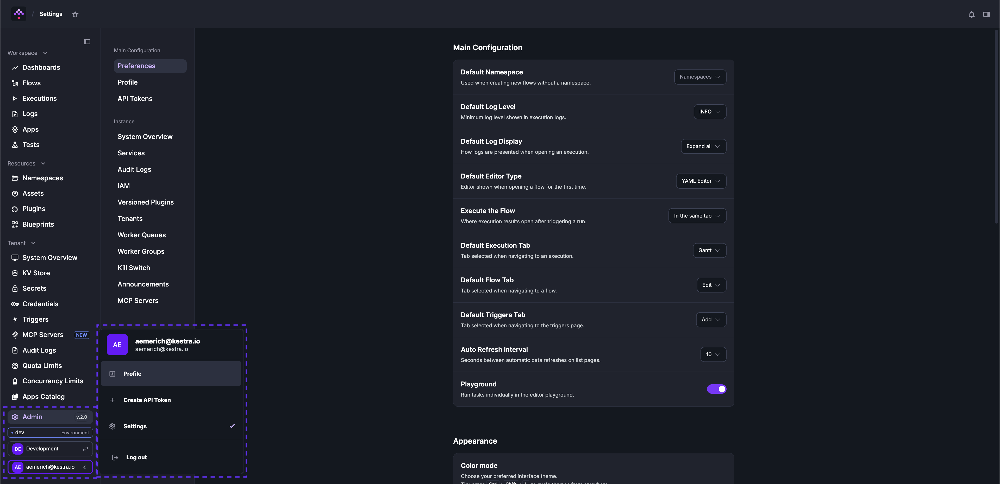

Configure per-user preferences, profile details, and API tokens from the **Settings** page, accessible via the bottom-left environment menu.

## Preferences

Options you can configure under **Preferences** include:
- **Default Namespace**: Pre-selects a namespace when creating a new flow and filters the Flows and Executions pages to that namespace by default.
- **Default Log Level**: Minimum log level shown in execution logs (e.g., `INFO`, `TRACE`).
- **Default Log Display**: How logs are presented when opening an execution — expand all, collapse all, or expand only failed tasks.
- **Default Editor Type**: Editor shown when opening a flow for the first time — YAML Editor or No Code Editor.
- **Execute the Flow**: Where execution results open after triggering a run — in the same tab or a new tab.
- **Default Execution Tab**: Tab selected when navigating to an execution (e.g., Gantt, Logs, Outputs).
- **Default Flow Tab**: Tab selected when navigating to a flow (e.g., Overview, Topology, Edit).
- **Default Triggers Tab**: Tab selected when navigating to the triggers page.
- **Auto Refresh Interval**: Seconds between automatic data refreshes on list pages.
- **Playground**: Toggle to enable or disable the editor playground, which lets you run tasks individually.
- **Customize Sidebar**: Drag and drop items to reorder the left navigation sidebar, or remove items you don't need.

## Profile

Access **Profile** from the Settings left-hand menu to manage your personal account details.

The following fields are editable directly — no separate save step is required:
- **First Name** and **Last Name**
- **Password** — enter and confirm a new password to update your login credentials.

Your avatar displays your initials derived from your first and last name. If you have pending workspace invitations, they appear in a table at the bottom of the Profile page.

## Appearance

Kestra supports both Light and Dark mode.

You can also configure the Editor independently in Light or Dark mode. In addition, you can adjust the Editor font size and family.

There's also the option to change the environment name and color to help you identify if you have multiple Kestra instances, for example a `dev` and `prod` environment.

Below is a detailed list of the Appearance options you can configure:

- **Theme Mode**: Dark or Light
- **Chart Color Scheme**: Classic (red-green) or Kestra (pink-purple)
- **Editor Theme**: Dark or Light
- **Editor Font Size**: e.g., 12 — arbitrary integer number
- **Editor Font Family**: one of the following:
  - Source Code Pro
  - Courier
  - Times New Roman
  - Book Antiqua
  - Times New Roman Arabic
  - SimSun
- **Automatic Code Folding in the Editor**: a toggle, by default toggled off
- **Environment Name**: e.g., dev, staging, prod
- **Environment Color**: select a color from the color picker

## Language and region

- **Language**: English, German, Spanish, French, Hindi, Italian, Japanese, Korean, Polish, Portuguese, Russian, or Chinese
- **Time Zone**: e.g., Europe/Berlin (`UTC+02:00`)
- **Date Format**: choose one of the following formats:
  - `2024-09-30T12:44:34+02:00`
  - `2024-09-30 12:44:34`
  - `30/09/2024 12:44:34`
  - `Sep 30, 2024 12:44 PM`
  - `Mon, Sep 30, 2024 12:44 PM`
  - `September 30, 2024 12:44 PM`
  - `Monday, September 30, 2024 12:44 PM`

:::alert{type="info"}
This setting only affects the UI display. It does not affect [Schedule triggers](../../05.workflow-components/07.triggers/01.schedule-trigger/index.md) or flow execution times, which run on UTC by default.
:::

