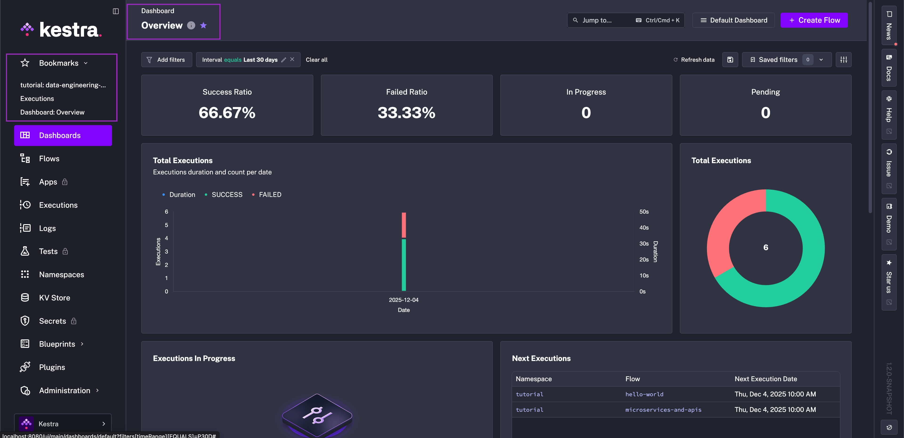

Quickly save and access your favorite pages by starring them for instant retrieval.

## Save and reopen your favorite pages

The bookmark feature allows you to star any page, instantly adding it to the Starred tab located in the left panel. The star is located near the top of the page next to the page name.

You can easily customize your bookmarks by renaming or removing them directly from the left panel, ensuring a personalized and simple browsing experience.

