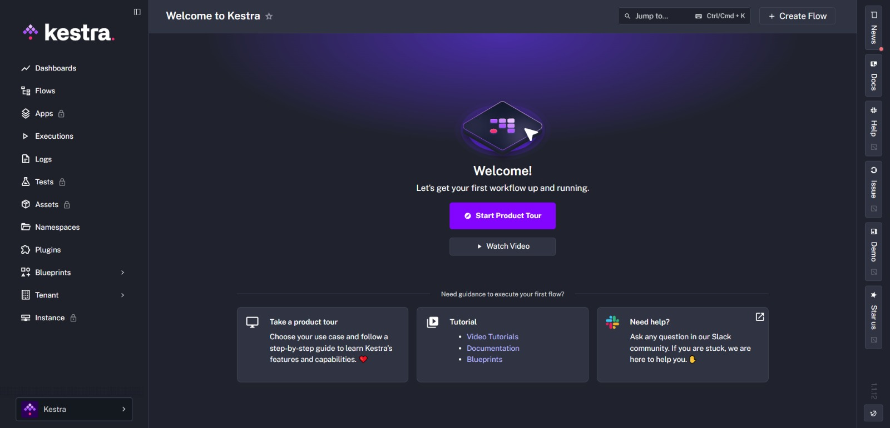

import ChildCard from "~/components/docs/ChildCard.astro"

Kestra's web UI is available by default on port 8080.

When you first navigate to the Kestra UI, you see the **Welcome** page.

Click **Start Product Tour** to open the Kestra **Guided Tour**, which guides you through creating and executing your first flow step by step.

The UI also includes a **No Code editor** for building flows and dashboards visually without writing YAML — available from the Flows and Dashboard pages.

The left menu includes the following pages:

- The **Dashboards** page shows visualizations of flow execution data and metrics.
- The **Flows** page lists all your flows, where you can create, edit, and execute them.
- The **Executions** page lets you inspect and manage previous executions.
- The **Logs** page shows all task logs from previous executions.
- The **Namespaces** page lists all namespaces and lets you set namespace-level configurations.
- The **Blueprints** page provides a catalog of ready-to-use flow examples.
- The **Plugins** page provides a catalog of plugins you can use inside your flows.
- The **Tenant** page provides a system overview, the full KV Store, triggers, and concurrency limits.

[Kestra Enterprise Edition](../oss-vs-paid/index.md) adds the following pages to the UI:

- The **Apps** page lists your Apps and lets you create new ones.
- The **Tests** page shows your flow unit tests where you can view, edit, and create assertions without creating executions.
- The **Assets** page lets you manage reusable assets available to your flows and apps.
- The **Tenant** page provides a system overview, KV Store, secrets and credentials, triggers, audit logs, concurrency limits, the Apps Catalog, and IAM.
- The **Instance** page includes sections for Services, Versioned Plugins, tenant management, Worker Groups, Kill Switch, and Announcements.

    <iframe
        src="https://www.youtube.com/embed/6o0PNVrA84k?si=QyjOSo5HMZ-wKHol"
        title="YouTube video player"
        allow="accelerometer; autoplay; clipboard-write; encrypted-media; gyroscope; picture-in-picture; web-share"
        referrerpolicy="strict-origin-when-cross-origin"
        allowfullscreen
    ></iframe>

 

<ChildCard />
