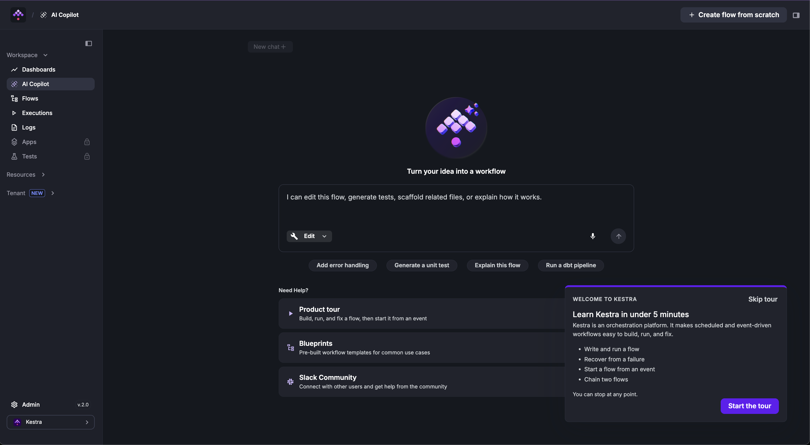
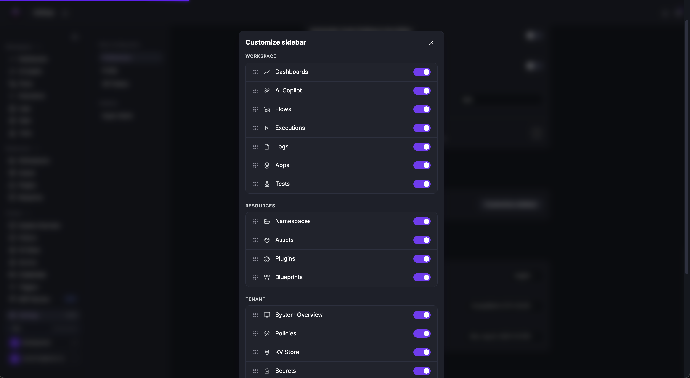

import ChildCard from "~/components/docs/ChildCard.astro"

Kestra's web UI is available by default on port 8080.

When you first open the UI, a **Welcome to Kestra** tour popup appears on the AI Copilot page.

Click **Start the tour** to walk through creating and executing your first flow.

The UI includes a **No Code editor** for building flows and dashboards visually without writing YAML — available from the Flows and Dashboard pages.

The left sidebar is organized into three sections:

**Workspace** — day-to-day work:
- **Dashboards** — visualizations of flow execution data and metrics.
- **AI Copilot** — generate and edit flows from a plain-language description.
- **Flows** — browse, create, edit, and execute flows.
- **Executions** — inspect and manage previous executions.
- **Logs** — task logs from previous executions.

**Resources** — reusable assets and plugins:
- **Namespaces** — namespace-level configuration, files, secrets, and variables.
- **Plugins** — catalog of plugins available in your flows.
- **Blueprints** — ready-to-use flow examples.

**Tenant** — instance-level configuration:
- **System Overview** — instance health and usage metrics.
- **KV Store** — key-value pairs available across flows.
- **Triggers** — all active triggers across the tenant.
- **MCP Servers** — registered Model Context Protocol servers.

[Kestra Enterprise Edition](../oss-vs-paid/index.md) adds the following to the UI:

- **Apps** (Workspace) — list and create Apps that expose flows as user-facing forms.
- **Tests** (Workspace) — run flow unit tests and view assertions without creating executions.
- **Assets** (Resources) — manage reusable assets available to flows and apps.
- The **Tenant** section gains: **Policies**, **Secrets**, **Credentials**, **Audit Logs**, and **IAM**.
- **Super Admin** (via **Settings → Super Admin**) — instance-wide administration covering services, tenants, Worker Groups, Worker Queues, Kill Switch, Announcements, Versioned Plugins, and instance-level IAM.

The sidebar is customizable. Go to **Settings → Preferences → Customize Sidebar** to reorder items or hide the ones you don't need.

    <iframe
        src="https://www.youtube.com/embed/6o0PNVrA84k?si=QyjOSo5HMZ-wKHol"
        title="YouTube video player"
        allow="accelerometer; autoplay; clipboard-write; encrypted-media; gyroscope; picture-in-picture; web-share"
        referrerpolicy="strict-origin-when-cross-origin"
        allowfullscreen
    ></iframe>

 

<ChildCard />
