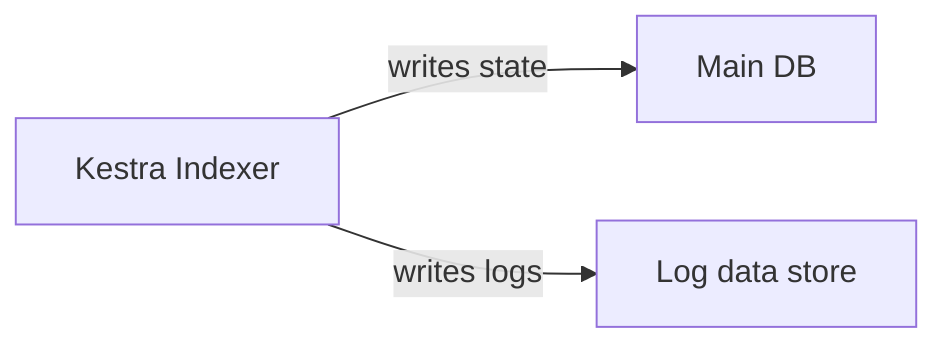

The external log data store routes Kestra execution logs to a dedicated JDBC database or Elasticsearch, separate from the main backend.

By default, Kestra stores execution logs in the same database as flows, executions, and state.

## Why move logs out of the main database

Logs are high-volume, write-heavy data. Keeping them in the main database creates three operational problems:

- **Database bloat**: Log volume grows independently of flows and executions, inflating main database size over time.
- **Migration risk**: Kestra schema migrations run across every table, including logs. Large log tables extend upgrade downtime.
- **Retention mismatch**: Flows, executions, and logs typically have different retention requirements but share the same database and backup lifecycle.

## How it works

The Indexer writes logs to the configured log store in real time. The log UI and dashboards read from the same store. The main database stores only flows, executions, and state.



### Default behavior

If `kestra.logs.type` is not set, logs stay in the main backend (`kestra.repository.type`). Existing installations see no change on upgrade.

The full resolution order is:

1. `kestra.logs.type` — explicit log store selection
2. `kestra.repository.type` — fallback: logs stay in the main backend (the default)
3. If neither is configured, Kestra fails fast at startup with a clear error

### Migration note

Configuring an external log store applies to **new executions only**. Historical logs remain in the main database. A CLI command to migrate historical log data is planned for a future release.

## Configure the JDBC log store (OSS + EE)

Select a JDBC store by setting `kestra.logs.type` to `h2`, `postgres`, or `mysql`. The store can connect to a dedicated log database or reuse the main datasource.

:::alert{type="info"}
There is no `datasources.logs` block. The dedicated log database is configured entirely under `kestra.logs.<type>.*`, not alongside the main `datasources.*` config.
:::

### Config reference

| Key | Description |
|-----|-------------|
| `kestra.logs.type` | Store type: `h2`, `postgres`, `mysql`, or `elasticsearch` |
| `kestra.logs.<type>.url` | JDBC URL of the dedicated log database. When set, Kestra opens its own HikariCP connection pool and runs log-table migrations against this database. |
| `kestra.logs.<type>.username` | Username for the dedicated log database |
| `kestra.logs.<type>.password` | Password for the dedicated log database |
| `kestra.logs.<type>.table` | Log table name (default: `logs`) |

When `kestra.logs.<type>.url` is **not** set, the JDBC store reuses the primary datasource and `kestra.logs.type` must match `kestra.repository.type`. This is useful for verifying config shape without standing up a second database, but it does not move logs out of the main database.

### Example: PostgreSQL backend with a separate PostgreSQL log database

Two independent Postgres databases: one for the main backend, one for logs only.

```yaml
services:
  postgres:                         # main backend DB
    image: postgres:16
    environment:
      POSTGRES_DB: kestra
      POSTGRES_USER: kestra
      POSTGRES_PASSWORD: k3str4
    volumes:
      - postgres-data:/var/lib/postgresql/data

  postgres-logs:                    # dedicated log DB
    image: postgres:16
    environment:
      POSTGRES_DB: kestra_logs
      POSTGRES_USER: kestra
      POSTGRES_PASSWORD: k3str4
    volumes:
      - postgres-logs-data:/var/lib/postgresql/data

  kestra:
    image: kestra/kestra:latest
    command: server standalone
    depends_on: [postgres, postgres-logs]
    ports: ["8080:8080"]
    environment:
      KESTRA_CONFIGURATION: |
        datasources:
          postgres:
            url: jdbc:postgresql://postgres:5432/kestra
            driverClassName: org.postgresql.Driver
            username: kestra
            password: k3str4
        kestra:
          repository:
            type: postgres
          queue:
            type: postgres
          storage:
            type: local
          logs:
            type: postgres
            postgres:
              url: jdbc:postgresql://postgres-logs:5432/kestra_logs
              username: kestra
              password: k3str4
              table: logs

volumes:
  postgres-data: {}
  postgres-logs-data: {}
```

The main backend keeps using `datasources.postgres`. The log store opens its own connection pool against `postgres-logs`, runs log-table migrations there, and routes all log reads and writes to that database.

## Configure the Elasticsearch log store (EE)

The Elasticsearch log store is an Enterprise Edition feature. It reuses the existing `kestra.elasticsearch.*` connection config; you add a `kestra.logs` block naming the index.

Kestra fails at startup if no Elasticsearch client is configured or if the required index declaration (with `cls: io.kestra.core.models.executions.LogEntry`) is missing.

### Config reference

| Key | Description |
|-----|-------------|
| `kestra.logs.type` | `elasticsearch` |
| `kestra.logs.elasticsearch.index` | Elasticsearch index or alias name (default: `logs`) |
| `kestra.elasticsearch.client.*` | ES connection config (hosts, auth, TLS) — same block used by the main ES backend |
| `kestra.elasticsearch.indices.<name>.cls` | Must be `io.kestra.core.models.executions.LogEntry` |
| `kestra.elasticsearch.indices.<name>.index` | Must match `kestra.logs.elasticsearch.index` |

### Example: PostgreSQL backend with Elasticsearch log store

The main backend stays Postgres; execution logs go to Elasticsearch.

```yaml
services:
  postgres:
    image: postgres:16
    environment:
      POSTGRES_DB: kestra
      POSTGRES_USER: kestra
      POSTGRES_PASSWORD: k3str4
    volumes:
      - postgres-data:/var/lib/postgresql/data

  elasticsearch:
    image: docker.elastic.co/elasticsearch/elasticsearch:8.13.0
    environment:
      discovery.type: single-node
      xpack.security.enabled: "false"
      ES_JAVA_OPTS: "-Xms512m -Xmx512m"
    ports: ["9200:9200"]

  kestra:
    image: kestra/kestra:latest-ee           # EE image required
    command: server standalone
    depends_on: [postgres, elasticsearch]
    ports: ["8080:8080"]
    environment:
      KESTRA_CONFIGURATION: |
        datasources:
          postgres:
            url: jdbc:postgresql://postgres:5432/kestra
            driverClassName: org.postgresql.Driver
            username: kestra
            password: k3str4
        kestra:
          repository:
            type: postgres
          queue:
            type: postgres
          storage:
            type: local
          logs:
            type: elasticsearch
            elasticsearch:
              index: logs
          elasticsearch:
            client:
              http-hosts:
                - http://elasticsearch:9200
              # basic-auth:
              #   username: elastic
              #   password: changeme
            indices:
              logs:
                cls: io.kestra.core.models.executions.LogEntry
                index: logs

volumes:
  postgres-data: {}
```

## Store capabilities

JDBC and Elasticsearch are complete implementations: they support offset pagination with exact totals, dashboard aggregation, and on-demand purge. Additional log backends planned for a future release may support a subset of these capabilities.

Each store declares its capabilities, and Kestra adapts gracefully:

| Capability | What it controls | JDBC | Elasticsearch |
|---|---|---|---|
| Aggregation | Whether log count charts and KPI tiles on dashboards query this store | ✓ | ✓ |
| Pagination type | `OFFSET`: numbered pages with exact totals. `CURSOR`: forward-only, no total. | OFFSET | OFFSET |
| Purge | Whether Kestra can delete logs on demand via [`PurgeLogs`](../purge/index.md) or the UI | ✓ | ✓ |

When a store does not support aggregation, dashboard log charts display "No data" rather than erroring. When a store does not support purge, Kestra's `PurgeLogs` operations no-op for logs — the backend's own retention or TTL policy governs deletion.

:::alert{type="warning"}
If you configure a store that cannot purge, set up a retention policy in that backend before switching. Kestra will not delete logs on your behalf.
:::

## Log Shipper vs External Log Data Store

| | External Log Data Store | Log Shipper |
|---|---|---|
| **What it is** | The primary store Kestra writes and reads logs from | A Kestra task that copies logs to observability platforms |
| **How it runs** | Infrastructure-level config, always active | A scheduled flow |
| **Use case** | Keep logs out of the main database; reduce migration risk | Send logs to Datadog, Splunk, Elastic, CloudWatch for alerting and search |
| **Requires a sidecar?** | No | No |

Use the External Log Data Store when you want logs **out of the main database**. Use the [Log Shipper](../../07.enterprise/02.governance/logshipper/index.md) when you want logs **in a third-party observability platform** as well, regardless of where Kestra stores them internally.

## Build a new log store plugin

A new log store is a Kestra plugin that implements `LogDataStoreInterface`. The Splunk log data store plugin is a useful reference for the complete pattern.

### 1. Implement the interface

Implement `io.kestra.core.repositories.LogDataStoreInterface`. For a new JDBC dialect, extend `AbstractJdbcLogDataStore` — it provides pagination, aggregation, and purge. Provide a no-arg constructor (the factory deserializes config onto the instance). If you need runtime Micronaut beans, implement `ApplicationContextInitializable` and wire dependencies in `init(ApplicationContext)`.

### 2. Declare the plugin id

```java
@Plugin
@Plugin.Id("mystore")     // the value operators set in kestra.logs.type
public class MyLogDataStore implements LogDataStoreInterface, ApplicationContextInitializable {
    @PluginProperty private String someOption;   // bound from kestra.logs.mystore.someOption
    ...
}
```

### 3. Declare capabilities

The defaults are `canPurge() == true`, `canAggregate() == true`, and `paginationType() == OFFSET`. Override only what your store cannot support:

```java
@Override public boolean canPurge()              { return false; }  // backend handles TTL
@Override public boolean canAggregate()          { return false; }  // no server-side aggregation
@Override public PaginationType paginationType() { return PaginationType.CURSOR; }
```

A store declaring `canPurge() == false` must no-op all delete/purge methods and must not publish audit events. A store declaring `CURSOR` must return a `CursoredPage` with a `nextPageable()` cursor token from paginated `find(...)` methods.

### 4. Pass the contract test

Every log store implementation must pass `io.kestra.core.repositories.AbstractLogDataStoreTest` from the `:tests` module. The base class exercises every interface method and asserts every capability branch. Extend it with an empty class:

```java
class MyLogDataStoreTest extends AbstractLogDataStoreTest {}
```

Wire your store as the injected `LogDataStoreInterface` bean via test config. The suite adapts to whatever your store declares — but your store must genuinely honour its declarations.

:::alert{type="info"}
Most external backends have an indexing delay — writes are not immediately queryable. Override `awaitIndexing(BooleanSupplier ready)` in your test class to poll until data is visible before assertions run.
:::
