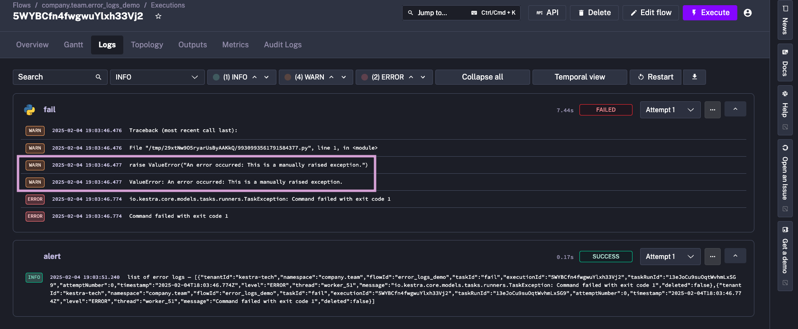
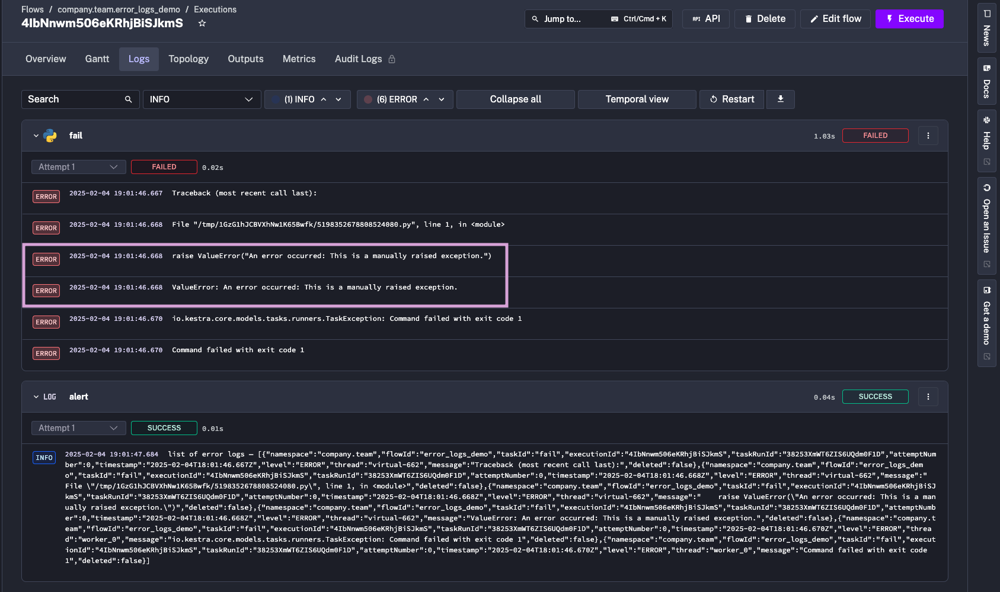

## Log level for stderr output

STDERR Logged at ERROR Level in Script Tasks

Script tasks now log output sent to `stderr` at the ERROR level instead of WARNING ([PR #6383](https://github.com/kestra-io/kestra/pull/6383); [Issue #190](https://github.com/kestra-io/plugin-scripts/issues/190)).

## Example

Here is an example of a script task that logs an error message to `stderr`:

```yaml
id: error_logs_demo
namespace: company.team

tasks:
  - id: fail
    type: io.kestra.plugin.scripts.python.Script
    taskRunner:
      type: io.kestra.plugin.core.runner.Process
    script: |
      raise ValueError("An error occurred: This is a manually raised exception.")

errors:
  - id: alert
    type: io.kestra.plugin.core.log.Log
    message: list of error logs — {{ errorLogs() }}
```

## Before 0.21.0

Here is the output of the `fail` task before the change:



## After 0.21.0

Here is the output of the `fail` task after the change:


