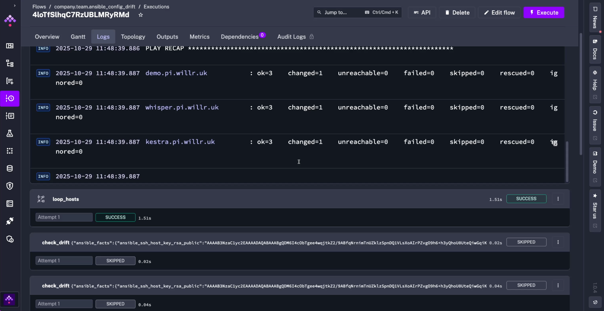

Keeps configs consistent and surfaces drift without manual checks with Ansible and Kestra.

## Detect Ansible Config Drift with Kestra

Use Ansible to enforce a required environment variable across multiple hosts and have Kestra alert you in Slack when a change occurs.

## Files to store as Namespace Files

Ansible expects two file types: an `inventory.ini` and a `playbook.yml`. To use with Kestra, they can either be stored as [Namespace Files](../../06.concepts/02.namespace-files/index.md) or written in-line in the flow code. The example continues using Namespace Files.

- `inventory.ini` (replace with your hosts and users; keys shown as placeholders):

```ini
[servers]
server1.example.test ansible_user=admin ansible_ssh_private_key_file=~/.ssh/id_rsa
server2.example.test ansible_user=admin ansible_ssh_private_key_file=~/.ssh/id_rsa
server3.example.test ansible_user=admin ansible_ssh_private_key_file=~/.ssh/id_rsa
```

- `myplaybook.yml` (enforce `MY_APP_MODE` and refresh the shell):

```yaml
---
- name: Ensure environment variable is set correctly
  hosts: servers
  become: true

  tasks:
    - name: Ensure MY_APP_MODE is set
      lineinfile:
        path: /home/{{ ansible_user }}/.bashrc
        regexp: '^MY_APP_MODE='
        line: 'MY_APP_MODE=production'
        state: present
      notify: Refresh environment

  handlers:
    - name: Refresh environment
      shell: . /home/{{ ansible_user }}/.bashrc
      changed_when: false
```

## Flow: run Ansible and alert on drift

This flow runs the playbook with the [Ansible CLI task](/plugins/plugin-ansible/cli/io.kestra.plugin.ansible.cli.ansiblecli), inspects each host result in a [`ForEach`](/plugins/core/flow/io.kestra.plugin.core.flow.foreach), and posts a Slack alert only when a host was changed using the [Slack Incoming Webhook task](/plugins/plugin-slack/io.kestra.plugin.slack.slackincomingwebhook). The schedule trigger is disabled by default — enable it to run nightly.

```yaml
id: ansible_config_drift
namespace: company.team

tasks:
  - id: set_up_env
    type: io.kestra.plugin.ansible.cli.AnsibleCLI
    namespaceFiles:
      enabled: true
    taskRunner:
      type: io.kestra.plugin.core.runner.Process
    ansibleConfig: |
      [defaults]
      interpreter_python = auto_silent
      log_path={{ workingDir }}/log
      callback_plugins = ./callback_plugins
      stdout_callback = kestra_logger
    commands:
      - ansible-playbook -i inventory.ini myplaybook.yml

  - id: loop_hosts
    type: io.kestra.plugin.core.flow.ForEach
    values: "{{ outputs.set_up_env.vars.outputs }}"
    tasks:
      - id: check_drift
        type: io.kestra.plugin.slack.SlackIncomingWebhook
        runIf: "{{ taskrun.value | jq('.changed') | first == true }}"
        url: "{{ secret('SLACK_WEBHOOK') }}"
        payload: |
          {
              "text": "Configuration updated - {{ taskrun.value | jq('.msg') | first ?? Null }}"
          }

triggers:
  - id: check_nightly
    type: io.kestra.plugin.core.trigger.Schedule
    cron: 0 3 * * *
    disabled: true
```

The execution generates logs for every play in the playbook for clear results and monitoring:



In the execution outputs, you can examine results and debug expressions to use in potential downstream tasks or subflows:


## Why this matters

This pattern enforces a critical env var across a fleet to catch drift quickly, streams Ansible output in structured form via `stdout_callback = kestra_logger`, and alerts only on changed hosts to keep Slack noise low. Keeping the playbook and inventory as Namespace Files means you can version and reuse them across flows without hardcoding paths in each run.

You can expand this pattern to check multiple config files, package versions, or CIS controls per host, while letting Kestra handle scheduling, secrets, notifications, and downstream tasks (tickets, S3 archiving, SIEM) so Ansible remediation and orchestration stay tightly linked.
